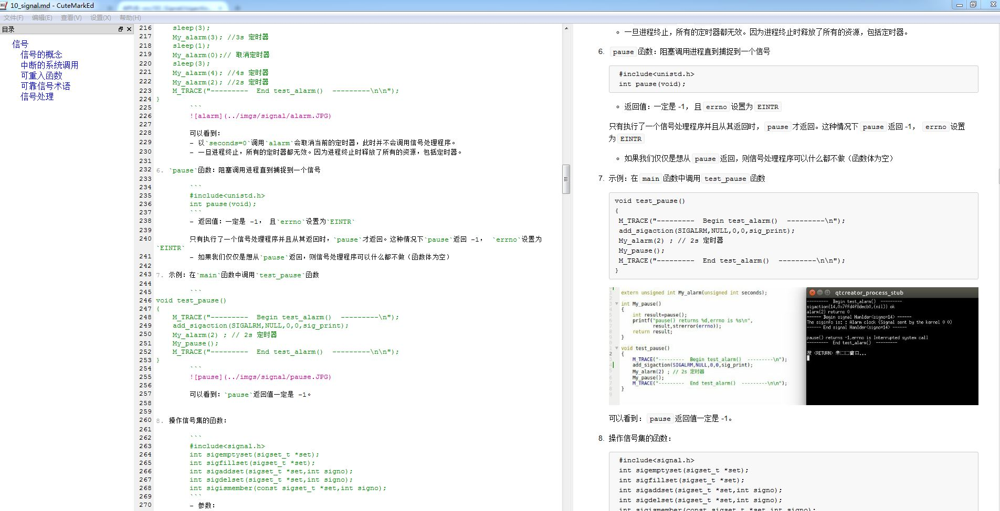
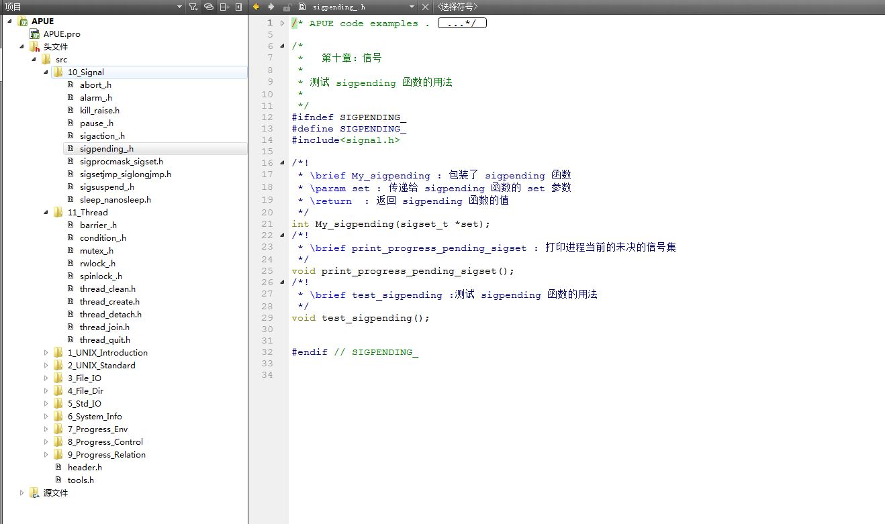
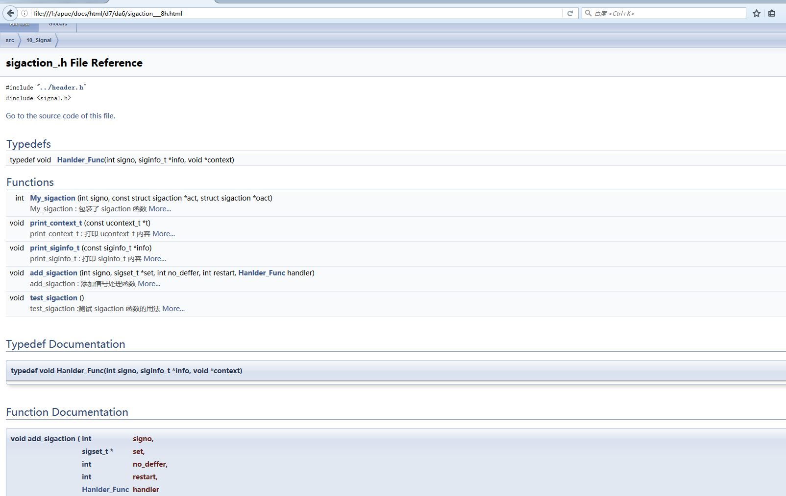

<!--
    作者：华校专
    email: huaxz1986@163.com
**  本文档可用于个人学习目的，不得用于商业目的  **
-->
<i>By huaxz1986@163.com</i>
# 《UNIX环境高级编程》第三版中文笔记

该笔记来自于本人的学习笔记。

另：本人搜集了个人笔记并整理成册，命名为《AI算法工程师手册》，详见:www.huaxiaozhuan.com

## 缘由

《UNIX环境高级编程》本人在多年以前多次阅读了，当时还是中文第二版。经过多年的工作和编程经验以后，发现有一些基本的概念还需要在这本书里面追寻。于是抽空重读第三版，写下这篇笔记。

本笔记来自于《UNIX环境高级编程》中文第三版。主要做了以下工作：

- 提炼了内容。内容更加精简
- 重新组织了下知识点结构
- 有些晦涩部分，重新用通俗易懂的话来解释
- 基本上每个知识点都有示例代码，以及运行结果的截图
- 所有的代码都在 `codes`文件夹下。代码均有文档说明。采用`Doxygen`自动化文档工具自动化生成文档。可以使用`Doxywizard`工具生成文档。

文档内容如下所示：
	

源代码如下所示：
	

注释文档如下所示：
	

## 运行环境

- 操作系统： ubutnu 16.04
- 编辑器： QtCreator

## 章节目录：
1. UNIX基础知识
	- UNIX系统
	- 错误处理
	- 时间
2. UNIX标准及实现
	- UNIX标准
	- 限制
3. 文件IO：不带缓冲的IO
	- 打开、创建、关闭文件
	- 定位、读、写文件
	- 原子操作、同步、复制、修改文件描述符
4. 文件和目录
	- stat 结构和权限相关
	- 访问测试和文件模式创建屏蔽字
	- 修改文件访问权限和文件所属用户
	- 修改文件长度
	- UNIX文件系统、硬链接、软链接、删除、重命名
	- 修改文件的时间
	- 目录操作
5. 标准IO库
	- 流和FILE对象
	- 打开关闭流
	- 读写流
	- 格式化IO
	- 其他
6. 系统数据文件和信息
	- 系统文件
	- 时间和日期
7. 进程环境
	- 进程相关
	- 环境变量
	- setjmp和 longjmp
	- 进程资源限制
8. 进程控制
	- 进程的创建
	- 进程的终止
	- exec
	- 更改用户ID和组ID
	- 进程会计
	- 进程调度
9. 进程关系
	- 进程组
	- 会话
	- 作业控制
10. 信号
	- 信号的概念
	- 中断的系统调用
	- 可重入函数
	- 可靠信号术语
	- 信号处理
11. 线程
	- 线程概念
	- 线程标识、创建、终止
	- 线程同步
		- 互斥量
		- 读写锁
		- 条件变量
		- 自旋锁
		- 屏障
12. 线程控制
	- 线程属性
	- 同步属性
		- 互斥量属性
		- 读写锁属性
		- 条件变量属性
		- 屏障属性
	- 线程重入
	- 线程特定数据
	- 取消选项
	- 线程和信号
	- 线程和fork
	- 线程和IO
13. 守护进程
	- 守护进程
	- 出错记录
	- 单例守护进程
14.  高级IO
	- 非阻塞IO
	- 记录锁
	- IO多路转换
		- select
		- poll
	- 异步IO
		- POSIX异步IO
	- readv/writev
	- 存储映射IO

