# 线程

## 1.线程概念

1. 一个进程中的所有线程都可以访问该进程的资源，如文件描述符、内存等等。

2. 典型的`UNIX`进程可以看成只有一个控制线程：一个进程在某个时刻只能做一件事情。有了多线程之后，程序设计就可以把进程设计成：在某个时刻能做不止一件事情，每个线程处理各自独立的任务。优点：
	- 通过为每种事件类型分配单独的处理线程，可以简化处理异步事件的代码
		- 每个线程在进行事件处理时可以采取同步编程模式（同步编程模式要比异步编程模式简单得多）
	- 多个进程必须使用操作系统提供的复杂机制才能实现内存共享和文件描述符的共享。而多线程能自动地访问相同的存储空间和文件描述符
	- 有些问题可以分解从而提高整个程序的吞吐量
		- 多线程中，相互独立的任务的处理可以交叉进行
	- 交互式程序可以通过多线程改善响应时间
		- 多线程可以把程序中处理用户的输入输出部分与其他部分分开

3. 多线程不等于多核编程。即使在单核处理器上，也能够使用多线程。

4. 对于多线程任务，如果某个线程阻塞了，那么其他的线程也可以执行，而不会像单线程那样阻塞整个进程。

5. 每个线程都包含有表示执行环境所必须的所有信息，包括：进程中标识线程的线程ID、一组寄存器值、栈、调度优先级和策略、信号屏蔽字、`errno`变量、以及线程私有数据
	- 进程的所有信息对该进程的所有线程是共享的，包括：可执行程序的代码、程序的全局内存和堆内存、栈、以及文件描述符

6. 这里讨论的线程接口来自`POSIX`。线程接口也称作`pthread`，其功能测试宏是`_POSIX_THREADS`
	- 应用程序可以用 `#ifdef _POSIX_THREADS` 测试，从而在编译时确定是否支持线程
	- 应用程序也可以用`_SC_THREADS`常数调用`sysconf`函数，从而在运行时确定是否支持线程

## 2. 线程标识、创建、终止

1. 每个线程都有一个线程`ID`。线程`ID`只有在它所属的进程中才有意义。
	- 比较两个进程中的线程`ID`没有任何意义	

2. 线程`ID`类型为`pthread_t`，实现的时候可以用一个`struct`来代表它，随意通常都不把它看作整数来处理。因此如果要判断两个线程`ID`是否相等，不能直接用`==`

3. `pthread_equal`函数：判断两个线程`ID`是否相等

	```
	#include<pthread.h>
	int pthread_equal(pthread_t tid1,pthread tid2);
	```
	- 参数：
		- `tid1`：第一个线程`ID`
		- `tid2`：第二个线程`ID`
	- 返回值：
		- 相等：返回非0数值
		- 不等：返回 0

	对于`Linux`，使用的是无符号长整型来表示`pthread_t`；`MacOSX`采用一个指向`pthread`结构的指针来表示`pthread_t`数据类型

4. `pthread_self(void)`函数：返回本线程自身的线程`ID`

	```
	#include<pthread.h>
	pthread_t pthread_self(void);
	```
	- 返回值：调用线程的线程`ID`

5. 在`POSIX`线程的情况下，程序开始运行时，它也是以单进程中的单个控制线程启动的。在创建多个控制线程之前，程序的行为与传统的进程并没有区别。

6. `pthread_create`函数：创建新线程

	```
	#include<pthread.h>
	int pthread_create(pthread_t *restrict tidp,
		const pthread_attr_t *restrict attr,
		void *(*start_rtn)(void*),
		void *restrict arg);
	```
	- 参数：
		- `tidp`：成功创建时，新线程的线程`ID`存放在`tidp`指向的内存单元
		- `attr`：用于定制不同的线程属性。如果为`NULL`，则是默认属性
		- `start_rtn`：线程例程地址。新创建的线程从`start_rtn`函数的地址处开始运行，该函数的参数为`void *`，返回值为`void *`
		- `arg`：作为`start_rtn`函数的参数
	- 返回值：
		- 成功：返回 0
		- 失败：返回错误编号

	注意：
	- 如果需要向`start_rtn`函数传递一个以上的参数，那么可以将这些参数放置在一个结构中，然后将这个结构的地址作为`arg`参数传入。
	- 线程创建的时候，并不能保证哪个线程会先运行：有可能是新创建线程先运行，也可能是调用线程先运行
	- 新创建的线程可以访问进程的地址空间，并继承了调用线程的浮点环境和信号屏蔽字，但是该线程的挂起信号集会被清除
7. 示例：在`main`函数中调用`test_thread_create`函数：

	```
void test_thread_create()
{
    M_TRACE("---------  Begin test_thread_create()  ---------\n");
    //******** 创建子线程 *********//
    pthread_mutex_lock(&mutex); //必须同步。否则多个线程的输出交叉进行
    pthread_t threads[3];
    for(int i=0;i<3;i++)
        My_pthread_create(threads+i,NULL,thread_func,i);
     pthread_mutex_unlock(&mutex);
    //******** 等待子线程结束 *********//
    int values[3];
    for(int i=0;i<3;i++)
    {
        thread_join_int(threads[i],values+i);
    }
    M_TRACE("---------  End test_thread_create()  ---------\n\n");
}
	```
	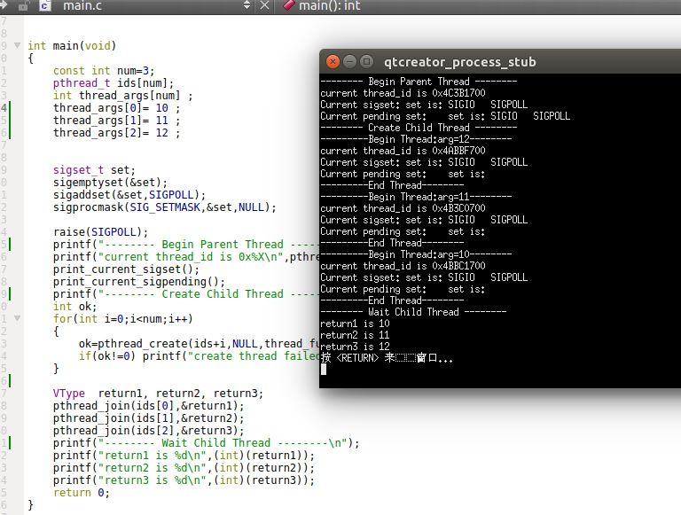

	注意：编译时必须添加 `pthread`库，在Qt中，就是在`.pro`文件中添加`LIBS += -lpthread`

	可以看到：
	- 子线程的工作例程的返回值，由父线程通过`pthread_join`来捕获
	- 如果子线程没有使用互斥量同步，则可以看到子线程的输出交叉进行，说明了子线程的运行是并行的，而且没有先后顺序

8. `pthread`系列的函数在调用失败时通常会返回错误码，它并不像其他`POSIX`函数一样设置`errno`。
	- 每个线程都提供了`errno`的副本，这只是为了与使用`errno`的现有函数兼容
	- 在线程中，从函数中返回错误码更为清晰整洁，不需要依赖那些随着函数执行不断变化的全局状态
		
9. 单个线程可以通过三种方式退出
	> 可以在不终止整个进程的情况下，停止它的控制流

	- 线程可以简单的从启动例程中返回，返回值是线程的退出码
	- 线程可以被同一个进程中的其他线程取消
	- 线程可以自己调用`phtread_exit`函数来主动退出

10. 单个线程还有其它的退出方式，此时的行为是终止整个进程：
	- 如果进程中的任意线程调用了`exit、_Exit、_exit`之一，那么整个进程就会终止	
	- 如果某个信号的默认动作是终止进程，那么发送到任意线程的这种信号就会终止整个进程

11. `pthread_exit`函数：线程主动退出

	```
	#include<pthread.h>
	void pthread_exit(void *rval_ptr);
	```
	- 参数：
		- `rval_ptr`：一个无类型指针，用于给`pthread_join`函数传递参数（即线程间消息传递）

12. `pthread_join`函数：等待指定的线程结束（类似于`waitpid`）

	```
	#include<pthread.h>
	int pthread_join(pthread_t tid,void **rval_pptr);
	```
	- 参数：
		- `tid`：要等待的线程的线程`ID`
		- `rval_pptr`：一个指针，指向无类型指针（该无类型指针用于线程返回值）
	- 返回值：
		- 成功：返回 0
		- 失败：返回错误编号

	当调用线程调用`pthread_join`之后，调用线程将会一直阻塞，直到:
	- 指定的线程`tid`调用`pthread_exit`。此时`rval_pptr`指向的内存区就包含`pthread_exit`的`rval_ptr`的值
	- 指定的线程`tid`从启动例程返回。此时`rval_pptr`指向的内存区就包含返回码
	- 指定的线程`tid`被取消。此时`rval_pptr`指向的内存单元就设置为`PTHREAD_CANCELED`

	如果不关注线程的返回值，则可以将`rval_pptr`设置为`NULL`。此时`pthread_join`函数可以等待指定的线程终止，但是并不获取线程的终止状态。

	可以通过调用`pthread_join`自动把线程置于分离状态，此时资源可以恢复。如果线程已经处理分离状态，`pthread_join`调用就会失败，返回`EINVAL`

13. `pthread_cancel`函数：请求取消同一个进程中的其他某个线程

	```
	#include<pthread.h>
	int pthread_cancel(pthread_t tid);
	```
	- 参数：
		- `tid`：期望取消的线程的`ID`
	- 返回值：
		- 成功：返回 0
		- 失败：返回错误码

	默认情况下，`pthread_cancel`函数会使得由`tid`标识的线程的行为表现得如同调用了`pthread_exit(PTHREAD_CANCELD)`函数。但是，`tid`标识的线程可以选择忽略取消或者控制如何被取消。
	>`pthread_cancel`并不等待线程`tid`终止，也不保证线程`tid`终止，它仅仅提出了请求

14. 示例：在`main`函数中调用`test_thread_quit`函数：

 	```
void test_thread_quit()
{
    M_TRACE("---------  Begin test_thread_quit()  ---------\n");
    //******** 创建子线程 *********//
    pthread_mutex_lock(&mutex); //必须同步。否则多个线程的输出交叉进行
    pthread_t threads[3];
    My_pthread_create(threads+0,NULL,thread_func_return,(void*)0);
    My_pthread_create(threads+1,NULL,thread_func_exit,(void*)1);
    My_pthread_create(threads+2,NULL,thread_func_exit,(void*)2);
    pthread_mutex_unlock(&mutex);
    My_pthread_cancel(threads[2]) ; // 取消最后一个子线程
    //******** 等待子线程结束 *********//
    int values[3];
    for(int i=0;i<3;i++)
    {
        thread_join_int(threads[i],values+i);
    }
    M_TRACE("---------  End test_thread_quit()  ---------\n\n");
}
	```
	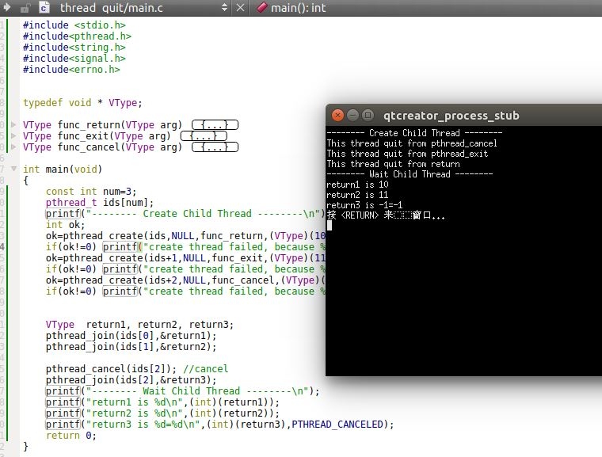

	图中可以看出线程的三种退出方式。并且可以看到`PTHREAD_CANCELD`其实就是 -1 

15. 线程可以安排它退出时需要调用的函数，这与进程在退出时可以使用`atexit`函数类似。这样的函数称作线程清理处理程序`thread cleanup handler`。
	- 一个线程可以建立多个清理处理程序
	- 处理程序记录在栈中。即它们的执行顺序与它们注册时相反

	`pthread_clearnup_push/pthread_cleanup_pop`函数：注册与注销清理处理程序

	```
	#include<pthread.h>
	void pthread_cleanup_push(void (*rtn)(void*),void *arg);
	void pthread_cleanup_pop(int execute);
	```

	- 对于 `pthread_cleanup_push`函数：
		- `rtn`：清理处理程序的指针。`rtn`函数的参数是`void *`，返回`void`
		- `arg`：作为清理处理程序`rtn`的参数
	- 对于`pthread_cleanup_pop`函数：
		- `execute`：如果为0，则线程退出时，清理函数不被调用（哪个清理函数？见后面说明）
		- `execute`：如果非零，则线程退出时，对应的清理函数被调用

	当线程退出时，清理函数`rtn`是由`pthread_cleanup_push`函数调度的，调用时只有一个参数`arg`。调用的顺序和它们注册的顺序是相反的。同时跳过 `pthread_cleanup_pop`设为0的那个清理处理程序。

	每一个`pthread_cleanup_pop`都匹配了在它之前且离他最近的那个`pthread_cleanup_push`。如果	`pthread_cleanup_pop(0)`，则对应的`pthread_cleanup_push`注册的清理处理程序就不会被执行。

	这两个函数有个限制：由于它们可以实现为宏，因此必须在于线程相同的作用域中以配对的形式使用。（否则程序编译不通过，在`Ubuntu 16.04`上测试是这样的）
	> 实际上，每次遇到`pthread_cleanup_pop`，如果参数非零，则调用清理函数


16. 示例：在`main`函数中调用`test_thread_clean`函数：

	```
void test_thread_clean()
{
    M_TRACE("---------  Begin test_thread_clean()  ---------\n");
    //******** 创建子线程 *********//
    pthread_t thread;
    My_pthread_create(&thread,NULL,thread_func,100);
    //******** 等待子线程结束 *********//
    int value;
    thread_join_int(thread,&value);
    M_TRACE("---------  End test_thread_clean()  ---------\n\n");
}
	```

	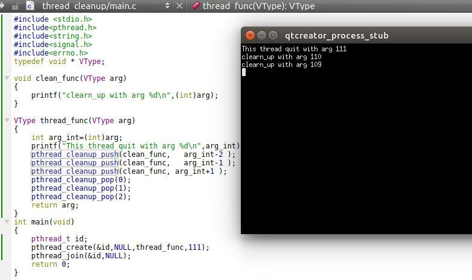
	
	可以看到：
	- 第三次注册的清理函数未被执行，因为它对应的`pthread_clearnup_pop`以参数0调用（就近原则）
	- 第二次注册的清理函数首先执行。这是“顺序注册，逆序执行”的原则
	- 调用清理函数由`pthread_cleanup_pop`函数负责

17. 默认的情况下，线程的终止状态会保存直到其他某个线程对它调用了`pthread_join`。如果线程已经被分离，则线程的底层存储资源可以在线程终止时立即被收回。
	- 在线程被分离后，我们不能用`pthread_join`函数等待它的终止状态。
	- 我们可以调用`pthread_detach`将指定线程设置为分离状态

18. `pthread_detach`函数：将指定线程设置为分离状态

	```
	#include<pthread.h>
	int pthread_detach(pthread_t tid);
	```
	- 参数：
		- `tid`：被分离的线程的`ID`
	- 返回值：
		- 成功：返回 0
		- 失败：返回错误码

19. 示例：在`main`函数中调用`test_thread_detach`函数：

	```
void test_thread_detach()
{
    M_TRACE("---------  Begin test_thread_detach()  ---------\n");
    //******** 创建子线程 *********//
    pthread_mutex_lock(&mutex); //必须同步。否则多个线程的输出交叉进行
    for(int i=0;i<3;i++)
        My_pthread_create(threads+i,NULL,thread_func,i);
    pthread_mutex_unlock(&mutex);

    My_pthread_detach(threads[0]);// 主线程会设置第一个子线程为分离状态
    //******** 等待子线程结束 *********//
    int values[3];
    for(int i=0;i<3;i++)
    {
        thread_join_int(threads[i],values+i);
    }
    M_TRACE("---------  End test_thread_detach()  ---------\n\n");
}
	```

	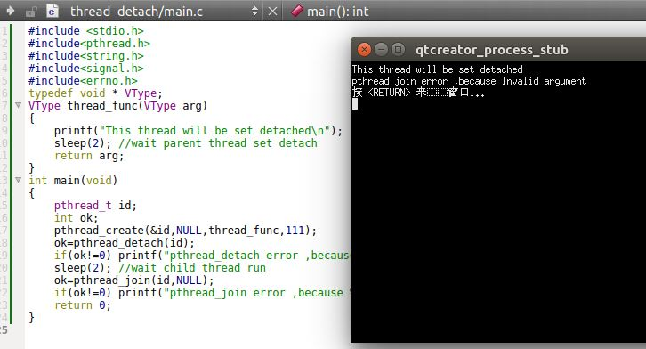

	可以看到：
	- 一旦对子线程调用了`pthread_detach`，就无法对子线程调用`pthread_join`了

20. 示例：在`main`函数中调用`test_thread_join`函数。任何线程都能`pthread_join`子线程；但是子线程不能等待主线程

	```
void test_thread_join()
{
    M_TRACE("---------  Begin test_thread_join()  ---------\n");
    //******** 创建子线程 *********//
    pthread_mutex_lock(&mutex); //必须同步。否则多个线程的输出交叉进行
    threads[0]=pthread_self();
    for(int i=0;i<3;i++)
        My_pthread_create(threads+i+1,NULL,thread_func,i);
    pthread_mutex_unlock(&mutex);
    //******** 等待子线程结束 *********//
    int values[3];
    for(int i=0;i<2;i++)
    {
        thread_join_int(threads[2+i],values+i);
    }
    M_TRACE("---------  End test_thread_join()  ---------\n\n");
}
	```

	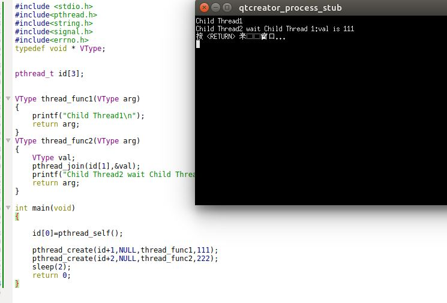	

	可以看到：
	- 子线程2可以等待子线程3的结束
	- 任何子线程无法等待主线程的结束。因为一旦主线程从`main`函数返回，则整个进程结束，则子线程的`pthread_join`也就没有返回了（子线程阻塞，还没来得及被唤醒，进程就结束了）

	另外可以验证：任何子线程可以取消主线程。此时一旦取消主线程，则进程立即结束。

## 3. 线程同步

1. 当多个线程共享相同的内存时，必须确保每个线程看到一致的数据视图。
	- 如果每个线程使用的变量都是其他线程不会读取和修改的，则不会存在数据一致性问题
	- 如果变量是只读的，多个线程同时读取改变了也不会有数据一致性问题	
	- 若一个线程可以修改的变量，其他线程也可以读取或者修改的时候，我们就需要对这些线程进行同步，确保他们在访问变量的存储内容时不会访问到无效的值
		> 当一个线程修改变量时，其他线程在读取这个变量时可能会看到一个不一致的值。当变量修改的时间多于一个存储器反问周期的处理器结构中，当存储器读和存储器写这两个周期交叉时，这种不一致就会出现。这就是由于计算机体系结构引起的不一致。

2. 除了计算机体系结构外，程序使用变量的方式也会引起竞争。如加1然后判断是否大于0。在加1和判断之间的组合并非原子操作，这就为不一致的出现提供了可能。  

3. 为了解决数据不一致的问题，线程不得不在访问数据前加锁并在访问结束后解锁，使得同一时间只允许一个线程访问被锁住的变数据。


### 3.1 互斥量

1. 可以使用`pthread`的互斥接口来保护数据，确保同一时刻只有一个线程访问数据
	- 互斥量`mutex` 本质上是一把锁，在访问共享资源前对互斥量进行设置（加锁），在访问完成后释放互斥量（解锁）
	- 任何其他试图再次对互斥量进行加锁的线程都会被阻塞，直到当前线程解锁该互斥量
	- 如果解锁互斥量时有一个以上的线程阻塞，那么等待锁住该互斥量的阻塞线程都变成可运行状态
		- 第一个变成运行状态的线程就可以对互斥量进行加锁
		- 其他线程看到互斥量仍然是锁住的，只能回去再次等待它重新变为可用

		因此，每次只有一个线程是可以向前执行的

2. 只有将所有线程都设计成遵守使用互斥量进行访问，互斥机制才能正常工作。操作系统并不会帮我们完成这个工作，必须程序员手动编写互斥量加锁和解锁流程。
	- 如果你允许其中的某个线程在没有获得互斥量加锁的情况下也可以访问共享资源，那么即使其他线程在使用共享资源之前都对互斥量加锁，也还是会出现不一致的情形

3. 互斥量是用`pthread_mutex_t`数据类型表示。
	- 使用互斥量之前必须初始化。
		- 如果是动态分配的互斥量（如通过`malloc`函数），则必须调用`pthread_mutex_init`函数进行初始化
		- 如果是静态分配的互斥量，那么除了调用`pthread_mutex_init`函数来初始化，也可以将它设置为常量`PTHREAD_MUTEX_INITALIZER`来初始化
	- 如果是动态分配的互斥量，那么在`free`释放内存之前必须调用`pthread_mutex_destroy`函数来销毁互斥量。该函数会释放在动态初始化互斥量时动态分配的资源

	涉及的函数为：

	```
	#include<pthread.h>
	int pthread_mutex_init(pthread_mutex_t *restrict mutex,
		const pthread_mutexattr_t *restrict attr);
	int pthread_mutex_destroy(pthread_mutex_t *mutex);
	```
	- 参数：
		- `mutex`：待初始化/释放的互斥量的地址
		- `attr`：互斥量的属性。如果为`NULL`，那么互斥量设置为默认属性
	- 返回值：
		- 成功：返回0
		- 失败： 返回错误编号

4. `pthread_mutex_lock/pthread_mutex_trylock/pthread_mutex_unlock`函数：对互斥量加锁/解锁操作

	```
	#include<pthread.h>
	int pthread_mutex_lock(pthread_mutex_t *mutex);
	int pthread_mutex_trylock(pthread_mutex_t *mutex);
	int pthread_mutex_unlock(pthread_mutex_t *mutex);
	```
	- 参数：
		- `mutex`：待加锁/解锁的互斥量的地址
	- 返回值：
		- 成功：返回0
		- 失败： 返回错误编号

	用法：
	- `pthread_mutex_lock`用于对互斥量进行加锁。如果互斥量已经上锁，则调用线程将阻塞直到互斥量解锁
	- `pthread_mutex_unlock`用于对互斥量进行解锁
	- `pthread_mutex_trylock`也用于对互斥量进行加锁
		- 如果它被调用时，互斥量处于未锁定状态，那么函数将锁住互斥量并返回0
		- 如果它被调用时，互斥量处于锁定状态，则函数调用失败，立即返回`EBUSY`而不是阻塞

5. 有两种情况可能导致死锁：
	- 如果线程试图对同一个互斥量加锁两次，则它自身就会陷入死锁状态
	- 如果程序中使用了两个互斥量 `Mutex1`,`Mutex2`；线程`A`锁住了 `Mutex1`并请求锁住 `Mutex2`；线程`B`锁住了 `Mutex2`并请求锁住 `Mutex1`，所以这两个线程都无法向前进行，导致死锁

	一般可以通过仔细控制互斥量加锁的顺序来避免死锁的发生。假设要同时对互斥量 `M1,M2,M3`同时加锁。如果所有线程总是在对互斥量`M2`锁住之前先锁住互斥量`M1`，在对互斥量`M3`锁住之前先锁住互斥量`M2`，那么就不会发生死锁

	还有一种办法是使用`pthread_mutex_trylock`接口并执行多次测试。一旦多次试图锁住互斥量都失败，则立即释放自己锁定的互斥量。

6. `pthread_mutex_timedlock`函数：对互斥量加锁或等待指定时间

	```
	#include<pthread.h>
	#include<time.h>
	int pthread_mutex_timedlock(pthread_mutex_t *restrict mutex,
		const struct timespec *restrict tsptr);
	```

	- 参数：
		- `mutex`：待加锁的互斥量的地址
		- `tsptr`：指向一个`timespec`的指针，该`timepsec`指定了一个绝对时间（并不是相对时间，比如10秒）
	- 返回值：
		- 成功：返回0
		- 失败： 返回错误编号

	`pthread_mutex_timedlock`被调用时：
	- 如果互斥量处于未锁定状态，那么函数将锁住互斥量并返回0
	- 如果互斥量处于锁定状态，那么函数将阻塞到`tsptr`指定的时刻。在到达超时时刻时，`pthread_mutex_timedlock`不再试图对互斥量进行加锁，而是返回错误码`ETIMEOUT`
	> 可以使用`clock_gettime`函数获取`timespec`结构表示的当前时间。但是目前并不是所有平台都支持这个函数。因此也可以用`gettimeofday`函数获取`timeval`结构表示的当前时间，然后将这个时间转换为`timespec`结构。

7. 实例：在`main`函数中调用`test_mutex`函数：

	```
void test_mutex()
{
    M_TRACE("---------  Begin test_mutex()  ---------\n");
    //********** 初始化 *************//
    shared_int=99;
    My_pthread_mutex_init(&mutex,NULL);
    //******** 创建子线程 *********//
    const int N=5;
    pthread_t threads[N];
    for(int i=0;i<N;i++)
        My_pthread_create(threads+i,NULL,thread_func,0);
    //******** 等待子线程结束 *********//
    int values[N];
    for(int i=0;i<N;i++)
        thread_join_int(threads[i],values+i);

    My_pthread_mutex_destroy(&mutex);
    M_TRACE("---------  End test_mutex()  ---------\n\n");
}
	```
	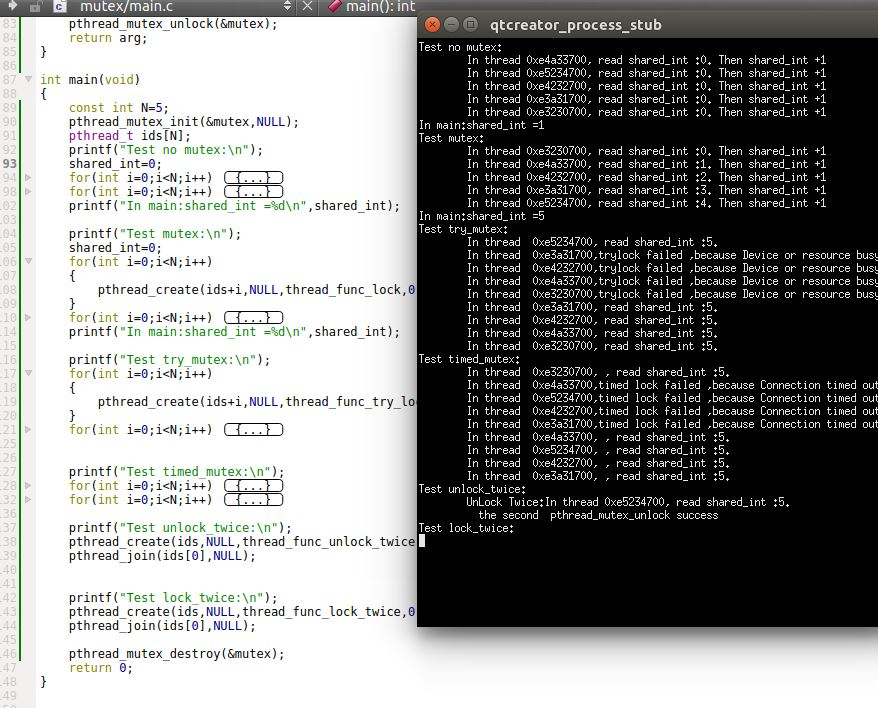
	从结果可见：如果不加锁，子线程之间相互竞争。最终主线程得到的是不正确的值。而且每次运行的情况可能还有不同
	
	如果使用`pthread_mutex_lock`，结果是正确的。
	

	注意：
	- 使用`pthread_mutex_trylock`时，如果不能加锁则直接返回`EBUSY`；使用`pthread_mutex_timedlock`时，如果超时则直接返回`ETIMEOUT`
	- 对于线程持有的锁，可以解锁多次。也就是当线程不再持有锁时，也可以调用`pthread_mutex_unlock`而不报错
	- 如果线程已经持有了锁，再次调用`pthread_mutex_lock`，则线程彻底死锁。

### 3.2 读写锁

1. 读写锁与互斥量类似，不过读写锁允许更高的并行性
	- 互斥量要么是锁住状态，要么是不加锁状态。而且一次只有一个线程可以对其进行加锁
	- 读写锁可以有三种状态：
		- 读模式下加锁状态（读锁定）
		- 写模式下加锁状态（写锁定）
		- 不加锁状态（未锁定）

		一次只能有一个线程可以对读写锁加写锁，但是允许多个线程同时对读写锁加读锁

2. 
	- 当读写锁是写锁定状态时，在该锁被解锁之前，所有试图对这个锁加锁（无论是加读锁还是价写锁）的线程都会被阻塞
	- 当读写锁是读锁定状态时，所有试图对它加读锁的线程都可以获得访问权，但是所有试图对它加写锁的线程都会被阻塞

	通常如果读写锁处于读锁定的状态，此时有一个线程试图对这个读写锁加写锁时，读写锁会阻塞该加写锁请求之后任何线程的所有加读锁请求。因为如果不阻塞之后的所有加读锁请求，那么当后续不断有加读锁请求到来时，该锁始终处于读锁定的状态，那么那个加写锁请求将永远得不到满足

3. 读写锁非常适合对于数据结构读的次数远大于写的情况。读写锁也叫共享互斥锁
	- 当读写锁是读锁定时，称它以共享模式锁住的
	- 当读写锁是写锁定时，称它以互斥模式锁住的

4. 读写锁是用`pthread_rwlock_t`数据类型表示。
	- 使用读写锁之前必须初始化。
		- 如果是动态分配的读写锁（如通过`malloc`函数），则必须调用`pthread_rwlock_init`函数进行初始化
		- 如果是静态分配的读写锁，那么除了调用`pthread_rwlock_init`函数来初始化，也可以将它设置为常量`PTHREAD_RWLOCK_INITALIZER`来初始化
	- 如果是动态分配的读写锁，那么在`free`释放内存之前必须调用`pthread_rwlock_destroy`函数来销毁读写锁。该函数会释放在动态初始化读写锁时动态分配的资源

	涉及的函数为：

	```
	#include<pthread.h>
	int pthread_rwlock_init(pthread_rwlock_t *restrict rwlock,
		const pthread_rwlockattr_t *restrict attr);
	int pthread_rwlock_destroy(pthread_rwlock_t *rwlock);
	```
	- 参数：
		- `rwlock`：待初始化/销毁的读写锁的地址
		- `attr`：读写锁的属性。如果为`NULL`，那么读写锁设置为默认属性
	- 返回值：
		- 成功：返回0
		- 失败： 返回错误编号

5. `pthread_rwlock_rdlock/pthread_rwlock_wrlock/pthread_rwlock_unlock`函数：对读写锁加锁/解锁操作

	```
	#include<pthread.h>
	int pthread_rwlock_rdlock(pthread_rwlock_t *rwlock);
	int pthread_rwlock_wrlock(pthread_rwlock_t *rwlock);
	int pthread_rwlock_unlock(pthread_rwlock_t *rwlock);
	```
	- 参数：
		- `rwlock`：待加锁/解锁的读写锁的地址
	- 返回值：
		- 成功：返回0
		- 失败： 返回错误编号

	用法：
	- `pthread_rwlock_rdlock`用于对读写锁加读锁。如果读写锁当前是未加锁的，或者是读锁定的，则加锁成功；如果读写锁当前是写锁定的，则阻塞线程。
	- `pthread_rwlock_wrlock`用于对读写锁加写锁。如果读写锁当前是未加锁的，则加锁成功；如果读写锁当前是读锁定或者写锁定的，则阻塞线程。
	- `pthread_rwlock_unlock`用于对读写锁进行解锁，无论读写锁当前状态是处于读锁定还是写锁定。

	注意：有的实现对读写锁同时加读锁的数量有限制。并不是无限制的加读锁。

6. `pthread_rwlock_tryrdlock/pthread_rwlock_trywrlock`函数：对读写锁加锁的条件版本

	```
	#include<pthread.h>
	int pthread_rwlock_tryrdlock(pthread_rwlock_t *rwlock);
	int pthread_rwlock_trywrlock(pthread_rwlock_t *rwlock);
	```
	- 参数：
		- `rwlock`：待加锁的读写锁的地址
	- 返回值：
		- 成功：返回0
		- 失败： 返回错误编号

	当可以加锁时，这两个函数返回0。否则它们返回错误`EBUSY`而不是阻塞线程。

7. `pthread_rwlock_timedrdlock/pthread_rwlock_timedwrlock`函数：对读写锁加锁的超时版本

	```
	#include<pthread.h>
	#include<time.h>
	int pthread_rwlock_timedrdlock(pthread_rwlock_t *rwlock,
		const struct timespect*restrict tsptr);
	int pthread_rwlock_timedwrlock(pthread_rwlock_t *rwlock,
		const struct timespect*restrict tsptr);
	```
	- 参数：
		- `rwlock`：待加锁的读写锁的地址
		- `tsptr`：指向一个`timespec`的指针，该`timepsec`指定了一个绝对时间（并不是相对时间，比如10秒）
	- 返回值：
		- 成功：返回0
		- 失败： 返回错误编号

	这两个函数被调用时：
	- 如果允许加锁，那么函数将对读写锁加锁并返回0
	- 如果不允许加锁，那么函数将阻塞到`tsptr`指定的时刻。在到达超时时刻时，`pthread_mutex_timedlock`不再试图对读写锁进行加锁，而是返回错误码`ETIMEOUT`
	> 可以使用`clock_gettime`函数获取`timespec`结构表示的当前时间。但是目前并不是所有平台都支持这个函数。因此也可以用`gettimeofday`函数获取`timeval`结构表示的当前时间，然后将这个时间转换为`timespec`结构。

8. 示例：在`main`函数中调用`test_rwlock`函数：

	```
void test_rwlock()
{
    M_TRACE("---------  Begin test_rwlock()  ---------\n");
    //********** 初始化 *************//
    shared_int=99;
    My_pthread_rwlock_init(&rwlock,NULL);
    //******** 创建子线程 *********//
    const int N=5;
    pthread_t threads[N];
    int rw_int[]={1,1,3,1,1}; // 每个线程的锁的类型
    for(int i=0;i<N;i++)
        My_pthread_create(threads+i,NULL,thread_func,rw_int[i]);
    //******** 等待子线程结束 *********//
    int values[N];
    for(int i=0;i<N;i++)
        thread_join_int(threads[i],values+i);

    My_pthread_rwlock_destroy(&rwlock);
    M_TRACE("---------  End test_rwlock()  ---------\n\n");
}
	```
	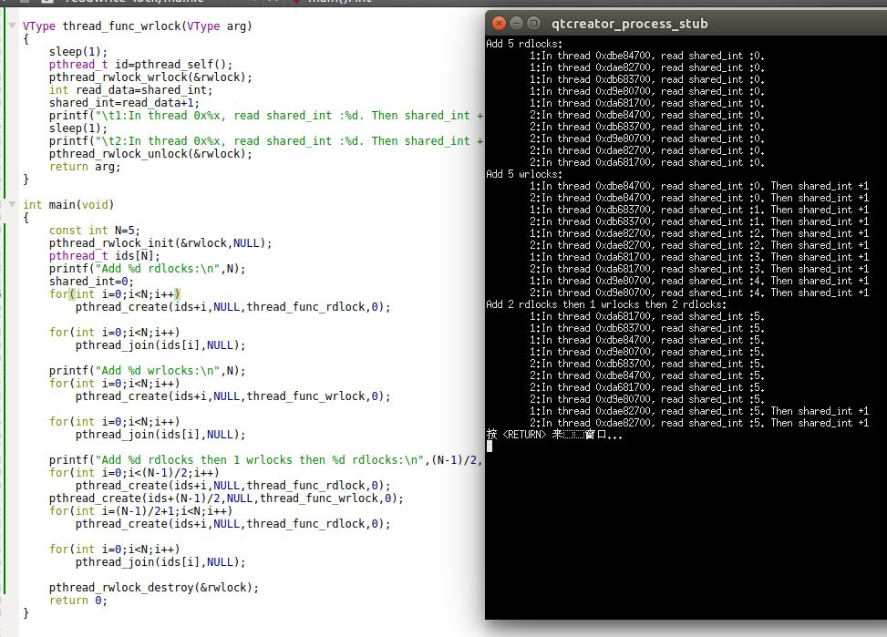
	可以看到，在读锁序列中，所有的子线程都能对读锁进行加锁，因此会并行执行。因此如果此时写共享数据，发现结果会不正确。
	
	如果我们采用写锁序列，则子线程会串行依次进行。结果如下：
	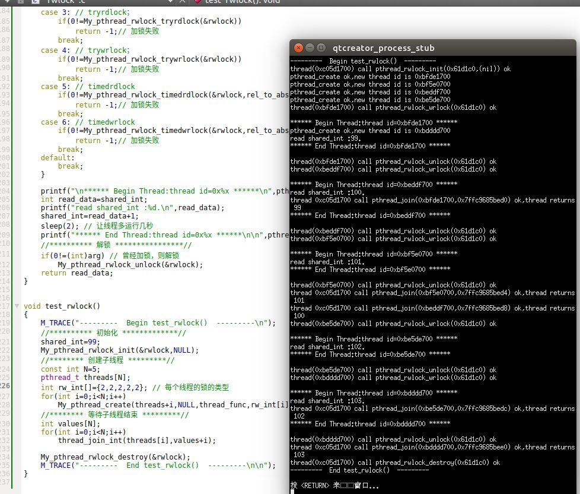


### 3.3 条件变量

1.  条件变量是不同于锁的另一种同步机制。条件变量给多个线程提供了一个会合的场所。条件变量实际应用中，它映射到某个数据的真假，如判断缓冲区的长度不为零：`buffer_len!=0`
	- 条件变量与互斥量一起使用时，允许线程以无竞争的方式等待指定的条件发生
	> 这里的“指定的条件“表示的是：数据变量为真，如`buffer_len!=0`

2. 条件本身是由互斥量来进行保护的：（即缓冲区`buffer`的访问需要互斥量保护）
	- 线程在改变条件的状态之前必须首先锁住互斥量，如要修改`buffer或者buffer_len`
	- 其他线程在获得互斥量之前不会察觉这种改变，因为必须首先锁定互斥量之后才能计算`buffer_len`

3. 条件变量是用`pthread_cond_t`数据类型表示。
	- 使用条件变量之前必须初始化。
		- 如果是动态分配的条件变量（如通过`malloc`函数），则必须调用`pthread_cond_init`函数进行初始化
		- 如果是静态分配的条件变量，那么除了调用`pthread_cond_init`函数来初始化，也可以将它设置为常量`PTHREAD_COND_INITALIZER`来初始化
	- 如果是动态分配的条件变量，那么在`free`释放内存之前必须调用`pthread_cond_destroy`函数来销毁条件变量。该函数会释放在动态初始化条件变量时动态分配的资源

	涉及的函数为：

	```
	#include<pthread.h>
	int pthread_cond_init(pthread_cond_t *restrict cond,
		const pthread_condattr_t *restrict attr);
	int pthread_cond_destroy(pthread_cond_t *cond);
	```
	- 参数：
		- `cond`：待初始化/销毁的条件变量的地址
		- `attr`：条件变量的属性。如果为`NULL`，那么条件变量设置为默认属性
	- 返回值：
		- 成功：返回0
		- 失败： 返回错误编号

4. `pthread_cond_wait/pthread_cond_timedwait`函数：等待条件成立

	```
	#include<pthread.h>
	#include<time.h>
	int pthread_cond_wait(pthread_cond_t *restrict cond,
		pthread_mutext_t *restrict mutex);
	int pthread_cond_timedwait(pthread_cond_t *restrict cond,
		pthread_mutext_t *restrict mutex,
		const struct timespect*restrict tsptr);
	```
	- 参数：
		- `cond`：要等待的条件变量的地址
		- `mutex`：与条件变量配套的互斥量的地址
		- `tsptr`：指向一个`timespec`的指针，该`timepsec`指定了一个绝对时间（并不是相对时间，比如10秒）
	- 返回值：
		- 成功：返回0
		- 失败： 返回错误编号

	`pthread_cond_wait`等待指定指定的条件成立；如果指定的条件不成立，则线程阻塞。`pthread_cond_timedwait`会指定一个超时时刻。如果在超时时刻到来时，指定条件仍然不满足，则函数返回错误码`ETIMEOUT`

	互斥量`mutex`用于对条件变量`cond`进行保护。调用者在调用`pthread_cond_wait/pthread_cond_timedwait`函数之前，必须首先对`mutex`加锁（即`mutex`此时必须是处于已锁定状态）。	
	- `pthread_cond_wait/pthread_cond_timedwait`会计算指定的条件是否成立，如果不成立则会自动把调用线程放到等待条件的线程列表中并阻塞线程，然后对互斥量`mutex`进行解锁。
	> 之所以`mutex`必须是已锁定状态，就是因为这里有“计算条件然后如果不满足条件就把进程投入休眠”的操作。这两步并不是原子的，所以需要利用条件变量保护起来
	- 当从`pthread_cond_wait/pthread_cond_timedwait`函数返回时，返回之前互斥量`mutex`再次被锁住

	`pthread_cond_timedwait`被调用时：
	- 如果指定条件成立，那么函数返回0
	- 如果指定条件不成立，那么函数将阻塞到`tsptr`指定的时刻。在到达超时时刻时，`pthread_mutex_timedlock`返回错误码`ETIMEOUT`
	> 可以使用`clock_gettime`函数获取`timespec`结构表示的当前时间。但是目前并不是所有平台都支持这个函数。因此也可以用`gettimeofday`函数获取`timeval`结构表示的当前时间，然后将这个时间转换为`timespec`结构。

5. `pthread_cond_signal/pthread_cond_broadcast`函数：通知所有线程，某个条件成立	

	```
	#include<pthread.h>
	int pthread_cond_signal(pthread_cond_t *cond);
	int pthread_cond_broadcast(pthread_cond_t *cond);
	``` 
	- 参数：
		- `cond`：该指针指向的条件变量状态变为：条件成立
	- 返回值：
		- 成功：返回0
		- 失败： 返回错误编号

	`pthread_cond_signal`函数能够唤醒一个等待`cond`条件发生的线程；而`pthread_cond_broadcast`函数能够唤醒等待`cond`条件发生的所有线程
	>在调用`pthread_cond_signal/pthread_cond_broadcast`函数时，我们说这是在给线程或者条件发信号。

6. 条件变量通常用于通知其它线程：某个条件成立。条件变量本身只是一个标记，真正发生改变的是某个真实等待同步的数据。如：
	- 线程`A`负责从网络接口读取网络数据，然后存入缓冲区中
	- 线程`B`负责`GUI`，并且当用户点击某个按钮时，打印缓冲区中的网络数据

	这种情况必须用多线程。如果是单线程，则当线程`A`读取网络数据时，可能发生阻塞。此时导致用户界面失去响应，用户体验极差。一旦使用多线程时，则必须有某种通信机制，使得当线程`B`打印网络数据时，确保缓冲区中有数据。所以典型的流程是：
	- 线程`B`等待条件变量`cond`的发生，然后投入睡眠
	- 线程`A`读取网络数据，一旦读取成功，则通知线程`A`，`cond`条件成立
	- 线程`B`被唤醒，继续执行打印网络数据的工作

	这里真实的条件是：缓冲区中有了有效的数据！而`cond`条件变量只是真实条件的一个标记！

7. 示例：在`main`函数中调用`test_condition`函数：

	```
void test_condition()
{
    M_TRACE("---------  Begin test_condition()  ---------\n");
    //********** 初始化 *************//
    shared_int=0;
    My_pthread_mutex_init(&mutex,NULL);
    My_pthread_cond_init(&cond,NULL);
    //******** 创建子线程 *********//
    const int N=2;

    pthread_t thread_waits[N];
    pthread_t thread_signals[N];

    My_pthread_mutex_lock(&mutex); // 加锁
    for(int i=0;i<N;i++)
        My_pthread_create(thread_waits+i,NULL,thread_func_wait,0); //这些线程都在等待事件的发生
    My_pthread_mutex_unlock(&mutex); // 解锁

    My_pthread_mutex_lock(&mutex); // 加锁
    for(int i=0;i<N;i++)
        My_pthread_create(thread_signals+i,NULL,thread_func_signal,0); //这些线程都在发送事件发生的信号
    My_pthread_mutex_unlock(&mutex); // 解锁
    //******** 等待子线程结束 *********//
    int values[N];
    for(int i=0;i<N;i++)
        thread_join_int(thread_waits[i],values+i);
    for(int i=0;i<N;i++)
        thread_join_int(thread_signals[i],values+i);

    My_pthread_mutex_destroy(&mutex);
    My_pthread_cond_destroy(&cond);
    M_TRACE("---------  End test_condition()  ---------\n\n");
}

	```
	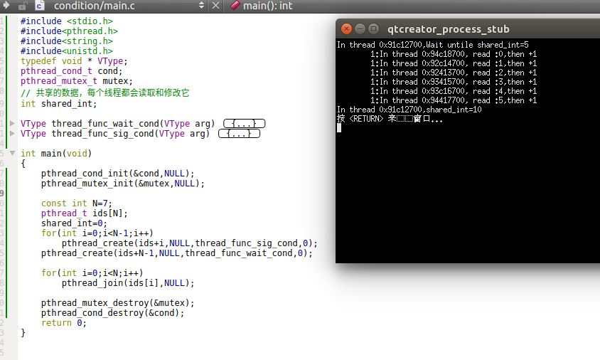
	这里子线程要等待的条件是： `shared_int>=3`。
	- 为了保证`pthread_cond_wait`醒来时，`shared_int`一定是大于等于 3，则必须用互斥量加锁（否则可能有其他线程在`pthread_cond_wait`返回的时候修改了`shared_int`）
	- 至于 `pthread_cond_signal`调用时需不需要加锁，则不一定
		- 如果线程执行 `pthread_cond_signal` 时，线程持有锁，则仅当线程释放锁的时候，阻塞在`pthread_cond_wait`的线程才会被唤醒。因为`pthread_cond_wait`需要获得锁
		- 如果线程执行 `pthread_cond_signal` 时，线程不持有锁，则阻塞在`pthread_cond_wait`的线程马上被唤醒

### 3.4 自旋锁

1. 自旋锁与互斥量类似，但是它并不是通过睡眠使得线程阻塞，而是在获得锁之前一直处于忙等（自旋）阻塞状态。此时`CPU`不能做其他的事情。

2. 自旋锁常用于以下情况：锁被持有时间很短，而且线程不希望在重新调度上花费太多的成本

3. 自旋锁通常作为底层原语用于实现其他类型的锁。

4. 自旋锁用于非抢占式内核中时非常有用。但是在用户层，自旋锁并不是非常有用（除了运行在不允许抢占的实时调度操作系统中）

5. 自旋锁的接口与互斥量的接口 类似，这使得它们之间可以方便的替换。

6. 自旋锁是用`pthread_spinlock_t`数据类型表示。
	- 使用自旋锁之前必须初始化。可以调用`pthread_spin_init`函数进行初始化
	- 在`free`释放内存之前必须调用`pthread_spin_destroy`函数来销毁自旋锁。该函数会释放在动态初始化自旋锁时动态分配的资源

	涉及的函数为：

	```
	#include<pthread.h>
	int pthread_spin_init(pthread_spinlock_t *restrict lock,
		int pshared);
	int pthread_spin_destroy(pthread_spinlock_t *lock);
	```
	- 参数：
		- `lock`：待初始化/释放的自旋锁的地址
		- `pshared`：自旋锁的属性。可以为：
			- `PTHREAD_PROCESS_SHARED`：表示自旋锁能够跨进程使用
			- `PTHREAD_PROCESS_PRIVATE`：表示自旋锁只能在进程内部的线程中使用
	- 返回值：
		- 成功：返回0
		- 失败： 返回错误编号

7. `pthread_spin_lock/pthread_spin_trylock/pthread_spin_unlock`函数：对自旋锁加锁/解锁操作

	```
	#include<pthread.h>
	int pthread_spin_lock(pthread_spinlock_t *lock);
	int pthread_spin_trylock(pthread_spinlock_t *lock);
	int pthread_spin_unlock(pthread_spinlock_t *lock);
	```
	- 参数：
		- `lock`：待加锁/解锁的自旋锁的地址
	- 返回值：
		- 成功：返回0
		- 失败： 返回错误编号

	用法：
	- `pthread_spin_lock`用于对自旋锁进行加锁。如果自旋锁已经上锁，则调用线程自旋
	- `pthread_spin_unlock`用于对自旋锁进行解锁
	- `pthread_spin_trylock`也用于对自旋锁进行加锁
		- 如果它被调用时，自旋锁处于未锁定状态，那么函数将锁住自旋锁并返回 0
		- 如果它被调用时，自旋锁处于锁定状态，则函数调用失败，立即返回`EBUSY`而不是自旋

	注意：
	- 同一个线程连续对自旋锁进行加锁，结构未定义。可能第二次加锁会返回`EDEADLK`错误或其他错误，也可能永久自旋
	- 试图对未加锁的自旋锁进行解锁，结果也未定义
	- 不要在持有自旋锁的情况下调用可能使线程休眠的函数。如果持有自旋锁的线程休眠，会浪费CPU资源，因为其他线程需要获取自旋锁要等待的时间就延长了

8. 示例：在`main`函数中调用`test_spinlock`函数：

	```
void test_spinlock()
{
    M_TRACE("---------  Begin test_spinlock()  ---------\n");
    //********** 初始化 *************//
    shared_int=0;
    My_pthread_spin_init(&spin_lock,PTHREAD_PROCESS_PRIVATE);
    //******** 创建子线程 *********//
    const int N=3;
    pthread_t threads[N];

    My_pthread_spin_lock(&spin_lock); // 加锁
    for(int i=0;i<N;i++)
        My_pthread_create(threads+i,NULL,thread_func,0);
    My_pthread_spin_unlock(&spin_lock); // 解锁
    //******** 等待子线程结束 *********//
    int values[N];
    for(int i=0;i<N;i++)
        thread_join_int(threads[i],values+i);

    My_pthread_spin_destroy(&spin_lock);
    M_TRACE("---------  End test_spinlock()  ---------\n\n");
}

	```
	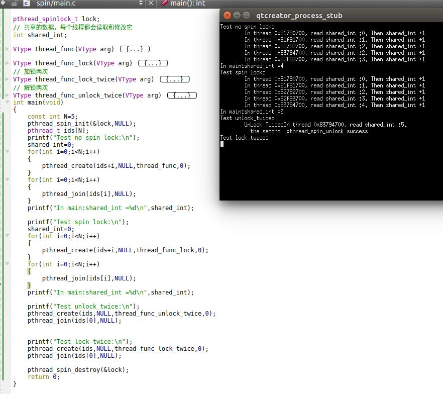
	可以看到：
	- 自旋锁的接口与用法基本与互斥量相同
		- 如果不加锁，子线程之间相互竞争。最终主线程得到的是不正确的值（5个子线程，每个子线程加1，应该为5）。而且每次运行的情况可能还有不同
		- 对于线程持有的自旋锁，可以解锁多次。也就是当线程不再持有锁时，也可以调用`pthread_spin_unlock`而不报错
		- 如果线程已经持有了自旋锁，再次调用`pthread_spin_lock`，则线程彻底死锁。


### 3.5 屏障

1. 屏障`barrier`是用户协作多个线程并行工作的同步机制。屏障允许每个线程等待，直到所有的合作线程都到达某一点，然后从改点继续执行

2. `pthread_join`函数就是一种屏障，它允许一个线程等待，直到另一个线程退出

3. 屏障是用`pthread_barrier_t`数据类型表示。
	- 使用屏障之前必须初始化。可以调用`pthread_barrier_init`函数进行初始化
	- 在`free`释放内存之前必须调用`pthread_barrier_destroy`函数来销毁屏障。该函数会释放在动态初始化屏障时动态分配的资源

	涉及的函数为：

	```
	#include<pthread.h>
	int pthread_barrier_init(pthread_barrier_t *restrict barrier,
		const pthread_barrierattr_t *restrict attr,
		int count);
	int pthread_barrier_destroy(pthread_barrier_t *barrier);
	```
	- 参数：
		- `barrier`：待初始化/释放的屏障的地址
		- `attr`：屏障的属性的地址。如果为`NULL`则采用默认属性
		- `count`：在允许所有线程继续允许之前，必须到达屏障的线程的数量
	- 返回值：
		- 成功：返回0
		- 失败： 返回错误编号

4. `pthread_barrier_wait`函数：线程到达屏障并等待其他线程也到达屏障

	```
	#include<pthread.h>
	int pthread_barrier_wait(pthread_barrier_t * barrier);
	```
  
	- 参数：
		- `barrier`：到达的屏障的地址
	- 返回值：
		- 成功：返回0或者`PTHREAD_BARRIER_SERIAL_THREAD`
		- 失败： 返回错误编号

	线性调用`pthread_barrier_wait`函数来表明，线程已经到达屏障`barrier`，并等待其他线程赶上来。

	调用`pthread_barrier_wait`的线程在屏障计数未满足条件时（即：到达屏障的线程数量小于`count`），会进入休眠状态。如果线程调用`pthread_barrier_wait`后，刚好满足了屏障计数条件，则返回 `PTHREAD_BARRIER_SERIAL_THREAD` ，同时所有的等待线程都将被唤醒(同时这些线程上的`pthread_barrier_wait` 函数返回 0）。

	一旦到达屏障计数值，而且线程处于非阻塞状态，那么屏障就可以重用（即屏障计数有从零开始）。此时屏障的计数目标数量仍然不变。如果你希望改变计数的目标数量（比如扩大到达线程的目标数量），则必须再一次调用`pthread_barrier_init`函数。

5. 示例：在`main`函数中调用`test_barrier`函数：

	```
void test_barrier()
{
    M_TRACE("---------  Begin test_barrier()  ---------\n");
    const int N=3;
    //********** 初始化 *************//
    My_pthread_barrier_init(&barrier,NULL,N);
    //******** 创建子线程 *********//
    pthread_t threads[N];
    for(int i=0;i<N;i++)
        My_pthread_create(threads+i,NULL,thread_func,0);
    //******** 等待子线程结束 *********//
    int values[N];
    for(int i=0;i<N;i++)
        thread_join_int(threads[i],values+i);

    My_pthread_barrier_destroy(&barrier);
    M_TRACE("---------  End test_barrier()  ---------\n\n");
}
	```

	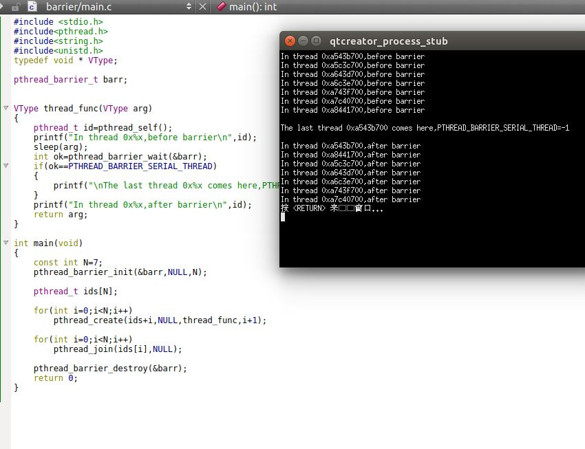
	可以看到：
	- 所有线程到达`pthread_barrier_wait`函数处就投入睡眠，等待其他线程追上来
	- 最后到达的一个线程，其 `pthread_barrier_wait`函数返回值为`PTHREAD_BARRIER_SERIAL_THREAD`（在`UBUNTU 16.04`上它就是 -1）
	- 当所有线程都到达，从`pthread_barrier_wait`函数返回时，线程唤醒的顺序不确定