# 线程控制

1. `SUS`定义了与线程操作有关的一些限制。与其他的系统限制一样，这些限制也可以通过`sysconf`函数进行查询：
	- `PTHREAD_DESTRUCTOR_ITERATIONS`：线程退出时，操作系统试图小伙线程特定数据的最大次数
	- `PTHREAD_KEYS_MAX`：线程可以创建的键的最大数目
	- `PTHREAD_STACK_MIN`：一个线程的栈可用的最小字节数
	- `PTHREAD_THREADS_MAX`：进程可以创建的最大线程数

2. `pthread`接口允许我们通过设置线程/同步对象关联的属性对象来详细调节线程/同步对象。通常，管理这些属性的函数遵循相同的模式

	- 每个对象与它自己类型的属性对象进行关联
		- 线程与线程属性关联
		- 互斥量与互斥量属性关联，等等
	- 一个属性对象可以代表多个属性。属性对象对于应用程序来说是不透明的。这意味着应用程序并不需要了解有关属性对象内部的详细结构，应用程序只需要使用相应函数来管理属性对象
		- 有一个初始化函数，用于将属性设置为默认值
		- 有一个销毁属性对象的函数。如果初始化函数分配了与属性对象关联的资源，销毁函数则负责释放这些资源
		- 每个属性都有一个从属性对象中获取属性值的函数。由于函数成功时会返回0，失败时会返回错误编号，因此获取的属性值是通过传入函数的一个指针参数返回的。
		- 每个属性都有一个设置属性值的函数。此时属性值作为参数按照值传递。

## 1. 线程属性

1. `pthread_attr_init/pthread_attr_destroy`函数：线程属性的初始化函数和销毁函数

	```
	#include<pthread>
	int pthread_attr_init(pthread_attr_t *attr);
	int pthread_attr_destroy(pthread_attr_t *attr);
	```
	- 参数：
		- `attr`：指向待初始/销毁的线程属性对象的指针
	- 返回值：
		- 成功：返回0
		- 失败：返回错误编号

	如果`pthread_attr_init`的实现对属性对象的内存空间是动态分配的，则`pthread_attr_destroy`就会释放该内存空间。另外`pthread_attr_destroy`还会用无效的值初始化属性对象。如果用`pthread_attr_destroy`销毁后的属性对象去调用`pthread_create`，则会创建线程失败

	如果`pthread_attr_init`调用失败，我们通常可以检测到，并且可以不去创建子线程。但是如果`pthread_attr_destroy`调用失败，那么通常子线程已经创建并开始执行了。这时非常难以清理：
	- 我们需要销毁刚创建的子线程
	- 如果`pthread_attr_init`分配了内存空间，那么没有任何补救措施（因为唯一可以清理的`pthread_attr_destroy`调用失败），会出现内存泄漏

2. `POSIX.1`定义了如下的线程属性：
	- `detachstate`：线程的分离状态属性
		> 分离线程：这种类型的线程在退出时会由操作系统马上收回它所占有的资源。非分离线程在退出时会持有某些资源直到另一个线程对它调用`pthread_join`
	- `guardsize`：线程栈末尾的警戒缓冲区大小（字节数）
	- `stackaddr`：线程栈的最低地址
	- `stacksize`：线程栈的最小长度（字节数）
	
3. `pthread_attr_getdetachstate/pthread_attr_setdetachsetate`函数：获取/设置线程的分离状态属性

	```
	#include<pthread>
	int pthread_attr_getdetachstate(const pthread_attr_t *restrict attr,
		int *detachstate);
	int pthread_attr_setdetachsetate(const pthread_attr_t *restrict attr,
		int detachstate);
	```
	- 参数：
		- `attr`：指向待获取/设置的线程属性对象
		- `pthread_attr_getdetachstate`函数，`detachstate`：一个整数指针，获取的分离状态属性存放在它指向的地址
		- `pthread_attr_setdetachsetate`函数，`detachstate`：一个整数，其值就是要设置的分离状态属性。它只有两个合法值：
			- `PTHREAD_CREATE_DETACHED`：以分离状态启动线程
			- `PTHREAD_CREATE_JOINABLE`：以正常状态启动线程

	- 返回值：
		- 成功：返回0
		- 失败：返回错误编号

	如果在创建线程时就知道不需要了解子线程的终止状态，则可以修改`pthread_attr_t`中的`detachstate`属性，让子线程从创建完毕就处于分离状态。

	当你想获取线程的分离状态时，调用`pthread_attr_getdetachstate`，其`detachstate`参数指向的内容要么是`PTHREAD_CREATE_DETACHED`，要么是`PTHREAD_CREATE_JOINABLE`

4. `pthread_attr_getstack/pthread_attr_setstack`函数：获取/设置线程的线程栈属性

	```
	#include<pthread.h>
	int pthread_attr_getstack(const pthread_attr_t *restrict attr,
		void ** restrict stackaddr,size_t *restrict stacksize);
	int pthread_attr_setstack(pthread_attr_t *attr,
		void *stackaddr,size_t stacksize);
	```
	- 参数：
		- `attr`：指向待获取/设置的线程属性对象
		- `pthread_attr_getstack`函数，`stackaddr`：一个指向`void*`的指针，获取的线程栈的最低地址存放在它指向的内存
		- `pthread_attr_getstack`函数，`stacksize`：一个指向`size_t*`的指针，获取的线程栈的大小存放在它指向的内存
		- `pthread_attr_setstack`函数，`stackaddr`：一个`void*`，其值就是要设置的线程栈的最低地址
		- `pthread_attr_setstack`函数，`stacksize`：一个`size_t`，其值就是要设置的线程栈的大小

	- 返回值：
		- 成功：返回0
		- 失败：返回错误编号

	对于遵守`POSIX`标准的操作系统来说，并不一定需要支持线程栈属性。对于遵守`SUS`中`XSI`选项的系统来说，必须支持线程栈属性。
	- 可以在编译阶段使用`_POSIX_THREAD_ATTR_STACKADDR`和`_POSIX_THREAD_ATTR_STACKSIZE`符号来检查操作系统是否支持线程栈属性
	- 也可以在运行阶段把`_SC_THREAD_ATTR_STACKADDR`和`_SC_THREAD_ATTR_STACKSIZE`选项传递给`sysconf`参数，检查操作系统是否支持线程栈属性

	对于进程来说，虚拟地址空间的大小是固定的。因为进程中只有一个进程栈，因此其大小通常不是问题。但是对线程来说，同样大小的虚拟地址空间被所有的线程所共享。如果有很多个线程，以至于这些线程栈的总大小超过了可用的虚拟地址空间，则需要减少默认的线程栈大小。

	另外如果线程调用的函数分配了大量的自动变量，或者调用的函数设计很多很深的栈帧，则需要的线程栈大小可能要比默认的大。

	如果线程栈的虚拟地址空间都用完了，那么可以调用`malloc`或者`mmap`来为线程栈分配空间，并用`pthread_attr_setstack`函数来改变新建线程的线程栈的位置。

	`stackaddr`线程属性被定义为线程栈的最低内存地址。但是这不一定是线程栈的开始位置。
	- 如果处理器结构的栈是从高地址到低地址方向增长，那么`stackaddr`将是线程栈的结尾位置
	- 如果处理器结构的栈是从低地址到高地址方向增长，那么`stackaddr`将是线程栈的开始位置

	在`LINUX`上，设置时，`stacksize` 如果小于`PTHREAD_STACK_MIN (16384字节，4*4Kb)`，则报错`Invalid Argument`

5. `pthread_attr_getstacksize/pthread_attr_setstacksize`函数：获取/设置线程的栈大小

	```
	#include<pthread.h>
	int pthread_attr_getstacksize(const pthread_attr_t *restrict attr,
		 size_t *restrict stacksize);
	int pthread_attr_setstacksize(pthread_attr_t *attr,
		 size_t stacksize);
	```
	- 参数：
		- `attr`：指向待获取/设置的线程属性对象
		- `pthread_attr_getstacksize`函数，`stacksize`：一个指向`size_t*`的指针，获取的线程栈的大小存放在它指向的内存
		- `pthread_attr_setstacksize`函数，`stacksize`：一个`size_t`，其值就是要设置的线程栈的大小

	- 返回值：
		- 成功：返回0
		- 失败：返回错误编号

	如果仅仅希望改变默认线程栈的大小，又不想自己处理线程栈的分配问题，则可以使用`pthread_attr_setstacksize`函数
	> `pthread_attr_setstack`函数不仅需要设置默认线程栈的大小，还需要分配线程栈的空间

6. `pthread_attr_getguardsize/pthread_attr_setguardsize`函数：获取/设置线程的`guardsize`属性

	```
	#include<pthread.h>
	int pthread_attr_getguardsize(const pthread_attr_t *restrict attr,
		 size_t *restrict guardsize);
	int pthread_attr_setguardsize(pthread_attr_t *attr,
		 size_t guardsize);
	```
	- 参数：
		- `attr`：指向待获取/设置的线程属性对象
		- `pthread_attr_getguardsize`函数，`guardsize`：一个指向`size_t*`的指针，获取的线程栈的`guardsize`值存放在它指向的内存
		- `pthread_attr_setguardsize`函数，`guardsize`：一个`size_t`，其值就是要设置的线程栈的`guardsize`值

	- 返回值：
		- 成功：返回0
		- 失败：返回错误编号

	一个线程的`guardsize`属性就是线程栈末尾的警戒缓冲区大小（字节数）。它控制着线程栈末尾之后，用以避免栈溢出的扩展内存大小。这个属性默认值由具体操作系统定义，但通常是系统页大小
	- 可以将这个值设置为 0 ，表示不提供警戒缓冲区
	- 如果修改了线程属性`stackaddr`，则系统认为我们将自己管理线程栈，进而也会使得警戒缓冲区机制无效，这等同于将`guardsize`属性设为 0

	如果`guardsize`属性设为非 0 ，则操作系统可能会将它设置为页大小的整数倍。如果线程的栈指针溢出到警戒区域，则应用程序可能通过信号接收到出错信息。

7. 示例

	```
#include <stdio.h>
#include<pthread.h>
#include<string.h>
#include<errno.h>
#include<malloc.h>
typedef void * VType;
pthread_mutex_t mutex=PTHREAD_MUTEX_INITIALIZER;
void print_pthread_detachstate(const pthread_attr_t*attr)
{
    int detach_state;
    int ok=pthread_attr_getdetachstate(attr,&detach_state);
    if(ok!=0)
    {
        printf("\tget detach state error,because :%s\n",strerror(ok));
    }else
    {
        printf("\tdetach state is %s\n",detach_state==PTHREAD_CREATE_DETACHED?
			 "Detached":"Joinable");
    }
}
void print_pthread_stack(const pthread_attr_t *attr)
{
    VType stack;
    size_t stacksize;
    int ok=pthread_attr_getstack(attr,&stack,&stacksize);
    if(ok!=0)
    {
        printf("\tget stack error,because :%s\n",strerror(ok));
    }else
    {
        printf("\tstack addr is 0x%x,stack size is %d\n",stack,stacksize);

    }
}
void print_pthread_guardsize(const pthread_attr_t *attr)
{
    size_t guardsize;
    int ok=pthread_attr_getguardsize(attr,&guardsize);
    if(ok!=0)
    {
        printf("\tget guard size error,because :%s\n",strerror(ok));
    }else
    {
        printf("\tguard size is %d\n",guardsize);
    }
}
void print_pthread_attr(const pthread_attr_t*attr)
{
    print_pthread_detachstate(attr);
    print_pthread_stack(attr);
    print_pthread_guardsize(attr);
}
VType thread_func (VType arg)
{// arg will be set to pthread_attr_t*attr
    pthread_attr_t*attr=(pthread_attr_t*)arg;
    pthread_mutex_lock(&mutex);
    pthread_t id=pthread_self();
    printf("---------Begin Thread 0x%x --------\n",id);
    print_pthread_attr(attr);
    printf("---------End Thread--------\n");
    pthread_mutex_unlock(&mutex);
    return arg;
}
pthread_attr_t pthread_attr_default;
pthread_attr_t pthread_attr_detach;
pthread_attr_t pthread_attr_stack;
pthread_attr_t pthread_attr_stack_size;
pthread_attr_t pthread_attr_guard_size;
int main(void)
{
    //******** init pthread_attr_t *****
    pthread_attr_init(&pthread_attr_default);
    pthread_attr_init(&pthread_attr_detach);
    pthread_attr_init(&pthread_attr_stack);
    pthread_attr_init(&pthread_attr_stack_size);
    pthread_attr_init(&pthread_attr_guard_size);
    //********** set pthread_attr_t ******
    int ok= pthread_attr_setdetachstate(&pthread_attr_detach,PTHREAD_CREATE_DETACHED);
    if(ok!=0)
    {
        printf("pthread_attr_setdetachstate failed, because %s \n",strerror(ok));
        return -1;
    }
    size_t stack_size=40960;
    char *buffer=malloc(stack_size);
    ok=pthread_attr_setstack(&pthread_attr_stack,(void*)buffer,stack_size);
    if(ok!=0)
    {
        printf("pthread_attr_setstack failed, because %s \n",strerror(ok));
        return -1;
    }
    ok=pthread_attr_setstacksize(&pthread_attr_stack_size,stack_size);
    if(ok!=0)
    {
        printf("pthread_attr_setstacksize failed, because %s \n",strerror(ok));
        return -1;
    }

    size_t guard_size=16;
    ok=pthread_attr_setguardsize(&pthread_attr_guard_size,guard_size);
    if(ok!=0)
    {
        printf("pthread_attr_setguardsize failed, because %s \n",strerror(ok));
        return -1;
    }
    //********* print pthread_attr_t ***********
    printf("pthread_attr_default:\n");
    print_pthread_attr(&pthread_attr_default);
    printf("pthread_attr_detach:\n");
    print_pthread_attr(&pthread_attr_detach);
    printf("pthread_attr_stack:\n");
    print_pthread_attr(&pthread_attr_stack);
    printf("pthread_attr_stack_size:\n");
    print_pthread_attr(&pthread_attr_stack_size);
    printf("pthread_attr_guard_size:\n");
    print_pthread_attr(&pthread_attr_guard_size);
    //********************** create thread *******
    pthread_t threads[5];
    pthread_create(0+threads,&pthread_attr_default,thread_func,
			&pthread_attr_default);
    pthread_create(1+threads,&pthread_attr_detach,thread_func,
			&pthread_attr_detach);
    pthread_create(2+threads,&pthread_attr_stack,thread_func,
			&pthread_attr_stack);
    pthread_create(3+threads,&pthread_attr_stack_size,thread_func,
			&pthread_attr_stack_size);
    pthread_create(4+threads,&pthread_attr_guard_size,thread_func,
			&pthread_attr_guard_size);
    //************ join thread *******
    for(int i=0;i<5;i++)
    {
        int ok=pthread_join(threads[i],NULL);
        if(ok!=0)
        {
            printf("join threads 0x%x failed,because %s\n",threads[i],strerror(ok));
        }else
        {
            printf("joine threads 0x%x\n",threads[i]);
        }
    }
    //******** destroy pthread_attr_t *****
    pthread_attr_destroy(&pthread_attr_default);
    pthread_attr_destroy(&pthread_attr_detach);
    pthread_attr_destroy(&pthread_attr_stack);
    pthread_attr_destroy(&pthread_attr_stack_size);
    pthread_attr_destroy(&pthread_attr_guard_size);
    free(buffer);
    return 0;
}
	```
	从结果可知：默认情况下，线程是`Joinable`，线程栈长度为0（即栈尚未分配），`guard size`为一页大小（`4Kb`）。
	
	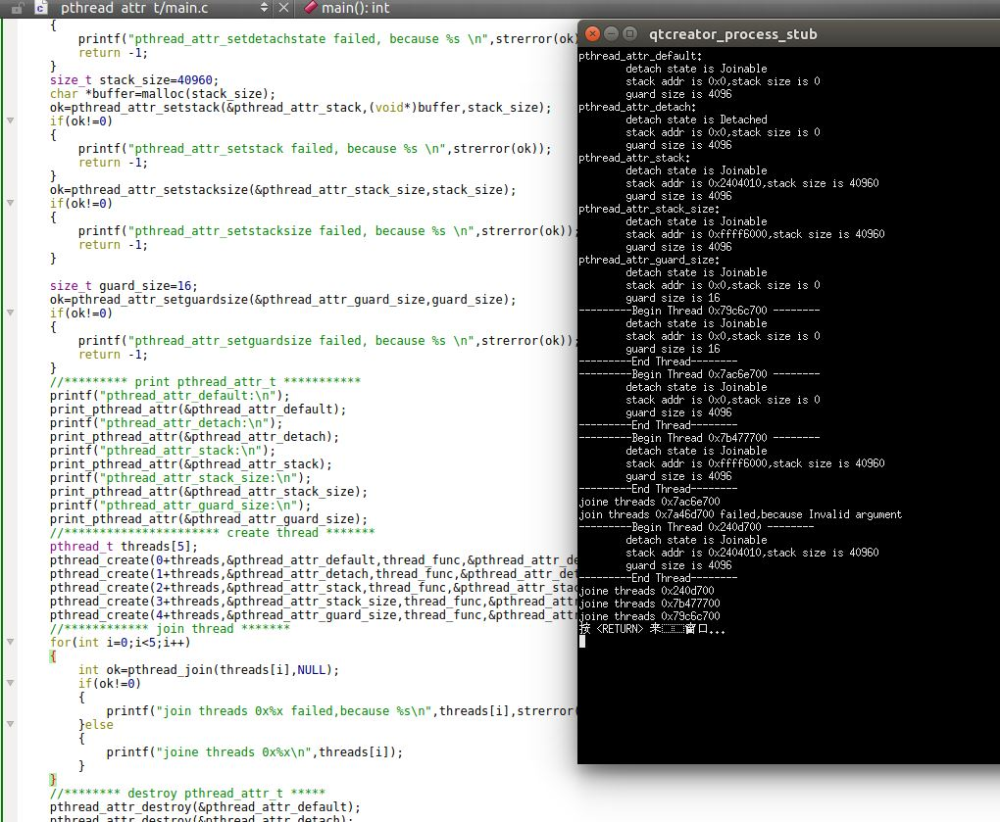

## 2. 同步属性

### 2.1 互斥量属性

1. 互斥量	属性是用`pthread_mutexattr_t`结构表示的

2. `pthread_mutexattr_init/pthread_mutexattr_destroy`函数：初始化/销毁互斥量	属性

	```
	#include<pthread.h>
	int pthread_mutexattr_init(pthread_mutexattr_t *attr);
	int pthread_mutexattr_destroy(pthread_mutexattr_t *attr);
	```
	- 参数：
		- `attr`：指向待初始化/销毁的互斥量属性
	
	- 返回值：
		- 成功：返回0
		- 失败：返回错误编号

	`pthread_mutexattr_init`将用默认的互斥量属性初始化`pthread_mutexattr_t`结构。

3. 互斥量属性最重要的有3个属性：
	- 进程共享属性：决定了该互斥量是进程共享`PTHREAD_PROCESS_SHARED `，还是线程共享`PTHREAD_PROCESS_PRIVATE`
	- 健壮属性：它改变了当持有互斥量的进程未释放互斥量就退出时，另一个进程的线程调用`pthread_mutex_lock`的返回类型
	- 类型属性：控制了互斥量的锁定属性

4. 进程共享属性：可以通过静态检查`_POSIX_THREAD_PROCESS_SHARED`符号是否定义从而判断这个平台是否支持进程共享这个属性。也可以运行时将`_SC_THREAD_PROCESS_SHARED`传入`sysconf`函数来动态判断这个平台是否支持进程共享这个属性。进
	
	如果将互斥量用于多线程同步，则互斥量的进程共享属性需要设置为`PTHREAD_PROCESS_PRIVATE`（默认情况）。

	我们也允许多个进程将同一个内存数据块映射到它们各自独立的地址空间中（即共享内存区）。就像多线程访问共享数据一样，多个进程访问共享数据通常也需要同步。如果互斥量的进程共享属性设置为`PTHREAD_PROCESS_SHARED`，共享内存区中的数据块中分配的互斥量就可以用于这些进程的同步。

5. `phtread_mutexattr_getpshared/pthread_mutexattr_setpshared`函数：获取/设置互斥量的进程共享属性

	```
	#include<pthread.h>
	int phtread_mutexattr_getpshared(const pthread_mutexattr_t *restrict attr,
		int *restrict pshared);
	int pthread_mutexattr_setpshared(pthread_mutexattr_t * attr,
		int pshared);
	```
	- 参数：
		- `attr`：指向待获取/设置的互斥量属性对象
		- `phtread_mutexattr_getpshared`函数，`pshared`：一个指向`int*`的指针，获取的互斥量的进程共享属性的值存放在它指向的内存
		- `pthread_mutexattr_setpshared`函数，`pshared`：一个`int`，其值就是要设置的互斥量的进程共享属性

	- 返回值：
		- 成功：返回0
		- 失败：返回错误编号
	
	我们可以设置`pthread_mutexattr_t`的进程共享属性为`PTHREAD_PROCESS_PRIVATE`或者`PTHREAD_PROCESS_SHARED `

6. 示例：

	```
#include <stdio.h>
#include <string.h>
#include<errno.h>
#include<pthread.h>
#include<sys/ipc.h>
#include<sys/shm.h>
#include<sys/types.h>
#include<unistd.h>
typedef void * VType;
struct shared_structure{
    pthread_mutex_t mutex; //shred_memory mutex
    char data[128];
};
typedef  struct shared_structure SharedStructure;
int shmid;
void create_shared_memory()
{
    shmid=shmget(IPC_PRIVATE,sizeof(SharedStructure),IPC_CREAT|0640);
    if(shmid <0)
    {
        printf("shmget error,because %s\n",strerror(errno));
        _exit(-1);
    }
}
void print_mutex_type(const pthread_mutexattr_t * attr)
{
    int type;
    int ok=pthread_mutexattr_gettype(attr,&type);
    if(ok!=0)
    {
        printf("\tpthread_mutexattr_gettype error,because %s\n",strerror(ok));
    }else
    {
        printf("\tmutex type is:");
        switch (type) {
        case PTHREAD_MUTEX_NORMAL:
            printf("NORMAL,");
            break;
        case PTHREAD_MUTEX_ERRORCHECK:
            printf("ERRORCHECK,");
            break;
        case PTHREAD_MUTEX_RECURSIVE:
            printf("RECURSIVE,");
            break;
         default:
            printf("Unknown\n");

        }
        if(type==PTHREAD_MUTEX_DEFAULT)
        {
            printf("(DEFAULT)");
        }
        printf("\n");
    }
}
void print_mutex_shared(const pthread_mutexattr_t *attr)
{
    int shared;
    int ok=pthread_mutexattr_getpshared(attr,&shared);
    if(ok!=0)
    {
        printf("\tpthread_mutexattr_getpshared error,because %s\n",strerror(ok));
    }else
    {
        printf("\tmutex shared is:");
        switch (shared) {
        case PTHREAD_PROCESS_SHARED:
            printf("Process shared\n");
            break;
        case PTHREAD_PROCESS_PRIVATE:
            printf("Process private\n");
            break;
        default:
            printf("Unkown\n");
            break;
        }
    }
}
void print_mutex_robust(const pthread_mutexattr_t *attr)
{
    int robust;
    int ok=pthread_mutexattr_getrobust(attr,&robust);
    if(ok!=0)
    {
        printf("\tpthread_mutexattr_getrobust error,because %s\n",strerror(ok));
    }else
    {
        printf("\tmutex robust is:");
        switch (robust) {
        case PTHREAD_MUTEX_STALLED:
            printf("Stalled\n");
            break;
        case PTHREAD_MUTEX_ROBUST:
            printf("Robust\n");
            break;
        default:
            printf("Unkown\n");
            break;
        }
    }
}
void print_mutex(const pthread_mutexattr_t *attr)
{
    print_mutex_type(attr);
    print_mutex_shared(attr);
    print_mutex_robust(attr);
}
void test_mutex_pshared()
{
    pthread_mutexattr_t attr;
    pthread_mutexattr_init(&attr);
    int ok=pthread_mutexattr_setpshared(&attr,PTHREAD_PROCESS_SHARED);
    if(ok!=0)
    {
        printf("pthread_mutexattr_setpshared:PTHREAD_PROCESS_SHARED failed,
			because %s\n",
                strerror(ok));
    }else
    {
        print_mutex(&attr);
    }
    SharedStructure *memory=shmat(shmid,NULL,NULL);
    pthread_mutex_init(&memory->mutex,&attr);
    pid_t id[2];
    id[0]=fork();
    if(id[0]==0)
    {//child 1
        int ok=pthread_mutex_lock(&memory->mutex);
        if(ok!=0)
        {
            printf("In child 1,lock mutex failed,because %s\n",strerror(ok));
        }else
        {
            printf("In child 1,lock mutex ok\n");
            printf("In child 1,lock mutex ok\n");
            printf("In child 1,lock mutex ok\n");
            pthread_mutex_unlock(&memory->mutex);
        }
        shmdt(memory);
        pthread_mutexattr_destroy(&attr);
        _exit(0);
    }else
    {
        id[1]=fork();
        if(id[1]==0)
        {// child2

            int ok=pthread_mutex_lock(&memory->mutex);
            if(ok!=0)
            {
                printf("In child 2,lock mutex failed,because %s\n",strerror(ok));
            }else
            {
                printf("In child 2,lock mutex ok\n");
                printf("In child 2,lock mutex ok\n");
                printf("In child 2,lock mutex ok\n");
                pthread_mutex_unlock(&memory->mutex);
            }
            shmdt(&memory);
            pthread_mutexattr_destroy(&attr);
            _exit(0);
        }else
        {// In parent

            int ok=pthread_mutex_lock(&memory->mutex);
            if(ok!=0)
            {
                printf("In parent,lock mutex failed,because %s\n",strerror(ok));
            }else
            {
                printf("In parent,lock mutex ok\n");
                printf("In parent,lock mutex ok\n");
                printf("In parent,lock mutex ok\n");
                pthread_mutex_unlock(&memory->mutex);
            }
            shmdt(memory);
            pthread_mutexattr_destroy(&attr);
        }
    }
}
int main(void)
{
    create_shared_memory();
    test_mutex_pshared();
    return 0;
}
	```

	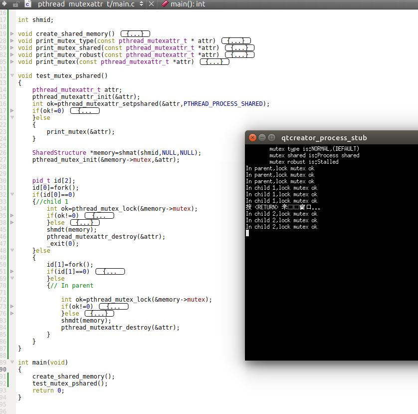

7. `pthread_mutexattr_getrobust/pthread_mutexattr_setrobust`函数：获取/设置互斥量的健壮属性：

	```
	#include<pthread.h>
	int pthread_mutexattr_getrobust(const pthread_mutexattr_t *restrict attr,
		int *restrict robust);
	int pthread_mutexattr_setrobust(pthread_mutexattr_t * attr,
		int robust);
	```
	- 参数：
		- `attr`：指向待获取/设置的互斥量属性对象
		- `pthread_mutexattr_getrobust`函数，`robust`：一个指向`int*`的指针，获取的互斥量的健壮属性的值存放在它指向的内存
		- `pthread_mutexattr_setrobust`函数，`robust`：一个`int`，其值就是要设置的互斥量的健壮属性

	- 返回值：
		- 成功：返回0
		- 失败：返回错误编号

	健壮属性用于这种情况：在进程间共享互斥量时，如果进程`A`持有互斥量，而其他进程都因为等待互斥量而投入睡眠。现在进程`A`没有来得及释放互斥量就异常终止了。问题是谁来唤醒那些因为等待互斥量而睡眠的进程？

	健壮属性有两种取值：
	- `PTHREAD_MUTEX_STALLED`：意味着持有互斥量的进程终止时不需要采取特别的动作（即不需要释放互斥量），此时所有等待该互斥量的进程都将死锁。
	- `PTHREAD_MUTEX_ROBUST`：意味着持有互斥量的进程`A`终止时，如果进程`A`并没有释放互斥量，那么进程`B`的线程调用`pthread_mutex_lock`时，成功返回，且返回值为`EOWNERDEAD`（而不是死锁），但是进程`B`并不会持有锁（此时锁的状态被破坏了，因为锁的持有者死亡了，比必须调用下面的`pthred_mutex_consistent`函数来完修复锁的状态）。

	健壮属性的互斥量改变了我们使用`pthread_mutex_lock`的方式，因为现在有3类返回值：
	- 不需要恢复的成功（返回，成功持有锁）
	- 需要恢复的成功（此时虽然返回，但是并没有持有锁）
	- 失败

8. 当 `pthread_mutex_lock`返回 `EOWNERDEAD` 时，我们需要调用`pthred_mutex_consistent`函数从而完成互斥量的`owner`切换工作。其函数为：

	```
	#include<pthread.h>
	int pthread_mutex_consistent(pthread_mutex_t *mutex);
	```
	- 参数：
		- `mutex`:指向待设置的互斥量的指针
	- 返回值：
		- 成功：返回0
		- 失败：返回错误编号

9. 示例：

	我们将最近的一个例子（观察互斥量的进程共享属性）的：

	```
{//child 1
        int ok=pthread_mutex_lock(&memory->mutex);
        if(ok!=0)
        {
            printf("In child 1,lock mutex failed,because %s\n",strerror(ok));
        }else
        {
            printf("In child 1,lock mutex ok\n");
            printf("In child 1,lock mutex ok\n");
            printf("In child 1,lock mutex ok\n");
            pthread_mutex_unlock(&memory->mutex);
        }
	...
	```

	修改成（即模拟：子进程1持有锁，但是异常终止了而未能释放锁）：

	```
{//child 1
        int ok=pthread_mutex_lock(&memory->mutex);
        if(ok!=0)
        {
            printf("In child 1,lock mutex failed,because %s\n",strerror(ok));
        }else
        {
            printf("In child 1,lock mutex ok\n");
            _exit(-1);		
            printf("In child 1,lock mutex ok\n");
            printf("In child 1,lock mutex ok\n");
            pthread_mutex_unlock(&memory->mutex);
        }
	...
	```
	运行结果如下。可以看到：持有锁的子进程1终止后，子进程2和父进程因为都在等待锁而被锁死！

	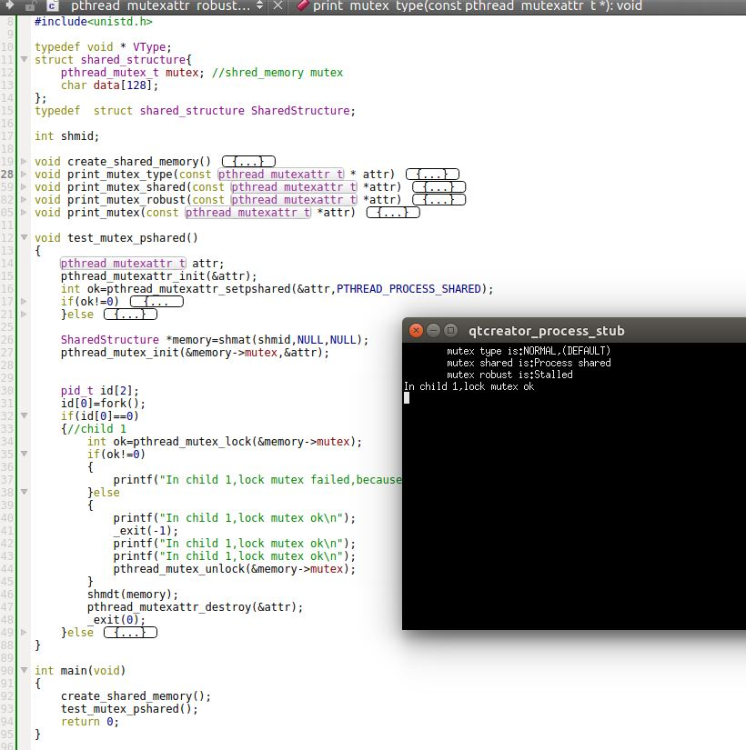

	我们继续修改，将：

	```
if(ok!=0)
    {
        printf("pthread_mutexattr_setpshared:PTHREAD_PROCESS_SHARED failed,
			because %s\n",strerror(ok));
    }else
    {
        print_mutex(&attr);
    }
	...
	```

	修改为：

	```
if(ok!=0)
    {
        printf("pthread_mutexattr_setpshared:PTHREAD_PROCESS_SHARED failed,
			because %s\n",strerror(ok));
    }else
    {
        print_mutex(&attr);
    }
    ok=pthread_mutexattr_setrobust(&attr,PTHREAD_MUTEX_ROBUST);
    if(ok!=0)
    {
        printf("pthread_mutexattr_setrobust:PTHREAD_MUTEX_ROBUST failed,
			because %s\n",strerror(ok));
    }else
    {
        print_mutex(&attr);
    }
	...
	```
  
	运行结果如下。可以看到：持有锁的子进程1终止后，子进程2和父进程因为都在等待锁，但是系统会通知某个进程（这里是父进程），你在等待的锁的持有者已经死亡。此时该进程中的`pthread_mutex_lock`会返回`EOWNERDEAD`。

	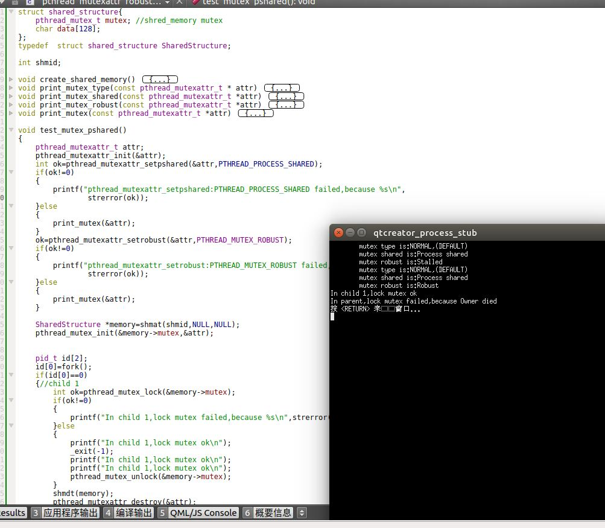

	我们继续`test_mutex_pshared`函数从`pid_t id[2];`开始到结尾的代码修改为

	```   
	pid_t id[2];
    id[0]=fork();
    if(id[0]==0)
    {//child 1
        int ok=pthread_mutex_lock(&memory->mutex);
        if(ok!=0 && ok==EOWNERDEAD)
        {
            printf("In child 1,lock mutex failed,because %s\n",strerror(ok));
        }else
        {
            if(ok==EOWNERDEAD)
            {
                printf("In Child 1 Make mutex consistend\n");
                pthread_mutex_consistent(&memory->mutex);
            }
            printf("In child 1,lock mutex ok\n");
            _exit(-1);
            printf("In child 1,lock mutex ok\n");
            printf("In child 1,lock mutex ok\n");
            pthread_mutex_unlock(&memory->mutex);
        }
        shmdt(memory);
        pthread_mutexattr_destroy(&attr);
        _exit(0);
    }else
    {
        id[1]=fork();
        if(id[1]==0)
        {// child2

            int ok=pthread_mutex_lock(&memory->mutex);
            if(ok!=0 && ok==EOWNERDEAD)
            {
                printf("In child 2,lock mutex failed,because %s\n",strerror(ok));
            }else
            {
                if(ok==EOWNERDEAD)
                {
                    printf("In Child 2 Make mutex consistend\n");
                    pthread_mutex_consistent(&memory->mutex);
                    pthread_mutex_unlock(&memory->mutex);
                                        printf("aaa2");
                }
                printf("In child 2,lock mutex ok\n");
                printf("In child 2,lock mutex ok\n");
                printf("In child 2,lock mutex ok\n");
                pthread_mutex_unlock(&memory->mutex);
            }
            shmdt(&memory);
            pthread_mutexattr_destroy(&attr);
            _exit(0);
        }else
        {// In parent

            int ok=pthread_mutex_lock(&memory->mutex);
            if(ok!=0 && ok==EOWNERDEAD)
            {
                printf("In Parent,lock mutex failed,because %s\n",strerror(ok));
            }else
            {
                if(ok==EOWNERDEAD)
                {
                    printf("In Parent Make mutex consistend\n");
                    pthread_mutex_consistent(&memory->mutex);
                }
                printf("In Parent,lock mutex ok\n");
                printf("In Parent,lock mutex ok\n");
                printf("In Parent,lock mutex ok\n");
                pthread_mutex_unlock(&memory->mutex);
            }
            shmdt(memory);
            pthread_mutexattr_destroy(&attr);
        }
    }
}
	```
  
	运行结果如下。可以看到： `pthread_mutex_consistent`实际上并没有切换`Owner`（在`UBUNTU 16.04`环境测试）。

	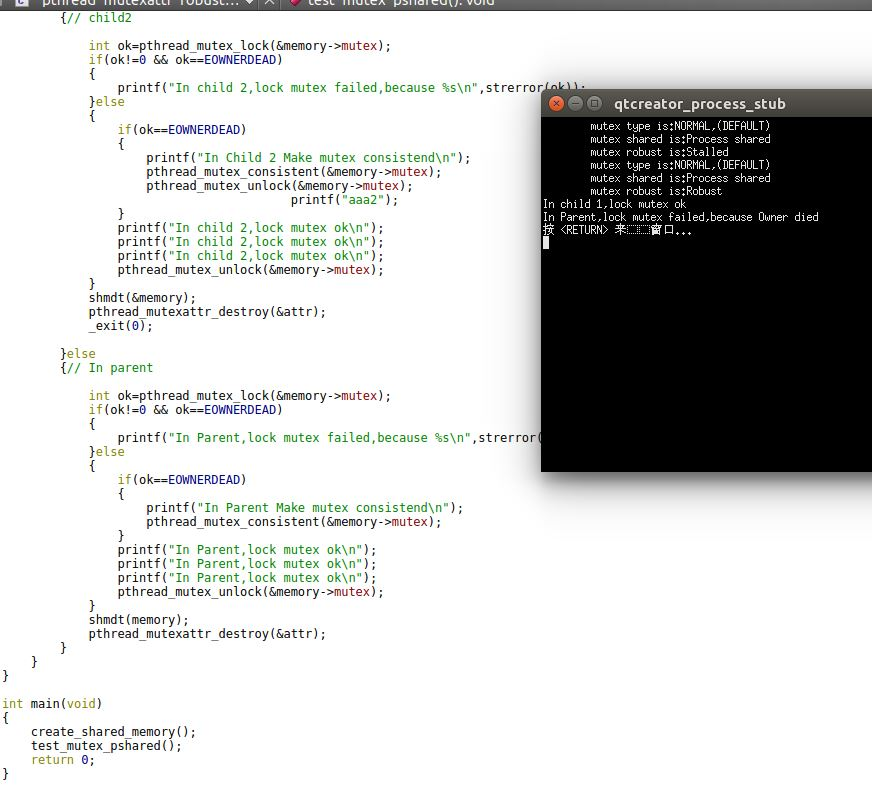

10. `pthread_mutexattr_gettype/pthread_mutexattr_settype`函数：获取/设置互斥量的类型属性

	```
	#include<pthread>
	int pthread_mutexattr_gettype(const pthread_mutexattr_t *restrict attr,
		int *restrict type);
	int pthread_mutexattr_settype(pthread_mutexattr_t * attr,
		int type);
	```
	- 参数：
		- `attr`：指向待获取/设置的互斥量属性对象
		- `pthread_mutexattr_gettype`函数，`type`：一个指向`int*`的指针，获取的互斥量的类型属性的值存放在它指向的内存
		- `pthread_mutexattr_settype`函数，`type`：一个`int`，其值就是要设置的互斥量的类型属性

	- 返回值：
		- 成功：返回0
		- 失败：返回错误编号

	`POSIX.1`定义了四种互斥量类型：
	- `PTHREAD_MUTEX_NORMAL`：一种标准互斥量类型，不做任何特殊的错误检查或死锁检查
	- `PTHREAD_MUTEX_ERRORCHECK`：此类型互斥量进行错误检查
	- `PTHREAD_MUTEX_RECURSIVE`：此类型互斥量运行同一线程在互斥量解锁之前对该互斥量进行多次加锁（维持了一个加锁的计数）。当解锁次数和加锁次数不相同的情况下，并不会释放锁
	- `PTHREAD_MUTEX_DEFAULT`：此类型互斥量提供默认特性和行为。操作系统在实现的时候可以将它映射到上面三类中的任何一种。

	下面是四种互斥量类型的加锁/解锁行为：

	| 互斥量类型 | 未解锁时重新加锁 |未占用时解锁  | 已解锁时再解锁 |
	|--|::|::|::|
	| PTHREAD_MUTEX_NORMAL  | 死锁 | 未定义 | 未定义 |
	| PTHREAD_MUTEX_ERRORCHECK  | 返回错误 | 返回错误 | 返回错误 |
	| PTHREAD_MUTEX_RECURSIVE  | 允许 | 返回错误 | 返回错误 |
	| PTHREAD_MUTEX_DEFAULT  | 未定义 | 未定义 | 未定义 |
	
	通常递归锁很难处理，因此只有在没有其他可行方案的前提下才使用它们。
	> 在`pthread_cond_wait`中永远不要使用递归锁。因为如果递归锁多次加锁，则`pthread_cond_wait`的解锁操作并不能真正的释放锁。

11. 示例

	```
#include <stdio.h>
#include <string.h>
#include<errno.h>
#include<pthread.h>
typedef void * VType;
pthread_mutex_t mutex;
pthread_mutexattr_t attr;
void print_mutex_type(const pthread_mutexattr_t * attr)
{
    int type;
    int ok=pthread_mutexattr_gettype(attr,&type);
    if(ok!=0)
    {
        printf("\tpthread_mutexattr_gettype error,because %s\n",strerror(ok));
    }else
    {
        printf("\tmutex type is:");
        switch (type) {
        case PTHREAD_MUTEX_NORMAL:
            printf("NORMAL,");
            break;
        case PTHREAD_MUTEX_ERRORCHECK:
            printf("ERRORCHECK,");
            break;
        case PTHREAD_MUTEX_RECURSIVE:
            printf("RECURSIVE,");
            break;
         default:
            printf("Unknown\n");

        }
        if(type==PTHREAD_MUTEX_DEFAULT)
        {
            printf("(DEFAULT)");
        }
        printf("\n");
    }
}
void print_mutex_shared(const pthread_mutexattr_t *attr)
{
    int shared;
    int ok=pthread_mutexattr_getpshared(attr,&shared);
    if(ok!=0)
    {
        printf("\tpthread_mutexattr_getpshared error,because %s\n",strerror(ok));
    }else
    {
        printf("\tmutex shared is:");
        switch (shared) {
        case PTHREAD_PROCESS_SHARED:
            printf("Process shared\n");
            break;
        case PTHREAD_PROCESS_PRIVATE:
            printf("Process private\n");
            break;
        default:
            printf("Unkown\n");
            break;
        }
    }
}
void print_mutex_robust(const pthread_mutexattr_t *attr)
{
    int robust;
    int ok=pthread_mutexattr_getrobust(attr,&robust);
    if(ok!=0)
    {
        printf("\tpthread_mutexattr_getrobust error,because %s\n",strerror(ok));
    }else
    {
        printf("\tmutex robust is:");
        switch (robust) {
        case PTHREAD_MUTEX_STALLED:
            printf("Stalled\n");
            break;
        case PTHREAD_MUTEX_ROBUST:
            printf("Robust\n");
            break;
        default:
            printf("Unkown\n");
            break;
        }
    }
}
void print_mutex(const pthread_mutexattr_t *attr)
{
    print_mutex_type(attr);
    print_mutex_shared(attr);
    print_mutex_robust(attr);
}
void thread_func_1(VType arg)
{
    int ok=pthread_mutex_lock(&mutex);
    if(ok!=0) printf("The first lock is failed,because %s\n",strerror((ok)));
    else printf("The first lock is ok\n");

    ok=pthread_mutex_lock(&mutex);
    if(ok!=0) printf("The second lock is failed,because %s\n",strerror((ok)));
    else printf("The second lock is ok\n");

    ok=pthread_mutex_unlock(&mutex);
    if(ok!=0) printf("The first unlock is failed,because %s\n",strerror((ok)));
    else printf("The first unlock is ok\n");

    ok=pthread_mutex_unlock(&mutex);
    if(ok!=0) printf("The second unlock is failed,because %s\n",strerror((ok)));
    else printf("The second unlock is ok\n");
}
void thread_func_2(VType arg)
{
    int ok=pthread_mutex_lock(&mutex);
    if(ok!=0) printf("The first lock is failed,because %s\n",strerror((ok)));
    else printf("The first lock is ok\n");

    ok=pthread_mutex_unlock(&mutex);
    if(ok!=0) printf("The first unlock is failed,because %s\n",strerror((ok)));
    else printf("The first unlock is ok\n");

    ok=pthread_mutex_unlock(&mutex);
    if(ok!=0) printf("The second unlock is failed,because %s\n",strerror((ok)));
    else printf("The second unlock is ok\n");
}
int main(void)
{
    pthread_mutexattr_init( &attr);
    pthread_mutexattr_settype( &attr,PTHREAD_MUTEX_NORMAL); 
	//PTHREAD_MUTEX_ERRORCHECK,PTHREAD_MUTEX_RECURSIVE
    pthread_mutex_init(&mutex,&attr);
    print_mutex(&attr);

    pthread_t thread;
    int ok=pthread_create(&thread,NULL,thread_func_1,(void*)0);
    if(ok!=0) printf("create thread error,because %s\n",strerror(ok));
    pthread_join(thread,NULL);

    pthread_mutexattr_destroy(&attr);
    pthread_mutex_destroy(&mutex);
    return 0;
}

	```

	运行结果如下图。此时可以看到，对于`PTHREAD_MUTEX_NORMAL`，连续两次加锁会导致死锁。

	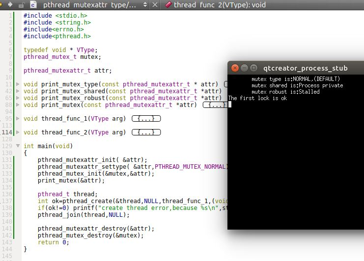
	
	我们将 `pthread_create(&thread,NULL,thread_func_1,(void*)0);` 修改成
`pthread_create(&thread,NULL,thread_func_2,(void*)0);`，结果如下。可以看到对于`PTHREAD_MUTEX_NORMAL`，如果不持有锁，则释放锁没有问题。

	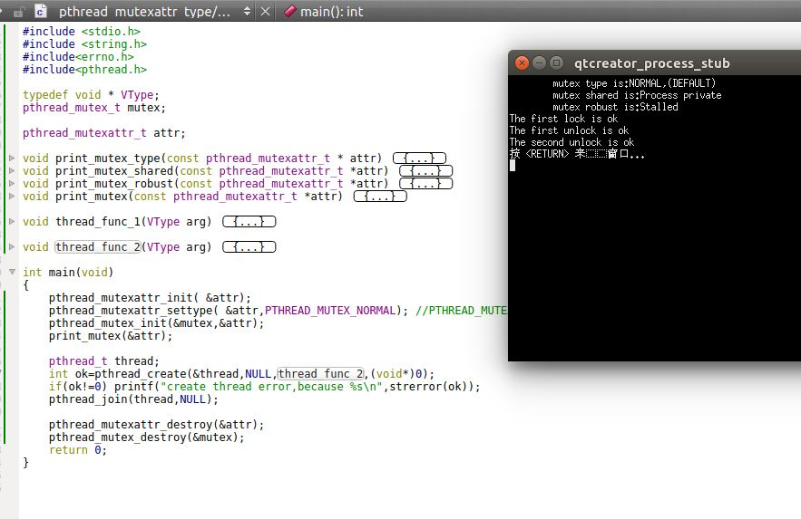

	我们定制组合： `pthread_mutexattr_settype( &attr,PTHREAD_MUTEX_ERRORCHECK);`以及`pthread_create(&thread,NULL,thread_func_1,(void*)0);`  ，结果如下。可以看到对于`PTHREAD_MUTEX_ERRORCHECK`。如果连续加锁，则只有为持有锁时的加锁才有效，后面的加锁并不会死锁而是返回错误；如果连续解锁，只有当确实持有锁的时候解锁才有效，后面的解锁会返回错误。

	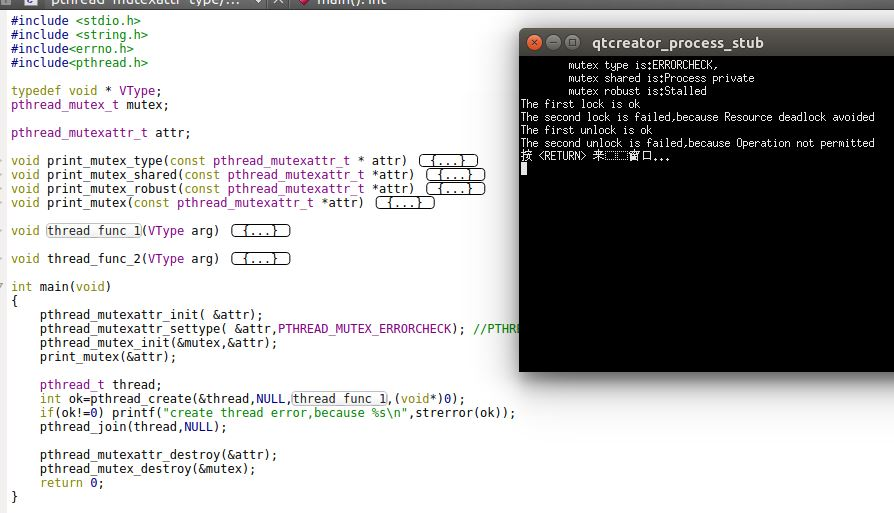

	我们定制组合： `pthread_mutexattr_settype( &attr,PTHREAD_MUTEX_ERRORCHECK);`以及`pthread_create(&thread,NULL,thread_func_2,(void*)0);`  ，结论同上。

	我们定制组合： `pthread_mutexattr_settype( &attr,PTHREAD_MUTEX_RECURSIVE);`以及`pthread_create(&thread,NULL,thread_func_1,(void*)0);`  ，结果如下。可以看到对于`PTHREAD_MUTEX_ERRORCHECK`。如果连续加锁，则加锁有效，同时在锁上计数，加锁一次计数加一。解锁时，解锁一次，计数减一。

	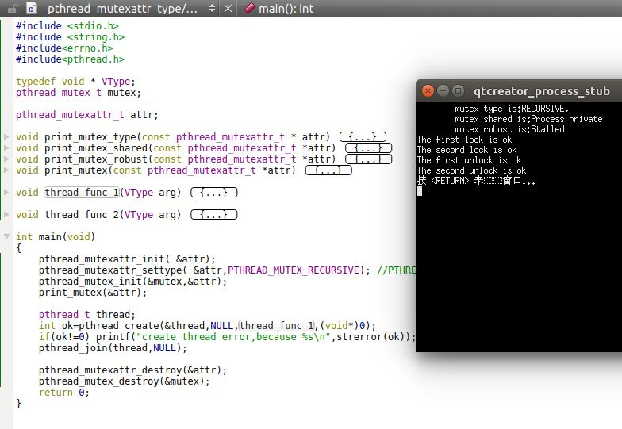

	我们定制组合： `pthread_mutexattr_settype( &attr,PTHREAD_MUTEX_RECURSIVE);`以及`pthread_create(&thread,NULL,thread_func_2,(void*)0);`  ，结果如下。可以看到对于`PTHREAD_MUTEX_ERRORCHECK`。如果解锁的次数在锁的计数之内，则解锁有效。如果解锁的次数超过了锁的计数，超过计数时的解锁返回错误。

	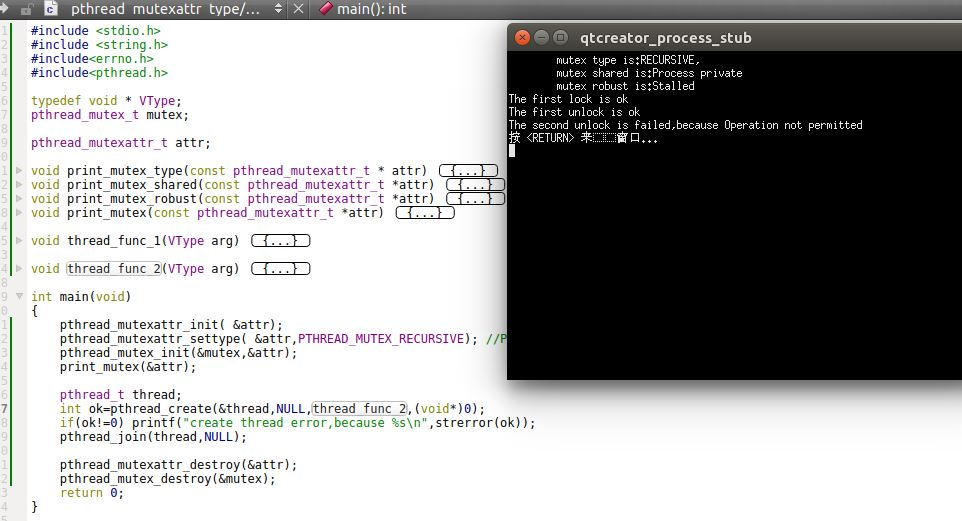


### 2.2 读写锁属性

1. `pthread_rwlockattr_init/pthread_rwlockattr_destroy`函数：初始化/销毁读写锁属性

	```
	#include<pthread.h>
	int pthread_rwlockattr_init(pthread_rwlockattr_t *attr);
	int pthread_rwlockattr_destroy(pthread_rwlockattr_t *attr);	
	```

	- 参数：
		- `attr`：指向待初始化/销毁的读写锁属性
	- 返回值：
		- 成功：返回0
		- 失败：返回错误编号

2. 读写锁支持的唯一属性是进程共享属性。它与互斥量的进程共享属性是相同的。获取/设置这一属性的函数为：

	```
	#include<pthread.h>
	int pthread_rwlockattr_getpshared(const pthread_rwlockattr_t * restrict attr,
		int *restrict pshared);
	int pthread_rwlockattr_setpshared(pthread_rwlockattr_t *attr,
		int pshared);
	```
	- 参数：
		- `attr`：指向待获取/设置的读写锁属性对象
		- `pthread_rwlockattr_getpshared`函数，`pshared`：一个指向`int*`的指针，获取的读写锁的进程共享属性的值存放在它指向的内存
		- `pthread_rwlockattr_setpshared`函数，`pshared`：一个`int`，其值就是要设置的读写锁的进程共享属性

	- 返回值：
		- 成功：返回0
		- 失败：返回错误编号
	
	我们可以设置`pthread_rwlockattr_t`的进程共享属性为`PTHREAD_PROCESS_PRIVATE`或者`PTHREAD_PROCESS_SHARED `

3. 虽然`POSIX`只定义了一个读写锁属性，但是不同的平台的实现可以自由地定义额外的、非标准的属性

### 2.3 条件变量属性

1. `pthread_condattr_init/pthread_condattr_destroy`函数：初始化/销毁条件变量属性

	```
	#include<pthread.h>
	int pthread_condattr_init(pthread_condattr_t *attr);
	int pthread_condattr_destroy(pthread_condattr_t *attr);	
	```

	- 参数：
		- `attr`：指向待初始化/销毁的条件变量属性
	- 返回值：
		- 成功：返回0
		- 失败：返回错误编号

2. `SUS`定义了条件变量的两个属性：
	- 进程共享属性：条件变量的进程共享属性与互斥量的进程共享属性是相同的。
	- 时钟属性：控制了计算`pthread_cond_timedwait`函数的超时参数`tsptr`时，采用的是哪个时钟

3. `pthread_condattr_getpshared/pthread_condattr_setpshared`函数：获取/设置条件变量的进程共享属性。条件变量的进程共享属性与互斥量的进程共享属性是相同的。

	```
	#include<pthread.h>
	int pthread_condattr_getpshared(const pthread_condattr_t * restrict attr,
		int *restrict pshared);
	int pthread_condattr_setpshared(pthread_condattr_t *attr,
		int pshared);
	```
  
	- 参数：
		- `attr`：指向待获取/设置的条件变量属性对象
		- `pthread_condattr_getpshared`函数，`pshared`：一个指向`int*`的指针，获取的条件变量的进程共享属性的值存放在它指向的内存
		- `pthread_condattr_setpshared`函数，`pshared`：一个`int`，其值就是要设置的条件变量的进程共享属性

	- 返回值：
		- 成功：返回0
		- 失败：返回错误编号
	
	我们可以设置`pthread_condattr_t`的进程共享属性为`PTHREAD_PROCESS_PRIVATE`或者`PTHREAD_PROCESS_SHARED `

4. `pthread_condattr_getclock/pthread_condattr_setclock`函数：获取/设置条件变量的时钟属性：

	```
	#include<pthread.h>
	int pthread_condattr_getclock(const pthread_condattr_t * restrict attr,
		int *restrict clock_id);
	int pthread_condattr_setclock(pthread_condattr_t *attr,
		int clock_id);
	```
	- 参数：
		- `attr`：指向待获取/设置的条件变量属性对象
		- `pthread_condattr_getclock`函数，`clock_id`：一个指向`int*`的指针，获取的条件变量的时钟属性的值存放在它指向的内存
		- `pthread_condattr_setclock`函数，`clock_id`：一个`int`，其值就是要设置的条件变量的时钟属性
	- 返回值：
		- 成功：返回0
		- 失败：返回错误编号

	`clock_id`的有效值为：
	- `CLOCK_REALTIME`：实时系统时间
	- `CLOCK_MONOTONIC`：不带负跳数的实时系统时间
	- `CLOCK_PROCESS_CPUTIME_ID`：调用进程的CPU时间
	- `CLOCK_THREAD_CPUTIME_ID`：调用线程的CPU时间

### 2.4 屏障属性

1. `pthread_barrierattr_init/pthread_barrierattr_destroy`函数：初始化/销毁屏障属性

	```
	#include<pthread.h>
	int pthread_barrierattr_init(pthread_barrierattr_t *attr);
	int pthread_barrierattr_destroy(pthread_barrierattr_t *attr);	
	```

	- 参数：
		- `attr`：指向待初始化/销毁的屏障属性
	- 返回值：
		- 成功：返回0
		- 失败：返回错误编号

2. 屏障支持的唯一属性是进程共享属性。它与互斥量的进程共享属性是相同的。获取/设置这一属性的函数为：

	```
	#include<pthread.h>
	int pthread_barrierattr_getpshared(const pthread_barrierattr_t * restrict attr,
		int *restrict pshared);
	int pthread_barrierattr_setpshared(pthread_barrierattr_t *attr,
		int pshared);
	```
	- 参数：
		- `attr`：指向待获取/设置的屏障属性对象
		- `pthread_barrierattr_getpshared`函数，`pshared`：一个指向`int*`的指针，获取的屏障的进程共享属性的值存放在它指向的内存
		- `pthread_barrierattr_setpshared`函数，`pshared`：一个`int`，其值就是要设置的屏障的进程共享属性

	- 返回值：
		- 成功：返回0
		- 失败：返回错误编号
	
	我们可以设置`pthread_barrierattr_t`的进程共享属性为`PTHREAD_PROCESS_PRIVATE`或者`PTHREAD_PROCESS_SHARED `

## 3. 线程重入

1. 线程在遇到重入问题时，与信号处理程序是类似的：
	- 如果一个函数在相同的时间点，可以被多个线程安全的调用，则称该函数是线程安全的
	- 操作系统实现如果支持线程安全函数这个特性，那么对于`POSIX.1`中的那些非线程安全函数，操作系统会提供可替代的线程安全版本。线程安全函数版本的命名方式与它们的非线程安全版本的名字相似，只是在名字最后加了`_r`，以表明这些版本是可重入的
	- 通过静态检查符号`_POSIX_THREAD_SAFE_FUNCTIONS`可以静态检查操作系统释放支持线程安全函数这个特性；或者在`sysconf`函数传入`_SC_THREAD_SAFE_FUNCTIONS`参数可以动态检查操作系统释放支持线程安全函数这个特性

2. 如果一个函数是线程安全的，那么这并不能说明对于信号处理程序来说，该函数也是可重入的。
	- 如果函数对于异步信号处理程序的重入是安全的，那么就说该函数是异步信号安全的。

3. 由于`FILE`对象内部有缓冲区，因此`FILE`对象不是线程安全的。为了在线程中安全的使用`FILE`对象，`POSIX`提供了线程安全的方式管理`FILE`对象。
	- `ftrylockfile/flockfile`函数：用于为`FILE`对象上锁
	- `funlockfile`函数：用于为`FILE`对象解锁

	`FILE`对象的锁是递归锁。当你持有锁时，可以重复加锁。只有解锁的次数和加锁的次数一致时，锁才会被释放。

4. `ftrylockfile/flockfile/funlockfile`函数：为`FILE`对象加锁/解锁

	```
	#include<stdio.h>
	int ftrylockfile(FILE *fp);
	void flockfile(FILE *fp);
	void funlockfile(FILE *fp);
	```
	- 参数：
		- `fp`：指向待加锁/解锁的对象
	- `ftrylockfile`返回值：
		- 成功：返回0
		- 如果不能获取锁，则返回非 0 值

	当处理多个`FILE`对象时，需要注意潜在的死锁，需要对所有的锁仔细排序	
5. 示例：

	```
#include <stdio.h>
#include<pthread.h>
#include<string.h>
#include<errno.h>
#include<unistd.h>
typedef void * VType;
VType thread_func (VType arg)
{

    fprintf(stdout,"In thread 0x%x ,line 1\n",pthread_self());
    sleep(1);
    fprintf(stdout,"In thread 0x%x ,line 2\n",pthread_self());
    sleep(1);
    fprintf(stdout,"In thread 0x%x ,line 3\n",pthread_self());
}
int main(void)
{
    pthread_t ids[2];
    pthread_create(ids,NULL,thread_func,0);
    pthread_create(ids+1,NULL,thread_func,0);
    pthread_join(ids[0],NULL);
    pthread_join(ids[1],NULL);
    return 0;
}
	```
	运行结果如下。可以看到对`stdio`这个`FILE`对象的访问是交叉进行的。
	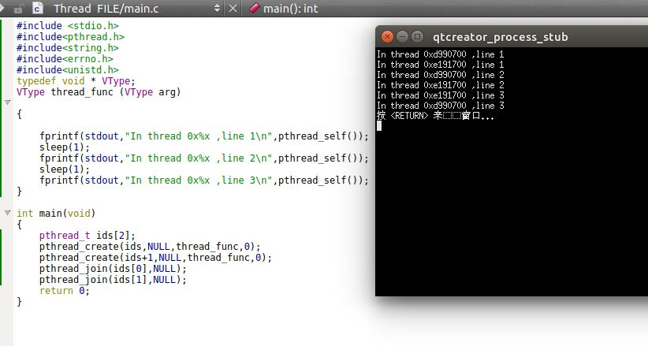

	我们修改`thread_func`函数为：

	```
VType thread_func (VType arg)
{
    flockfile(stdout);
    fprintf(stdout,"In thread 0x%x ,line 1\n",pthread_self());
    sleep(1);
    fprintf(stdout,"In thread 0x%x ,line 2\n",pthread_self());
    sleep(1);
    fprintf(stdout,"In thread 0x%x ,line 3\n",pthread_self());
    funlockfile(stdout);
}
	```

	运行结果如下。可以看到对`stdio`这个`FILE`对象的访问是获得锁之后才能访问的。
	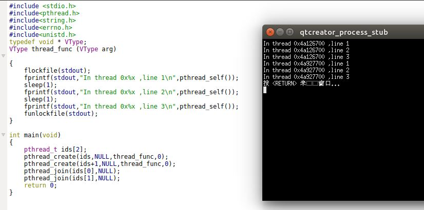

6. 对于线程可重入版本的标准`IO`函数，标准`IO`函数都首先对`FILE`加锁，然后操作完成后再对`FILE`解锁。那么在进行一次一个字符的`IO`时，就会出现严重的性能下降。此时提供了不加锁版本的基于字符的标准`IO`函数：

	```
	#include<stdio.h>
	int getchar_unlocked(void);
	int getc_unlocked(FILE *fp);
	int putchar_unlocked(int c);
	int putc_unlocked(int c,FILE *fp);
	```
	- 参数：
		- `fp`：指向待处理的`FILE`对象
		- `c`：待写入的字符
	- 返回值：
		- `get...`函数：成功则返回下一个字符；如果出错或者遇到文件尾，则返回`EOF`
		- `put...`函数：成功则返回`c`；如果出错则返回`EOF`

	除非被`flockfile/ftrylockfile`和`funlockfile`调用包围，否则尽量不要直接调用这四个函数，因为它们会导致不可预期的结果（如多个线程非同步访问`FILE`引起的种种问题）

	一旦对`FILE`加锁，那么可以在释放锁之前对上述四个函数进行多次调用，从而在多次的数据读写上分摊总的加锁/解锁的开销。（这就是需要将无锁版本暴露出来的原因：分摊开销）

## 4. 线程特定数据

1. 线程特定数据也称作线程私有数据，是存储和查询某个线程相关数据的一种机制。我们采用线程特定数据的原因是：我们希望每个线程都可以访问线程各自独立的数据副本，而不需要担心与其他线程的同步问题。因为：
	- 有时候需要维护基于线程的数据
	- 线程特定数据让基于进程的接口适应于多线程环境。比如`errno`：为了让线程中可以使用原本基于进程的系统调用和库例程，`errno`被重新定义为线程私有数据。这样一个线程中做了重置`errno`的操作也不会影响进程中其它线程的`errno`值

2. 进程中的所有线程都可以访问这个进程的地址空间，线程特定数据也不例外。因此虽然底层的实现并不能阻止一个线程去访问另一个线程的线程私有数据，但是使用了管理线程私有数据的函数可以提供线程之间的数据独立性，使得线程不太容易访问到其他线程的线程私有数据。
	>简单地说：只要你一致性的使用管理线程私有数据的函数来访问线程私有数据，那么就可以保证线程之间不会访问其他线程的线程私有数据

3. 在分配线程私有数据之前，需要创建与该数据关联的键。这个键的作用是：获取对线程私有数据的访问。

4. `pthread_key_create`函数：创建线程私有数据的键

	```
	#include<pthread.h>
	int pthread_key_create(pthread_key_t *keyp,void (*destructor)(void*));
	```
	- 参数：
		- `keyp`：指向键的指针
		- `destructor`：一个函数指针，该函数返回`void`，参数是`void*`。该函数是键的析构函数。
	- 返回值：
		- 成功：返回0
		- 失败：返回错误编号

	当创建键时，这个键可以被进程中的所有线程使用，但是每个线程把这个键绑定了不同的私有数据。
	- 创建新键时，每个线程未绑定私有数据
	> 绑定的私有数据的类型是 `(void *)`。你可以传入一个整数；如果数据较多你可以传入一个结构体的指针。

	除了创建键以外，你也可以选择为键提供一个可选的析构函数。当线程退出时，如果键绑定了私有数据，则析构函数会被调用。
	- 析构函数的唯一参数就是键绑定的私有数据
	- 如果传入的析构函数为空，则表明没有析构函数与这个键关联

	析构函数被调用的情形：
	- 如果线程是调用`pthread_exit`或者线程例程中返回，则退出时，析构函数会被调用
	- 如果线程是被取消的，则在线程最后的清理处理程序返回值后，析构函数才会被调用
	- 如果线程调用了`exit、_ext、_Exit、abort`或者其他非正常的退出时，不会调用析构函数

	为们要提供析构函数？因为线程通常使用`malloc`为线程私有数据分配内存。析构函数通常释放已分配的内存。如果线程在没有释放内存之前就退出了，那么这块内存就会泄露。

5. 线程可以为线程私有数据分配多个键
	- 每个键都可以有一个析构函数与之关联。
	- 每个键的析构函数都可以互不相同，当然也可以使用相同的析构函数
	- 操作系统可以对进程可分配的键的数量进行限制（`PTHREAD_KEYS_MAX`）

6. 线程退出时，线程私有数据的析构函数将按照操作系统实现中定义的顺序被调用。注意：
	- 析构函数中可能会调用另一个函数，这个函数可能会创建新的线程私有数据的，并把这个数据绑定当前的键
	- 当所有的析构函数都调用完成后，系统会检查是否还有线程私有数据绑定了键；如果有的话，再次调用析构函数
	- 这个过程会一直重复到所有的键都未绑定线程私有数据，或者已经做了`PTHREAD_DESTRUCTOR_ITERATIONS`中定义的最大次数的尝试

7. 对所有的线程，我们可以调用`pthread_key_delete`来取消键与线程私有数据值之间绑定

	```
	#include<pthread.h>
	int pthread_key_delete(pthread_key_t key);
	```
	- 参数：
		- `key`：键
	- 返回值：
		- 成功：返回0
		- 失败：返回错误编号

	注意：调用`pthread_key_delete`并不会激活与键关联的析构函数。

8. `pthread_once`函数：

	```
	#include<pthread.h>
	pthread_once_t initflag=PTHREAD_ONCE_INIT;
	int pthread_once(pthread_once_t *initflag,void (*initfn)(void));
	```
	- 参数：
		- `initflag`：它指向一个`pthread_once_t`变量，该变量必须是个全局变量或者静态变量（即非局部变量），且该变量必须初始化为`PTHREAD_ONCE_INIT`
		- `initfn`：初始化例程
	- 返回值：
		- 成功：返回0
		- 失败：返回错误编号

	如果每个线程都调用`pthread_once`，那么系统就能够保证初始化例程`initfn`只会被调用一次，即系统首次调用`pthread_once`时。

9. `pthread_setspecific/pthread_getspecific`函数：将键与线程私有数据绑定 / 根据键获取它绑定的线程私有数据

	```
	#include<pthread.h>
	void *pthread_getspecific(pthread_key_t key);
	int pthread_setspecific(pthread_key_t key,const void*value);
	```	
	- 参数：
		- `key`：键 
		- `value`：绑定的线程私有数据
	- 返回值：

		- `pthread_getspecific`：返回绑定的线程私有数据；如果没有线程私有数据与该键绑定，则返回`NULL`
		- `pthread_setspecific`：成功：返回0；失败：返回错误编号

	通常我们可以通过`pthread_getspecific`返回的值是否为`NULL`来判断键上是否解除绑定了线程私有数据。
	> 注意到这里绑定的线程私有数据类型为`void *`。所以，理论上我们可以绑定一个整数`-1`（一个有效的数字），但是其`(void*)`转换后恰好是`NULL`，`pthread_getspecific`返回的结果就是`NULL`。事实上这就是我们故意设置的一个整数值。所以格式转换要注意！

10. 示例：

	```
#include <stdio.h>
#include<pthread.h>
#include<string.h>
#include<errno.h>
typedef void * VType;
pthread_key_t main_key;
pthread_key_t thread_key;
pthread_once_t initflag=PTHREAD_ONCE_INIT;
void destructor_main_key(VType data)
{
    printf("\tdestructor_main_key is called:data is %d\n",data);
}
void destructor_thread_key(VType data)
{
    printf("\tdestructor_thread_key is called:data is %d\n",data);
}
void initfn()
{
    pthread_key_create(&thread_key,destructor_thread_key);
    printf("\tthread_key init once\n");
}
VType thread_func (VType arg)
{
    int ok=pthread_once(&initflag,initfn);
    if(ok!=0) printf("Init thread_key failed ,because %s\n",strerror(ok));
    pthread_setspecific(main_key,arg);
    VType val=pthread_getspecific(main_key);
    printf("In thread 0x%x, thread local var is %d\n",pthread_self(),val);
}
int main(void)
{
    pthread_key_create(&main_key,destructor_main_key);
    pthread_t ids[5];
    for(int i=0;i<5;i++)
    {
        pthread_create(ids+i,NULL,thread_func,i+10);
    }
    for(int i=0;i<5;i++)
    {
        int ok=pthread_join(ids[i],NULL);
        if(ok!=0) printf("wait thread 0x%x failed ,because %s\n",ids[i],strerror(ok));
    }
    return 0;
}
	```
	运行结果如下所示。可以看出：
	- `initfn`函数在所有线程中只调用一次，且第一个执行到此处的线程调用
	- 一个键只需要被`pthread_create`一次。具体是在主线程还是子线程中创建，则无所谓。但是它在子线程中析构多次。
	> 准确的说，析构的是键绑定的数据。因为每个线程都有独立的数据，所以需要每个线程都析构一次。
	- 如果只是创建了线程键，但是没有绑定数据，则不会调用析构函数
	- 线程键绑定的数据就是传给析构函数的参数
	> 注意：当你绑定键的数据为数字零（即`(void*)0`时），析构函数也不会被调用。猜测原因是 `if(NULL)`与`if(0)`都是假

	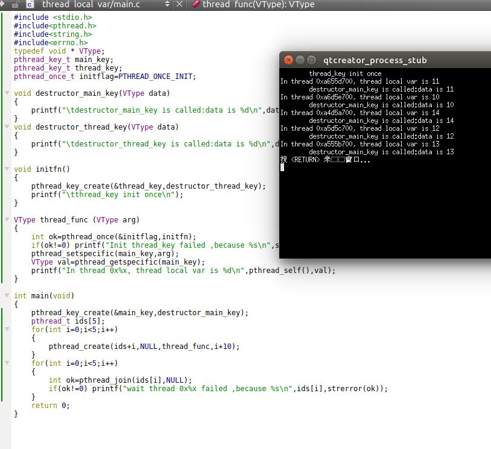
					
## 5. 取消选项

1. 有两个线程属性并没有包含在`pthread_attr_t`结构中：
	- 可取消状态
	- 可取消类型

2. 可取消状态：

	当线程`A`对线程`B`调用`pthread_cancel`时，线程`B`不一定终止。在默认情况下，线程`B`在取消请求发出以后还是继续运行，直到线程达到某个取消点。

	取消点是线程`B`检查它是否被取消的一个位置。如果取消了，则按照请求行事。`POSIX.1`给出了一个函数列表，当线程`B`调用该列表中的任何一个函数时，取消点都会出现。

	线程`B`启动的默认的可取消状态是`PTHREAD_CANCEL_ENABLE`。此时，一旦线程`B`到达取消点时，线程`B`会执行取消操作。

	如果线程`B`的可取消状态设置为`PTHREAD_CANCEL_DISABLE`，则对线程`B`调用`pthread_cancel`并不会杀死线程。相反，对线程`B`来说，取消请求还是处于挂起的状态。当线程`B`的可取消状态再次变成`PTHREAD_CANCEL_ENABLE`时，线程`B`将在下一个取消点上对所有的挂起的取消请求进行处理。

	如果线程`B`在很长的一段时间内都不会调用哪个函数列表中指定的函数（也就是不会遇到取消点），你可以自动调用`pthread_testcancel`函数来在线程中手动添加自己的取消点：

3. `pthread_testcancel`函数：手动添加取消点

	```
	#include<pthread.h>
	void pthread_testcancel(void);
	```

4. `pthread_setcancelstate`函数：设置线程的可取消状态

	```
	#include<pthread.h>
	int pthread_setcancelstate(int state,int *oldstate);
	```
	- 参数：
		- `state`：即将被设置的线程的可取消状态
		- `oldstate`：线程的原有的可取消状态存放在它指向的内存
	- 返回值：
		- 成功：返回0
		- 失败：返回错误编号

	函数将当前的可取消状态设置为`state`，将原来的可取消状态存储在由`oldstate`指向的内存单元。这两步是一个原子操作。

	`state`可选的两个值：
	- `PTHREAD_CANCEL_ENABLE`：可取消
	- `PTHREAD_CANCEL_DISABLE`： 不可取消	

5. 我们之前描述的默认的取消类型是“延迟取消”。即线程`A`对线程`B`调用`pthread_cancel`之后，在线程`B`达到取消点之前，并不会出现真正的取消。我们也可以调用`pthread_setcanceltype`来修改取消类型。

6. `pthread_setcanceltype`函数：修改取消类型

	```
	#include<pthread.h>
	int pthread_setcanceltype(int type,int *oldtype);
	```
	- 参数：
		- `type`：即将被设置的线程的取消类型
		- `oldtype`：线程的原有的取消类型存放在它指向的内存
	- 返回值：
		- 成功：返回0
		- 失败：返回错误编号

	函数将当前的取消类型设置为`type`，将原来的取消类型存储在由`oldtype`指向的内存单元。这两步是一个原子操作。

	`type`可选的两个值：
	- `PTHREA_CANCEL_DEFERRED`：延迟取消
	- `PTHREAD_CANCEL_ASYNCHRONOUS`： 异步取消。此时线程可以在任意时间取消，不是非的遇到取消点才能被取消 
7. 示例：

	```
#include <stdio.h>
#include<pthread.h>
#include<string.h>
#include<errno.h>
#include<unistd.h>
typedef void * VType;
VType thread_func (VType arg)
{
    int oldstate;
    int oldtype;
    pthread_setcancelstate(PTHREAD_CANCEL_DISABLE,&oldstate);
    pthread_setcanceltype(PTHREAD_CANCEL_DEFERRED,&oldtype);
    printf("Old State is %s\n",oldstate==PTHREAD_CANCEL_DISABLE?
               "PTHREAD_CANCEL_DISABLE":"PTHREAD_CANCEL_ENABLE");
    printf("Old type is %s\n",oldtype==PTHREAD_CANCEL_DEFERRED?
               "PTHREAD_CANCEL_DEFERRED":"PTHREAD_CANCEL_ASYNCHRONOUS");
}
int main(void)
{
    pthread_t id;
    pthread_create(&id,NULL,thread_func,NULL);
    pthread_join(id,NULL);
    return 0;
}
	```
	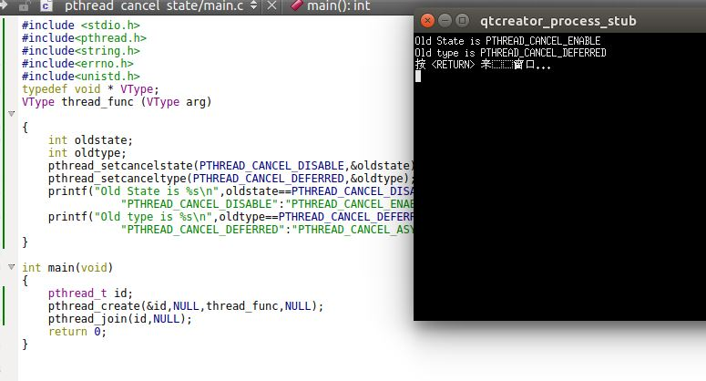

## 6. 线程和信号

1. 每个线程都有自己的信号屏蔽字，但是信号的处理是进程中所有线程共享的
	- 这意味着单个线程可以阻止某些信号，但是当某个线程修改了与某个给定信号相关的处理行为以后，所有的线程必须共享这个处理行为的改变	

2. 进程中的信号是递送到单个线程中的
	- 如果一个信号与硬件故障相关，那么该信号一般会被发送到引发该事件的线程中去
	- 其他的信号则被发送到任意一个线程

3. 在进程中可以使用`sigprocmask`来修改进程的信号屏蔽字。但是`sigprocmask`的行为在多线程中是未定义的。线程必须使用`pthread_sigmask`。

4. `pthread_sigmask`函数：修改线程的信号屏蔽字

	```
	#include<signal.h>
	int pthread_sigmask(int how,const sigset_t *restrict set,sigset_t *restrict oset);
	```
	- 参数：
		- `how`:如果`set`是非空指针，则它结合`set`一起指示了如何修改线程的当前信号屏蔽字
		- `set`:如果`set`是非空指针，则它结合`how`一起指示了如何修改线程的当前信号屏蔽字
		- `oset`:如果是非空指针，则线程的前信号屏蔽字通过它返回
	- 返回值：
		- 成功：返回0
		- 失败：返回错误编号

	如果`set`是非空指针，则它结合`how`一起指示了如何修改线程的当前信号屏蔽字
	- `how=SIG_BLOCK`：该线程的新的信号屏蔽字是其当前信号屏蔽字和`set`指向的信号集的并集。即`set`包含了希望阻塞的信号
	-  `how=SIG_UBBLOCK`：该线程的新的信号屏蔽字是其当前信号屏蔽字和`set`指向的信号集补集的并集。即`set`包含了希望解除阻塞的附加信号
	- `how=SIG_SETMASK`：该线程的新的信号屏蔽字是`set`指向的值

	如果`set`是空指针，则不改变线程的信号屏蔽字，`how`的值没有任何意义

5. 线程可以通过`sigwait`来等待一个或者多个信号的出现：
	
	```
	#include<signal.h>
	int sigwait(const sigset_t *restrict set,int *restrict signop);
	```
	- 参数：
		- `set`：指定了线程等待的信号集
		- `signop`：返回时，它指向的整数将包含发送信号的数量
	- 返回值：
		- 成功：返回0
		- 失败：返回错误编号
	
	如果信号集`set`中的某个信号在调用`sigwait`时处于挂起状态，那么`sigwait`将无阻塞地返回。在返回之前，`sigwait`将从进程中移除那些处于挂起状态的信号。如果具体实现支持排队信号，并且信号的多个实例被挂起，那么`sigwait`将会移除该信号的一个实例，其他的实例还要继续排队。

	为了避免错误行为发生，线程在调用`sigwait`之前，必须阻塞那些它正在等待的信号。`sigwait`函数会原子地取消`set`信号集中信号的阻塞状态，直到有新的信号被递送。在返回之前，`sigwait`将恢复线程的信号屏蔽字。

	`sigwait`的好处在于：它简化了信号处理。它把异步产生的信号用同步的方式处理。为了防止信号中断线程，你可以将信号加到每个线程的信号屏蔽字中，然后可以安排专门的线程处理信号。这些专用线程可以进行函数调用，而不使用信号处理程序那一套机制。因此也不用担心调用哪些函数是安全的。

	如果多个线程在`sigwait`的调用中因为等待同一个信号而被阻塞，那么在信号递送的时候，就只有一个线程可以从`sigwait`中返回。如果一个信号被捕获（如进程通过调用`sigaction`建立了一个信号处理程序），而某个线程正在用`sigwait`调用来等待该信号，那么将由操作系统来决定以何种方式递送信号
	- 操作系统可以让`sigwait`返回，也可以激活信号处理程序。但是这二者不会同时发生。

6. 要把信号发送给线程，可以用`pthread_kill`

	```
	#include<signal.h>
	int pthread_kill(pthread_t thread,int signo);
	```
	- 参数：
		- `thread`：接收信号的线程
		- `signo`：信号的编号
	- 返回值：
		- 成功：返回0
		- 失败：返回错误编号

	可以传入一个 `0` 值的`signo`来检查线程是否存在。如果某个信号的默认处理动作是终止该进程，则将该信号传递给某个线程让然会杀死整个进程。

7. 闹钟定时器是进程资源，并且所有的线程都共享相同的闹钟。所以进程中的多个线程不可能互不干扰的使用闹钟定时器。

8. 示例：

	```
#include <stdio.h>
#include<pthread.h>
#include<string.h>
#include<signal.h>
#include<errno.h>
#include<unistd.h>
typedef void * VType;
VType thread_func (VType arg)
{
    sigset_t sigset;
    sigemptyset(&sigset);
    sigaddset(&sigset,arg);
    pthread_sigmask(SIG_SETMASK,&sigset,NULL);
    printf("Thread is 0x%x will block signal %s\n",pthread_self(),strsignal(arg));
    pause();
    printf("Thread 0x%x wake up,because signo %s",pthread_self(),strsignal(arg));
}
void sig_print(int signo,siginfo_t *info, void *context)
{
    printf("Begin signal Hanlder:\n");
    psiginfo(info,"The siginfo is:\t");
    printf("The current thread is 0x%x\n",pthread_self());
    printf("End signal Hanlder:\n");
}
void add_sigaction(int signo)
{
    sigset_t set;
    sigemptyset(&set);

    struct sigaction action;
    action.sa_sigaction=sig_print;
    action.sa_flags=SA_SIGINFO;
    action.sa_mask=set;
    if(sigaction(signo,&action,NULL)==-1)
    {
        printf("set sigaction for signal %s failed!,because %s\n",
			strsignal(signo),strerror(errno));
    }else
    {
        printf("set sigaction for signal %s successed\n",strsignal(signo));
    }
}
int main(void)
{
    pthread_t ids[2];
    add_sigaction(SIGINT);
    add_sigaction(SIGALRM);
    pthread_create(ids,NULL,thread_func,SIGINT);
    pthread_create(ids+1,NULL,thread_func,SIGALRM);
    sleep(1);
    pthread_kill(ids[0],SIGINT);
    pthread_kill(ids[1],SIGALRM);
    pthread_join(ids[0],NULL);
    pthread_join(ids[1],NULL);
    return 0;
}
	```
	结果如下。可以看到：
	- 每个线程都有自己的信号屏蔽字

	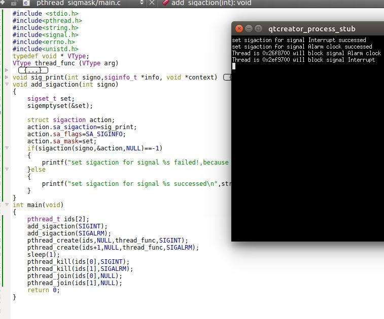

	我们将`main`修改为：

	```
int main(void)
{
    pthread_t ids[2];
    add_sigaction(SIGINT);
    add_sigaction(SIGALRM);
    pthread_create(ids,NULL,thread_func,SIGINT);
    pthread_create(ids+1,NULL,thread_func,SIGALRM);
    sleep(1);
    pthread_kill(ids[0],SIGALRM);
    pthread_kill(ids[1],SIGINT);
    pthread_join(ids[0],NULL);
    pthread_join(ids[1],NULL);
    return 0;
}
	```
	结果如下。可以看到：
	- 信号的处理是进程中所有线程共享
	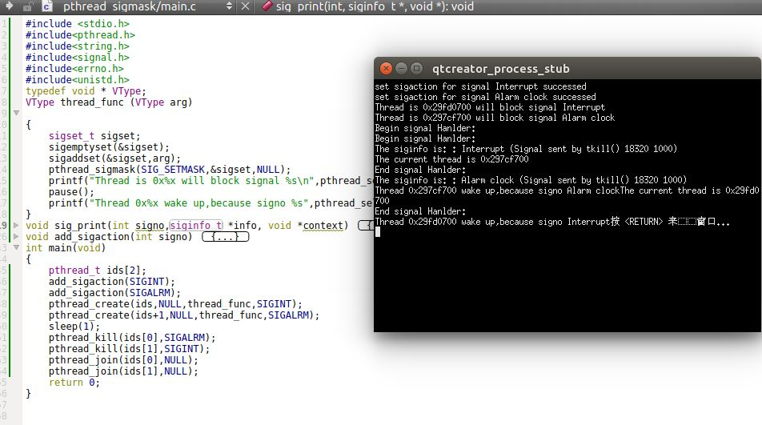
	
	我们将`main`修改为：

	```
int main(void)
{
    pthread_t ids[2];
    add_sigaction(SIGINT);
    add_sigaction(SIGALRM);
    pthread_create(ids,NULL,thread_func,SIGINT);
    pthread_create(ids+1,NULL,thread_func,SIGALRM);
    sleep(1);
    kill(0,SIGINT);
    kill(0,SIGALRM);
    pthread_join(ids[0],NULL);
    pthread_join(ids[1],NULL);
    return 0;
}
	```

	结果如下。可以看到：
	- 发送到进程的信号，现在被主线程接收到了
	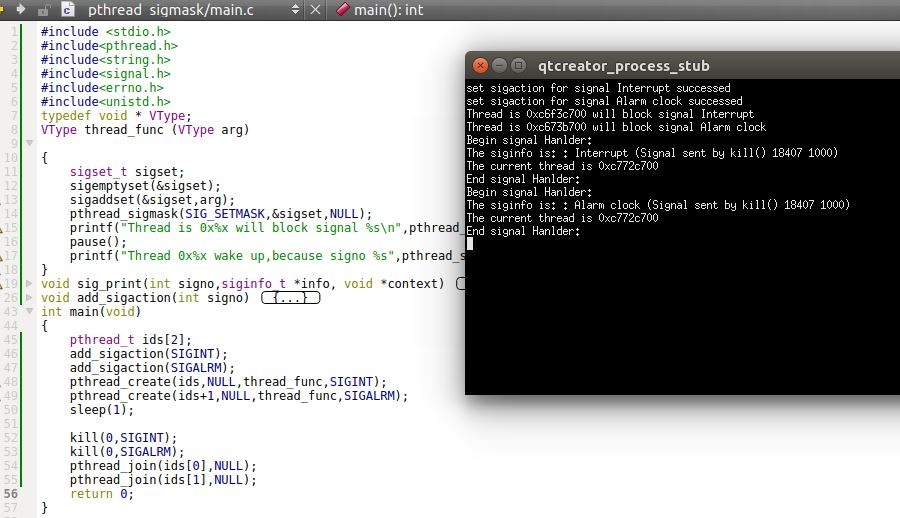

9. 示例：

	```
#include <stdio.h>
#include<pthread.h>
#include<string.h>
#include<signal.h>
#include<errno.h>
typedef void * VType;
VType thread_sig(VType arg)
{
    sigset_t mask_set;
    sigset_t return_set;
    int num;
    int ok;
    sigemptyset(&mask_set);
    sigemptyset(&return_set);
    sigaddset(&mask_set,arg);
    sigaddset(&return_set,arg);
    pthread_sigmask(SIG_SETMASK,&mask_set,NULL);
    while(1)
    {
        ok=sigwait(&return_set,&num);
        if(ok!=0) printf("Thread 0x%x,sigait error,because %s\n",pthread_self(),
			strerror(ok));
        else
        {
            printf("Thread 0x%x,signal %s catched,num=%d\n",pthread_self(),
			strsignal(arg),num);
        }
    }
}
int main(void)
{
    pthread_t ids;
    pthread_create(&ids,NULL,thread_sig,SIGINT);
    sleep(1);
    pthread_kill(ids,SIGINT);
    pthread_join(ids,NULL);
    return 0;
}
	```
	可以看到：
	- 这里并没有给信号处理函数。`SIGINT`默认行为是终止进程，但是这里并没有终止进程。说明`sigwait`确实	移除了挂起的信号
	- 这里向线程发送了一个`SIGINT`信号，但是`sigwait`返回结果是`2`。具体原因不明。

	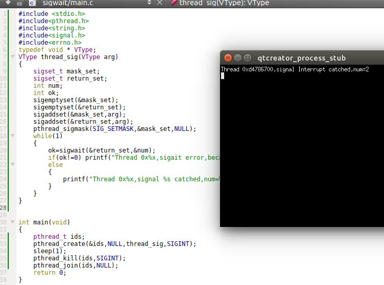

## 7. 线程和 fork

1. 在多线程的环境中，当父进程的某个线程调用`fork`时，为子进程创建了整个进程地址空间的副本。
	- 子进程通过继承整个地址空间的副本，还从父进程那儿继承了每个互斥量、读写锁和条件变量的状态
	- 如果父进程包含了一个以上的线程，则子线程内部，只存在一个线程，它是由父进程中调用`fork`的线程的副本构成的

	如果父进程中的线程占有锁，子进程将同样占有这些锁。问题是子进程并不包含占有锁的线程的副本。所以子进程没有办法知道它占有了哪些锁、需要释放哪些锁。所以子进程从`fork`返回以后马上调用`exec`族函数就可以避免锁的问题，因为这种情况下，旧的地址空间被丢弃，锁的状态就无所谓了。

2. 在多线程的进程中，为了避免不一致的问题，`POSIX.1`声明，在`fork`返回和子进程调用`exec`族函数之间，子进程只能调用异步信号安全的函数。
	- 这限制了在调用`exec`之前子进程能做什么，但是不涉及子进程中锁的状态问题
	- 要想清除锁的状态，可以通过调用`pthread_atfork`函数建立`fork`处理程序

3. `pthread_atfork` 函数：建立`fork`处理程序

	```
	#include<pthread.h>
	int pthread_atfork(void (*prepare)(void),void (*parent)(void),void (*child)(void));
	```
	- 参数：
		- `prepare`：一个函数指针。该函数在父进程`fork`创建子进程之前调用
		- `parent`:一个函数指针。该函数在`fork`返回之前在父进程的上下文中调用
		- `child`：一个函数指针。该函数在`fork`返回之前在子进程的上下文中调用
	- 返回值：
		- 成功：返回0
		- 失败：返回错误编号

	`pthread_atfork`是父进程在调用`fork`之前调用的。它给出了`fork`前后可以执行的三个清理函数。你可以在其中清理锁。此时：
	- 在`prepare`处理程序中获取所有的锁（因此潜在的条件是：所有实用这些锁的线程都释放了锁）
	- 在`parent`处理程序中释放锁
	- 在`child`处理程序中释放锁

	可以多次调用`pthread_atfork`函数从而设置多套`fork`处理程序。如果你不需要使用其中某个处理程序，可以给特定的处理程序参数传入空指针。
	- 多个`fork`处理程序时，处理程序的调用顺序并不相同：
		- `parent`和`child`处理程序是以它们注册时的顺序进行调用的
		- `prepare`处理程序是以它们注册时的逆序进行调用的
	- 这样安排的目的是：保持锁的层次。

4. 虽然可以通过`fork`处理程序来清理锁的状态，但是目前不存在清理条件变量的方法。

5. 示例

	```
#include <stdio.h>
#include<pthread.h>
void prepare_1()
{
    printf("1:Called when  enter in fork\n");
}
void parent_1()
{
    printf("1:Called in parent,before return from fork\n");
}
void child_1()
{
    printf("1:Called in child,before return from fork\n");
}
void prepare_2()
{
    printf("2:Called when  enter in fork\n");
}
void parent_2()
{
    printf("2:Called in parent,before return from fork\n");
}
void child_2()
{
    printf("2:Called in child,before return from fork\n");
}
void prepare_3()
{
    printf("3:Called when  enter in fork\n");
}
void parent_3()
{
    printf("3:Called in parent,before return from fork\n");
}
void child_3()
{
    printf("3:Called in child,before return from fork\n");
}
int main(void)
{
    pthread_atfork(prepare_1,parent_1,child_1);
    pthread_atfork(prepare_2,parent_2,child_2);
    pthread_atfork(prepare_3,parent_3,child_3);
    fork();
    return 0;
}
	```
	可以看到：
	- `parent`和`child`处理程序是以它们注册时的顺序进行调用的
	- `prepare`处理程序是以它们注册时的逆序进行调用的
	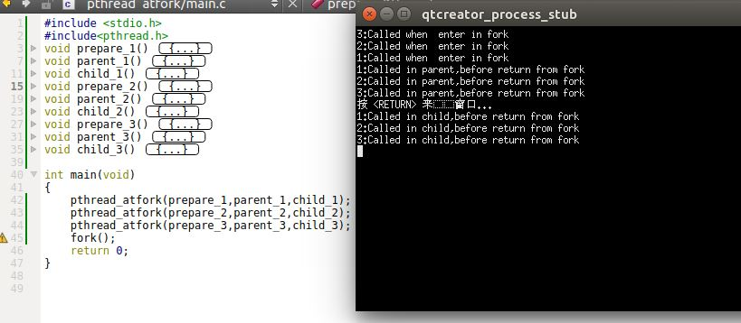


## 8. 线程和IO

1. 在多线程的环境中，进程中的所有线程共享相同的文件描述符。因此`pread`（原子定位读）和`pwrite`（原子定位写）这两个方法在多线程的环境下非常有用。