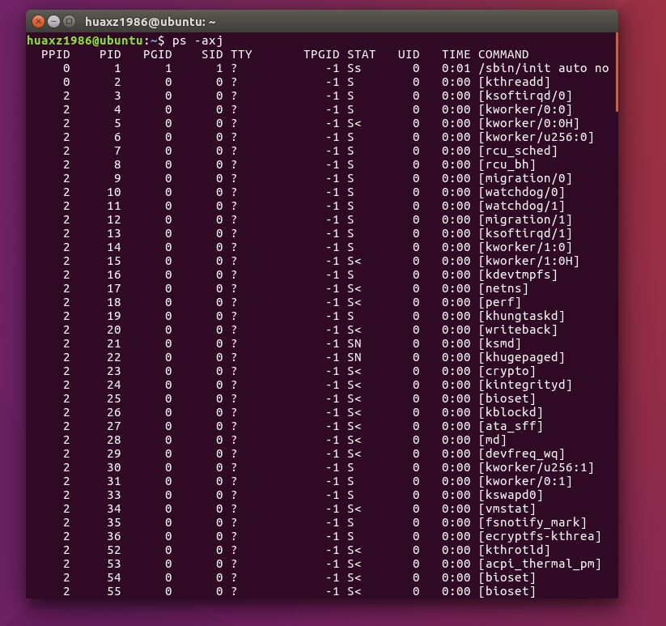
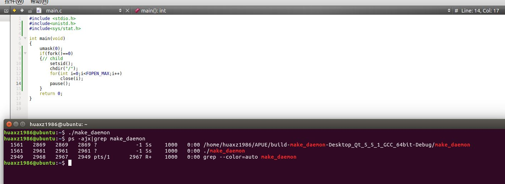
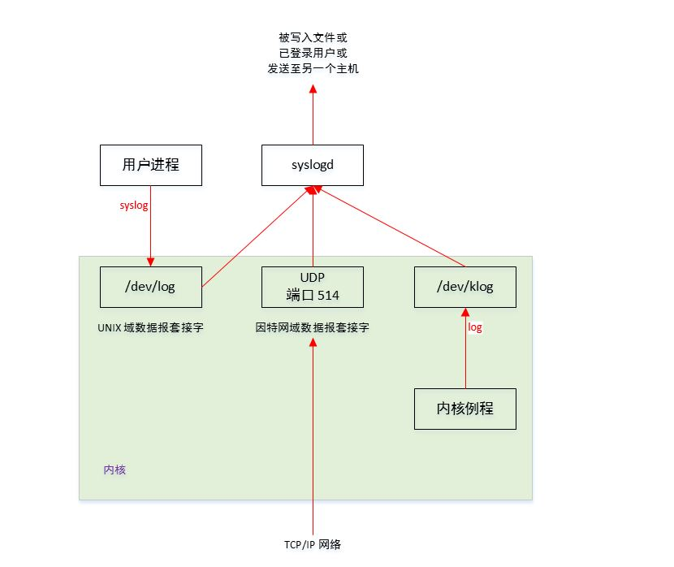
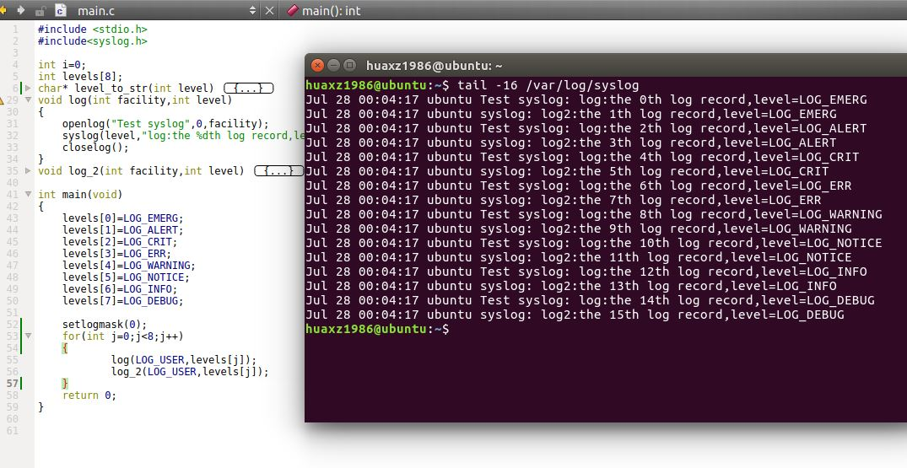
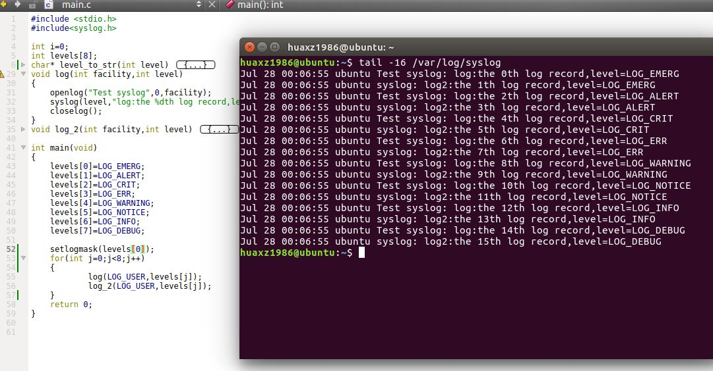
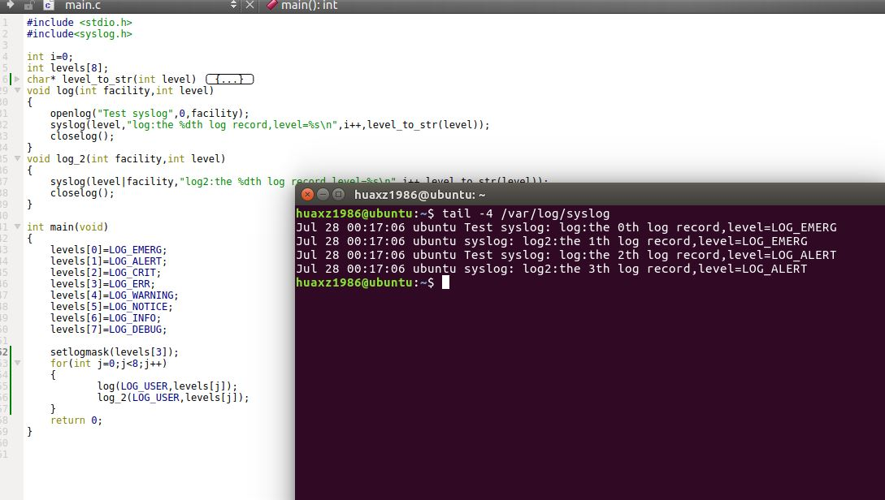

# 守护进程

## 1. 守护进程

1. 守护进程`daemon`：生存期长的一种进程
	- 它们经常在系统引导启动时启动，仅在系统关闭时终止
	- 它们没有控制终端，因此是在后台运行的
	- `UNIX`系统有很多守护进程，它们执行日常事务活动

2. 常见的守护进程：
	> 通过`ps`命令可以查看系统的各个进程。选项`-a`显示所有用户的进程；`-x`显示没有控制终端的进程；`-j`显示与作业有关的信息

	- `kthreadd`守护进程：是其他内核进程的父进程。
		> 内核进程是特殊的，它存在于操作系统的整个生命周期中。它们以超级用户特权运行，无控制终端，无命令行

		常用的内核守护进程有：
	
		- `kswapd`守护进程：内存换页守护进程。它支持虚拟内存子系统在经过一段时间后将脏页面慢慢写回磁盘来回收这些页面。
		- `flush`守护进程：在可用内存达到设置的最小阈值时，将脏页面冲洗至磁盘。它也定期地将脏页面冲洗回磁盘来减少在系统出现故障时发生数据丢失。
			- 多个`flush`守护进程可以同时存在，每个写回设备都有一个`flush`守护进程
		- `sync_supers`守护进程：定期将文件系统元数据冲洗至磁盘
		- `jbd`守护进程：辅助实现了`ext4`文件系统中的日志功能
	- `init`守护进程：系统守护进程。主要负责启动个运行层次特定的系统服务。这些服务通常是在它们自己拥有的守护进程的帮助下实现的。
	- `rpcbind`守护进程：提供将远程过程调用`RPC`程序号映射为网络端口号的服务
	- `rsyslogd`守护进程：提供系统消息日志管理服务
	- `inetd`守护进程：侦听网络接口，以便取得来自网络的对各种网络服务进程的请求
	- `cron`守护进程：定期安排的日期和时间来执行命令
	- `atd`守护进程：类似`cron`，但是它只允许每个任务执行一次，而不是周期性的反复执行
	- `cupsd`守护进程：打印假脱机进程，它处理对系统提出的各个打印请求
	- `sshd`守护进程：提供了安全的远程登录和执行设施

	

3. 大多数守护进程都是以`root`特权运行
	- 所有的守护进程都没有控制终端，在`ps`显示的信息中，其终端名为问号
		- 内核守护进程以无终端的方式启动
		- 用户层守护进程通过调用`setsid`来设置无终端
	- 大多数用户层守护进程都是进程组的组长进程，以及会话的首进程，而且是这些进程组和会话中的唯一进程
	- 用户层守护进程的父进程是`init`进程

4. 编写守护进程时需要遵循一些基本规则，以防止产生不必要的交互（如信号处理，终端处理等）
	- 首先调用`umask`将文件模式创建屏蔽字设置为一个已知值（通常是0）
	> 因为继承而来的文件模式创建屏蔽字很可能会被设置为拒绝某些权限。如果守护进程要创建文件，那么它可能需要设置特定的权限。
	- 然后调用`fork`，然后使父进程`exit`。这样做实现了下面几点：
		- 如果该守护进程是作为一条简单`shell`命令启动的，那么父进程终止会让`shell`认为这条命令已经执行完毕
		- 虽然子进程继承了父进程的进程组`ID`，但是获得了一个新的进程`ID`，这就保证了子进程不是一个进程组的组长`ID`，这就是后面的`setsid`调用的先决条件
		
	- 然后调用`setsid`创建一个新会话。执行完`setsid`之后，调用进程将成为新会话的首进程，而且它也是一个新进程组的组长进程，同时没有控制终端
	- 将当前工作目录改为根目录`/`
		> 这是因为守护进程要求在系统重启/关闭之前是一直存在的。所以如果守护进程的当前工作目录在一个挂载的文件系统中，则该文件系统就不能被卸载。而从父进程中继承过来的当前工作目录可能就在一个挂在的文件系统中。

	  	当然某些守护进程可能会将当前工作目录更改到某个指定位置（不一定是`/`）
	- 关闭不再需要的文件描述符。这使得守护进程不再持有从其父进程继承而来的任何文件描述符。
		> 可以先判断最高文件描述符值，然后关闭直到该值的所有描述符
	- 某些守护进程打开`/dev/null/`使其具有文件描述符`0,1,2`。这样任何试图读标准输入、写标准输出、写标准错误的库例程都不会产生任何效果。
		> 因为守护进程并不与任何终端关联，所以其输出无处显示，也无法获得用户的输入。

5. 示例

	```
#include <stdio.h>
#include<unistd.h>
#include<sys/stat.h>
int main(void)
{
    umask(0);
    if(fork()==0)
    {// child
        setsid();
        chdir("/");
        for(int i=0;i<FOPEN_MAX;i++)
            close(i);
        pause();
    }
    return 0;
}
	```
	

## 2. 出错记录

1. 守护进程的一个问题是如何处理出错信息。因为守护进程没有控制终端，所以不能只是简单的写到标准错误上。`BSD`的`syslog`设施提供了一个解决方案：

	

2. 有三种产生日志消息的方式：
	- 内核例程可以调用`log`函数来产生日志消息。
		- 任何一个用户进程都可以通过打开并读取`/dev/klog`设备来读取这些内核日志消息
	- 大多数用户进程（包括收获进程）调用`syslog`函数来产生日志消息。这些消息被发送至`UNIX`域数据包套接字`/dev/log`
	- 无论一个用户进程是在当前主机，还是通过`TCP/IP`网络连接到此主机上，都可以将日志消息发送到`UDP`端口号`514`。
	> `syslog`函数并不产生这些`UDP`数据报，你必须显式的进行网络编程

3. 通常`syslogd`守护进程读取所有三种格式的日志信息。此守护进程在启动时读取一个配置文件，文件名一般为`/etc/syslog.conf`，该文件决定了不同种类的消息应该送往何处。

4. `syslog`设施的接口函数如下：

	```
	#include<syslog.h>
	void openlog(const char *ident,int option,int facility);
	void syslog(int priority,const char *format,...);
	void closelog(void);
	int setlogmask(int maskpri);
	```
	- `openlog`函数用于打开设施。该函数是可选的，如果你不调用`openlog`，则在第一次调用`syslog`时自动调用`openlog`。其参数为：
		- `ident`：一个前缀字符串。这个字符串将被追加到每条日志消息中。通常用程序的名字来做`ident`
		- `option`：指定各种选项的位屏蔽。可以为以下常量或者按位或：
			- `LOG_CONS`：若日志消息不能通过`UNIX`域数据报发送至`syslogd`，则将该消息写到控制台
			- `LOG_NDELAY`：立即打开到`syslogd`守护进程的`UNIX`域数据报套接字，而不要等到第一条消息已经被记录时才打开
			- `LOG_NOWAIT`：不要等待在将消息记入日志过程中可能已创建的子进程
			- `LOG_ODELAY`：延迟打开到`syslogd`守护进程的`UNIX`域数据报套接字，直到第一条消息已经被记录时才打开
			- `LOG_PERROR`：除了将日志消息发送给`syslogd`以外，还将它写到标准出错
			- `LOG_PID`：记录的每条消息都要包含进程`ID`
		- `facility`：指定消息类别。提供该参数的原因是为了让`syslogd`的配置文件说明：来自不同设施的不同类别信息将以不同的方式进行处理。
			> 如果不调用`openlog`，则默认`facility=0`

			常用的为：
			- `LOG_AUDIT`：审计设施
			- `LOG_AUTH`：授权程序
			- `LOG_CONSOLE`：消息写入`/dev/console`
			- `LOG_CRON`：`cron`和`at`
			- `LOG_DAEMON`：系统守护进程，如`inetd,routed`等
			- `LOG_FTP`：`ftpd`守护进程
			- `LOG_KERN`：内核产生的消息
			- `LOG_MAIL`：邮件系统
			- `LOG_SYSLOG`：`syslogd`本身产生的信息
			- `LOG_USER`：由其他用户进程的消息（默认）
	- `closelog`函数用于关闭设施。该函数也是可选的，它只是关闭那个用于与`syslogd`守护进程进程通信的描述符（由`openlog`打开的）。
	- `syslog`函数调用是，会产生一条日志消息。其参数为：
		- `priority`：优先级参数。它是`facility`和`level`的组合。`level`值按照优先级从高到低依次为：
			- `LOG_EMERG`：紧急（系统不可使用）（最高优先级）
			- `LOG_ALERT`：必须立即修复的情况
			- `LOG_CRIT`：严重情况（如硬件设备出错）
			- `LOG_ERR`：出错情况
			- `lOG_WARNING`：警告情况
			- `LOG_NOTICE`：正常但是重要的情况
			- `LOG_INFO`：信息性消息
			- `LOG_DEBUG`：调试消息（最低优先级）
		- `format`以及其他参数：被传递到`vsprintf`函数以便进行格式化。在`format`中，每个出现的`%m`字符串都先被替代成`errno`值对应的出错消息字符串（相当于替代成了`strerror(errno)`）
	- `setlogmask`函数用于设置进程的记录优先级屏蔽字。它返回调用它之前的屏蔽字。

		当设置了记录优先级屏蔽字时，各条信息除非已经在记录优先级屏蔽字中进行了设置，否则将不被记录。
		> 试图将记录优先级屏蔽字设置为 0 并没有什么卵用

	通常如果我们在`openlog()`函数中，指定了一个非零的`facility`，则在`syslog()`函数中，`priority`可以仅仅提供`level`。如果我们没有调用`openlog()`，或者以`facility=0`调用`openlog()`，则我们在`syslog()`函数中，`priority`可以必须提供`level`和`facility`的或值。

5. 大多数`syslog`的实现将消息短时间内处于队列中。如果在这段时间内，有重复消息到达，那么`syslog`守护进程并不会将重复的信息写入到日志记录中，而是会打印输出一条类似“上一条消息重复了 N 次”的消息。

6. 示例：

	```
#include <stdio.h>
#include<syslog.h>
int i=0;
int levels[8];
char* level_to_str(int level)
{
    switch (level) {
    case LOG_EMERG:
        return "LOG_EMERG";
    case LOG_ALERT:
        return "LOG_ALERT";
    case LOG_CRIT:
        return "LOG_CRIT";
    case LOG_ERR:
        return "LOG_ERR";
    case LOG_WARNING:
        return "LOG_WARNING";
    case LOG_NOTICE:
        return "LOG_NOTICE";
    case LOG_INFO:
        return "LOG_INFO";
    case LOG_DEBUG:
        return "LOG_DEBUG";
    default:
        return "Unkonwn Level";
    }
}
void log(int facility,int level)
{
    openlog("Test syslog",0,facility);
    syslog(level,"log:the %dth log record,level=%s\n",i++,level_to_str(level));
    closelog();
}
void log_2(int facility,int level)
{
    syslog(level|facility,"log2:the %dth log record,level=%s\n",i++,
		level_to_str(level));
    closelog();
}
int main(void)
{
    levels[0]=LOG_EMERG;
    levels[1]=LOG_ALERT;
    levels[2]=LOG_CRIT;
    levels[3]=LOG_ERR;
    levels[4]=LOG_WARNING;
    levels[5]=LOG_NOTICE;
    levels[6]=LOG_INFO;
    levels[7]=LOG_DEBUG;

    setlogmask(0);
    for(int j=0;j<8;j++)
    {
            log(LOG_USER,levels[j]);
            log_2(LOG_USER,levels[j]);
    }
    return 0;
}
	```

	其在`/var/log/syslog`日志记录中的输出如下图所示。可以看到：
	- 可以不`openlog`而直接调用`syslog`函数，此时`syslog`的第一个参数为`level|facility`（参见`log2`函数）
	- 对于`setlogmask(0)`，所有层次的日志都会放行（即相当于不过滤）
	

	我们将`setlogmask(0);`修改成`setlogmask(levels[0]);`，结果如下所示。其效果与`setlogmask(0)`相同，因为`LOG_EMERG`就是 0。
	

	我们将`setlogmask(0);`修改成`setlogmask(levels[3]);`，结果如下所示。奇怪的是`setlogmask(LOG_ERR)`，放行的是`LOG_EMERG,LOG_ALERT`的日志。
		
	

## 3. 单例守护进程

1. 为了正常运行，某些守护进程要求实现为单例模式：任何时刻只能运行一个该守护进程。
2. 为了创建单例守护进程，可以使用文件和记录锁。
	- 如果为守护进程创建一个固定名字的文件，并且在该文件的整体上加一把写锁，那么只允许创建一把这样的写锁。在此之后创建写锁的任何尝试都将失败。
	- 如果某个守护进程对该文件创建写锁失败，则说明已经存在了一个守护进程的副本
	- 当持有文件写锁的守护进程终止时，这把锁将被自动删除

3. `UNIX`守护进程遵循下列通用惯例：

	- 如果守护进程使用锁文件，则该文件通常存储于`/var/run`目录中。锁文件的名字通常是`name.pid`，其中`name`是该守护进程或者服务的名字
		> 守护进程可能需要具有超级用户的权限才能在此目录下创建文件
	- 如果守护进程支持配置选项，则配置文件通常存在于`/etc`目录下。配置文件的名字通常是`name.conf`，其中`name`是该守护进程或者服务的名字	
	- 守护进程可以用命令行启动，但是通常它们是由系统初始化脚本之一（`/etc/rc*`或者`/etc/init.d/*`）启动的
		
		如果在守护进程终止时，需要自动重启它，则我们可以在`/etc/inittab`中为该守护进程包括`respawn`记录项，这样`init`将会重启该守护进程
	- 如果一个守护进程有一个配置文件，则当该守护进程启动时会读取该文件，但在此之后一般就不再查看该文件了。

		如果后来管理员修改了配置文件，那么你可以先停止守护进程，然后重启守护进程。

		为了避免这种麻烦，某些守护进程将捕捉`SIGHUP`信号。当它们接收到`SIGHUP`信号时，会重新读取配置文件。
		> 因为守护进程没有终端，因此守护进程并不期望收到`SIGHUP`。所以用`SIGHUP`作为守护进程的配置文件变更的信号是合适的