# 高级 IO 

## 非阻塞 IO 

1. 非阻塞`IO`能够使得我们可以在执行`open、read、write`等操作时永远不会阻塞。如果这些操作不能立即完成，则调用立即返回失败。

2. 对于一个给定的描述符，有两种方法为其指定非阻塞`IO`的方法：
	- 对于尚未打开的描述符，如果调用`open`获取描述符，则可以对`open`函数指定`O_NONBLOCK`标志
	- 对于已经打开的描述符，则可以调用`fcntl`函数，通过该函数打开`O_NONBLOCK`文件状态标志
		> `fcntl(fd,F_SETFL,O_NONBLOCK)`

3. 有时我们可以将应用程序设计成多线程的，从而避免使用非阻塞`IO`。我们在单个线程中执行`IO`调用阻塞，但是在另外线程中可以继续执行。
	- 这种方法的优点是能简化应用程序的设计
	- 缺点是：线程间的同步开销有时候可能增加复杂性

4. 示例：

	```
#include <stdio.h>
#include<fcntl.h>
#include<errno.h>
#include<string.h>
void print_block_type(int fd)
{
    printf("\tget block state on fd(%d):",fd);
    int result=fcntl(fd,F_GETFL);
    if(result==-1)
    {
        printf("\tfcntl:F_GETFL error,because %s\n",strerror(errno));
    }
    else
    {

        if(result&O_NONBLOCK) printf("\tUnBlock\n");
        else printf("\t Block\n");
    }
}
void test_unblock_open()
{
    int fd=open("/home/huaxz1986/test.txt",O_CREAT|O_NONBLOCK|O_WRONLY,S_IRUSR|S_IWUSR);
    if(fd==-1)
        printf("open /home/huaxz1986/test.txt error,because %s\n",strerror(errno));
    else
        print_block_type(fd);
}
void test_unblock_fcntl()
{
    int fd=open("/home/huaxz1986/test.txt",O_CREAT|O_WRONLY,S_IRUSR|S_IWUSR);
    if(fd==-1)
        printf("open /home/huaxz1986/test.txt error,because %s\n",strerror(errno));
    else
    {
        printf("Before fcntl:F_SETFL, block state is:\n");
        print_block_type(fd);
    }
    int ok=fcntl(fd,F_SETFL,O_NONBLOCK);
    if(ok==-1)
    {
        printf("fcntl: F_SETFL error,because %s\n",strerror(errno));
    }else
    {
        printf("After fcntl:F_SETFL, block state is:\n");
        print_block_type(fd);
    }
}
int main(void)
{
    printf("Test set unblock in open:\n");
    test_unblock_open();
    printf("Test set unblock in fcntl:\n");
    test_unblock_fcntl();
    return 0;
}

	```

	

## 记录锁

1. 当多个进程同时修改同一个文件时，该文件的最后状态取决于写该文件的最后一个进程。记录锁`record locking`的功能是：当第一个进程正在读或者修改文件的某个部分时，使用记录锁可以阻止其他进程修改同一个文件区。
	> 其实`UNIX`文件并没有记录这个概念，更合适的称呼是“字节范围锁”

2. `POSIX.1`中，通过`fcntl`设置文件记录锁：

	```
	#include<fcntl.h>
	int fcntl(int fd,int cmd,.../*struct flock *flockptr */);
	```
	- 参数：
		- `fd`：待处理的文件描述符
		- `cmd`：指示操作的命令常量
		- `flockptr`：指向`struct flock`的指针，用于加锁

	- 返回值：
		- 成功：返回值依赖于`cmd`
		- 失败：返回 -1
	> `fcntl`的其他功能参见第三章“文件`IO`”	
	
	对于记录锁，`cmd`可以为：
	- `F_GETLK`：判断由`flockptr`所描述的锁能否顺利创建（如果不满足互斥规则，则无法创建）
		- 如果无法顺利创建，则将现有的锁（它阻止了`flockptr`所描述的锁的创建）的信息重写入`flockptr`指向的内存
		- 如果可以顺利创建，则将`flockptr`结构的`l_type`设置为`F_UNLCK`，其他信息保持不变
		> 如果`l_type`本身就是`F_UNLCK`，则`F_GETLK`会失败，`errno`报告为`Invalid Argument`
	- `F_SETLK`：设置由`flockptr`所描述的锁。如果不满足兼容性规则从而无法加锁，则`fcntl`会立即失败返回，此时`errno`设置为`EACCESS`或者`EAGAIN`
		- 如果`flockptr`的`l_type`为`F_UNLCK`，则为清除由`flockptr`所描述的锁
	- `F_SETLKW`：这个命令是`F_SETLK`的阻塞版本。`W`表示`wait`。
		- 如果所请求的读锁或者写锁因为另一个进程对当前锁的请求区域的某个部分已经进行了加锁而不能完成，则调用线程会被设置为睡眠。
		- 如果请求创建的锁已经可用，或者休眠由信号中断，则该进程被唤醒。

3. `flock`结构为：

	```
	struct flock{
		short l_type;// 指示锁的类型，如F_RDLCK(共享性读锁),F_WRLCK(独占性写锁),F_UNLCK(解锁)
		short l_whence;// 指示锁的相对位置，如 SEEK_SET,SEEK_CUR,SEEK_END
		off_t l_start; // 锁的起点相对于相对位置的字节数
		off_t l_len;   // 锁的长度，0表示锁的长度直到 EOF
		pid_t l_pid;   // 由 F_GETLK 返回，表示持有锁的进程的 ID
	}
	```

	注意：
	- 指定锁的范围起始偏移量的两个元素`l_whence,l_start`与`lseek`函数中最后两个参数类似
	- 锁可以在当前文件尾端处开始，或者越过尾端处开始，但是不能在文件起始位置之前开始
	- 如果`l_len`为 0 ，则表示锁的范围可以扩展到最大可能偏移量。这意味着不论向该文件中追加写了多少数据，它们都可以处于锁的范围内
	- 为了对整个文件加锁，我们可以设置`l_whence,l_start`指向文件的起始位置，并指定`l_len`为 0 

4. 示例 

	```
#include <stdio.h>
#include<unistd.h>
#include<fcntl.h>
#include<string.h>
#include<errno.h>
typedef struct flock Flock;
void set_lock_unlock(int fd,int type,off_t start,off_t len)
{
    Flock flock_data;
    const char * lock_type= type==F_RDLCK ? 
		"F_RDLCK":(type==F_WRLCK? "F_WRLCK":"F_UNLCK");
    pid_t pid=getpid();
    flock_data.l_type=type;
    flock_data.l_whence=SEEK_SET;
    flock_data.l_start=start;
    flock_data.l_len=len;
    // test F_GETLK
    int ok=fcntl(fd,F_GETLK,&flock_data);
    if(ok==-1)
    {
        printf("%s F_GETLK error in pid %d,because %s\n",lock_type,pid,strerror(errno));

    }else
    {
        if(flock_data.l_type==F_UNLCK)
        {
            printf("%s can perform in pid %d\n",lock_type,pid);
        }else
        {
            printf("%s can't  perform in pid %d,because there is a lock hold by 
			 process : pid=%d\n",lock_type,pid,flock_data.l_pid);
        }
    }
    // test F_GETLK
    flock_data.l_type=type;
    flock_data.l_whence=SEEK_SET;
    flock_data.l_start=start;
    flock_data.l_len=len;
    ok=fcntl(fd,F_SETLK,&flock_data);
    if(ok==-1)
    {
        printf("%s F_SETLK error in pid %d,because %s\n",lock_type,pid,strerror(errno));

    }else
    {
        printf("%s F_SETLK is ok in pid %d\n",lock_type,pid);
    }
}
void child(int fd)
{
    // lock at parent!
    printf("\tParent pid is %d\n",getpid());
    set_lock_unlock(fd,F_RDLCK,0,10);
    set_lock_unlock(fd,F_WRLCK,10,10);
    if(fork()==0)
    {//child
        sleep(1);
        // lock at child!
        printf("\tChild1 pid is %d\n",getpid());
        set_lock_unlock(fd,F_RDLCK,0,10);
        set_lock_unlock(fd,F_WRLCK,10,10);
        sleep(10);
        _exit(0);
    }
    if(fork()==0)
    {//child
        sleep(3);
        printf("\tChild2 pid is %d\n",getpid());
        set_lock_unlock(fd,F_RDLCK,0,10);
        set_lock_unlock(fd,F_WRLCK,10,10);
        sleep(10);
        _exit(0);
    }
    if(fork()==0)
    {//child
        sleep(5);
        printf("\tChild3 pid is %d\n",getpid());
        set_lock_unlock(fd,F_RDLCK,0,10);
        set_lock_unlock(fd,F_WRLCK,10,10);
        sleep(10);
        _exit(0);
    }
    sleep(2);
    set_lock_unlock(fd,F_UNLCK,0,10);
    set_lock_unlock(fd,F_UNLCK,0,10);
    sleep(2);
    set_lock_unlock(fd,F_UNLCK,10,10);
    set_lock_unlock(fd,F_UNLCK,10,10);
}
int main(void)
{
    int fd=open("/home/huaxz1986/test.txt",O_RDWR);
    child(fd);
    return 0;
}
	```

	

	- 第0秒：父进程（进程ID`4272`）对文件的`0-9`字节加读锁，对文件的`10-19`字节加写锁。然后父进程创建了三个子进程。可以看到父进程加锁正常！
	- 第1秒：子进程1（进程ID`4273`）从睡眠中返回，然后试图对文件的`0-9`字节加读锁，对文件的`10-19`字节加写锁，然后睡眠 。可以看到，子进程加读锁正常，加写锁失败（提示说已经有进程持有锁，持有锁的进程ID为`4272`，就是父进程！）
	- 第2秒：父进程对文件的`0-9`字节解锁两次。可以看到：对`F_UNLCK`调用`F_GETLK`会失败，这是语义上的规定。但是解锁两次都会成功（重复解锁并不会失败）
	- 第3秒：子进程2（进程ID`4274`）从睡眠中返回，然后试图对文件的`0-9`字节加读锁，对文件的`10-19`字节加写锁，然后睡眠 。可以看到，子进程加读锁正常，加写锁失败（提示说已经有进程持有锁，持有锁的进程ID为`4272`，就是父进程！）
	- 第4秒：父进程对文件的`10-19`字节解锁两次。可以看到：对`F_UNLCK`调用`F_GETLK`会失败，这是语义上的规定。但是解锁两次都会成功（重复解锁并不会失败）
	- 第5秒：子进程3（进程ID`4275`）从睡眠中返回，然后试图对文件的`0-9`字节加读锁，对文件的`10-19`字节加写锁，然后睡眠 。可以看到，子进程加读锁正常，加写锁正常。

5. 有两种类型的锁：共享性读锁(`l_type=F_RDLCK`)，独占性写锁(`l_type=F_WRLCK`)。互斥规则为：
	- 任意多个进程可以在一个给定的字节上有一把共享性读锁
	- 在一个给定字节上只能有一个进程有一把独占性写锁
		
	即：如果在一个给定字节上已经有了一把或者多把读锁，则不能在该字节上添加写锁；
	   如果在一个给定字节上已经有了一把写锁，则不能在该字节上添加任何读锁或者写锁。

	注意：该规则适用于不同进程提出的锁请求，不适合单个进程提出的多个锁请求。如果某个进程对一个文件区间已经有了一把锁，后来该进程又企图在同一个文件区间再加一把锁，则新锁将会替换旧锁。（此处读锁可以替换写锁/读锁；写锁也可以替换写锁/读锁）

	示例：

	```
#include <stdio.h>
#include<unistd.h>
#include<fcntl.h>
#include<string.h>
#include<errno.h>
typedef struct flock Flock;
void set_lock_unlock(int fd,int type,off_t start,off_t len)
{
    Flock flock_data;
    const char * lock_type= type==F_RDLCK ? 
			"F_RDLCK":(type==F_WRLCK? "F_WRLCK":"F_UNLCK");
    pid_t pid=getpid();
    flock_data.l_type=type;
    flock_data.l_whence=SEEK_SET;
    flock_data.l_start=start;
    flock_data.l_len=len;
    // test F_GETLK
    int ok=fcntl(fd,F_GETLK,&flock_data);
    if(ok==-1)
    {
        printf("%s F_GETLK error in pid %d,because %s\n",lock_type,pid,strerror(errno));

    }else
    {
        if(flock_data.l_type==F_UNLCK)
        {
            printf("%s can perform in pid %d\n",lock_type,pid);
        }else
        {
            printf("%s can't  perform in pid %d,because there is a lock hold by  
				process : pid=%d\n",lock_type,pid,flock_data.l_pid);
        }
    }

    // test F_GETLK
    flock_data.l_type=type;
    flock_data.l_whence=SEEK_SET;
    flock_data.l_start=start;
    flock_data.l_len=len;
    ok=fcntl(fd,F_SETLK,&flock_data);
    if(ok==-1)
    {
        printf("%s F_SETLK error in pid %d,because %s\n",lock_type,
			pid,strerror(errno));

    }else
    {
        printf("%s F_SETLK is ok in pid %d\n",lock_type,pid);
    }
}
void child(int fd)
{
    // lock at parent!
    printf("\tParent pid is %d\n",getpid());
    set_lock_unlock(fd,F_RDLCK,0,5);
    set_lock_unlock(fd,F_RDLCK,0,10);
    set_lock_unlock(fd,F_WRLCK,10,5);
    set_lock_unlock(fd,F_WRLCK,10,10);
    if(fork()==0)
    {//child
        sleep(1);
        // lock at child!
        printf("\tChild1 pid is %d\n",getpid());
        set_lock_unlock(fd,F_RDLCK,0,10);
        set_lock_unlock(fd,F_WRLCK,0,10);
        set_lock_unlock(fd,F_RDLCK,10,10);
        set_lock_unlock(fd,F_WRLCK,10,10);
        sleep(10);
        _exit(0);
    }
    sleep(2);
}
int main(void)
{
    int fd=open("/home/huaxz1986/test.txt",O_RDWR);
    child(fd);
    return 0;
}
	```
	
  
	- 第0秒：父进程（进程ID`4353`）对文件的加锁：
		- 先对文件的`0-4`字节加读锁，再对`0-9`字节加读锁
		- 再对文件的`10-14`字节加写锁，最后对文件的`10-19`字节加写锁。

		然后父进程创建了一个子进程。可以看到父进程加锁正常！对于同一个进程，对同个字节的多次加锁的结果是：最后的锁覆盖前面的锁，而不会抛出异常！

	- 第1秒：子进程1（进程ID`4354`）从睡眠中返回，然后试图对文件加锁：
		- 先对`0-9`字节加读锁，再对`0-9`字节加写锁
		- 再对文件的`10-19`字节加读锁，最后对文件的`10-19`字节加写锁 

		可以看到，只有子进程对`0-9`字节加读锁正常，其他情况下失败（提示说已经有进程持有锁，持有锁的进程ID为`4353`，就是父进程！）

6. 加读锁时，该文件描述符必须是读打开的；加写锁时，该文件描述符必须是写打开的。

	示例：

	```
#include <stdio.h>
#include<unistd.h>
#include<fcntl.h>
#include<string.h>
#include<errno.h>
typedef struct flock Flock;
void set_lock_unlock(int fd,int type,off_t start,off_t len)
{
    Flock flock_data;
    const char * lock_type= type==F_RDLCK ?
			 "F_RDLCK":(type==F_WRLCK? "F_WRLCK":"F_UNLCK");
    pid_t pid=getpid();
    flock_data.l_type=type;
    flock_data.l_whence=SEEK_SET;
    flock_data.l_start=start;
    flock_data.l_len=len;
    // test F_GETLK
    int ok=fcntl(fd,F_GETLK,&flock_data);
    if(ok==-1)
    {
        printf("%s F_GETLK error in pid %d,because %s\n",lock_type,pid,strerror(errno));

    }else
    {
        if(flock_data.l_type==F_UNLCK)
        {
            printf("%s can perform in pid %d\n",lock_type,pid);
        }else
        {
            printf("%s can't  perform in pid %d,because there is a lock hold by  
			process : pid=%d\n",lock_type,pid,flock_data.l_pid);
        }
    }

    // test F_GETLK
    flock_data.l_type=type;
    flock_data.l_whence=SEEK_SET;
    flock_data.l_start=start;
    flock_data.l_len=len;
    ok=fcntl(fd,F_SETLK,&flock_data);
    if(ok==-1)
    {
        printf("%s F_SETLK error in pid %d,because %s\n",
			lock_type,pid,strerror(errno));

    }else
    {
        printf("%s F_SETLK is ok in pid %d\n",lock_type,pid);
    }
}
int main(void)
{
    int fd1=open("/home/huaxz1986/test.txt",O_RDONLY);
    int fd2=open("/home/huaxz1986/test2.txt",O_WRONLY);

    set_lock_unlock(fd1,F_RDLCK,0,10);
    set_lock_unlock(fd1,F_WRLCK,10,20);
    set_lock_unlock(fd2,F_RDLCK,0,10);
    set_lock_unlock(fd2,F_WRLCK,10,20);
    return 0;
}
	```

	

	可以看到：
	- `fd1`是只读打开的，在其上加读锁正常；在其上加写锁失败，报告说`Bad file descriptor`
	- `fd1`是只写打开的，在其上加写锁正常；在其上加读锁失败，报告说`Bad file descriptor`
	> 在这两种情况下，`F_GETLK`都报告正常，因为`F_GETLK`只是检测在指定区域的字节数是否有另外的进程加锁使得本进程无法加锁！

7. 通常使用`F_GETLK`命令来测试能否建立一把锁，然后用`F_SETLK`或者`F_SETLKW`试图建立那把锁。但是注意到：这二者不是一个原子操作！因此不能保证在这两次`fcntl`调用之间，可能另有一个进程插入并建立一把相同的锁从而导致本进程建立锁的过程失败。

8. 当进程`A`在文件的某个区间设置了一把读锁时，如果进程`B`试图在同一个区间设置一把写锁，则进程`B`会被阻塞。现在如果有另外进程`C`试图在同一个区间设置一把读锁，则进程`C`能不能顺利加读锁？`POSIX.1`并没有说明这一情况。

	如果进程`C`允许添加读锁，则很可能后续大量的读锁被添加从而导致进程`B`的写锁得不到设置从而进程`B`被饿死。

9. 在某个进程设置和释放文件上的一把锁时，系统会按照要求来组合和分裂相邻区域。
	- 第 100～199 字节加读锁：
		
	- 解锁第150 字节，分裂成两个区域
		
	- 第150字节加读锁，合并成一个区域
		
	- 第150～249字节加写锁： 
		

10. 由于调用进程绝对不会阻塞在自己持有的记录锁上，因此`F_GETLK`命令绝不会报告调用进程自己持有的记录锁

11. 记录锁的隐含继承和释放：
	- 记录锁与进程和文件两者相关联
		- 当一个进程终止时，它所建立的所有记录锁全部被释放
		- 无论一个文件描述符何时关闭，该进程通过这个描述符所引用的文件上的任何一把锁都将被释放（这些锁都是该进程设置的）
		> 文件描述符是和进程关联的。文件时和进程无关的
	- `fork`产生的子进程并不继承父进程所设置的记录锁。这是因为父进程与子进程是不同的进程，而记录锁是与进程和文件两者相关联
		> 子进程想获得记录锁，可以在继承而来的文件描述符上调用`fcntl`函数来设置记录锁。
	- 在执行`exec`后，新程序可以继承原程序的记录锁。但注意：如果对一个文件描述符设置了执行时关闭标志，则作为`exec`的一部分关闭该文件描述符时，将释放相应文件的所有锁。

	示例

	```
#include <stdio.h>
#include<unistd.h>
#include<fcntl.h>
#include<string.h>
#include<errno.h>
typedef struct flock Flock;
void set_lock_unlock(int fd,int type,off_t start,off_t len)
{
    Flock flock_data;
    const char * lock_type= type==F_RDLCK ? 
			"F_RDLCK":(type==F_WRLCK? "F_WRLCK":"F_UNLCK");
    pid_t pid=getpid();
    flock_data.l_type=type;
    flock_data.l_whence=SEEK_SET;
    flock_data.l_start=start;
    flock_data.l_len=len;
    // test F_GETLK
    int ok=fcntl(fd,F_GETLK,&flock_data);
    if(ok==-1)
    {
        printf("%s F_GETLK error in pid %d,because %s\n",lock_type,pid,strerror(errno));

    }else
    {
        if(flock_data.l_type==F_UNLCK)
        {
            printf("%s can perform in pid %d\n",lock_type,pid);
        }else
        {
            printf("%s can't  perform in pid %d,because there is a lock hold by
			  process : pid=%d\n",lock_type,pid,flock_data.l_pid);
        }
    }
    // test F_GETLK
    flock_data.l_type=type;
    flock_data.l_whence=SEEK_SET;
    flock_data.l_start=start;
    flock_data.l_len=len;
    ok=fcntl(fd,F_SETLK,&flock_data);
    if(ok==-1)
    {
        printf("%s F_SETLK error in pid %d,because %s\n",lock_type,pid,strerror(errno));

    }else
    {
        printf("%s F_SETLK is ok in pid %d\n",lock_type,pid);
    }
}
void child(int fd1,int fd2,int fd3)
{
    // lock at parent!
    printf("\tParent pid is %d\n",getpid());
    set_lock_unlock(fd1,F_WRLCK,0,10);
    set_lock_unlock(fd2,F_WRLCK,0,10);
    set_lock_unlock(fd3,F_UNLCK,0,10);
    if(fork()==0)
    {//child
        sleep(1);
        // lock at child!
        printf("\tChild1 pid is %d\n",getpid());
        set_lock_unlock(fd1,F_WRLCK,0,10);
        set_lock_unlock(fd2,F_WRLCK,0,10);
        sleep(10);
        set_lock_unlock(fd1,F_WRLCK,0,10);
        _exit(0);
    }
    sleep(2);
}
int main(void)
{
    int fd1=open("/home/huaxz1986/test.txt",O_RDWR);
    int fd2=open("/home/huaxz1986/test2.txt",O_RDWR);
    int fd3=open("/home/huaxz1986/test2.txt",O_RDWR);
    child(fd1,fd2,fd3);
    return 0;
}
	```
  
	
  
	- 第0秒：父进程（进程ID`4576`）对文件的加锁：
		- 先对`fd1`的`0-10`字节加写锁
		- 再对`fd2`的`0-10`字节加写锁
		- 再释放`fd3`的`0-10`字节上的锁。由于`fd2`和`fd3`指向同一个文件，因此这一步操作其实释放了`fd2`和`fd3`指向文件上的锁。

		然后父进程创建了一个子进程。

	- 第1秒：子进程（进程ID`4577`）从睡眠中返回，然后试图对文件加锁：
		- 先对`fd1`的`0-10`字节加写锁
		- 再对`fd2`的`0-10`字节加写锁

		可以看到，对`fd1`加锁失败（提示说已经有进程持有锁，持有锁的进程ID为`4576`，就是父进程！），对`fd2`加锁成功。
	- 第 11秒：父进程已经退出，则父进程释放它持有的所有文件记录锁（意味着它释放了在`fd1`上的锁）。此时子进程再次对`fd1`的`0-10`字节加写锁，加锁成功！

12.  下图是`FreeBSD`实现的记录锁。从中可以清楚的看到：记录锁与进程和文件两者相关联：
	- 每个`lockf`结构描述了一个给定进程的一个加锁区域
	- 在`v`结点中，存有该文件的`lockf`链表的指针
	- 某个进程`A`，如果`fd1,fd2,fd3`都指向同一个文件表项，则关闭`fd1,fd2,fd3`中的任何一个都将释放由进程`A`设置的锁。
		- 关闭`fd1,fd2,fd3`中的任何一个时，内核会从该描述符所关联的`v`结点开始，逐个检查`lockf`链表中的各项，并释放由调用进程持有的各把锁。
		> 内核并不清楚（也不关心）进程`A`是用这三个描述符中的哪个来设置这把锁的

	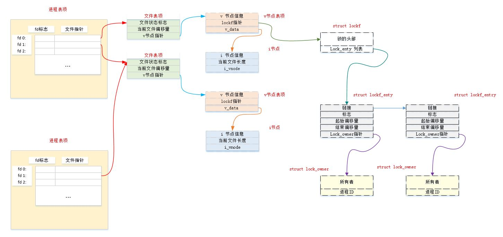

13. 在文件尾端加锁/解锁时要注意：
	- 当执行`fcntl(F_SETLK,flockptr)`，而`flockptr->l_type=F_WRLCK`，
	`flockptr->l_whence=SEEK_END`，`flockptr->l_start=0`，`flockptr->l_len=0` 时，表示从当前文件尾端开始，包括以后所有可能追加写到该文件的任何字节都将加写锁
	- 然后执行`write`一个字节时，该字节将被加锁
	- 当执行 `fcntl(F_SETLK,flockptr)`，而`flockptr->l_type=F_UNLCK`，
	`flockptr->l_whence=SEEK_END`，`flockptr->l_start=0`，`flockptr->l_len=0` 时，表示从当前文件尾端开始解锁，但是之前刚写入的一个字节仍然保持在加锁状态！！

	如果你想解除的锁包括之前刚写入的一个字节，则应该`flockptr->l_len=-1` ， 负的长度值表示在指定偏移量之前的字节数。

	当对文件的一部分加锁时，内核将指定的偏移量变换成绝对文件偏移量。这是因为当前偏移量和文件尾端可能不断变化，但是这种变化不应该影响已经存在的锁的状态，所以内核必须独立于当前文件偏移量和文件尾端而记住锁的位置。

14. 建议性锁和强制性锁：
	- 建议性锁：并不能阻止对文件有读写权限的任何其他进程不使用记录锁而访问文件
	- 强制性锁：内核会检查每一个`open,read,write`等操作，验证调用进程是否违背了正在访问的文件上的某一把锁

	对于一个特定文件，打开其设置组`ID`位，同时关闭其组执行位，就开启了对该文件的强制性锁机制。
	> 因为当组执行位关闭时，设置组`ID`位不再有意义（设置组`ID`位的目的就是为了那些需要特殊组执行权限）

15. 如果一个进程试图`read/write`一个强制性锁起作用的文件，但是将要读/写的部分又由其他进程上了锁，则结果取决于三方面的因素：操作类型`read/write`，其他进程在该区域上持有的记录锁的类型（读锁/写锁），`read/write`文件描述符是阻塞的还是非阻塞的

	<table align='center'>
	<tr align='center'>
		<td rowspan='2'>其他进程在该区域上<br>持有的现有锁的类型</td>
		<td colspan='2'>阻塞描述符</td>
		<td colspan='2'>非阻塞描述符</td>
	</tr>
	<tr align='center'>
		<td>read</td><td>write</td><td>read</td><td>write</td>
	</tr>
	<tr align='center'>
		<td>读锁</td><td>允许</td><td>阻塞</td><td>允许</td><td>EAGAIN</td>
	</tr>
	<tr align='center'>
		<td>写锁</td><td>阻塞</td><td>阻塞</td><td>EAGAIN</td><td>EAGAIN</td>
	</tr>
	</table>

	除了`read/write`函数外，`open`函数也会受到另一个进程持有的强制性锁的影响：
	- 通常，即使正在打开的文件具有强制性记录锁，`open`也会成功，随后的`read/write`遵从上表中的规则
	- 但是，如果`open`调用中的标志指定了`O_TRUNC`或者`O_CREAT`，且正在打开的文件具有强制性记录锁，则不论是否指定`O_NONBLOCK`，`open`都将出错返回，`errno`设置为`EAGAIN`	

	> 一个恶意用户可以使用强制性记录锁，对大家都可读的文件加一把读锁，这样就能阻止任何人写该文件。

16. 强制性锁是可以设法避开的：强制性锁机制对`unlink`函数没有影响，因此你可以先将内容写到一个临时文件中，然后删除 原文件，最后将临时文件改名为原文件名。

## IO多路转换

1. 当从多个描述符读，然后又写到一另一个描述符时，有多种技术：
	- 阻塞式读写+多进程：每个进程负责阻塞式读取一个描述符。缺点是进程间通信太复杂
	- 阻塞式读写+多线程：每个线程负责阻塞式读取一个描述符。缺点是线程将通信太复杂
	- 采用轮询+非阻塞式读写：将每个描述符都设置为非阻塞的，然后轮询读取这些描述符。缺点是浪费`CPU`时间
	- 异步`IO`：内核在`IO`准备好的时候，向进程发送信号。缺点是：
		- 可执行性较差：某些操作系统不支持
		- 这种信号对每个进程而言只有一个。进程在接收到信号时，无法分辨到底是哪一个描述符准备好了（我们仍然需要将描述符设置为非阻塞的，并在接收到信号之后，顺序尝试执行`IO`）
	- `IO`多路转换`IO multiplexing`：使用`poll/pselect/select`这三个函数。这三个函数的原理是：
		- 先构建一张我们感兴趣的描述符（通常不止一个）的列表
		- 然后调用上述函数之一
		- 直到这些描述符中的一个已准备好进行`IO`时，该函数才返回

### select

1. `select`函数：执行`IO`多路转换

	```
	#include<sys/select.h>
	int select(int maxfdp1,fd_set *restrict readfds,fd_set *restrict writefds,
			fd_set *restrict exceptfds,struct timeval *restrict tvptr);
	```
	- 参数：
		- `maxfdp1`：最大的描述符编号值加1。考虑`readfds,writefds,exceptfds`所指定的描述符集，在这三个描述符集中找出最大描述符编号值，然后该值加 1 就是 `maxfdp1` 参数值。
			- 通过指定该参数，内核就在该参数范围内寻找就绪的描述符
			- 之所以加1，是因为描述符编号从 0 开始。因此该参数的真实意义是：要检查的描述符个数。如`maxfdp1=100`，则检查描述符`0~99`一共100个
			> 你也可以设置`maxfdp1`为`FD_SETSIZE`常量，它指定了最大描述符书来那个（通常是1024）。对于大多数应用而言，该常量指定的描述符太大了
		- `readfds`：指向`fd_set`类型，其中存放的是我们关心的需要读取的描述符列表。如果为`NULL`，则表示不关心可读的描述符
		- `writefds`：指向`fd_set`类型，其中存放的是我们关心的需要写入的描述符列表。如果为`NULL`，则表示不关心可写的描述符
		- `exceptfds`：指向`fd_set`类型，其中存放的是我们关心的可能发生异常的描述符列表。如果为`NULL`，则表示不关心发生异常的描述符
		- `tvptr`：指向`timeval`结构，存放的是我们愿意等待的时间长度
			- 如果为`NULL`，则表示永远等待。当发生以下条件时，函数会返回：
				- 如果捕捉到一个信号则中断此无限期等待，函数返回`-1`，`errno`设置为`EINTR`
				- 如果所指定的描述符中的一个已经准备好，则函数返回
			- 如果`tvptr->tv_sec==0`而且`tvptr->tv_usec==0`，则根本不等待。此时函数会测试所有指定的描述符并立即返回
			- 其他情况：等待指定的秒数加微秒数。当发生以下条件时，函数会返回：
				- 如果超时则函数返回，此时函数的返回值是 0（表示没有描述符准备好）
				- 如果所指定的描述符中的一个已经准备好，则函数返回

	- 返回值：
		- 成功：返回准备就绪的描述符的数量。该值是三个描述符集中已经准备好的描述符之和
			> 如果某个描述符同时位于`readfds`和`writefds`，一旦该描述符同时可读可写，则返回值中会对其计数两次
		- 失败：
			- 若超时则返回 0（此时表示没有描述符准备好）
			- 若出错则返回 -1（如`select`阻塞期间被信号中断）

	`POSIX`中`select`的语义为：
	- 我们通过传递给`select`的参数告诉内核：
		- 我们所关心的描述符
		- 对于每个描述符，我们所关心的条件：是描述符可读？还是描述符可写？还是描述符出现异常？
		- 我们愿意等多久
	- 从`select`返回时，内核告诉我们：
		- 已经准备好的描述符的总数量（通过`select`返回）
		- 对于可读、可写、发生异常这三个条件中的每一个，哪些描述符已准备好（通过`readfds,writefds,exceptfds`返回）

	注意：准备好的语义为：
	- 如果对`readfds`中的一个描述符进行的`read`操作不会阻塞，则认为该描述符是准备好的		
	- 如果对`writefds`中的一个描述符进行的`write`操作不会阻塞，则认为该描述符是准备好的
	- 如果对`exceptfds`中的一个描述符有一个未决异常条件，则认为该描述符是准备好的。未决异常条件包括：
		- 在网络连接上到达带外数据
		- 处于数据包模式的伪终端上发生了 某些条件
	- 对于读、写和异常条件，普通文件的文件描述符总是返回准备好	

2. `fd_set`数据类型：它是描述符集类型。其数据类型是由具体实现定义的，可以为每一个可能的描述符保持一位
	> 我们可以认为它是一个很大的字节数组，每个可能的描述符占一个比特位

	对于`fd_set`类型，只支持下列操作：
	- 分配一个`fd_set`类型的变量
	- 将`fd_set`类型的变量赋给同类型的另一个变量
	- 对`fd_set`类型的变量使用下列函数中的一个（这些函数接口可能实现为宏或者函数）：
		- `FD_ISSET(fd,fdset)`：判断 `fd_set`变量的指定位（由`fd`指定）是否为 1
		- `FD_CLR(fd,fdset)`：将`fd_set`变量的指定位（由`fd`指定）设置为 0
		- `FD_SET(fd,fdset)`:将`fd_set`变量的指定位（由`fd`指定）设置为 1
		- `FD_ZERO(fdset)`：将`fd_set`变量的所有位设置为 0
		> 这里的`fdset`为`fd_set *`

	```
	#include<sys/select.h>
	int FD_ISSET(int fd,fd_set *fdset);
	void FD_CLR(int fd,fd_set *fdset);
	void FD_SET(int fd,fd_set *fdset);
	void FD_ZERO(fd_set *fdset);
	```
	- 参数：
		- `fd`：待测试的位（通常是一个描述符）
		- `fdset`：指向待测试的`fd_set`变量的指针
	- 返回值：
		- 对于`FD_ISSET`函数：如果`fd`在描述符集中，则返回非零值；否则返回 0

3. 如果`select`的`readfds,writefds,exceptfds`均为`NULL`，则该函数就成了一个比`sleep`精度更高的定时器

4. 一个描述符阻塞并不影响`select`是否阻塞。

5. 如果在一个描述符上碰到了文件尾端，则`select`认为该描述符是可读的（因为调用`read`会返回0）

6. `POSIX.1`也定义了一个`pselect`函数，它是`select`的变体：

	```
	#include<sys/select.h>
	int pselect(int maxfdp1,fd_set *restrict readfds,fd_set *restrict writefds,
			fd_set *restrict exceptfds,const struct timespec *restrict tsptr,
			const sigset_t *restrict sigmask);
	```
	除了下列几点外，`pselect`与`select`完全相同：
	- `select`的超时值用`timeval`结构指定，而`pselect`的超时值用`timespec`结构（它以秒加纳秒表示超时值，而非秒加微秒）
	- `pselect`的超时值被声明为`const`
	- `pselect`可使用可选信号屏蔽字：
		- 若`sigmask`为`NULL`，则关于信号有关的方面，`pselect`与`select`相同
		- 否则`sigmask`指向一个信号屏蔽字。在调用`pselect`时，以原子操作的方式安装该信号屏蔽字。在返回时，原子的回复以前的信号屏蔽字

7. 示例：

	```
#include <stdio.h>
#include<string.h>
#include<errno.h>
#include<unistd.h>
#include<sys/select.h>
void test_select(fd_set* set_p,int maxfdp1)
{
    int ok;
    ok=select(maxfdp1,set_p,NULL,NULL,NULL);
    if(ok==-1)
    {
            printf("select error,because %s\n",strerror(errno));
    }else if(ok==0)
        {
            printf("Timeout\n");
        }
    else
    {
            for(int i=0;i<maxfdp1;i++)
            {
                if(FD_ISSET(i,set_p))
                {
                    printf("fd %d is read ready\n",i);
                }
            }
    }
}
int main(void)
{
    fd_set set;
    FD_ZERO(&set);
    FD_SET(0,&set);
    test_select(&set,1);
    pause();
    return 0;
}
	```

	结果如下。其中`select`的读描述符列表仅包含描述符0（标准输入）。在未输入时，进程阻塞等待标准输入，如图一所示。在输入数据时，进程从`select`唤醒，如图二所示。

	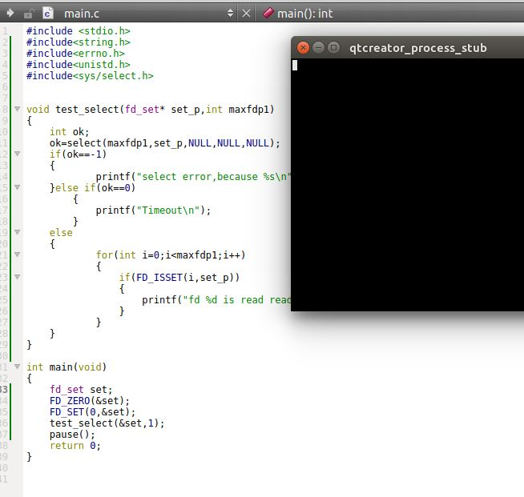
	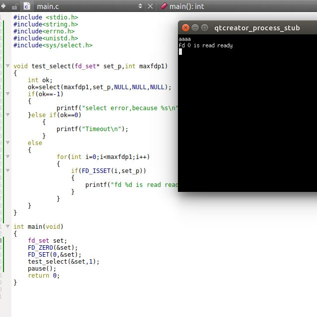

### poll
1. 函数`poll`类似于`select`，但是接口不同。其原型为：

	```
	#include<poll.h>
	int poll(struct pollfd fdarray[],nfds_t nfds,int timeout);
	```
	- 参数
		- `fdarray`：`pollfd`结构数组的地址，其长度由`nfds`指定
		- `nfds`：`pollfd`结构数组的长度
		- `timeout`：指定我们愿意等多长时间，单位为毫秒。
			- 如果为 -1， 表示永远等待。当发生以下条件时，函数会返回：
				- 如果捕捉到一个信号则中断此无限期等待，函数返回`-1`，`errno`设置为`EINTR`
				- 如果所指定的描述符中的一个已经准备好，则函数返回
			- 如果为 0 ，则表示不等待，此时函数会测试所有指定的描述符并立即返回。
			- 如果大于 0， 则等待指定的毫秒数。当发生以下条件时，函数会返回：
				- 如果超时则函数返回，此时函数的返回值是 0（表示没有描述符准备好）
				- 如果所指定的描述符中的一个已经准备好，则函数返回
	- 返回值：
		- 成功：返回准备就绪的描述符数目
		- 失败：
			- 超时：返回 0
			- 出错：返回 -1

	与`select`不同，`poll`不是为每个条件（可读性、可写性、异常条件）构造一个描述符集，而是构造一个`pollfd`结构的数组，每个数组元素指定一个描述符编号以及我们对该描述符感兴趣的条件：

	```
	struct pollfd{
		int fd;         // 待检查的描述符，如果小于零则忽略之
		short events;    // 对`fd`上感兴趣的条件
		short revents;   // 在`fd`上发生的条件
	}
	```

	`events`成员指定了我们对该描述符感兴趣的条件，由用户设置。可以为下列常量的一个或者几个：
	- `POLLIN`：可以不阻塞地读取高优先级数据以外的数据（等价于`POLLRDNORM|POLLRDBAND`）
	- `POLLRDNORM`：可以不阻塞地读取普通数据
	- `POLLRDBAND`：可以不阻塞地读取优先级数据
	- `POLLPRI`：可以不阻塞地读取高优先级数据
	- `POLLOUT`：可以不阻塞地写普通数据
	- `POLLWRNORM`：与`POLLOUT`相同
	- `POLLWRBAND`:可以不阻塞地写优先级数据

	`revents`成员指示了描述符上发生了哪些事件，由内核设置。可以为下列常量的一个或者几个：
	- `events`的取值常量
	- `POLLERR`：已出错
	- `POLLHUP`：已挂断
	- `POLLNVAL`：描述符没有引用一个打开的文件

	示例：

	```
#include <stdio.h>
#include<string.h>
#include<errno.h>
#include<unistd.h>
#include<poll.h>
typedef struct pollfd Pollfd;
void print_pollfd_revent(Pollfd * pfd)
{
    if(pfd==NULL) return;
    switch (pfd->revents) {
    case POLLIN:
        printf("\tfd %d is POLLIN\n",pfd->fd);
        break;
    case POLLRDNORM:
        printf("\tfd %d is POLLRDNORM\n",pfd->fd);
        break;
    case POLLRDBAND:
        printf("\tfd %d is POLLRDBAND\n",pfd->fd);
        break;
    case POLLPRI:
        printf("\tfd %d is POLLPRI\n",pfd->fd);
        break;
    case POLLOUT:
        printf("\tfd %d is POLLOUT\n",pfd->fd);
        break;
    case POLLWRNORM:
        printf("\tfd %d is POLLWRNORM\n",pfd->fd);
        break;
    case POLLWRBAND:
        printf("\tfd %d is POLLWRBAND\n",pfd->fd);
        break;
    case POLLERR:
        printf("\tfd %d is POLLERR\n",pfd->fd);
        break;
    case POLLHUP:
        printf("\tfd %d is POLLHUP\n",pfd->fd);
        break;
    case POLLNVAL:
        printf("\tfd %d is POLLNVAL\n",pfd->fd);
        break;
    default:
         printf("Never come here\n");
        break;
    }
}
void test_poll(Pollfd fdarray[],int num)
{
    int ok;
    ok=poll(fdarray,num,-1);
    if(ok==-1)
    {
            printf("\tpoll error,because %s\n",strerror(errno));
    }else if(ok==0)
        {
            printf("\tTimeout\n");
        }
    else
    {
            for(int i=0;i<num;i++)
            {
                print_pollfd_revent(fdarray+i);
            }
    }
}
int main(void)
{
    Pollfd array[1];
    array[0].fd=0;
    array[0].events=POLLIN|POLLPRI;
    test_poll(array,1);
    pause();
    return 0;
}
	```
	结果如下。在未输入时，进程阻塞等待标准输入，如图一所示。在输入数据时，进程从`poll`唤醒，如图二所示。

	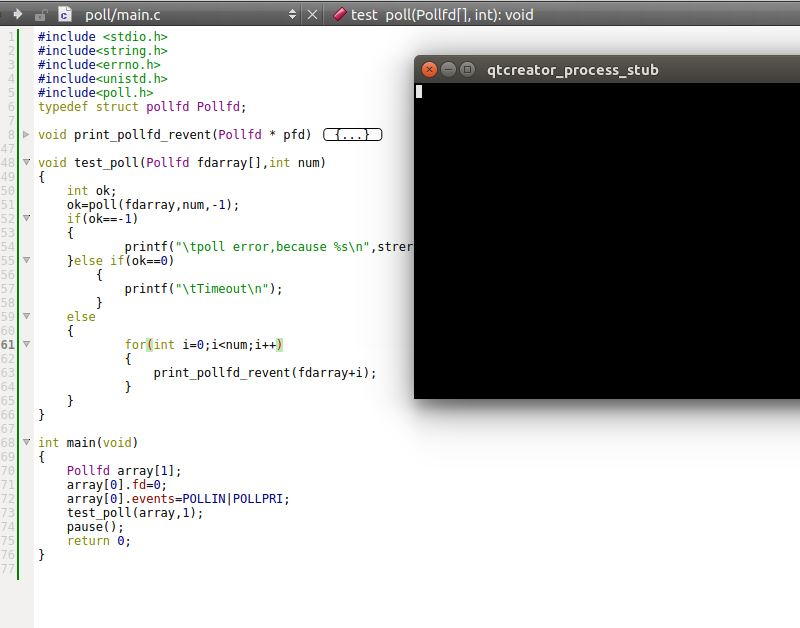

	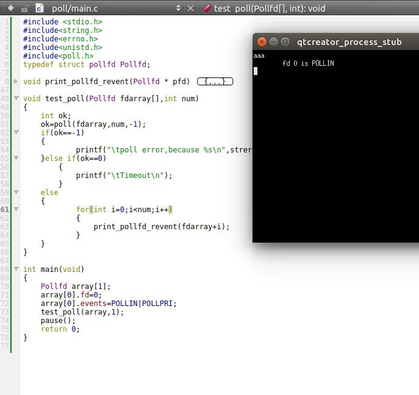


2. 当一个描述符被挂断之后（`POLLHUP`），就不能再写该描述符，但是仍有可能从描述符读取到数据。
	注意文件尾端和挂断的区别：
	- 如果到达文件尾端，则`POLLIN`事件会发生，我们可以读到`EOF`（此时`read`返回 0）
	- 如果正在读调制解调器，并且电话线已挂断，则将发生`POLLHUP`事件

3. 一个描述符是否阻塞不影响`poll`是否阻塞

4. `select`和`poll`的可中断性：目前各种实现在接收到信号时都不会自动重启`poll`和`select`，即使在建立信号处理程序时指定`SA_RESTART`标志时也是如此。

	示例：

	```
#include <stdio.h>
#include<string.h>
#include<errno.h>
#include<unistd.h>
#include<poll.h>
#include<signal.h>
typedef struct pollfd Pollfd;
void sig_print(int signo,siginfo_t *info, void *context)
{
    printf("Begin signal Hanlder:\n");
    psiginfo(info,"The siginfo is:\t");
    printf("End signal Hanlder:\n");
}
void add_sigaction(int signo)
{
    sigset_t set;
    sigemptyset(&set);

    struct sigaction action;
    action.sa_sigaction=sig_print;
    action.sa_flags=SA_SIGINFO|SA_RESTART;
    action.sa_mask=set;
    if(sigaction(signo,&action,NULL)==-1)
    {
        printf("set sigaction for signal %s failed!
			,because %s\n",strsignal(signo),strerror(errno));
    }else
    {
        printf("set sigaction for signal %s successed\n",strsignal(signo));
    }
}
void print_pollfd_revent(Pollfd * pfd)
{
    if(pfd==NULL) return;
    switch (pfd->revents) {
    case POLLIN:
        printf("\tfd %d is POLLIN\n",pfd->fd);
        break;
    case POLLRDNORM:
        printf("\tfd %d is POLLRDNORM\n",pfd->fd);
        break;
    case POLLRDBAND:
        printf("\tfd %d is POLLRDBAND\n",pfd->fd);
        break;
    case POLLPRI:
        printf("\tfd %d is POLLPRI\n",pfd->fd);
        break;
    case POLLOUT:
        printf("\tfd %d is POLLOUT\n",pfd->fd);
        break;
    case POLLWRNORM:
        printf("\tfd %d is POLLWRNORM\n",pfd->fd);
        break;
    case POLLWRBAND:
        printf("\tfd %d is POLLWRBAND\n",pfd->fd);
        break;
    case POLLERR:
        printf("\tfd %d is POLLERR\n",pfd->fd);
        break;
    case POLLHUP:
        printf("\tfd %d is POLLHUP\n",pfd->fd);
        break;
    case POLLNVAL:
        printf("\tfd %d is POLLNVAL\n",pfd->fd);
        break;
    default:
         printf("Never come here\n");
        break;
    }
}
void test_poll(Pollfd fdarray[],int num)
{
    int ok;
    ok=poll(fdarray,num,-1);
    if(ok==-1)
    {
            printf("\tpoll error,because %s\n",strerror(errno));
    }else if(ok==0)
        {
            printf("\tTimeout\n");
        }
    else
    {
            for(int i=0;i<num;i++)
            {
                print_pollfd_revent(fdarray+i);
            }
    }
}
void child()
{
    if(fork()==0)
    {//chid
        sleep(1);
        kill(getppid(),SIGINT);
          _exit(0);
    }else
    {
        Pollfd array[1];
        array[0].fd=0;
        array[0].events=POLLIN|POLLPRI;
        test_poll(array,1);
    }
}
int main(void)
{
    add_sigaction(SIGINT);
    child();
    return 0;
}
	```
  
	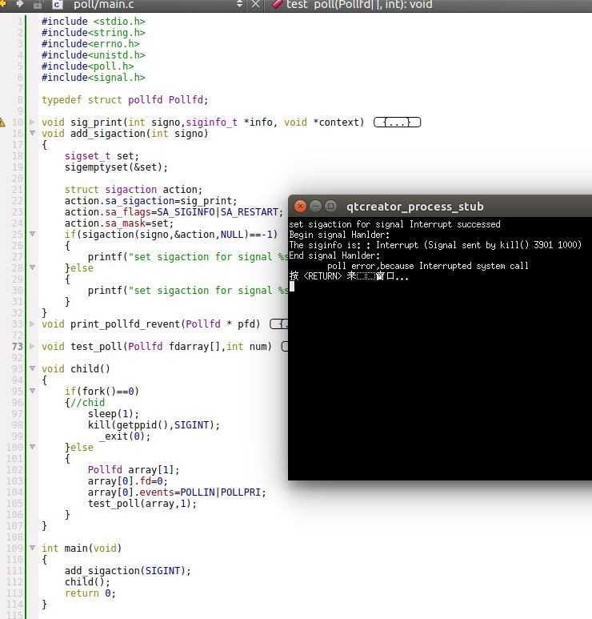

## 异步IO

1. 信号机制提供了一种以异步形式通知某种事件已发生的方法。由`BSD`和`System V`派生的所有系统都提供了某种形式的异步`IO`，使用一个信号通知进程：对某个描述符所关注的某个事件已经发生了
	- `System V`中是`SIGPOLL`信号
	- `BSD`中是`SIGIO`信号

2. 信号机制的异步`IO`是有限制的：
	- 它们并不能够用在所有的文件类型上
	- 只能使用一个信号。如果要对一个以上的描述符进行异步`IO`，则在进程接收到该信号时，并不知道这一信号对应于哪个描述符

3. 使用`POSIX`异步`IO`接口有三个麻烦：
	- 每个异步操作都有三处可能产生错误的地方：
		- 在提交异步操作时
		- 在异步操作本身执行`IO`时
		- 在获取异步操作结果状态时
	- 与传统的方法相比，`POSIX`异步`IO`本身涉及大量的额外设置和处理规则
	- 从错误中恢复可能会比较困难。假设提交了多个异步写操作，其中一个失败了，那么是撤销失败的写操作，还是撤销所有的写操作？

### POSIX 异步 IO

1. `POSIX`异步`IO`接口为不同类型的文件进行异步`IO`提供了一套一致的方法。这些异步`IO`接口使用`AIO`控制块来描述`IO`操作。

	`aiocb`结构定义了`AIO`控制块，其结构至少包括下面这些字段：

	```
	struct aiocb{
		int aio_fildes;            // 文件描述符
		off_t aio_offset;           // 文件偏移量
		volatile void* aio_buf;     // IO缓冲区
		size_t aio_nbytes;          // 传输的字节数
		int aio_reqprio;            // 优先级
		struct sigevent aio_sigevent;// 信号信息
		int aio_lio_opcode;           // IO操作列表
	}
	```
	- `aio_fildes`：表示被打开用来读或者写的文件描述符
	- `aio_offset`：读或者写操作从该字段指定的偏移量开始
	- `aio_buf`：
		- 对于读操作，它指定了从文件中读取内容存放的缓冲区
		- 对于写操作，它指定了将要向文件写入内容存放的缓冲区
	- `aio_nbytes`：指定了要读或者写的字节数
	- `aio_reqprio`：指定了异步`IO`的优先级，操作系统根据该优先级来安排执行顺序。但是操作系统对于该顺序只有 有限的控制能力，因此不一定能够遵循该提示
	- `aio_lio_opcode`：参见`lio_listio`函数的说明。它指定了该`AIO`控制块是用于多操作、写操作、还是空操作
	- `aio_sigevent`：指定`IO`事件完成后，如何通知应用程序：

		```
		struct sigevent{
			int sigev_notify;         // 通知类型
			int sigev_signo;          // 信号编号
			union sigval sigev_value;                   // 通知的参数
			void (*sigev_notify_function)(union sigval);// 作为线程执行的函数
			pthread_attr_t *sigev_notify_attributes;    // 线程属性
		```
		- `sigev_notify`：指定了通知的类型，可以为下列三种之一
			- `SIGEV_NONE`：异步`IO`请求完成后，不通知进程
			- `SIGEV_SIGNAL`：异步`IO`请求完成后，产生由`sigev_signo`字段指定的信号。如果应用程序选择捕捉此信号，且在建立信号处理程序时，指定了`SA_SIGINFO`标志，则该信号将被入队列（如果实现支持排队信号）。信号处理程序将被传递一个`siginfo`结构，该结构的`si_value`字段将被设置成`sigev_value`
			- `SIGEV_THREAD`：当异步`IO`请求完成后，由`sigev_notify_function`字段指定的函数被调用成为一个子线程。`sigev_value`字段被传入作为其参数。如果`sigev_notify_attributes`为`NULL`，则该线程为分离状态；如果`sigev_notify_attributes`不是`NULL`，则该线程的属性由`sigev_notify_attributes`指定
			> `sigev_value`是个`union`，其结构一般为：
			>
			>```
			union sigval
  			{
				int sival_int;
 				void *sival_ptr;
  			}
			```	

2. 在进行异步`IO`之前，需要先初始化`AIO`控制块，然后再进行异步读写操作

3. `aio_read/aio_write`函数：异步读/写操作

	```
	#include<aio.h>
	int aio_read(struct aiocb *aiocb);
	int aio_write(struct aiocb *aiocb);
	```
	- 参数：
		- `aiocb`：指向`AIO`控制块
	- 返回值：
		- 成功：返回 0
		- 失败： 返回 -1

	当这些函数返回成功时，异步`IO`请求就已经被操作系统放入等待处理的队列中了。这些返回值与实际`IO`操作的结果没有任何关系。

	注意：`IO`操作在等待时，必须确保`AIO`控制块和数据缓冲区保持稳定。它们下面对应的内存必须始终是合法的，除非`IO`操作完成，这些内存不应该被复用

4. 示例 

	```
#include <stdio.h>
#include<fcntl.h>
#include<unistd.h>
#include<aio.h>
#include<signal.h>
#include<string.h>
#include<errno.h>
typedef struct aiocb Aiocb;
typedef struct sigevent Sigevent;
Aiocb read_aiocb;
void sig_print(int signo,siginfo_t *info, void *context)
{
    printf("Begin signal Hanlder:\n");
    psiginfo(info,"The siginfo is:\t");
    printf("End signal Hanlder:\n");
}
void add_sigaction(int signo)
{
    sigset_t set;
    sigemptyset(&set);

    struct sigaction action;
    action.sa_sigaction=sig_print;
    action.sa_flags=SA_SIGINFO|SA_RESTART;
    action.sa_mask=set;
    if(sigaction(signo,&action,NULL)==-1)
    {
        printf("set sigaction for signal %s failed!,because %s\n",
			strsignal(signo),strerror(errno));
    }else
    {
        printf("set sigaction for signal %s successed\n",strsignal(signo));
    }
}
void thread_func(void *val)
{
    printf("Begin Thread:\n");
    printf("val is %d\n",(int)val);
    printf("End Thread:\n");
}
void test_read_aio_signal()
{

    Sigevent read_event;
    int read_buffer[10];
    int ok;
    int fd=open("/home/huaxz1986/test.txt",O_RDONLY);
    //****** init sigevent *****//
    read_event.sigev_notify=SIGEV_SIGNAL;
    read_event.sigev_signo=SIGINT;
    read_event.sigev_value.sival_int=99;
    //****** init aiocb   ******//
    read_aiocb.aio_fildes=fd;
    read_aiocb.aio_offset=0;
    read_aiocb.aio_buf=read_buffer;
    read_aiocb.aio_nbytes=10;
    read_aiocb.aio_sigevent=read_event;
    ok=aio_read(&read_aiocb);
    if(ok==-1) printf("aio_read error,because %s\n",strerror(errno));
}
void test_read_aio_thread()
{
    Sigevent read_event;
    int read_buffer[10];
    int ok;
    int fd=open("/home/huaxz1986/test.txt",O_RDONLY);
    //****** init sigevent *****//
    read_event.sigev_notify=SIGEV_THREAD;
    read_event.sigev_value.sival_int=100;
    read_event._sigev_un._sigev_thread._function=thread_func;
    //****** init aiocb   ******//
    read_aiocb.aio_fildes=fd;
    read_aiocb.aio_offset=0;
    read_aiocb.aio_buf=read_buffer;
    read_aiocb.aio_nbytes=10;
    read_aiocb.aio_sigevent=read_event;
    ok=aio_read(&read_aiocb);
    if(ok==-1) printf("aio_read error,because %s\n",strerror(errno));
}
int main(void)
{
    add_sigaction(SIGINT);
    test_read_aio_signal();
    sleep(5);
    int ok=aio_error(&read_aiocb);
    if(0==ok)
    {
        int size=aio_return(&read_aiocb);
        printf("aio read is success done, read %d bytes\n",size);
    }else if(-1==ok) printf("aio_error because %s\n",strerror(errno));
    else if(EINPROGRESS ==ok) printf("aio is in progress\n");
    else printf("aio_error test aio read id error ,because %s\n",strerror(ok));
    return 0;
}
	```
	`librt` 是`glibc`对linux下的`real-time`系统调用的支持接口，封装的函数包括异步I/O。因此需要在`Qt`的`.pro`文件中添加`LIBS+= -lrt`。（如果用到了`sigev_notify=SIGEV_THREAD`，则还需要添加`LIBS+=-lpthread`）

	我们调用`test_read_aio_signal`，结果如图一。我们调用`test_read_aio_thread`，结果如图二。
	> 注意，`main`中必须`sleep`，否则进程过快终止。


	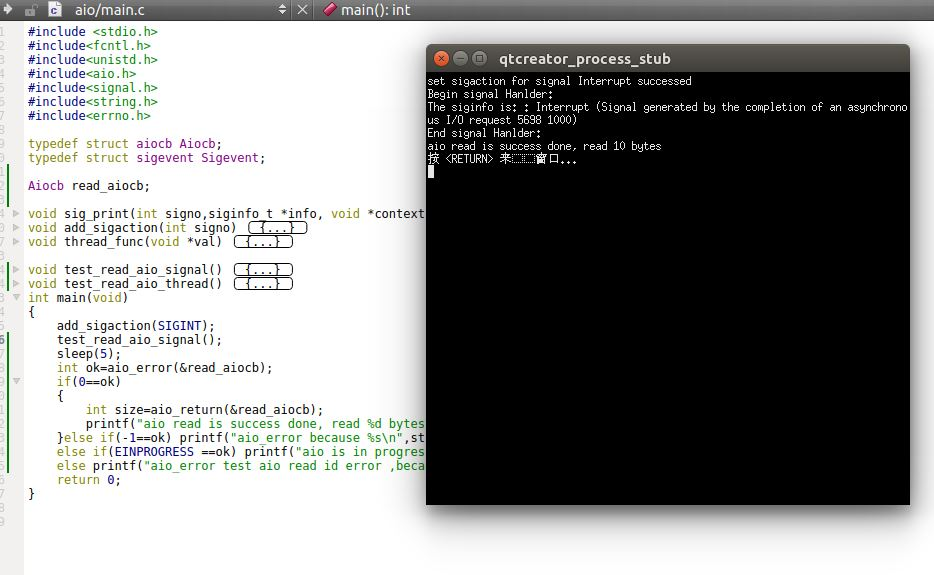
	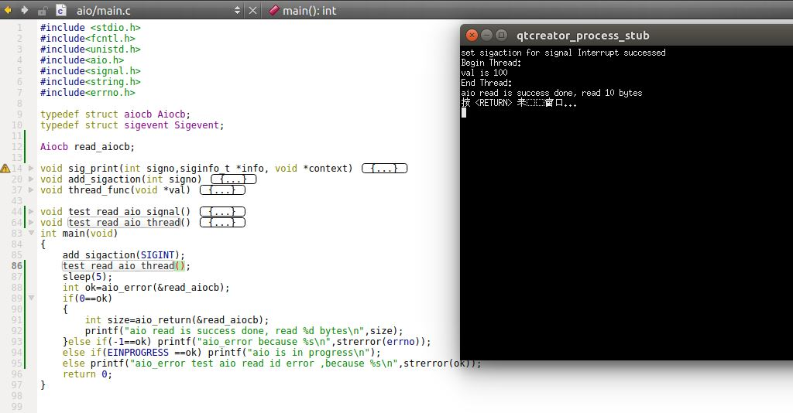	

4. 如果想强制所有等待中的异步操作不等待而写入持久化的存储（如硬盘）中，可以设立一个`AIO`控制块并调用`aio_fsync`函数：

	```
	#include<aio.h>
	int aio_fsync(int op,struct aiocb *aiocb);
	```
	- 参数：
		- `op`：指定模式：
			- `O_DSYNC`：操作执行起来就像是调用了`fdatasync`一样
			- `O_SYNC`：操作执行起来就像是调用了`fsync`一样
		- `aiocb`：指向`AIO`控制块
	- 返回值：
		- 成功：返回 0
		- 失败： 返回 -1

	`AIO`控制块中的`aio_fildes`字段指定了其异步写操作不等待而写入持久化的存储的那个文件。

	就像`aio_read/aio_write`函数一样，在安排了同步时，`aio_fsync`操作立即返回。在异步的同步操作完成之前，数据不会被持久化。`AIO`控制块控制我们如何被通知
	> 异步的同步操作：指的是将数据修改同步到硬盘上的这个操作是异步执行的。数据持久化：值得就是将数据修改同步到硬盘上

5. `aio_error`函数：获取一个异步读、写或者同步操作的完成状态

	```
	#include<aio.h>
	int aio_error(const struct aiocb *aiocb);
	```
	- 参数：
		- `aiocb`：指向`AIO`控制块
	- 返回值：
		- 成功：返回 0 。表示异步操作完成，此时需要调用`aio_return`函数获取操作返回值
		- 失败： 返回 -1。对`aio_error`的调用失败，此时`errno`会告诉我们发生了什么
		- `EINPROGRESS`：对异步读、写、同步操作仍在等待
		- 其他情况：其他任何返回值是相关的异步操作失败返回的错误码

6. `aio_return`函数：如果异步操作成功，该函数获取异步操作的返回值

	```
	#include<aio.h>
	ssize_t aio_return(const struct aiocb *aiocb);
	```
	- 参数：
		- `aiocb`：指向`AIO`控制块
	- 返回值：
		- 失败： 返回 -1。对`aio_return`的调用失败，此时`errno`会告诉我们发生了什么
		- 其他情况：返回异步读、写、同步操作的结果

	直到异步操作完成之前，都要小心的不要调用`aio_return`函数。操作完成之前，该函数调用的结果是未定义的。

	还需要小心地对每个异步操作只调用一次`aio_return`函数，一旦调用了该函数，操作系统就可以释放掉包含`IO`操作返回值的记录。

7. 如果想等待异步操作的完成，则可以使用`aio_suspend`函数：

	```
	#include<aio.h>
	int aio_suspend(const struct aiocb *const list[],int nent,
					const struct timespec *timeout);
	```

	- 参数：
		- `list`：`AIO`控制块指针的数组。每个元素指向了要等待完成的异步操作
			- 如果数组元素为`NULL`，则跳过空指针
			- 如果数组元素非`NULL`，则它必须是已经初始化的异步`IO`操作的`AIO`控制块
		- `nent`：该数组的长度
		- `timeout`：指定超时时间。如果想永不超时，则设定它为`NULL`

	- 返回值：
		- 成功：返回 0
		- 失败： 返回 -1

	`aio_suspend`可能返回三种结果：
	- 如果被一个信号中断，则返回-1 ，并将`errno`设置为`EINTR`
	- 如果`list`指定的异步`IO`中，没有任何`IO`操作完成的情况下，超时时间到达，则返回-1 ，并将`errno`设置为`EAGAIN`
	- 如果`list`指定的异步`IO`中，有任何`IO`操作完成，则返回 0

8. `aio_cancel`函数：取消异步`IO`：

	```
	#include<aio.h>
	int aio_cacel(int fd,struct aiocb *aiocb);
	```	
	- 参数：
		- `fd`：指定了那个未完成异步`IO`操作的文件描述符
		- `aiocb`：指向`AIO`控制块
	- 返回值：
		- 失败： 返回 -1。对`aio_cacel`的调用失败，此时`errno`会告诉我们发生了什么
		- `AIO_ALLDONE`：所有异步操作在尝试取消它们之前已经完成
		- `AIO_CANCELED`：所有要求的异步操作已经取消
		- `AIO_NOTCANCELED`：至少有一个异步操作没有被取消

	如果`aiocb`为`NULL`，则系统将尝试取消所有在`fd`文件上未完成的异步`IO`操作。其他情况下尝试取消由`AIO`控制块描述的单个异步`IO`操作。之所以说尝试，是因为无法保证系统能够取消正在进程中的任何异步操作。

	如果异步`IO`操作被成功取消，则对应的`AIO`控制块调用`aio_error`函数将会返回错误`ECANCELED`。

	如果异步`IO`操作不能被取消，那么相应的`AIO`控制块不会被修改。

9. `lio_listio`函数：提交一系列由一个`AIO`控制块列表描述的`IO`请求

	```
	#include<aio.h>
	int lio_listio(int mode,struct aiocb *restrict const list[restrict_arr],
		int nent,struct sigenvent* restrict sigev);
	```
	- 参数：
		- `mode`：决定了`IO`是否同步的。其值可以为：
			- `LIO_WAIT`：`lio_listio`函数将在所有的由列表指定的`IO`操作完成后返回。此时`sigev`参数被忽略。这是同步操作
			- `LIO_NOWAIT`：`lio_listio`函数将在所有的由列表指定的`IO`操作请求入队立即返回（不等到完成）。进程将在所有`IO`操作完成后，根据`sigev`参数指定的方式，被异步的通知（如果不想被通知，则将`sigev`设置为`NULL`）
				> 每个`AIO`控制块本身也可能启动了在各自操作完成时的异步通知。`sigev`指定的异步通知是额外加的，并且只会在所有的`IO`操作完成后发送
		- `list`：`AIO`控制块指针的数组，该数组指定了要允许的`IO`操作。如果数组包含空指针，则跳过这些空指针
		- `nent`：数组的长度
		- `sigev`：指定了当所有`IO`操作完成后，发送的异步通知（如果不想被通知，则将`sigev`设置为`NULL`）。只有当`mode=LIO_NOWAIT`才有意义
	- 返回值：
		- 成功： 返回 0
		- 失败： 返回  -1

	在每个`AIO`控制块中，`aio_lio_opcode`字段指定了该操作是一个读操作`LIO_READ`、写操作`LIO_WRITE`，还是将被忽略的空操作`LIO_NOP`。
	- 读操作对应的`AIO`控制块将被传递给`aio_read`函数来处理
	- 写操作对应的`AIO`控制块将被传递给`aio_write`函数来处理

	> 在`Linux`上测试，该函数总是抛出异常中断了进程！

10. 异步IO的数量有限制，这些限制都是运行时不变量。
	- 可以通过`sysconf`函数并把`name`设置为`_SC_IO_LISTIO_MAX`来设定`AIO_LISTIO_MAX`的值	
	- 可以通过`sysconf`函数并把`name`设置为`_SC_AIO_MAX`来设定`AIO_MAX`的值
	- 可以通过`sysconf`函数并把`name`设置为`_SC_AIO_PRIO_DELTA_MAX`来设定`AIO_PRIO_DELTA_MAX`的值

	这些常量的意义为：
	- `AIO_LISTIO_MAX`：单个列表`IO`调用中的最大`IO`操作数量
	- `AIO_MAX`：未完成的异步`IO`操作的最大数量
	- `_SC_AIO_PRIO_DELTA_MAX`：进程可以减少的其异步`IO`优先级的最大值


## readv/writev

1. `readv`和`writev`用于在一次函数调用中读、写多个非连续缓冲区。也称它们为散布读与聚集写

	```
	#include<sys/uio.h>
	ssize_t readv(int fd,const struct iovec *iov,int iovcnt);
	ssize_t writev(int fd,const struct iovec *iov,int iovcnt);
	```	
	- 参数：
		- `fd`：打开的文件描述符，用于读/写
		- `iov`：指向`iovec`结构数组
		- `iovcnt`：`iovec`结构数组的元素个数，其值最大为`IOV_MAX`
	- 返回值：
		- 成功：返回已读/已写的字节数量
		- 失败：返回 -1

	这两个函数的`iov`参数是指向`iovec`结构数组的一个指针：
	- 对于`readv`，该结构存放的是从文件中读入的内容
	- 对于`writev`，该结构存放的是想文件中写入的内容	

	```
	struct iovec{
		void *iov_base;  // 缓冲区开始地址
		size_t iov_len;  // 缓冲区长度
	}
	```

	对于`writev`函数，从缓冲区中聚集输出数据到文件的顺序是`iov[0],iov[1],...iov[iovcnt-1]`。它返回总的输出字节数，通常应该等于所有缓冲区长度之和。

	对于`writev`函数，从文件中读取的数据依次输出到缓冲区`iov[0],iov[1],...iov[iovcnt-1]`。它返回总的读取字节数，通常应该等于所有缓冲区长度之和。如果遇到文件尾端，已无数据可读，则返回  0

2. 示例：


	```
#include <stdio.h>
#include<sys/uio.h>
#include<string.h>
#include<errno.h>
#include<fcntl.h>
#include<unistd.h>
typedef struct iovec Iovec;
// read buffers
char read_buffer1[10];
char read_buffer2[10];
char read_buffer3[10];
char read_buffer4[10];
// write buffers
char write_buffer1[20];
char write_buffer2[20];
// iovs
Iovec read_iovs[4];
Iovec write_iovs[2];
void init_data()
{
	// init read_iovs
    read_iovs[0].iov_base=read_buffer1;
    read_iovs[0].iov_len=10;
    read_iovs[1].iov_base=read_buffer2;
    read_iovs[1].iov_len=10;
    read_iovs[2].iov_base=read_buffer3;
    read_iovs[2].iov_len=10;
    read_iovs[3].iov_base=read_buffer4;
    read_iovs[3].iov_len=10;
	//init write_iovs
    write_iovs[0].iov_base=write_buffer1;
    write_iovs[0].iov_len=20;
    write_iovs[1].iov_base=write_buffer2;
    write_iovs[1].iov_len=20;
	// init write_buffer
    for(int i=0;i<20;i++)
    {
        write_buffer1[i]='a'+i;
        write_buffer2[i]='A'+i;
    }
}
void print_buffer(char* buffer,int len)
{
    printf("\t");
    for(int i=0;i<len;i++)
        printf("%c\t",buffer[i]);
    printf("\n");
}
int main(void)
{
    init_data();
    printf("Read Buffer is:\n");
    print_buffer(read_buffer1,10);
    print_buffer(read_buffer2,10);
    print_buffer(read_buffer3,10);
    print_buffer(read_buffer4,10);
    printf("Write Buffer is:\n");
    print_buffer(write_buffer1,20);
    print_buffer(write_buffer2,20);
	// open file
    int fd=open("/home/huaxz1986/test.txt",O_RDWR|O_TRUNC);
	//writev
    int num=writev(fd,write_iovs,2);
    if(num<0) printf("writev error,because %s \n",strerror(errno));
	// readv
    lseek(fd,0,SEEK_SET);
    num=readv(fd,read_iovs,4);
    if(num<0) printf("readv error,because %s \n",strerror(errno));
	// print buffer
    printf("After writev and readv, Read Buffer is:\n");
    print_buffer(read_buffer1,10);
    print_buffer(read_buffer2,10);
    print_buffer(read_buffer3,10);
    print_buffer(read_buffer4,10);
    return 0;
}
	```

	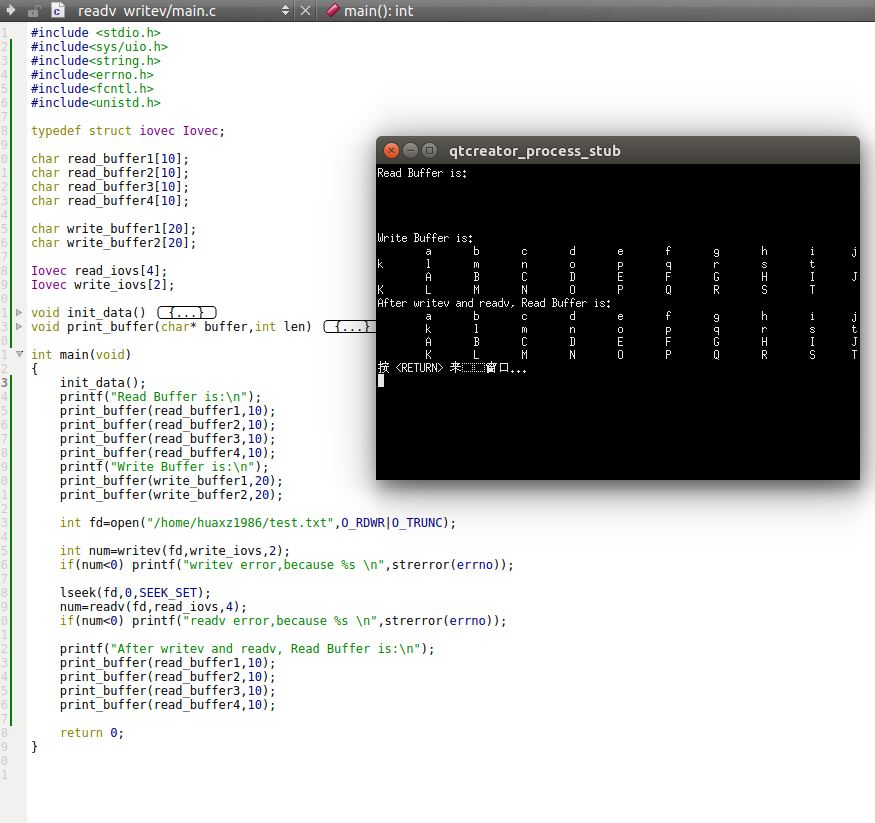

3. 管道、FIFO 以及某些设备有下列两个性质：
	- 一次`read`操作所返回的数据可能少于所要求的数据，即使还没有达到文件尾端也可能是这样。这不是一次错误，应当继续读该设备
	- 一次`write`操作的返回值也可能少于指定输出的字节数。这可能是由于某个因素造成的（如内核输出缓冲区满）。这也不是一个错误，应当继续写余下的数据

	> 在读、写磁盘文件时，从来未见到上述两种情况，除非文件系统用完了空间，或者接近了配额限制从而不能将要求写的数据全部写出

## 存储映射 IO 

1. 存储映射`IO`（`memory-mapped IO`） 能将一个磁盘文件映射到存储空间中的一个缓冲区上。于是：
	- 当从缓冲区中读取数据时，就相当于读文件中的相应字节
	- 当数据存入缓冲区时，相应字节就自动写入文件
	> 这样就能够在不是用`read`和`write`的情况下执行`IO`

2. `mmap`函数：将一个给定的文件映射到一个存储区域中：

	```
	#include<sys/mman.h>
	void *mmap(void *addr,size_t len,int prot,int flag,int fd,off_t off);
	```
	- 参数：
		- `addr`：用于指定映射存储区的起始地址。如果为 0，则表示由系统选择该映射区的起始地址
		- `len`：指定要映射的字节数
		- `prot`：指定了映射存储区的保护要求，可以为下列之一：
			- `PROT_READ`：映射区可读
			- `PROT_WRITE`：映射区可写
			- `PROT_EXEC`：映射区可执行
			- `PROT_NONE`：映射区不可访问

			也可以为`PROT_READ`、`PROT_WRITE`、`PROT_EXEC`的按位或。
		- `flag`：影响映射存储区的多种属性：
			- `MAP_FIXED`：返回值必须等于`addr`。因为这不利于可移植性，所以不鼓励使用此标志。
			> 如果未指定此标志，且`addr`非 0，则内核只是将`addr`视为在何处设置映射区的一个建议，但是不保证会使用所要求的地址。将`addr`设为 0，可以获取最大可移植性

			- `MAP_SHARED`：它描述了本进程对于映射区所进行的存储操作的配置。此标志指定存储操作将修改底层的映射文件（即存储操作相当于对底层的映射文件进行`write`）
			- `MAP_PRIVATE`：它描述了本进程对于映射区所进行的存储操作的配置。此标志指定存储操作将不会修改底层的映射文件，而是创建该底层的映射文件的一个私有副本。所有后续的对该映射区的引用都是引用该副本
			> 此标志的一个用途是用于调试程序，它将程序文件的正文部分映射到存储区，但运行用户修改其中的指令。任何修改只影响程序文件的副本，而不影响源文件
		- `fd`：指定要被映射文件的描述符。在文件映射到地址空间之前，必须先打开该文件
		- `off`：要映射字节在文件中的起始偏移量
	- 返回值：
		- 成功：返回映射区的起始地址 
		- 失败：返回 -`MAP_FAILED`

	注意：
	- `prot`不能超过文件`open`模式访问权限。如：如果该文件是只读打开的，则对于映射存储区就不能指定`PROT_WRITE`
	- `flag`的标志中，`MAP_SHARED`和`MAP_PRIVATE`必须指定一个，而且二者不能同时指定
	- `flag`的标志中，每种实现可能会自定义一些`MAP_XXX`标志值，它们是那些实现特有的
	- `off`的值和`addr`的值（如果指定了`MAP_FIXED`）通常被要求是系统虚拟存储页长度的倍数。因为`off`和`addr`通常指定为 0 ，所以这种要求一般并不重要
		> 虚拟存储页长可以用带参数`_SC_PAGESIZE`或者`_SC_PAGE_SIZE`的`sysconf`函数得到

	下图是存储映射文件的基本情况。其中“起始地址”是`mmap`的返回值

	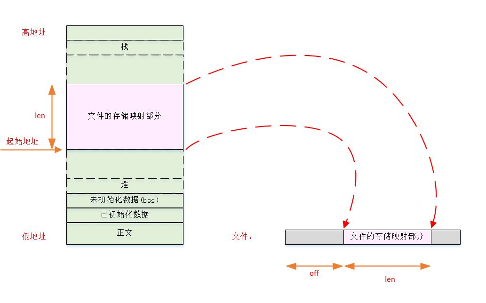

	示例：

	```
#include <stdio.h>
#include<sys/mman.h>
#include<string.h>
#include<errno.h>
#include<fcntl.h>
#include<unistd.h>
typedef void * VType;
void test_mmap_shared(int fd,int len)
{
    VType addr=mmap(0,len,PROT_READ|PROT_WRITE,MAP_SHARED,fd,0);
    if(addr==MAP_FAILED)
    {
        printf("mmap failed ,because %s\n",strerror(errno));
    }else
    {
        close(fd);
        memcpy(addr,"abcdefghijklmn",14);
    }
    munmap(addr,len);
}
void test_mmap_private(int fd,int len)
{
    VType addr=mmap(0,len,PROT_READ|PROT_WRITE,MAP_PRIVATE,fd,0);
    if(addr==MAP_FAILED)
    {
        printf("mmap failed ,because %s\n",strerror(errno));
    }else
    {
        close(fd);
        memcpy(addr,"ABCDEFGHIJKLMN",14);
    }
    munmap(addr,len);
}
int main(void)
{
    int fd1=open("/home/huaxz1986/test.txt",O_RDWR|O_TRUNC);
    if(fd1==-1)
    {
        printf("open /home/huaxz1986/test.txt failed,because %s\n",
               strerror(errno));
        return -1;
    }
    int fd2=open("/home/huaxz1986/test2.txt",O_RDWR|O_TRUNC);
    if(fd2==-1)
    {

        printf("open /home/huaxz1986/test2.txt failed,because %s\n",
               strerror(errno));
        return -1;
    }

    ftruncate(fd1,100);
    ftruncate(fd2,100);
    test_mmap_shared(fd1,100);
    test_mmap_private(fd2,100);
    return 0;
}
	```
	
	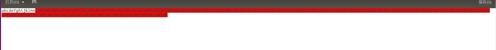
	

	上图一为`test.txt`的内容，图二为`test2.txt`的内容。为可以看到：
	- `MAP_SHARED`时，对存储映射区的修改反映到底层文件中
	- `MAP_PRIVATE`时，对存储映射区的修改并不会反映到底层文件中
	- 一旦将底层文件映射到存储映射区，则关闭`fd`并不会关闭存储映射区

3. 假设文件长度为 12 字节，系统页长为 512 字节，则系统通常会提供 512 字节的映射区，其中后 500字节被设置为0 。可以修改后面的这 500 字节，但是任何变动都不会在文件中反映出来。
	- 我们可以先加长该文件，使得能够将后面500字节的改动反映到文件中去

4. 与映射区相关的信号有：`SIGSEGV`和`SIGBUS`
	- `SIGSEGV`：通常用于指示进程试图访问对它不可用的存储区。如果映射存储区被`mmap`指定成了只读的，则进程试图将数据存入这个映射存储区时，也产生此信号
	- `SIGBUS`：如果映射区的某个部分在访问时不存在，则产生`SIGBUS`信号
		> 如：用文件长度映射了一个文件，但在引用该映射区之前，另一个进程已将该文件截断，此时如果进程视图访问被截断部分对应的映射区，则接收到`SIGBUS`信号

	示例：

	```
#include <stdio.h>
#include<sys/mman.h>
#include<string.h>
#include<errno.h>
#include<fcntl.h>
#include<unistd.h>
#include<signal.h>
typedef void * VType;
void sig_print(int signo,siginfo_t *info, void *context)
{
    printf("Begin signal Hanlder:\n");
    psiginfo(info,"The siginfo is:\t");
    printf("End signal Hanlder:\n");
    _exit(0);
}
void add_sigaction(int signo)
{
    sigset_t set;
    sigemptyset(&set);

    struct sigaction action;
    action.sa_sigaction=sig_print;
    action.sa_flags=SA_SIGINFO;
    action.sa_mask=set;
    if(sigaction(signo,&action,NULL)==-1)
    {
        printf("set sigaction for signal %s failed!,because %s\n",
			strsignal(signo),strerror(errno));
    }else
    {
        printf("set sigaction for signal %s successed\n",strsignal(signo));
    }
}
void test_mmap_sigsegv(int fd,int len)
{
    VType addr=mmap(0,len,PROT_READ,MAP_SHARED,fd,0);
    if(addr==MAP_FAILED)
    {
        printf("mmap sigsegv failed ,because %s\n",strerror(errno));
    }else
    {
        char buffer[14];
        memcpy(addr,"abcdefghijklmn",14);
        memcpy(buffer,addr,14);
    }
    munmap(addr,len);
}
void test_mmap_sigbus(int fd,int len)
{
    VType addr=mmap(0,len,PROT_READ,MAP_SHARED,fd,0);
    if(addr==MAP_FAILED)
    {
        printf("mmap sigbus failed ,because %s\n",strerror(errno));
    }else
    {
        if(fork()==0)
        {
            ftruncate(fd,1);
            _exit(0);
        }
        sleep(2);
        char buffer[14];
        memcpy(buffer,addr,14);
    }
    munmap(addr,len);
}
int main(void)
{
    int fd=open("/home/huaxz1986/test.txt",O_RDONLY|O_TRUNC);
    if(fd==-1)
    {
        printf("open /home/huaxz1986/test.txt failed,because %s\n",
               strerror(errno));
        return -1;
    }
    ftruncate(fd,100);
    add_sigaction(SIGSEGV);
    add_sigaction(SIGBUS);
    test_mmap_sigbus(fd,100);
    return 0;
}
	```
	这里调用的是`test_mmap_sigbus`，结果如下图：

	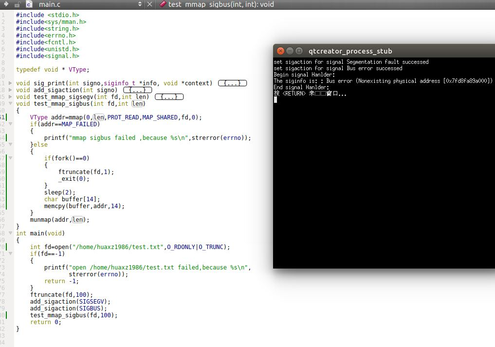

	如果将`test_mmap_sigbus`替换为`test_mmap_sigsegv`，则结果如下图：
	

	注意：如果`open`时，用`O_RDONLY`，则`mmap`时只能用`PROT_READ`。如果用`PROT_WRITE`，则会返回权限错误`Permission denied`。

5. 子进程能够通过`fork`继承存储映射区（因为子进程复制了父进程地址空间，而存储映射区是该地址空间的组成部分）。但是一旦子进程调用了`exec`，则新程序不再拥有存储映射区了

6. `mprotect`函数：修改一个现有映射区的权限：

	```
	#include<sys/mman.h>
	int mprotect(void *addr,size_t len,int prot);
	```
	- 参数：
		- `addr`：存储映射区的地址
		- `len`：存储映射区的长度
		- `prot`：存储映射区的修改后的权限，与`mmap`中的`prot`一样
	- 返回值：
		- 成功： 返回 0
		- 失败： 返回  -1


9. 如果修改的页是通过`MAP_SHARED`	标志映射到地址空间的，那么对内存映射区的修改并不会立即写回到底层文件中。何时写回脏页（即被修改的页）由内核的守护进程决定，决定的依据有两个：
	- 系统负载
	- 用来限制在系统失败事件中的数据损失的配置参数 

	因此，如果只修改了一页中的一个字节，当修改被写回到文件中时，整个页都被写回。

8. 如果共享映射中的页已修改，则可以调用`msync`函数将该页冲洗到底层文件中。它类似于`fsync`，但是作用于存储映射区：

	```
	#include<sys/mman.h>
	int msync(void *addr,size_t len,int flags);
	```
	- 参数：
		- `addr`：存储映射区的地址
		- `len`：存储映射区的长度
		- `flags`：用于控制如何冲洗存储区。下列两个常量二选一
			- `MS_ASYNC`：简单的调试要写的页
			- `MS_SYNC`：在返回之前等待写操作完成
	- 返回值：
		- 成功： 返回 0
		- 失败： 返回  -1

	如果存储映射是私有的，则不修改底层的文件。

9. 当进程终止时，会自动解除存储映射区的映射。你也可以直接调用`munmap`函数来手动解除映射区。

	```
	#include<sys/mman.h>
	int nummap(void* addr,size_t len);
	```
	- 参数：
		- `addr`：存储映射区的地址
		- `len`：存储映射区的长度
	- 返回值：
		- 成功： 返回 0
		- 失败： 返回  -1

	`munmap`并不影响被映射的对象。即调用`munmap`并不会使映射区的内容写到磁盘文件上。
	- 对于`MAP_SHARED`存储映射区的磁盘文件的更新：会在我们将数据写到存储映射区后的某个时刻，由内核虚拟存储算法自动运行
	- 对于`MAP_PRIVATE`存储映射区：对其做出的修改会被丢弃

10. 注意：对于创建存储映射区时使用的文件描述符，如果关闭该描述符，并不会解除映射区