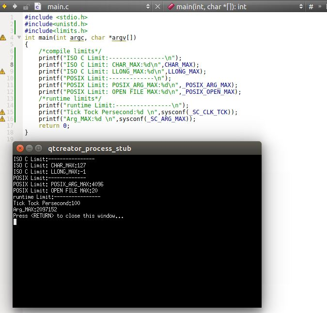

# UNIX 标准及实现

## UNIX 标准

1. ISO C：意图是提供C程序的可移植性，使得它能够适合于大量不同的操作系统。
	- 该标准不仅定义了C程序设计语言的语法和语义，还定义了标准库

2. POSIX(Portable Operating System Interface): 指的是可移植操作系统接口。该标准的目的是提升应用程序在各种UNIX系统环境之间的可移植性。它定义了“符合POSIX”的操作系统必须提供的各种服务。
	- POSIX 包含了 ISO C 标准库函数

3. SUS(Single Unix Specification)：是 POSIX 标准的一个超集，他定义了一些附加接口扩展了 POSIX 规范提供的功能。

4. 上述三个标准只是定义了接口的规范，而具体的实现由厂商来完成。目前UNIX主要有以下实现：
	- SVR4(UNIX System V Release 4)
	- 4.4 BSD(Berkeley Software Distribution)
	- FreeBSD
	- Linux
	- Mac OS X
	- Solaris

## 限制

1. UNIX 系统实现定义了很多幻数和常量。有两种类型的限制是必须的：
	- 编译时限制，如 `short int` 最大值是多少
	- 运行时限制，如文件名最长多少个字符

2. 通常编译时限制可以在头文件中定义；运行时限制则要求进程调用一个函数获得限制值。

3. 某些限制在一个给定的 UNIX 实现中可能是固定的（由头文件定义），在另一个 UNIX 实现中可能是动态的（需要由进程调用一个函数获得限制值）。如文件名的最大字符数在不同的操作系统中，是属于动态/静态限制。因此提供了三种限制：

	- 编译时限制（由头文件给定）
	- 与文件或者目录无关的运行时限制（由 `sysconf`函数给定）
	- 与文件或者目录相关的运行时限制（由 `pathconf`函数以及`fpathconf`函数给定）

4. ISO C 限制：ISO C 所有编译时限制都在头文件 `<limits.h>` 中,如整型大小。
	- 这些限制常量在一个给定的操作系统中不会改变
	- 关于浮点数的最大最小值的编译时限制，在`<float.h>`头文件中定义
	- `<stdio.h>` 头文件还定义了三个编译时限制：
		- `FOPEN_MAX`：可同时打开的标准I/O 流限制的最小数
		- `TMP_MAX`：由`tmpnam`函数产生的唯一文件名的最大个数
		- `FILENAME_MAX`：虽然 ISO C 定义了该常量，但是要避免使用。而要用 POSIX 提供的 `NAME_MAX`和 `PATH_MAX` 常量

5. POSIX 限制：POSIX定义了很多涉及操作系统实现限制的常量。这些常量大多数在`<limits.h>`中，也有的按照具体条件定义在其他头文件中

6. 获取运行时限制：

	```
	#include<unistd.h>
	long sysconf(int name); 
	long pathconf(const char*pathname,int name);
	long fpathconf(int fd,int name); //fd 为文件描述符
	```
	
	- 参数：
		- `name`：指定的限制值。`name`参数是系统定义的常量
			- 以 `_SC_`开头的常量用于 `sysconf`函数
			- 以 `-PC_`开头的常量用于`pathconf`和`fpathconf`函数
		- `pathname`：文件名
		- `fd`：打开文件的文件描述符
	- 返回值：
		- 成功：返回对应的限制值
		- 失败： 返回 -1

	这三个函数失败的情况：

	- 若`name`参数并不是一个合适的常量，则这三个函数返回-1，并将 `errno`设置为 `EINVAL`
	- 有些`name`会返回一个不确定的值，这通过返回 -1 来体现，同时不改变`errno`	

  	 