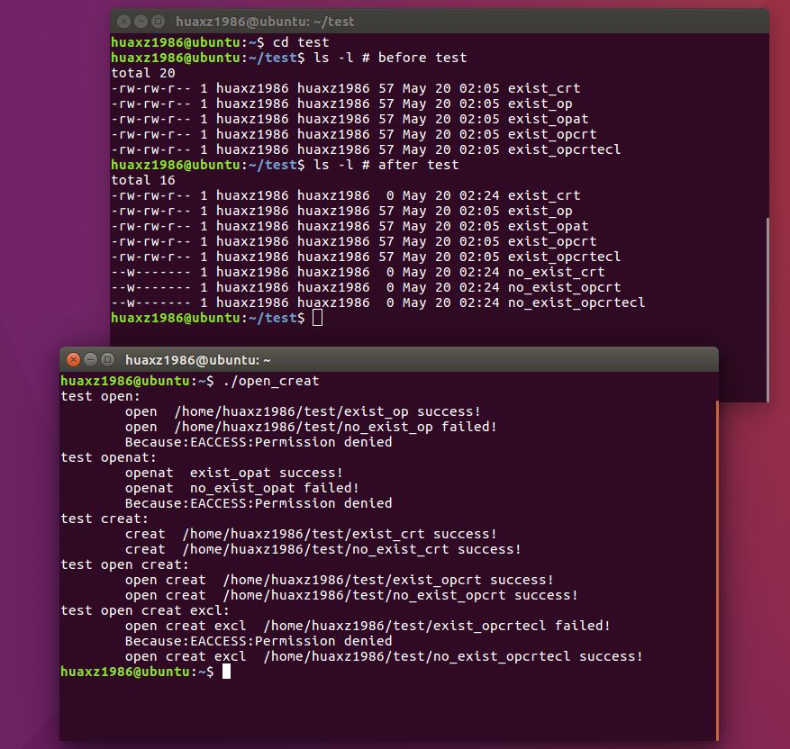
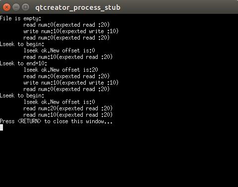
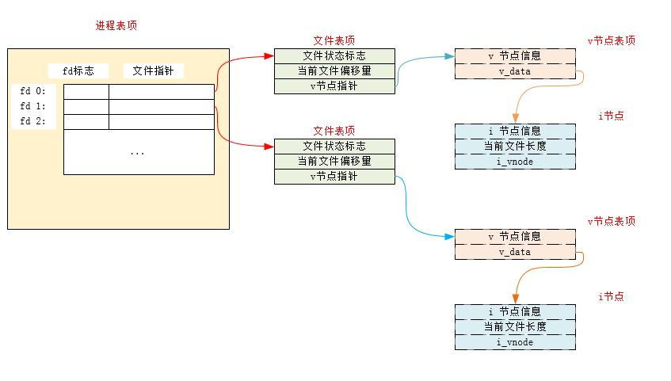
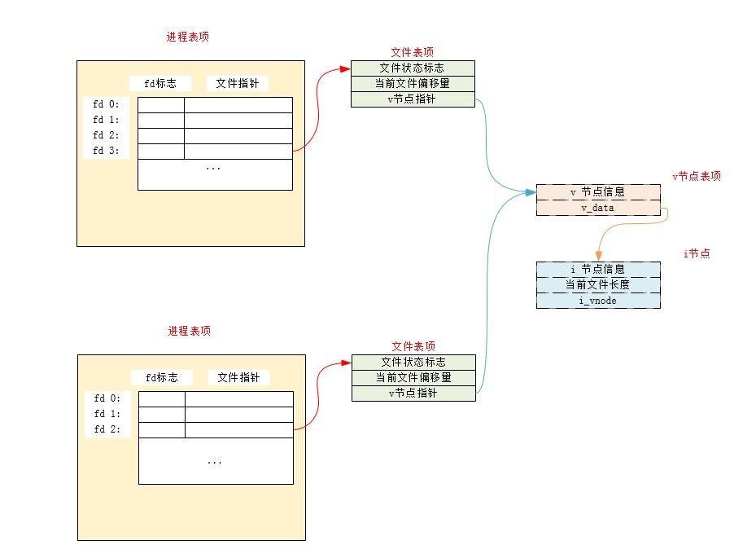
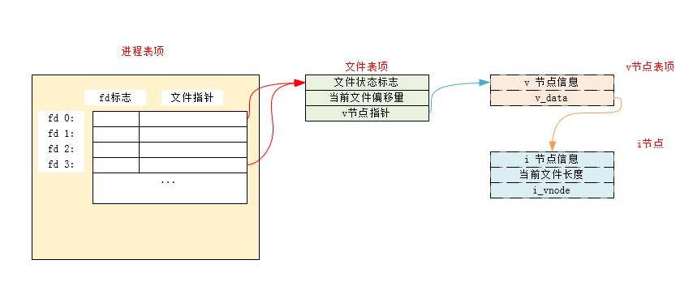
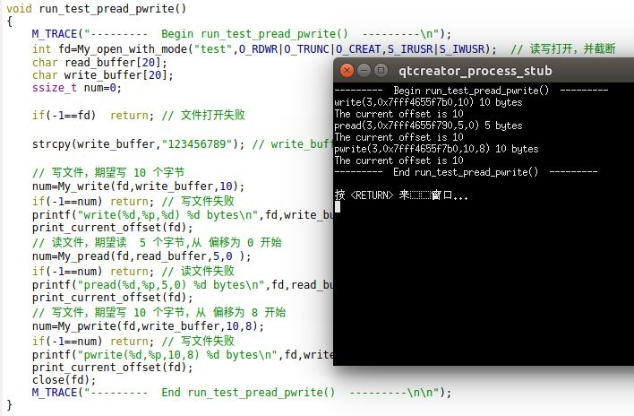
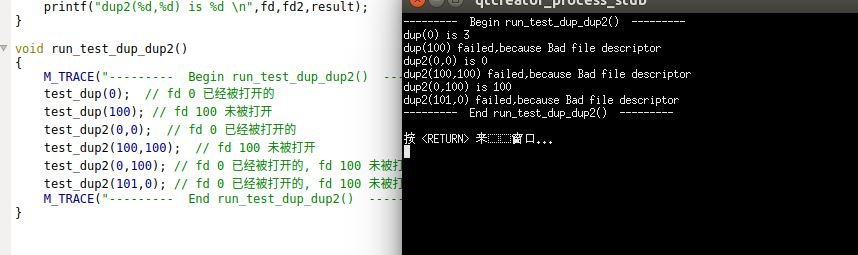
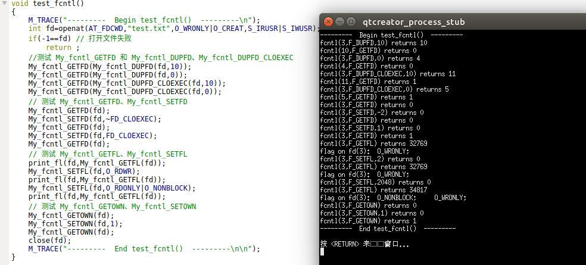
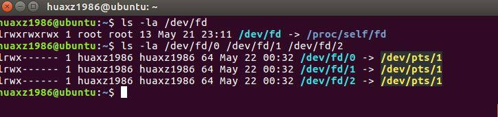

# 文件IO：不带缓冲的IO

## 一、打开、创建文件、关闭文件

1.  文件描述符 ：一个非负整数，范围是`0~OPEN_MAX-1`。内核用它来标识进程正在访问的文件。当进程创建时，默认为它打开了3个文件描述符，它们都链接向终端：
	- 0： 标准输入
	- 1： 标准输出
	- 2： 标准错误输出

	通常我们应该使用`STDIN_FILENO`，`STDOUT_FILENO`和 `STDERR_FILENO`来替代这三个幻数，从而提高可读性。这三个常量位于`<unistd.h>`中。

2. `open`和`openat`函数：打开文件

	```
	#include<fcntl.h>
	int open(const char* path,int oflag,.../*mode_t mode*/);
	int openat(int fd,const char*path,int oflag,.../*mode_t mode */);
	```

	- 参数：
		- `path`:要打开或者创建文件的名字
		- `oflag`：用于指定函数的操作行为：
			- `O_RDONLY`常量：文件只读打开
			- `O_WRONLY`常量：文件只写打开
			- `O_RDWR`常量：文件读、写打开
			- `O_EXEC`常量：只执行打开
			- `O_SEARCH`常量：只搜索打开（应用于目录）。本文涉及的操作系统都没有支持该常量
	
			在上面五个常量中必须指定且只能指定一个。下面的常量是可选的（进行或运行）：
			- `O_APPEND`：每次写时都追加到文件的尾端
			- `O_CLOEXEC`：将`FD_CLOEXEC`常量设置为文件描述符标志
			- `O_CREAT`：若此文件不存在则创建它。在使用此选项时，需要同时说明参数`mode`（指定该文件的访问权限）
			- `O_DIRECTORY`：若`path`引用的不是目录，则出错
			- `O_EXCL`：若同时指定了`O_CREAT`时，且文件已存在则出错。根据此可以测试一个文件是否存在。若不存在则创建此文件。这使得测试和创建两者成为一个原子操作
			- `O_NOCTTY`：若`path`引用的是终端设备，则不将该设备分配作为此进程的控制终端
			- `O_NOFOLLOW`：若`path`引用的是一个符号链接，则出错
			- `O_NONBLOCK`：如果`path`引用的是一个`FIFO`、一个块特殊文件或者一个字符特殊文件，则文件本次打开操作和后续的 I/O 操作设为非阻塞模式。
			- `O_SYNC`：每次 `write` 等待物理 I/O 完成，包括由 `write` 操作引起的文件属性更新所需的 I/O 
			- `O_TRUNC`： 如果此文件存在，且为`O_WRONLY`或者`O_RDWR`成功打开，则将其长度截断为0
			- `O_RSYNC`：使每一个`read`操作等待，直到所有对文件同一部分挂起的写操作都完成。
			- `O_DSYNC`：每次 `write` 等待物理 I/O 完成，但不包括由 `write` 操作引起的文件属性更新所需的 I/O 

		-  `mode`：文件访问权限。文件访问权限常量在 `<sys/stat.h>` 中定义，有下列九个：
			- `S_IRUSR`：用户读
			- `S_IWUSR`：用户写
			- `S_IXUSR`：用户执行
			- `S_IRGRP`：组读
			- `S_IWGRP`：组写			
			- `S_IXGRP`：组执行			
			- `S_IROTH`：其他读
			- `S_IWOTH`：其他写
			- `S_IXOTH`：其他执行 

	- 对于`openat`函数，被打开的文件名由`fd`和`path`共同决定：
		- 如果`path`指定的是绝对路径，此时`fd`被忽略。`openat`等价于`open`
		- 如果`path`指定的是相对路径名，则`fd`是一个目录打开的文件描述符。被打开的文件的绝对路径由该`fd`描述符对应的目录加上`path`组合而成
		- 如果`path`是一个相对路径名，而`fd`是常量`AT_FDCWD`，则`path`相对于当前工作目录。被打开文件在当前工作目录中查找。

	- 返回值：	
		- 成功：返回文件描述符。
		- 失败：返回 -1

	由 `open/openat` 返回的文件描述符一定是最小的未使用的描述符数字。

3. `creat`函数：创建一个新文件

	```
	#include<fcntl.h>
	int creat(const char*path,mode_t mode);
	```

	- 参数：
		- `path`:要创建文件的名字
		- `mode`：指定该文件的访问权限文件访问权限常量在 `<sys/stat.h>` 中定义，有下列九个：
			- `S_IRUSR`：用户读
			- `S_IWUSR`：用户写
			- `S_IXUSR`：用户执行
			- `S_IRGRP`：组读
			- `S_IWGRP`：组写			
			- `S_IXGRP`：组执行			
			- `S_IROTH`：其他读
			- `S_IWOTH`：其他写
			- `S_IXOTH`：其他执行  
	- 返回值：
		- 成功： 返回`O_WRONLY`打开的文件描述符
		- 失败： 返回 -1

	该函数等价于`open(path,O_WRONLY|O_CREAT|O_TRUNC,mode)`。注意：
	- 它以只写方式打开，因此若要读取该文件，则必须先关闭，然后重新以读方式打开。
	- 若文件已存在则将文件截断为0。

4. 打开和创建文件的测试。在 `main`函数中调用`test_open_creat()`函数：

	```
void test_open_creat()
{
    M_TRACE("---------  Begin test_open_creat()  ---------\n");
    My_open("./test1",O_RDWR); // 一个存在的文件
    My_open("./no_such_file1",O_RDWR);  // 一个不存在的文件
    My_open_with_mode("./test2",O_RDWR,S_IRUSR|S_IWUSR); // 一个存在的文件
    My_open_with_mode("./no_such_file2",O_RDWR,S_IRUSR|S_IWUSR); // 一个不存在的文件
    My_open_with_mode("./test3",O_RDWR|O_CREAT,S_IRUSR|S_IWUSR); // 一个存在的文件 ，带 O_CREAT 标志
    My_open_with_mode("./no_such_file3",O_RDWR|O_CREAT,S_IRUSR|S_IWUSR); // 一个不存在的文件 ，带 O_CREAT 标志
    My_open_with_mode("./test4",O_RDWR|O_CREAT|O_EXCL,S_IRUSR|S_IWUSR); // 一个存在的文件 ，带 O_CREAT|O_EXCL 标志
    My_open_with_mode("./no_such_file4",O_RDWR|O_CREAT|O_EXCL,S_IRUSR|S_IWUSR); // 一个不存在的文件，带 O_CREAT|O_EXCL 标志
    My_creat("./test5",S_IRUSR|S_IWUSR); // 一个存在的文件
    My_creat("./no_such_file5",S_IRUSR|S_IWUSR); // 一个不存在的文件
    M_TRACE("---------  End test_open_creat()  ---------\n\n");
}
	```
  	 

	可以看到：

	- 若文件存在：
		- 简单的`open()`成功打开
		- 带`O_CREAT`选项的`open()`成功打开
		- 带`O_CREAT|O_EXCL`选项的`open()`打开失败
		- `creat()`成功打开并且将文件截断为0
	- 若文件不存在：
		- 简单的`open()`打开失败
		- 带`O_CREAT`选项的`open()`成功创建文件，打开并且将文件截断为0
		- 带`O_CREAT|O_EXCL`选项的`open()`成功创建文件，打开并且将文件截断为0
		- `creat()`成功创建文件，打开并且将文件截断为0
	

5. `close`函数：关闭文件

	```
	#include<unistd.h>
	int close(int fd);
	```

	- 参数：
		- `fd`：待关闭文件的文件描述符
	- 返回值：
		- 成功：返回 0
		- 失败：返回 -1

	注意：
	- 进程关闭一个文件会释放它加在该文件上的所有记录锁。
	- 当一个进程终止时，内核会自动关闭它所有的打开的文件。

## 二、定位、读、写文件

1. `lseek`函数：设置打开文件的偏移量

	```
	#include<unistd.h>
	off_t lseek(int fd, off_t offset,int whence);
	```

	- 参数：
		- `fd`：打开的文件的文件描述符
		- `whence`：必须是 `SEEK_SET`、`SEEK_CUR`、`SEEK_END`三个常量之一
		- `offset`：
			- 如果 `whence`是`SEEK_SET`，则将该文件的偏移量设置为距离文件开始处`offset`个字节
			- 如果 `whence` 是 `SEEK_CUR`，则将该文件的偏移量设置为当前值加上`offset`个字节，`offset`可正，可负
			- 如果 `whence` 是 `SEEK_END`，则将该文件的偏移量设置为文件长度加上`offset`个字节，`offset`可正，可负
	- 返回值：
		- 成功： 返回新的文件偏移量
		- 失败：返回 -1

	每个打开的文件都有一个与其关联的“当前文件偏移量”。它通常是个非负整数，用于度量从文件开始处计算的字节数。通常读、写操作都从当前文件偏移量处开始，并且使偏移量增加所读写的字节数。注意：
	- 打开一个文件时，除非指定`O_APPEND`选项，否则系统默认将该偏移量设为0
	- 如果文件描述符指定的是一个管道、FIFO、或者网络套接字，则无法设定当前文件偏移量，则`lseek`将返回 -1 ，并且将 `errno` 设置为 `ESPIPE`。
	- 对于普通文件，其当前文件偏移量必须是非负值。但是某些设备运行负的偏移量出现。因此比较`lseek`的结果时，不能根据它小于0 就认为出错。要根据是否等于 -1 来判断是否出错。
	- `lseek` 并不会引起任何 I/O 操作，`lseek`仅仅将当前文件的偏移量记录在内核中。
	- 当前文件偏移量可以大于文件的当前长度。此时对该文件的下一次写操作将家常该文件，并且在文件中构成一个空洞。空洞中的内容位于文件中但是没有被写过，其字节被读取时都被读为0
	> 文件中的空洞并不要求在磁盘上占据存储区。具体处理方式与操作系统有关

2. `read`函数：读取文件内容

	```
	#include<unistd.h>
	ssize_t read(int fd,void *buf,size_t nbytes);
	```

	- 参数：
		- `fd`：打开的文件的文件描述符
		- `buf`：存放读取内容的缓冲区的地址（由程序员手动分配）
		- `nbytes`：期望读到的字节数
	- 返回值：
		- 成功：返回读到的字节数，若已到文件尾则返回 0
		- 失败：返回 -1

	读操作从文件的当前偏移量开始，在成功返回之前，文件的当前偏移量会增加实际读到的字节数。有多种情况可能导致实际读到的字节数少于期望读到的字节数：
	- 读普通文件时，在读到期望字节数之前到达了文件尾端
	- 当从终端设备读时，通常一次最多读取一行（终端默认是行缓冲的）
	- 当从网络读时，网络中的缓存机制可能造成返回值小于期望读到的字节数
	- 当从管道或者` FIFO `读时，若管道包含的字节少于所需的数量，则 `read`只返回实际可用的字节数
	- 当从某些面向记录的设备（如磁带）中读取时，一次最多返回一条记录
	- 当一个信号造成中断，而已读了部分数据时。

3. `write`函数：想文件写数据

	```
	#include<unistd.h>
	ssize_t write(int fd,const void *buf,size_t nbytes);
	```

	- 参数：
		- `fd`：打开的文件的文件描述符
		- `buf`：存放待写的数据内容的缓冲区的地址（由程序员手动分配）
		- `nbytes`：期望写入文件的字节数
	- 返回值：
		- 成功：返回已写的字节数
		- 失败：返回 -1

	`write`的返回值通常都是与`nbytes`相同。否则表示出错。`write`出错的一个常见原因是磁盘写满，或者超过了一个给定进行的文件长度限制

	对于普通文件，写操作从文件的当前偏移量处开始。如果打开文件时指定了`O_APPEND`选项，则每次写操作之前，都会将文件偏移量设置在文件的当前结尾处。在一次成功写之后，该文件偏移量增加实际写的字节数。

4. 测试`lseek,read,write`。在 `main`函数中调用 `test_lseek_read_write`函数：

	```
void test_lseek_read_write()
{
    M_TRACE("---------  Begin test_lseek_read_write()  ---------\n");
    int fd=My_open_with_mode("test",O_RDWR|O_TRUNC|O_CREAT,S_IRUSR|S_IWUSR);  // 读写打开，并截断
    if(-1==fd)  return; // 文件打开失败
    char read_buffer[20];
    char write_buffer[10];

    strcpy(write_buffer,"123456789"); // write_buffer 填充数字

    My_read(fd,read_buffer,20); // 读文件，期望读 20 个字节
    My_write(fd,write_buffer,10);// 写文件，期望写 10 个字节
    My_read(fd,read_buffer,20);// 读文件，期望读 20 个字节
    My_lseek(fd,0,SEEK_SET);// 定位文件到头部
    My_read(fd,read_buffer,20);// 读文件，期望读 20 个字节
    My_lseek(fd,10,SEEK_END);// 定位文件到尾部之后的 10 个字节
    My_read(fd,read_buffer,20);// 读文件，期望读 20 个字节
    My_write(fd,write_buffer,10);// 写文件，期望写 10 个字节
    My_read(fd,read_buffer,20);// 读文件，期望读 20 个字节
    My_lseek(fd,0,SEEK_SET);// 定位文件到头部
    My_read(fd,read_buffer,20);// 读文件，期望读 20 个字节
    My_read(fd,read_buffer,20);// 读文件，期望读 20 个字节
    close(fd);
    M_TRACE("---------  End test_lseek_read_write()  ---------\n\n");

}
	```
 	  

	测试序列为：
	- 开始文件为空，所以读取20个字节的`read`只读取0
	- 写入文件10个字节
	- 读取文件。此时读和写共享一个当前文件偏移。而且当前文件偏移被`write`置于文件结尾。此时读取0个字节
	- 执行`lseek`将当前文件偏移量重置到文件开头，返回0（新的文件偏移量）
	- 读取文件，只能读取10个字节（因为文件此时就10个字节）
	- 执行`lseek`将文件偏移量放到文件末尾之后的10个字节，返回20（新的文件偏移量）
	- 读取文件。此时当前文件偏移被置于文件结尾。此时读取0个字节
	- 写入文件10个字节
	- 读取文件。此时当前文件偏移被`write`置于文件结尾。此时读取0个字节
	- 执行`lseek`将当前文件偏移量重置到文件开头，返回0（新的文件偏移量）
	- 读取文件，读取20个字节（因为文件结尾的偏移是30个字节）。空洞部分读取的结果都是 0 
	- 读取文件，只能读取10个字节（因为文件结尾的偏移是30个字节）


## 三、  原子操作、同步、复制、修改文件描述符

1. 内核使用三种数据结构描述打开文件。它们之间的关系决定了一个进程与另一个进程在打开的文件之间的相互影响。
	- 内核为每个进程分配一个进程表项（所有进程表项构成进程表），进程表中都有一个打开的文件描述符表。每个文件描述符占用一项，其内容为：
		- 文件描述符标志
		- 指向一个文件表项的指针
	- 内核为每个打开的文件分配一个文件表项（所有的文件表项构成文件表）。每个文件表项的内容包括：
		- 文件状态标志（读、写、添写、同步和阻塞等）
		- 当前文件偏移量
		- 指向该文件 v 结点表项的指针
	- 每个打开的文件或者设备都有一个 v 结点结构。 v 结点结构的内容包括： 
		- 文件类型和对此文件进行各种操作函数的指针。
		- 对于大多数文件， v 结点还包含了该文件的 i 结点。

	这些信息都是在打开文件时从磁盘读入内存的。如 i 结点包含了文件的所有者、文件长度、指向文件实际数据在磁盘上所在位置的指针等等。 v 结点结构和 i 结点结构实际上代表了文件的实体。

 	  

	现在假设进程 A 打开文件 `file1`，返回文件描述符 3；进程 B 也打开文件 `file2`，返回文件描述符 2：

	

	- 内核在文件表上新增两个表项：
		- 这两个文件表项指向同一个 v 结点表项
		- 进程 A 、B 各自的文件描述符表项分别指向这两个文件表项；
	- 对文件的操作结果：
		- 进程 A 每次 `write` 之后，进程 A 对应的文件表项的当前文件偏移量即增加所写入的字节数。
			- 若这导致当前文件偏移量超过当前文件长度，则修改 i 节点的当前文件长度，设为当前文件偏移量
		- 如果进程 B 用 `O_APPEND`标志打开一个文件，在相应标志也设置到进程 B 对于的文件表项的文件状态标志中。
			- 每次进程 B 对具有追加写标志的文件执行写操作时，文件表项中的当前文件偏移量首先被置为 i 结点中的文件长度。
		- 若进程 B 用 `lseek` 定位到文件当前的尾端，则进程 B 对应的文件表项的当前文件偏移量设置为 i 结点中的当前长度
		- `lseek` 函数只是修改文件表项中的当前文件偏移量，不进行任何 I/O 操作
	
	
 	

	可能一个进程中有多个文件描述符指向同一个文件表项。
  	 
 

2. 原子操作：
	- 追加一个文件时，不能通过`lseek`到末尾然后`write`。要用`O_APPEND`选项打开文件，然后直接`write`。
		- 通过`lseek`到末尾然后`write`时，如果多个进程同时执行这两个操作，则会引起竞争条件
		- 通过 `O_APPEND`选项打开文件，然后直接`write`时，内核每一次在写操作之前，都会将进程的当前偏移量设置到文件的末尾，于是就不需要执行`lseek`定位操作
	- `pread/pwrite`可以执行原子性的定位读/定位写
	- `O_CREAT|O_EXCL`选项打开文件时，可以原子性的检查文件是否存在和创建文件这两个操作。

3. `pread/pwrite`：原子定位读和原子定位写

	```
	#include<unistd.h>
	ssize_t pread(int fd,void*buf,size_t nbytes,off_t offset);
	ssize_t pwrite(int fd,const void*buf,size_t nbytes,off_t offset);
	```

	- 参数：
		- `fd`：打开的文件描述符
		- `buf`：读出数据存放的缓冲区/ 写到文件的数据的缓冲区
		- `nbytes`：预期读出/写入文件的字节数
		- `offset`：从文件指定偏移量开始执行`read/write`
	- 返回：
		- 成功：读到的字节数/已写的字节数
		- 失败： -1

	调用`pread`相当于先调用`lseek`再调用`read`.但是调用`pread`时，无法中断其定位和读操作，并且不更新当前文件偏移量；调用`pwrite`相当于先调用`lseek`再调用`write`.但是调用`pwrite`时，无法中断其定位和写操作，并且不更新当前文件偏移量

	示例：在 `main`函数中调用 `test_pread_pwrite` 函数：

	```
void test_pread_pwrite()
{
    M_TRACE("---------  Begin test_pread_pwrite()  ---------\n");
    int fd=My_open_with_mode("test",O_RDWR|O_TRUNC|O_CREAT,S_IRUSR|S_IWUSR);  // 读写打开，并截断
    if(-1==fd)  return; // 文件打开失败
    char read_buffer[20];
    char write_buffer[20];
    strcpy(write_buffer,"123456789"); // write_buffer 填充数字

    // 写文件，期望写 10 个字节
    My_write(fd,write_buffer,10);
    print_current_offset(fd);
    My_pread(fd,read_buffer,5,0 );// 读文件，期望读  5 个字节,从 偏移为 0 开始
    print_current_offset(fd);
    My_pwrite(fd,write_buffer,10,8);// 写文件，期望写 10 个字节，从 偏移为 8 开始
    print_current_offset(fd);
    close(fd);
    M_TRACE("---------  End test_pread_pwrite()  ---------\n\n");
}
	```
 	  

4. `dup/dup2`：复制一个现有的文件描述符：

	```
	#include<unistd.h>
	int dup(int fd);
	int dup2(int fd,int fd2);
	```

	- 参数：
		- `fd`：被复制的文件描述符（已被打开）
		- `fd2`：指定的新的文件描述符（待生成）
	- 返回值：
		- 成功： 返回新的文件描述符
		- 失败： 返回 -1

  	

	对于`dup`函数，返回的新的文件描述符一定是当前可用的文件描述符中最小的数字。对于`dup2`函数：
	- 如果 `fd2`已经是被打开的文件描述符且不等于`fd`，则先将其关闭，然后再打开（<font color='red'>注意关闭再打开是一个原子操作</font>）
	- 如果 `fd2`等于`fd`，则直接返回`fd2`（也等于`fd`），而不作任何操作

	任何情况下，这个返回的新的文明描述符与参数`fd`共享同一个文件表项（因此文件状态标志以及文件偏移量都会共享）。	任何情况下，这个返回的新的文明描述符的`close-on-exec`标志总是被清除

	示例：在 `main`函数中调用`test_dup_dup2`函数:

	```
void test_dup_dup2()
{
    M_TRACE("---------  Begin test_dup_dup2()  ---------\n");
    My_dup(0);  // fd 0 已经被打开的
    My_dup(100); // fd 100 未被打开
    My_dup2(0,0);  // fd 0 已经被打开的
    My_dup2(100,100);  // fd 100 未被打开
    My_dup2(0,100); // fd 0 已经被打开的, fd 100 未被打开
    My_dup2(101,0); // fd 0 已经被打开的, fd 100 未被打开
    M_TRACE("---------  End test_dup_dup2()  ---------\n\n");
}

	```

  	 

5. UNIX操作系统在内核中设有缓冲区，大多数磁盘 I/O 都通过缓冲区进行。当我们想文件写入数据时，内核通常都首先将数据复制到缓冲区中，然后排入队列，晚些时候再写入磁盘。这种方式称为延迟写。
	- 当内核需要重用缓冲区来存方其他数据时，它会把所有延迟写的数据库写入磁盘
	- 你也可以调用下列函数来显式的将延迟写的数据库写入磁盘

	```
	#include<unistd.h>
	int fsync(int fd);
	int fdatasync(int fd);
	void sync(void);
	```

	- 参数（前两个函数）：
		- `fd`：指定的打开的文件描述符

	- 返回值（前两个函数）：
		-  成功：返回 0
		- 失败： 返回 -1

	区别：
	- `sync`：将所有修改过的块缓冲区排入写队列，然后返回，它并不等待时机写磁盘结束
	- `fsync`：只对由`fd`指定的单个文件起作用，等待写磁盘操作结束才返回
	- `fdatasync`：只对由`fd`指定的单个文件起作用，等待写磁盘操作结束才返回，但是它只影响文件的数据部分（`fsync`会同步更新文件的属性）
	> `update` 守护进程会周期性的调用`sync`函数。命令`sync`也会调用`sync`函数

6. `fcntl`函数：改变已经打开的文件的属性

	```
	#include<fcntl.h>
	int fcntl(int fd,int cmd,.../* int arg */);
	```

	- 参数：
		- `fd`：已打开文件的描述符
		- `cmd`：有下列若干种：
			- `F_DUPFD`常量：复制文件描述符 `fd`。新文件描述符作为函数值返回。它是尚未打开的文件描述符中大于或等于`arg`中的最小值。新文件描述符与`fd`共享同一个文件表项，但是新描述符有自己的一套文件描述符标志，其中`FD_CLOEXEC`文件描述符标志被清除
			- `F_DUPFD_CLOEXEC`常量：复制文件描述符。新文件描述符作为函数值返回。它是尚未打开的个描述符中大于或等于`arg`中的最小值。新文件描述符与`fd`共享同一个文件表项，但是新描述符有自己的一套文件描述符标志，其中`FD_CLOEXEC`文件描述符标志被设置
			- `F_GETFD`常量：对应于`fd`的文件描述符标志作为函数值返回。当前只定义了一个文件描述符标志`FD_CLOEXEC`
			- `F_SETFD`常量：设置`fd`的文件描述符标志为`arg`
			- `F_GETFL`常量：返回`fd`的文件状态标志。文件状态标志必须首先用屏蔽字 `O_ACCMODE` 取得访问方式位，然后与`O_RDONLY`、`O_WRONLY`、`O_RDWR`、`O_EXEC`、`O_SEARCH`比较（这5个值互斥，且并不是各占1位）。剩下的还有：`O_APPEND`、`O_NONBLOCK`、`O_SYNC`
		、`O_DSYNC`、`O_RSYNC`、`F_ASYNC`、`O_ASYNC`
			- `F_SETFL`常量：设置`fd`的文件状态标志为 `arg`。可以更改的标志是：
	  `O_APPEND`、`O_NONBLOCK`、`O_SYNC`、`O_DSYNC`、`O_RSYNC`、`F_ASYNC`、`O_ASYNC`
			- `F_GETOWN`常量：获取当前接收 `SIGIO`和`SIGURG`信号的进程 `ID`或者进程组 `ID`
			- `F_SETOWN`常量：设置当前接收 `SIGIO`和`SIGURG`信号的进程 `ID`或者进程组 `ID`为`arg`。若 `arg`是个正值，则设定进程 `ID`；若 `arg`是个负值，则设定进程组`ID`	
			- `F_GETLK`、`F_SETLK`、`F_SETLKW`：获取/设置文件记录锁
		- `arg`：依赖于具体的命令 

	- 返回值：
		- 成功： 依赖于具体的命令
		- 失败： 返回 -1

	示例：在 `main`函数中调用`test_fcntl()`函数:
	
	```
void test_fcntl()
{
    M_TRACE("---------  Begin test_fcntl()  ---------\n");
    int fd=openat(AT_FDCWD,"test.txt",O_WRONLY|O_CREAT,S_IRUSR|S_IWUSR);;
    if(-1==fd) // 打开文件失败
        return ;
    //测试 My_fcntl_GETFD 和 My_fcntl_DUPFD、My_fcntl_DUPFD_CLOEXEC
    My_fcntl_GETFD(My_fcntl_DUPFD(fd,10));
    My_fcntl_GETFD(My_fcntl_DUPFD(fd,0));
    My_fcntl_GETFD(My_fcntl_DUPFD_CLOEXEC(fd,10));
    My_fcntl_GETFD(My_fcntl_DUPFD_CLOEXEC(fd,0));
    // 测试 My_fcntl_GETFD、My_fcntl_SETFD
    My_fcntl_GETFD(fd);
    My_fcntl_SETFD(fd,~FD_CLOEXEC);
    My_fcntl_GETFD(fd);
    My_fcntl_SETFD(fd,FD_CLOEXEC);
    My_fcntl_GETFD(fd);
    // 测试 My_fcntl_GETFL、My_fcntl_SETFL
    print_fl(fd,My_fcntl_GETFL(fd));
    My_fcntl_SETFL(fd,O_RDWR);
    print_fl(fd,My_fcntl_GETFL(fd));
    My_fcntl_SETFL(fd,O_RDONLY|O_NONBLOCK);
    print_fl(fd,My_fcntl_GETFL(fd));
    // 测试 My_fcntl_GETOWN、My_fcntl_SETOWN
    My_fcntl_GETOWN(fd);
    My_fcntl_SETOWN(fd,1);
    My_fcntl_GETOWN(fd);
    close(fd);
    M_TRACE("---------  End test_fcntl()  ---------\n\n");
}
	```

 	  

	注意：
	- Linux 下，不支持文件状态标志： `F_EXEC与`， `F_SEARCH`
	- `(result&O_ACCMODE)==O_RDONLY` 表达式中， `&`优先级较低
	- `F_SETFL`命令：当文件读打开时，你无法将文件状态标志修改为`O_WRONLY`、`O_WRWR`这两种中任何一个。你只能修改：`O_APPEND`、`O_NONBLOCK`、`O_SYNC`、`O_DSYNC`、`O_RSYNC`、`F_ASYNC`、`O_ASYNC`等标志

7. `/dev/fd`目录：该目录下是名为`0、1、2`等的文件。打开文件`/dev/fd/n`等效于复制描述符（假定描述符`n`是打开的）
	- `fd=open("/dev/fd/0",mod)`：`fd`和文件描述符`0`共享同一个文件表项。
	- 大多数系统忽略`mod`参数
	- 在 Linux 操作系统上， `/dev/fd/0`是个例外，它是个底层物理文件的符号链接。因此在它上面调用`creat` 会导致底层文件被截断

  	 