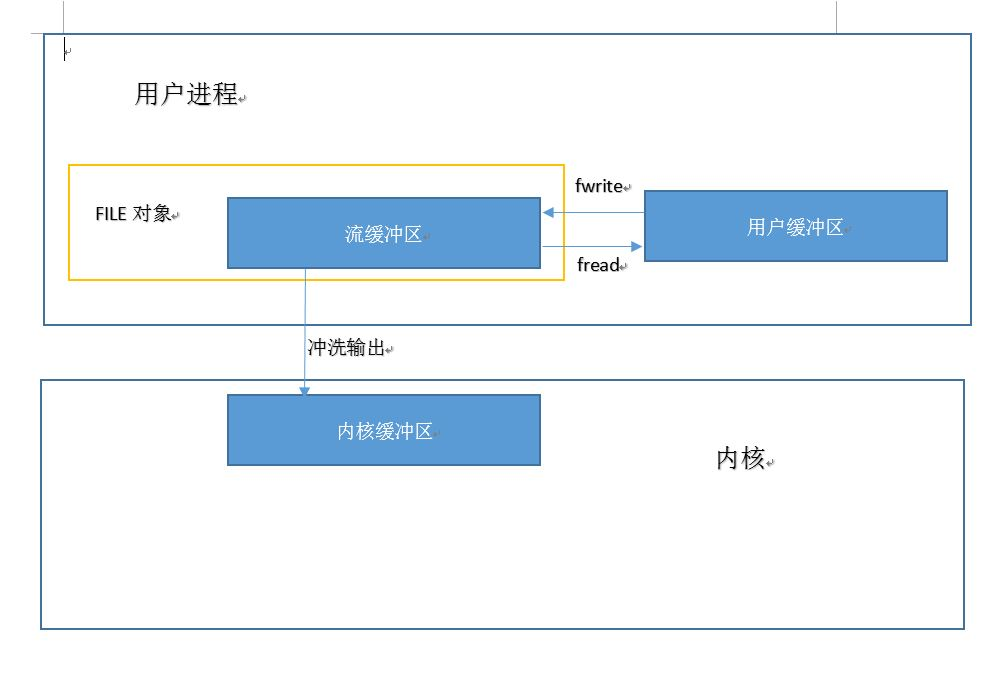
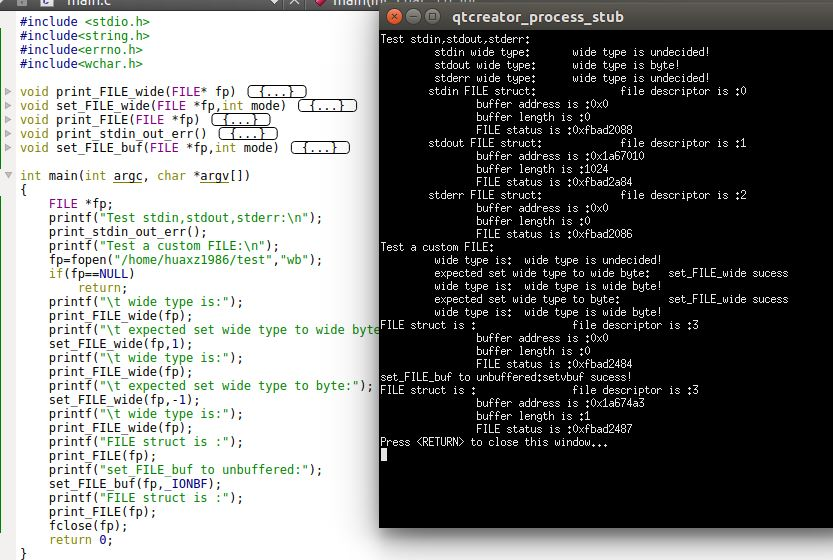
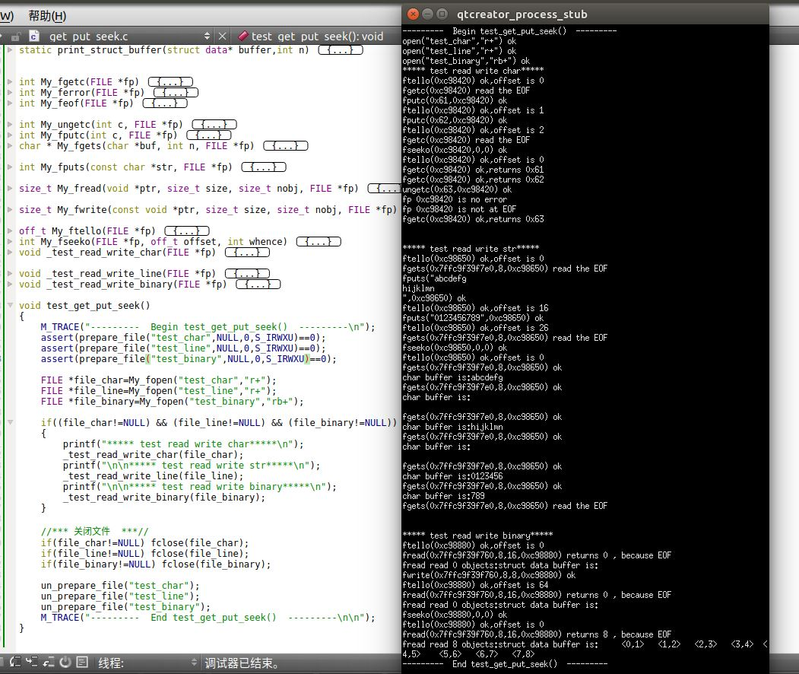
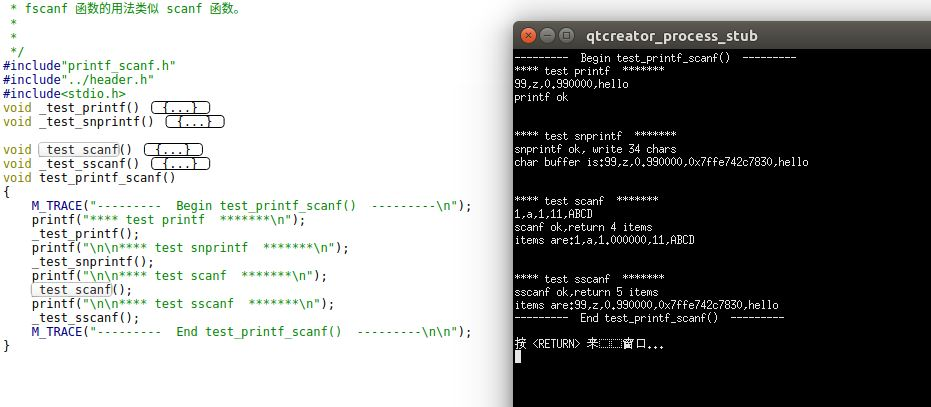
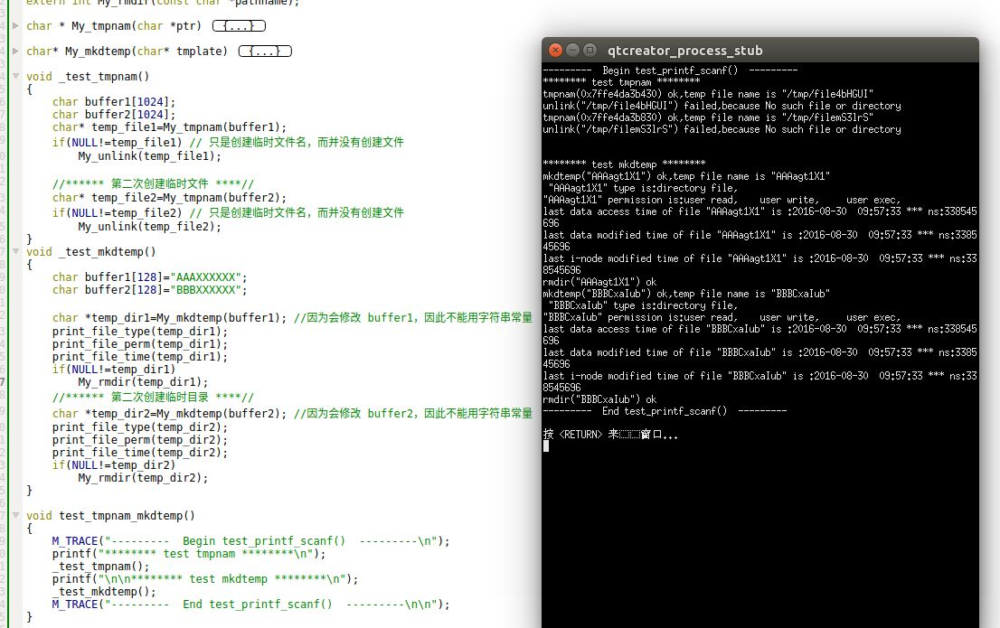
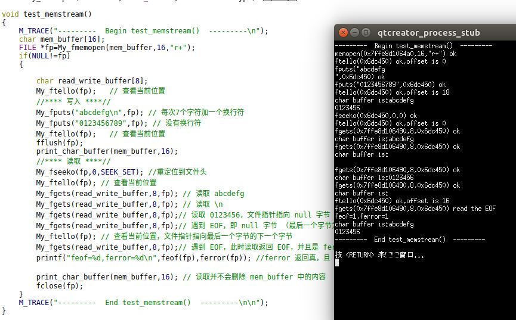

# 标准IO库

## 流和 FILE对象
1. 标准IO库与文件IO区别：
	- 标准IO库处理很多细节，如缓冲区分片、以优化的块长度执行IO等。
	- 文件IO函数都是围绕文件描述符进行。首先打开一个文件，返回一个文件描述符；后续的文件IO操作都使用该文件描述符
	- 标准IO库是围绕流进行的。当用标准IO库打开或者创建一个文件时，就有一个内建的流与之相关联
	> 标准IO库的函数很多都是以 `f`开头，如`fopen`、`fclose`

2. 对于ASCII字符集，一个字符用一个字节表示；对于国际字符集，一个字符可以用多个字节表示。
	- 标准IO文件流可用于单字节或者多字节字符集。流的定向决定了所处理的字符是单字节还是多字节的。
	- 当一个流最初被创建时，它并没有定向。
		- 若在未定向的流上使用一个多字节IO函数，则将该流的定向设置为宽定向的（即处理多字节）
		- 若在未定向的流上使用一个单字节IO函数，则将该流的定向设置为字节定向的（即处理单字节）
	- 只有两个函数可以改变流的定向
		- `freopen`函数清除一个流的定向
		- `fwide`函数设置流的定向

3. `fwide`函数：设置流的定向

	```
	#include<stdio.h>
	#include<wchar.h>
	int fwide(FILE *fp,int mode);
	```
	- 参数：
		- `fp`：`FILE`文件对象的指针
		- `mode`：流的定向模式。
			- 如果`mode`是负数，则函数试图使指定的流为字节定向（并不保证修改成功，因为`fwide`并不改变已定向流的定向）
			- 如果`mode`是正数，则函数试图使指定的流为宽定向的（并不保证修改成功，因为`fwide`并不改变已定向流的定向）
			- 如果`mode`为0，则函数不试图设置流的定向，而直接返回该流定向的值
	- 返回值：
		- 若流是宽定向的，返回正值
		- 若流是字节定向的，返回负值
		- 若流是未定向的，返回0
	> 这里并没有函数失败的情况

	注意：
	- `fwide`并不改变已定向流的定向。
	- 如果`fp`是无效流，由于`fwide`从返回值无法得知函数执行成功还是失败。那么我们必须采用这个方法：首先在调用`fwide`之前清除`errno`。然后在`fwide`之后检查`errno`的值。通过`errno`来检测`fwide`执行成功还是失败。

4. `FILE`指针：当使用`fopen`函数打开一个流时，它返回一个执行`FILE`对象的指针。该对象通常是一个结构，包含了标准IO库为管理该流所需要的所有信息，包括：
	- 用于实际IO的文件描述符
	- 指向用于该流缓冲区的指针
	- 该流缓冲区的长度
	- 当前在缓冲区中的字符数
	- 出错标志

	应用程序没必要检验`FILE`对象，只需要将`FILE`指针作为参数传递给每个标准IO函数。

	 

5. 操作系统对每个进程与定义了3个流，并且这3个流可以自动地被进程使用，他们都是定义在`<stdio.h>`中：
	- 标准输入：预定义的文件指针为`stdin`，它内部的文件描述符就是`STDIN_FILENO`
	- 标准输出：预定义的文件指针为`stdout`，它内部的文件描述符就是`STDOUT_FILENO`
	- 标准错误：预定义的文件指针为`stderr`，它内部的文件描述符就是`STDERR_FILENO`

6. 标准IO库提供缓冲的目的是：尽量减少使用`read`和`write`调用的次数。标准IO库对每个IO流自动地进行缓冲管理，从而避免了程序员需要手动管理这一点带来的麻烦。

	标准IO库提供了三种类型的缓冲：
	- 全缓冲：此时在标准IO缓冲区被填满后，标准IO库才进行实际的IO操作。
	- 行缓冲：此时当输入和输出中遇到换行符时，标准IO库执行实际的IO操作。但是注意：
		- 只要填满了缓冲区，即使还没有写一个换行符，也立即进行IO操作
		- 任何时候只要通过标准IO库，从一个不带缓冲的流或者一个行缓冲的流得到输入数据，则会冲洗所有行缓冲输出流。(<font color='red'>即要缓冲输入，先冲洗输出缓冲</font>)
	- 不带缓冲：标准IO库不对字符进行缓冲存储。此时任何IO都立即执行实际的IO操作。

	另外：
	- 在一个流上执行第一次IO操作时，相关标准的IO函数通常调用 `malloc`获取使用的缓冲区
	- 缓冲区可以由标准的IO操作自动地冲洗（如，当填满一个缓冲区时），也可以手动调用`fflush`函数冲洗一个流。

7. ISO C 要求下来缓冲特征：
	- 当且仅当标准输入和标准输出并不指向交互式设备时，他们才是全缓冲的
	- 标准错误绝不会是全缓冲的。
	
	很多操作系统默认使用下列类型的缓冲：
	- 标准错误`stderr`时不带缓冲的
	- 标准输入`stdin`和输出`stdout`：若是指向终端设备的流，则是行缓冲的；否则是全缓冲的

8. `setbuf/setvbuf`函数：设置流的缓冲类型
	
	```
	#include<stdio.h>
	void setbuf(FILE *restrict fp,char *restrict buf);
	int setvbuf(FILE *restrict fp,char* restrict buf,int mode,size_t size);
	```
	- 参数：
		- `fp`：被打开的文件对象的指针
		- `buf`：一个缓冲区的指针。缓冲区长度必须为`BUFSIZ`常量（该常量定义在`<stdio.h>`中）。
			- 如果`buf`为`NULL`，则是关闭缓冲
			- 如果`buf`非`NULL`，则通常设定该流为全缓冲的。但若该流与一个设备终端相关，则设为行缓冲的
	
		对于`setvbuf`函数：
		- `buf`：一个缓冲区的指针。缓冲区长度为`size`。
			- 若`buf`为`NULL`，且`mode`为`_IONBF`：则该流为不带缓冲的。因为此时忽略`buf`和`size`参数
			- 若`buf`为`NULL`，且`mode`不是`_IONBF`：则标准IO库将自动为该流分片合适长度的缓冲区（即`BUFSIZE`长度），然后设定该流为指定的`mode`
		- `mode`：指定缓冲类型。可以为：
			- `_IOFBF`：全缓冲。
			- `_IOLBF`：行缓冲
			- `_IONBF`：不带缓冲。此时忽略`buf`和`size`参数
		- `size`：缓冲的长度
	- 返回值：
		- 成功： 返回0
		- 失败： 返回非0(<font color='red'>并不是-1</font>)

	注意：
	- 如果在一个函数内分配一个自动变量类型的标准IO缓冲区，则从该函数返回之前，必须关闭流。因此自动变量是栈上分配，函数返回之后自动变量被销毁
	- 某些操作系统将缓冲区的一部分存放它自己的管理操作信息，因此可以存放在缓冲区中的实际数据字节数将少于`size`
	- 通常推荐利用操作系统自动选择缓冲区长度并自动分配缓冲区。在这种情况下若关闭此流，则标准IO库会自动释放缓冲区

9. `fflush`函数：手动冲洗一个流

	```
	#include<stdio.h>
	int fflush(FILE *fp);
	```
	- 参数：
		- `fp`：被打开的文件对象的指针
	
	- 返回值：
		- 成功：返回0
		- 失败：返回`EOF` (<font color='red'>并不是-1</font>)

	该函数会使得该流所有未写的数据都被传送至内核。当`fp`为`NULL`时，此函数将导致所有输出流被冲洗。
	> - 冲洗是双向的：输出流 ---> 内核 ---> 磁盘或者终端； 输入流---> 用户缓冲区
	>-  冲洗并不是立即写到磁盘文件中。冲洗只是负责数据传到内核

## 打开关闭流

1. `fopen/freopen/fdopen`函数：打开标准IO流
	
	```
	#include<stdio.h>
	FILE *fopen(const char*restrict pathname,const char*restrict type);
	FILE *freopen(const char*restrict pathname,const char*restrict type,\
		FILE *restrict fp);
	FILE *fdopen(int fd,const char*type);
	```

	- 参数：

		- `type`：指定对该IO流的读写方式：
			- `"r"`或者`"rb"`：为读打开
			- `"w"`或者`"wb"`：写打开。若文件存在则把文件截断为0长；若文件不存在则创建然后写
			- `"a"`或者`"ab"`：追加写打开；若文件存在每次都定位到文件末尾；若文件不存在则创建然后写
			- `"r+"`或者`"r+b"`或者`"rb+"`：为读和写打开
			- `"w+"`或者`"w+b"`或者`"wb+"`：若文件存在则文件截断为0然后读写；若文件不存在则创建然后读写
			- `"a+"`或者`"a+b"`或者`"ab+"`：若文件存在则每次都定位到文件末尾然后读写；若文件不存在则创建然后读写
			> - 其中`b`用于区分二进制文件和文本文件。但是由于`UNIX`内核并不区分这两种文件，所以在UNIX环境中指定`b`并没有什么卵用
			> - 创建文件时，无法指定文件访问权限位。POSIX默认要求为：`S_IRUSR|S_IWUSR|S_IRGRP|S_IWGRP|S_IROTH|S_IWOTH`

		对于 `fopen`函数：
		- `pathname`：待打开文件的路径名		
		对于 `freopen`函数：
		- `pathname`：待打开文件的路径名
		- `fp`：在指定的流上打开文件。若`fp`已经打开，则先关闭该流；若`fp`已经定向，则清除该定向。

		对于 `fdopen`函数：
		- `fd`：打开文件的文件描述符
		- 对于`fopen`，`type`意义稍微有点区别。因为该描述符已经被打开，所以`fdopen`为写而打开并不截断该文件。另外该文件既然被打开并返回一个文件描述符，则它一定存在。因此标准 IO追加写方式也不能创建文件
		
	- 返回值：
		- 成功： 返回文件指针
		- 失败： 返回`NULL`

	这几个函数的常见用途：
	- `fopen`常用于打开一个指定的文件，返回一个文件指针
	- `freopen`常用于将一个指定的文件打开为一个预定义的流（标准输入、标准输出或者标准错误）
	- `fdopen`常用于将文件描述符包装成一个标准IO流。因为某些特殊类型的文件（如管道、`socket`文件）不能用`fopen`打开，必须先获取文件描述符，然后对文件描述符调用`fdopen`。

	注意：当以读和写类型打开一个文件时(`type`中带`+`号的类型)，有下列限制：
	- 如果写操作后面没有`fflush,fseek,fsetpos,rewind`操作之一，则写操作后面不能紧跟读操作
	- 如果读操作后面没有`fseek,fsetpos,rewind`操作之一，也没有到达文件末尾，则在读操作之后不能紧跟写操作

	注意：按照系统默认，流被打开时是全缓冲的。但是如果流引用的是终端设备，则安装系统默认，流被打开时是行缓冲的。

2. `fclose`：关闭一个打开的流

	```
	#include<stdio.h>
	int fclose(FILE *fp);
	```
	- 参数：
		- `fp`：待关闭的文件指针
	- 返回值：
		- 成功： 返回 0
		- 失败： 返回 -1

	在该文件被关闭之前：
	- `fclose`会自动冲洗缓冲中的输出数据
	- 缓冲区中的输入数据被丢弃
	- 若该缓冲区是标准IO库自动分配的，则释放此缓冲区

	当一个进程正常终止时（直接调用`exit`函数，或者从`main`函数返回）：
	- 所有带未写缓存数据的标准IO流都被冲洗
	- 所有打开的标准IO流都被关闭

3. 示例:在 `main`函数中调用 `test_fopen_fwide_setvbuf`函数：

	```
void test_fopen_fwide_setvbuf()
{
    M_TRACE("---------  Begin test_fopen_fwide_setvbuf()  ---------\n");
    assert(prepare_file("test",NULL,0,S_IRWXU)==0);

    My_fwide(stdin,0); //打印 stdin 的流向
    My_fwide(stdout,0); //打印 stdout 的流向
    My_fwide(stderr,0); //打印 stderr 的流向
    print_FILE(stdin); //打印 stdin 结构
    print_FILE(stdout); //打印 stdout 结构
    print_FILE(stderr); //打印 stderr 结构

    FILE *fp=My_fopen("test","r+");
    if(NULL!=fp)
    {
        My_fwide(fp,0); //打印 fp 的流向
        My_fwide(fp,-1); //设置 fp 为字节流 然后打印 fp 的流向
        My_fwide(fp,1); //无法修改已定向的流
        print_FILE(fp);
        //**** 设置不同的缓冲 ****//
        set_full_buf(fp);
        print_FILE(fp);
        set_line_buf(fp);
        print_FILE(fp);
        set_no_buf(fp);
        print_FILE(fp);

        fclose(fp); //关闭流
    }
    un_prepare_file("test");
    M_TRACE("---------  End test_fopen_fwide_setvbuf()  ---------\n\n");
}
	```
	

	可以看到：
	- 三个标准IO流的文件描述符依次为 0、1、2
	- 未被使用的流不会分配缓冲，因此`stdin`、`stderr`的缓冲区地址是 `NULL`。刚被创建的流的缓冲区地址也是`NULL`。
	- 未被使用的流是为定向的。因此`stdin`、`stderr`是未定向的。刚被创建的流的也是未定向的
	- 对已经定向的流设置流向，并不会改变流的方向。但是也不报告失败。
	- 未分配缓冲区的流，与非缓冲流不是一个概念。非缓冲流是分配了缓冲区的，它的缓冲区长度为1。而未分配缓冲区的流，其缓冲区是无效待分配的。

## 读写流

1.  一旦打开了流，可以在3中不同类型的非格式化IO中选择，对流进行读、写操作：
	- 每次一个字符的IO。一次读、写一个字符。若流是带缓冲的，则标准IO函数处理所有缓冲
	- 每次一行的IO。一次读、写一行。每一行都以一个换行符终止
	- 二进制IO。每次IO读、写某种数量的对象。
	> 格式化IO由`printf`族函数完成

2. `getc/fgetc/getchar`函数：一次读一个字符：

	```
	#include<stdio.h>
	int getc(FILE*fp);
	int fgetc(FILE*fp);
	int getchar(void);
	```
	- 参数：
		- `fp`：打开的文件对象指针
	- 返回值：
		- 成功：则返回下一个字符
		- 到达文件尾端：返回`EOF`
		- 失败：返回`EOF`

	注意：
	- `getchar()`等价于`getc(stdin)`。它从标准输入中读取一个字符
	- `getc`和`fgetc`的区别在于：`getc`可能通过宏定义来实现，而`fgetc`不能实现为宏。因此：
		- `getc`的参数不应该是具有副作用的表达式，因为它可能被计算多次
		- `fgetc`可以得到其地址，这就允许将`fgetc`的地址作为参数传递。而`getc`不行
		- 调用`fgetc`所需的时间可能比调用`getc`长，因为函数调用所需时间通常比调用宏长
	- 这三个函数在返回下一个字符时，将`unsigned char`类型转换成了`int`类型。
		> 因为需要通过返回`EOF`来标记到达末尾或者出错。而`EOF`通常是常量 -1 。所以需要返回 `int`

3. `ferror/feof`函数：查看是读文件出错，还是到达读文件遇到尾端

	```
	#include<stdio.h>
	int ferror(FILE *fp);
	int feof(FILE *fp);
	```
	- 参数：
		- `fp`：打开的文件对象指针
	- 返回值：
		- 若条件为真：则返回非 0
		- 若条件为假： 则返回 0

	当读流返回`EOF`时，我们可能不清楚到底是遇到错误，还是读到了文件尾端。此时必须调用`ferror`或者`feof`来区别这两种情况。

4. `clearerr`函数：清除文件出错标志和文件结束标志

	```
	#include<stdio.h>
	void clearerr(FILE *fp)
	```
	- 参数：
		- `fp`：打开的文件对象指针

	在大多数操作系统中，每个流在`FILE`对象中维护了两个标志：
	- 出错标志
	- 文件结束标志
	
	调用`clearerr`函数可以清除这两个标志

5. `ungetc`函数：将字符压回流中

	```
	#include<stdio.h>
	int ungetc(int c,FILE *fp);
	```
	- 参数：
		- `c`：待压入字符转换成的整数值
		- `fp`：打开的文件对象指针
	- 返回值：
		- 成功：则返回 `c`
		- 失败：返回`EOF`

	注意：
	- 若根据某个序列向流中压入一串字符，则再从该流中读取的字符序列是逆序的。即最后压入的字符最先读出
	- 可以执行任意次数的压入单个字符，但是不支持一次压入多个字符
	- 不能压入 `EOF`。但是当已经读到文件尾端时，支持压入一个字符，此时`ungetc`会清除该流的文件结束标志

	`ungetc`通常用于这样的情形：正在读取一个输入流，然后需要根据某个字符串（标记字符串）来对输入进行切分。那么我们就需要先看一看下一个字符，来决定如何处理当前字符。此时需要方便的将刚查看的字符回送。
	> `ungetc`只是将字符压入流缓冲区中，并没有压入底层的磁盘文件或者操作系统内核中

6. `putc/fputc/putchar`函数：一次写一个字符

	```
	#include<stdio.h>
	int putc(int c,FILE*fp);
	int fputc(int c,FILE*fp);
	int putchar(int c);
	```
	- 参数：
		- `c`：待写字符转换成的整数值
		- `fp`：打开的文件对象指针
	- 返回值：
		- 成功：则返回 `c`
		- 失败：返回`EOF`

	注意：
	- `putchar(c)`等价于`putc(c,stdout)`。它向标准输出中写一个字符
	- `putc`和`fputc`的区别在于：`putc`可能通过宏定义来实现，而`fputc`不能实现为宏

7. `fgets/gets`函数：一次读一行字符：

	```
	#include<stdio.h>
	char *fgets(char *restrict buf,int n, FILE* restrict fp);
	char *gets(char *buf);
	```
	- 参数：
		- `buf`：存放读取到的字符的缓冲区地址

		对于 `fgets`函数：
		- `n`：缓冲区长度
		- `fp`：打开的文件对象指针
	- 返回值：
		- 成功：则返回`buf`
		- 到达文件尾端：返回`NULL`
		- 失败：返回`NULL`

	注意：
	- 对于`fgets`函数，必须指定缓冲区的长度`n`。该函数一直读到下一个换行符为止，但是不超过`n-1`个字符。
		- 无论读到多少个字符，缓冲区一定以`null`字节结尾
		- 若某一行包括换行符超过 `n-1`个字节，则`fgets`只返回一个不完整的行；下次调用`fgets`会继续读该行
	- 对于`gets`函数，从标准输入总读取字符。由于无法指定缓冲区的长度，因此很可能造成缓冲区溢出漏洞。故该函数不推荐使用
	- 对于发生错误和读到末尾，都是返回`NULL`	
	

8. `fputs/puts`函数：一次写一行字符：

	```
	#include<stdio.h>
	int fputs(const char* restrict str,FILE*restrict fp);
	int puts(const char*str);
	```
	- 参数：
		- `str`：待写的字符串
		- `fp`：打开的文件对象指针
	- 返回值：
		- 成功：则返回非负值
		- 失败：返回`EOF`

	注意：
	- `fputs`和`puts`都是将一个以`null`字节终止的字符串写到流中，末尾的`null`字符不写出！。<font color='red'>字符串不要求以换行符结尾！</font>
	- `puts`将字符串写到标准输出，末尾的`null`字符不写出！<font color='red'>但是`puts`随后又将一个换行符写到标准输出中！</font>。而`fputs`不会自动添加换行符。
	> 虽然`puts`是安全的，但是我们也是要避免使用它，以免要记住它在最后是否添加了一个换行符。
	
9. `fread/fwrite`函数：执行二进制读写IO

	```
	#include<stdio.h>
	size_t fread(void *restrict ptr,size_t size,size_t nobj,FILE *restrict fp);
	size_t fwrite(const void*restrict ptr,size_t size,size_t nobj,FILE *restrict fp);
	```	
	- 参数：
		- `ptr`:存放二进制数据对象的缓冲区地址
		- `size`：单个二进制数据对象的字节数（比如一个`struct`的大小）
		- `nobj`：二进制数据对象的数量
		- `fp`：打开的文件对象指针
	- 返回值：
		- 成功或失败： 读/写的对象数
			- 对于读：如果出错或者到达文件尾端，则此数字可以少于`nobj`。此时应调用`ferror`或者`feof`来判断究竟是那种情况
			- 对于写：如果返回值少于`nobj`，则出错

	使用二进制IO的基本问题是：它只能用在读取同一个操作系统上已写的数据。如果跨操作系统读写，则很可能工作异常。因为：
	- 同一个`struct`，可能在不同操作系统或者不同编译系统中，成员的偏移量不同
	- 存储多字节整数和浮点数的二进制格式在不同的操作系统中可能不同


10. 有三种方法定位标准IO流

	- 通过 `ftell/fseek`函数：

		```
		#include<stdio.h>
		long ftell(FILE *fp);
		```
		- 参数：`fp`：打开的文件对象指针
		- 返回值：
			- 成功：返回当前文件位置指示
			- 失败：返回 -1L
		
			若是二进制文件，则文件指示器是从文件开始位置度量的，并以字节为度量单位。`ftell`就是返回这种字节位置。

		```
		#include<stdio.h>
		int fseek(FILE *fp,long offset,int whence);
		```
		- 参数：
			- `fp`：打开的文件对象指针
			- `offset`：偏移量。其解释依赖于`whence`
			- `whence`：偏移量的解释方式：
				- `SEEK_SET`常量：表示从文件的起始位置开始
				- `SEEK_CUR`常量：表示从文件的当前位置开始
				- `SEEK_END`常量：表示从文件的尾端开始
		- 返回值：
			- 成功：返回 0
			- 失败：返回 -1

			> 原书说，对文本文件和二进制文件，`fseek`定位有某些限制。但是经过在`ubuntu 16.04`上测试，可以任意定位。并没有要求说不能定位到文件尾端，以及必须用`SEEK_SET`等诸多限制。

		```
		#include<stdio.h>
		void rewind(FILE *fp);
		```
		- 参数：
			- `fp`：打开的文件对象指针

			`rewind`函数将一个流设置到文件的起始位置

	- 通过 `ftello/fseeko`函数：除了偏移量类型为`off_t`而不是`long`以外，`ftello/fseeko`与`ftell/fseek`相同

		```
		#include<stdio.h>
		off_t ftello(FILE *fp);
		```
		- 参数：`fp`：打开的文件对象指针
		- 返回值：
			- 成功：返回当前文件位置指示
			- 失败：返回 (off_t)-1
		
		```
		#include<stdio.h>
		int fseeko(FILE *fp,off_t offset,int whence);
		```
		- 参数：
			- `fp`：打开的文件对象指针
			- `offset`：偏移量。其解释依赖于`whence`
			- `whence`：偏移量的解释方式：
				- `SEEK_SET`常量：表示从文件的起始位置开始
				- `SEEK_CUR`常量：表示从文件的当前位置开始
				- `SEEK_END`常量：表示从文件的尾端开始
		- 返回值：
			- 成功：返回 0
			- 失败：返回 -1

	- `fgetpos/fsetpos`函数：由 ISO C 引入

		```
		#include<stdio.h>
		int fgetpos(FILE *restrict fp,fpos_t *restrict pos);
		int fsetpos(FILE * fp,const fpos_t * pos);
		```
		- 参数：
			- `fp`：打开的文件对象指针
			- `pos`：存放偏移量的缓冲区
		- 返回值：
			- 成功： 返回 0
			- 失败： 返回非 0

11. 示例:在`main`函数中调用`test_get_put_seek` 函数：

	```
void test_get_put_seek()
{
    M_TRACE("---------  Begin test_get_put_seek()  ---------\n");
    assert(prepare_file("test_char",NULL,0,S_IRWXU)==0);
    assert(prepare_file("test_line",NULL,0,S_IRWXU)==0);
    assert(prepare_file("test_binary",NULL,0,S_IRWXU)==0);

    FILE *file_char=My_fopen("test_char","r+");
    FILE *file_line=My_fopen("test_line","r+");
    FILE *file_binary=My_fopen("test_binary","rb+");

    if((file_char!=NULL) && (file_line!=NULL) && (file_binary!=NULL))
    {
        printf("***** test read write char*****\n");
        _test_read_write_char(file_char);
        printf("\n\n***** test read write str*****\n");
        _test_read_write_line(file_line);
        printf("\n\n***** test read write binary*****\n");
        _test_read_write_binary(file_binary);
    }

    //*** 关闭文件  ***//
    if(file_char!=NULL) fclose(file_char);
    if(file_line!=NULL) fclose(file_line);
    if(file_binary!=NULL) fclose(file_binary);

    un_prepare_file("test_char");
    un_prepare_file("test_line");
    un_prepare_file("test_binary");
    M_TRACE("---------  End test_get_put_seek()  ---------\n\n");
}
	```
	

## 格式化IO

1. 格式化输出函数：

	```
	#include<stdio.h>
	int printf(const char *restrict format,...);
	int fprintf(FILE *restrict fp,const char*restrict format,...);
	int dprintf(int fd,const char *restrict format,...);
	int sprintf(char *restrict buf,const char*restrict format,...);
	int snprintf(char *restrict buf,size_t n,const char *restrict format,...);
	```
	- 参数：
		- `format,...`：输出的格式化字符串

		对于`fprintf`：
		- `fp`：打开的文件对象指针。格式化输出到该文件中

		对于`dprintf`：
		- `fd`：打开文件的文件描述符。格式化输出到该文件中

		对于`sprintf`:
		- `buf`：一个缓冲区的指针。格式化输出到该缓冲区中

		对于`snprintf`:
		- `buf`：一个缓冲区的指针。格式化输出到该缓冲区中
		- `n`：缓冲区的长度。格式化输出到该缓冲区中

	- 返回值：
		- 成功：返回输出字符数（不包含`null`字节）
		- 失败：返回负数
	
	`printf`将格式化输出写到标准输出；`fprintf`写到指定的流；`dprintf`写到指定的文件描述符；`sprintf`写到数组`buf`中；`snprintf`也是写到数组`buf`中，但是在该数组的尾端自动添加一个`null`字节（该字节不包含在返回值中）。	
	- 通常不推荐使用`sprintf`，因为它可能引起缓冲区溢出流动
	- 如果格式化输出一共 s 个字节，那么`snprintf`的数组缓冲区至少为`s+1`个字节，否则发生截断

2. 格式说明：`%[flags][fldwidth][precision][lenmodifier]convtype`
	- 标志`flags`有：
		- `'` : 撇号，将整数按照千位分组字符
		- `-` ： 在字段内左对齐输出
		- `+`： 总是显示带符号转换的正负号
		- ` `：空格。如果第一个字符不是正负号，则在其前面加一个空格
		- `#`：指定另一种转换形式（如，对于十六进制格式，加 0x 前缀）
		- `0`：添加前导0（而非空格） 进行填充
	- `fldwidth`：说明最小字段宽度。转换后参数字符如果小于宽度，则多余字符位置用空格填充。
		- 字段宽度是一个非负十进制数，或者是一个星号 `*`
	- `precision`：说明整型转换后最少输出数字位数、浮点数转换后小数点后的最少位数、字符串转换后最大字节数。
		- 精度是一个点`.`后跟随一个可选的非负十进制数或者一个星号`*`
	> 宽度和精度可以为`*`，此时一个整型参数指定宽度或者精度的值。该整型参数正好位于被转换的参数之前
	- `lenmodifier`：说明参数长度。可以为：
		- `hh`：将相应的参数按照`signed char`或者`unsigned char`类型输出
		- `h`：将相应的参数按照`signed short`或者`unsigned short`类型输出
		- `l`：将相应的参数按照`signed long`或者`unsigned long`或者宽字符类型输出
		- `ll`：将相应的参数按照`signed longlong`或者`unsigned longlong`类型输出
		- `j`：`intmax_t`或者`uintmax_t`
		- `z`：`size_t`
		- `t`：`ptrdiff_t`
		- `L`：`long double`
	- `convtype`：控制如何解释参数
		- `d`或者`i`：有符号十进制
		- `o`：无符号八进制
		- `u`：无符号十进制
		- `x`或者`X`：无符号十六进制
		- `f`或者`F`：双精度浮点数
		- `e`或者`E`：指数格式双精度浮点数
		- `g`或者`G`：根据转换后的值解释为`f、F、e、E`
		- `a`或者`A`：十六进制指数格式双精度浮点数
		- `c`：字符（若带上长度修饰符`l`,则为宽字符）
		- `s`：字符串（若带上长度修饰符`l`,则为宽字符）
		- `p`：指向`void`的指针
		- `n`：到目前位置，此`printf`调用输出的字符的数目将被写入到指针所指向的带符号整型中
		- `%`：一个`%`字符
		- `C`：宽字符，等效于`lc`
		- `S`：宽字符串，等效于`ls`

3. `printf`族的变体：将可变参数`(...)`替换成了`va_list arg`:

	```
	#include<stdarg.h>
	#include<stdio.h>
	int vprintf(const char *restrict format,va_list arg);
	int vfprintf(FILE *restrict fp,const char*restrict format,va_list arg);
	int vdprintf(int fd,const char *restrict format,va_list arg);
	int vsprintf(char *restrict buf,const char*restrict format,va_list arg);
	int vsnprintf(char *restrict buf,size_t n,const char *restrict format,va_list arg);
	```
	其参数与返回值与前面的`printf`族完全相同


4. 格式化输入函数：

	```
	#include<stdio.h>
	int scanf(const char*restrict format,...);
	int fscanf(FILE *restrict fp,const char *restrict format,...);
	int sscanf(const char *restrict buf,const char *restrict format,...);
	```
	- 参数：
		- `format,...`：格式化字符串
		
		对于`fscanf`：
		- `fp`：打开的文件对象指针。从流中读取输入

		对于`sscanf`：
		- `buf`：一个缓冲区指针。从该缓冲区中读取输入
	- 返回值：
		- 成功：返回赋值的输入项数
		- 提前到达文件尾端：返回`EOF`
		- 失败：返回`EOF`

	`scanf`族用于分析输入字符串，将字符序列转换成指定类型的变量。在格式之后的各参数中包含了变量的地址，用转换结果对这些变量赋值。
	- 除了转换说明和空白字符以外，格式字符串中的其他字符必须与输入匹配。如有一个字符不匹配，则停止后续处理，不再读输入的其余部分。
	- 转换说明的格式为：`%[*][fldwidth][m][lenmodifier]convtype`：
		- `*`：用于抑制转换。按照转换说明的其余部分对输入进行转换，但是转换结果不存放在参数中而是抛弃
		- `fldwidth`：说明最大宽度，即最大字符数
		- `lenmodifier`：说明要转换结果赋值的参数大小。见前述说明
		- `convtype`：类似前述说明。但是稍有区别：输入中的带符号的数值可以赋给无符号类型的变量
		- `m`：用于强迫内存分配。当`%c,%s`时，如果指定了`m`，则会自动分配内存来容纳转换的字符串。同时该内存的地址会赋给指针类型的变量（即要求对应的参数必须是指针的地址）。同时要求程序员负责释放该缓冲区（通过`free`函数）

5. `scanf`族也有一类变体：将可变参数`(...)`替换成了`va_list arg`:

	```
	#include<stdarg.h>
	#include<stdio.h>
	int vscanf(const char*restrict format,va_list arg);
	int vfscanf(FILE *restrict fp,const char *restrict format,va_list arg);
	int vsscanf(const char *restrict buf,const char *restrict format,va_list arg);
	```

6. 示例： 在 `main`函数中调用`test_printf_scanf`函数：


	```
void test_printf_scanf()
{
    M_TRACE("---------  Begin test_printf_scanf()  ---------\n");
    printf("**** test printf  *******\n");
    _test_printf();
    printf("\n\n**** test snprintf  *******\n");
    _test_snprintf();
    printf("\n\n**** test scanf  *******\n");
    _test_scanf();
    printf("\n\n**** test sscanf  *******\n");
    _test_sscanf();
    M_TRACE("---------  End test_printf_scanf()  ---------\n\n");
}
	```	
	 

## 其他

1. `fileno`函数：获取文件对象的文件描述符
	
	```
	#include<stdio.h>
	int fileno(FILE *fp);
	```
	- 参数：
		- `fp`：打开的文件对象的指针
	- 返回值： 返回与该流相关联的文件描述符

2. `tmpnam/tmpfile`函数：创建临时文件	

	```
	#include<stdio.h>
	char *tmpnam(char *ptr);
	FILE *tmpfile(void);
	```
	- `tmpnam`参数：
		- `ptr`：指向存放临时文件名的缓冲区的指针
			- 若为`NULL`，则产生的路径名存放在一个静态区中，指向该静态区的指针作为函数值返回
			> 下次再调用`tmpnam`时，会重写该静态区
			- 如果为非`NULL`，则认为它指向长度至少为`L_tmpnam`个字符的数组，产生的路径名存放在该缓冲区中，返回`ptr`。`L_tmpnam`常量定义在`<stdio.h>`头文件中
	- `tmpnam`返回值：返回指向唯一路径名的指针
	- `tmpfile`返回值：
		- 成功：返回文件指针
		- 失败：返回`NULL`

	`tmpnam`函数产生一个与现有文件名不同的有效路径名字符串。每次调用它时，都产生一个不同路径名。最多调用次数是`TMP_MAX`次（定义在`<stdio.h>`中）
	> 它只创建独一无二的文件名，但是并不创建临时文件

	`tmpfile`是创建一个临时二进制文件（类型`wb+`），在关闭该文件或者程序结束时将自动删除这种文件
	> `UNIX`对二进制文件、文本文件并不进行特殊区分

3. `mkdtemp/mkstemp`函数：创建临时文件（由SUS 标准给出）

	```
	#include<stdlib.h>
	char *mkdtemp(char *template);
	int mkstemp(char *template);
	```
	- 参数：
		- `template`：一个字符串。这个字符是最末6个字符设置为`XXXXXX`的路径名。函数将这些占位符替代成不同的字符来构建一个唯一的路径名。若成功的话，这两个函数将修改`template`字符串来反映临时文件的名字
	> 因为函数会修改`template`,因此一定不能用常量字符串来赋值！
	- `mkdtemp`返回值：
		- 成功：返回指向目录名的指针
		- 失败：返回`NULL`
	- `mkstemp`返回值：
		- 成功： 返回文件描述符
		- 失败： 返回 -1

	`mkdtemp`函数创建了一个目录，该目录有一个唯一的名字；`mkstemp`函数创建了一个文件，该文件有一个唯一的名字。名字是通过`template`字符串进程构建的。
	- `mkdtemp`函数创建的目录具有权限位集： `S_IRUSR|S_IWUSR|S_IXUSR`。调用进程的文件模式创建屏蔽字可以进一步限制这些权限
	- `mkstemp`函数返回的文件描述符以读写方式打开。它创建的文件用访问权限位：`S_IRUSR|S_IWUSR`
	- `mkstemp`创建的临时文件并不会自动删除

4. 示例：在`main`函数中调用`test_tmpnam_mkdtemp`函数：

	```
void test_tmpnam_mkdtemp()
{
    M_TRACE("---------  Begin test_printf_scanf()  ---------\n");
    printf("******** test tmpnam ********\n");
    _test_tmpnam();
    printf("\n\n******** test mkdtemp ********\n");
    _test_mkdtemp();
    M_TRACE("---------  End test_printf_scanf()  ---------\n\n");
}
	```

	 

5. 内存流：一种标准IO流，虽然它通过 `FILE`指针来访问，但是并没有底层的文件 。所有的IO都是通过在缓冲区和主存之间来回传送字节来完成。
	> 虽然它看起来像是文件流，但是更适用于字符串操作

	- 创建内存流：

		```
		#include<stdio.h>
		FILE *fmemopen(void *restrict buf,size_t size,const char *restrict type);
		```
		- 参数：
			- `buf`：内存流缓冲区的起始地址
			- `size`：内存流缓冲区的大小（字节数）
				- 若`buf`为`NULL`时，则函数负责分配`size`字节的缓冲区，并在流关闭时自动释放分配的缓冲区
			- `type`:控制如何使用流（即打开内存流的方式）：
				- `r`或者`rb`：读打开
				- `w`或者`wb`：写打开
				- `a`或者`ab`：追加打开；为在第一个`null`字节处写打开
				- `r+`或者`r+b`或`rb+`：读写打开
				- `w+`或者`w+b`或`wb+`：把文件截断为0，然后读写打开
				- `a+`或者`a+b`或`ab+`：追加；为在第一个`null`字节处读写打开
		- 返回值：
			- 成功：返回流指针
			- 失败：返回`NULL`

		注意：
		- 无论何时以追`a`方式打开内存流时，当前文件位置设为缓冲区中第一个`null`字节处。
			- 若缓冲区中不存在`null`字节，则当前位置设为缓冲结尾的后一个字节
		- 当内存流不是`a`方式打开时，当前位置设置为缓冲区的开始位置
		- 如果`buf`是`null`，则打开流进行读或者写都没有任何意义。因为此时缓冲区是通过`fmemopen`分配的，没办法找到缓冲区的地址。
		- 任何时候需要增加流缓冲区中数据流以及调用`fclose、fflush、fseek、fseeko、fsetpos`时都会在当前位置写入一个`null`字节
	- 创建内存流的其他两个函数：

		```
		#include<stdio.h>
		FILE *open_memstream(char **bufp,size_t *sizep);
		#include <wchar.h>
		FILE *open_wmemstream(wchar_t **bufp,size_t *sizep);
		```
		- 参数：
			- `bufp`：指向缓冲区地址的指针（用于返回缓冲区地址）
			- `sizep`:指向缓冲区大小的指针（用于返回缓冲区大小）
		- 返回值：
			- 成功：返回流指针
			- 失败：返回 `NULL`

		这两个函数创建的流：
		- 只能写打开
		- 缓冲区由函数自动创建
		- 关闭流后需要程序员释放缓冲区
		- 对流添加字节会增加缓冲区大小

		在缓冲区地址和大小使用上要遵守规则：
		- 缓冲区地址和长度只有在调用`fclose`或者`fflush`后才有效
		- 这些值只有在下一次写入或者调用`fclose`之前才有效。因为缓冲区可能增长，也可能需要重新分配

6. 示例：在`main`函数中调用`test_memstream`函数：

	```
void test_memstream()
{
    M_TRACE("---------  Begin test_memstream()  ---------\n");
    char mem_buffer[16];
    FILE *fp=My_fmemopen(mem_buffer,16,"r+");
    if(NULL!=fp)
    {

        char read_write_buffer[8];
        My_ftello(fp);   // 查看当前位置
        //**** 写入 ****//
        My_fputs("abcdefg\n",fp); // 每次7个字符加一个换行符
        My_fputs("0123456789",fp); // 没有换行符
        My_ftello(fp);   // 查看当前位置
        fflush(fp);
        print_char_buffer(mem_buffer,16);
        //**** 读取 ****//
        My_fseeko(fp,0,SEEK_SET); //重定位到文件头
        My_ftello(fp); // 查看当前位置
        My_fgets(read_write_buffer,8,fp); // 读取 abcdefg
        My_fgets(read_write_buffer,8,fp); // 读取 \n
        My_fgets(read_write_buffer,8,fp);// 读取 0123456，文件指针指向 null 字节
        My_fgets(read_write_buffer,8,fp);// 遇到 EOF，即 null 字节 （最后一个字节为 null 字节，因此有效字节只有15个字节）
        My_ftello(fp); // 查看当前位置，文件指针指向最后一个字节的下一个字节
        My_fgets(read_write_buffer,8,fp);// 遇到 EOF，此时读取返回 EOF，并且是 ferror 返回真，且 feof 返回真
        printf("feof=%d,ferror=%d\n",feof(fp),ferror(fp)); //ferror 返回真，且 feof 返回真

        print_char_buffer(mem_buffer,16); // 读取并不会删除 mem_buffer 中的内容
        fclose(fp);
    }
    M_TRACE("---------  End test_memstream()  ---------\n\n");
}
	```

	 

7. 标准IO库的缺点：效率不高。这与它需要复制的数据量有关。当使用每次一行的函数`fgets/fputs`时，通常需要复制两次数据：
	- 内核和标准IO缓冲区之间（当调用`read/write`时）
	- 标准IO缓冲区和用户程序的缓冲区之间