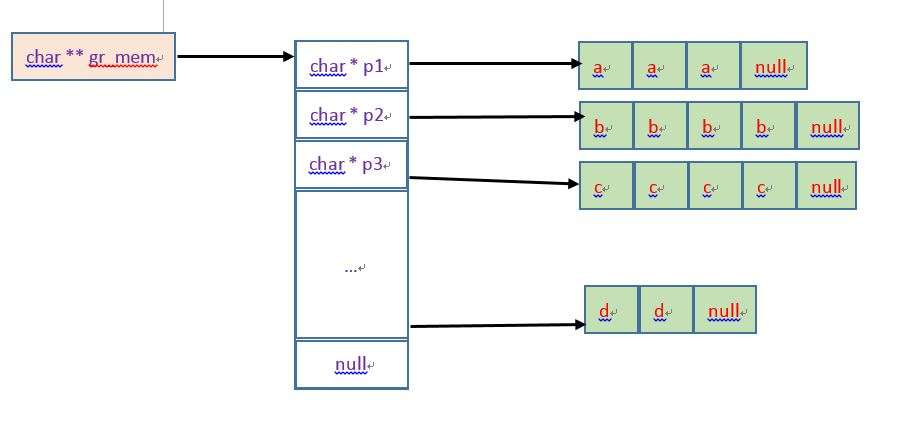
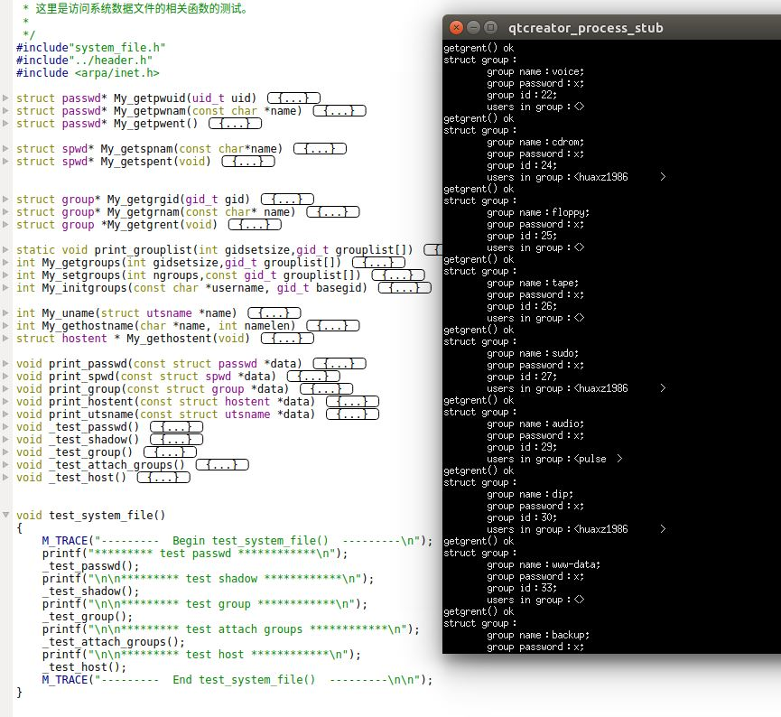
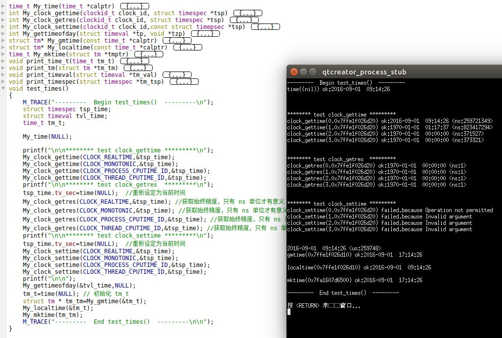

# 系统数据文件和信息

1. UNIX系统的正常运作需要使用大量与系统有关的数据文件。如口令文件 `/etc/passwd/`和组文件`/etc/group`
	- 由于历史原因，这些数据文件都是 `ASCII` 文本文件
	- 我们可以用标准 IO 库来读取这些文件，但是也可以有专门的 API 来读取这些文件

## 系统文件

1. UNIX口令文件 `/etc/passwd/`是一个`ASCII`文件，每一行包含很多字段，字段之间用冒号分隔。这些字段包含在`<pwd.h>`头文件定义的`passwd`，该结构有如下成员：
	- `char *pw_name`：用户名
	- `char *pw_passwd`：加密口令
	- `uid_t pw_uid`：数值用户ID
	- `gid_t pw_gid`：数值组ID
	- `char *pw_gecos`：注释字段
	- `char *pw_dir`：初始工作目录
	- `char *pw_shell`：初始`shell`
	- `char *pw_class`：用户访问类
	- `time_t pw_change`：下次更改口令时间
	- `time_t pw_expire`：账户有效期时间

	关于口令文件：
	- 通常有一个用户名为`root`的登录项，其用户ID是 0
	- 加密口令字段包含一个占位符。现在加密口令其实是放在另一个文件中
	- 口令文件中某些字段可能为空。
		- 如果加密口令字段为空，则说明该用户没有口令
		- 如果注释字段为空，则没有任何影响
	- `shell`字段指定了初始`shell`
		- 若它为空，则取系统默认值（通常是`/bin/sh`）
		- 若它为`/dev/null`，则会阻止任何人以该字段所在行记录中的用户名来登录系统
	- 用户名如果是`nobody`，则任何人都可以使用它登录系统，但是其用户ID和组ID不提供任何特权。该用户ID和组ID只能访问人人皆可读、可写的文件
	- 在`Linux`中，没有 `pw_class,pw_change,pw_expire`字段

2. `getpwuid/getpwnam`函数：读取口令文件：
	
	```
	#include<pwd.h>
	struct passwd* getpwuid(uid_t uid);
	struct passwd* getpwnam(const char*name);
	```
	- 参数：
		- `uid`：用户ID
		- `name`：用户名
	- 返回值：
		- 成功：返回`passwd`结构的指针
		- 失败：返回`NULL`

	注意：`getpwuid/getpwnam`函数返回的 `struct passwd`结构通常是函数内部的静态变量，因此多次调用上面的函数，该静态变量会被覆写。

3. 查看整个口令文件，使用下面的函数：
	
	```
	#include<pwd.h>
	struct passwd *getpwent(void);
	void setpwent(void);
	void endpwent(void);
	```
	- `getpwent`返回值：
		- 成功：返回`passwd`结构的指针
		- 失败：返回`NULL`
		- 到达文件尾端：返回`NULL`

	用法：
	- 调用`getpwent`时，它返回口令文件中的下一个记录项
		>返回的 `struct passwd`结构通常是函数内部的静态变量，因此多次调用`getpwent`函数，该静态变量会被覆写
	- 在第一次调用`getpwent`函数时，它会打开所使用的各个文件
	- `getpwent`对返回的各个记录项顺序并没有要求
	- `setpwent`会反绕`getpwent`所使用的文件到文件起始处。即当调用`setpwent`之后，`getpwent`又会从头开始读取记录项
	- `endpwent`会关闭`getpwent`所使用的文件。在调用`getpwent`读取完口令文件后，一定要调用`endpwent`关闭这些文件
		> `getpwent`知道什么时候应该打开它所使用的文件（第一次被调用时），但是不知道何时应该关闭这些文件

4. 加密口令是经单向加密算法处理过的用户口令副本。
	> 因为此算法是单向的，所以不能从加密口令猜测到原始口令	
	
	现在的UNIX将加密口令存放在一个称作阴影口令的文件中（即文件`/etc/shadow`）。该文件至少应该包含用户名和加密口令。这些字段包含在`<shadow.h>`头文件的`struct spwd`结构中。相关的字段如下：
	- `char *sp_namp`：用户登录名
	- `char *sp_pwdp`：加密口令
	- `int sp_lstchg`：上次更改口令以来经过的时间
	- `int sp_min`：经过多少天后允许修改口令
	- `int sp_max`：经过多少天后必须修改口令
	- `int sp_warn`：经过多少天后如果未修改口令则系统发出警告
	- `int sp_inact`：经过多少天后，该账户是`inactive`
	- `int sp_expire`：经过多少天后，该账户过期
	- `unsigned int sp_flag`：保留字段

	其中只有用户登录名和加密口令这两个字段是必须的。其他字段都是用于控制口令更改的频率。
	注意：
	- 阴影口令文件`/etc/shadow` 不应该由一般用户读取。
		- 仅有少数几个程序需要访问加密口令，如`login,passwd`。这些程序通常是设置用户ID为`root`的程序
		- 普通口令文件`/etc/passwd/`可以任由各用户读取

5. 用于读取阴影口令文件的函数为：

	```
	#include<shadow.h>
	struct spwd *getspnam(const char*name);
	struct spwd *getspent(void);
	void setspent(void);
	void endspent(void);
	```
	-  `getspnam`参数：
		- `name`：用户名
	- `getspnam`返回值：
		- 成功：返回`spwd`结构指针
		- 失败：返回`NULL`
	- `getspent`返回值：
		- 成功：返回`spwd`结构指针
		- 失败：返回`NULL`
		- 到达文件尾端：返回`NULL`

	用法：
	- 调用 `getspnam`时，它返回阴影口令文件中，对应用户名的那一条记录项
		>返回的 `struct spwd`结构通常是函数内部的静态变量，因此多次调用`getspnam`函数，该静态变量会被覆写
	- 调用`getspent`时，它返回阴影口令文件中的下一个记录项
		>返回的 `struct spwd`结构通常是函数内部的静态变量，因此多次调用`getspent`函数，该静态变量会被覆写
	- 在第一次调用`getspent`函数时，它会打开所使用的各个文件
	- `getspent`对返回的各个记录项顺序并没有要求
	- `setspent`会反绕`getspent`所使用的文件到文件起始处。即当调用`setspent`之后，`getspent`又会从头开始读取记录项
	- `endspent`会关闭`getspent`所使用的文件。在调用`getspent`读取完阴影口令文件后，一定要调用`endspent`关闭这些文件
		> `getspent`知道什么时候应该打开它所使用的文件（第一次被调用时），但是不知道何时应该关闭这些文件

6. UNIX 组文件包含的字段定义在`<grp.h>`所定义的`group`结构中：
	- `char *gr_name`：组名
	- `char *gr_passwd`：加密口令
	- `int gr_gid`：组ID
	- `char **gr_mem`：指向各用户名指针的数组
		> 它是一个指针数组，其中每个指针指向一个属于该组的用户名。该数组以`null`指针结尾

  	 

7. `getgrgid/getgrnam`函数：查看组文件：

	```
	#include<grp.h>
	struct group* getgrgid(gid_t gid);
	struct group* getgrnam(const char* name);
	```
	- 参数：
		- `gid`：组ID
		- `name`：组名
	- 返回值：
		- 成功：返回`group`结构的指针
		- 失败：返回`NULL`

	注意：`getgrgid/getgrnam`函数返回的 `struct group`结构通常是函数内部的静态变量，因此多次调用上面的函数，该静态变量会被覆写。

8. 查看整个组文件，使用下面的函数：
	
	```
	#include<grp.h>
	struct group *getgrent(void);
	void setgrent(void);
	void endgrent(void);
	```
	- `getgrent`返回值：
		- 成功：返回`group`结构的指针
		- 失败：返回`NULL`
		- 到达文件尾端：返回`NULL`

	用法：
	- 调用`getgrent`时，它返回组文件中的下一个记录项
		>返回的 `struct group`结构通常是函数内部的静态变量，因此多次调用`getgrent`函数，该静态变量会被覆写
	- 在第一次调用`getgrent`函数时，它会打开所使用的各个文件
	- `getgrent`对返回的各个记录项顺序并没有要求
	- `setgrent`会反绕`getgrent`所使用的文件到文件起始处。即当调用`setgrent`之后，`getgrent`又会从头开始读取记录项
	- `endgrent`会关闭`getgrent`所使用的文件。在调用`getgrent`读取完组文件后，一定要调用`endgrent`关闭这些文件
		> `getgrent`知道什么时候应该打开它所使用的文件（第一次被调用时），但是不知道何时应该关闭这些文件

9. UNIX中还提供了附属组ID。其中获取和设置附属组ID的函数为：

	```
	#include<unistd.h>
	int getgroups(int gidsetsize,gid_t grouplist[]);

	#include<grp.h>    	//对Linux
	#include<unistd.h>	//对 FreeBSD, Mac OS X, Solaris
	int setgroups(int ngroups,const gid_t grouplist[]);

	#include<grp.h>    	//对Linux
	#include<unistd.h>	//对 FreeBSD, Mac OS X, Solaris
	int initgroups(const char *username, gid_t basegid);	
	```

	参数：

	- 对于`getgroups`函数：
		- `gidsetsize`：填入`grouplist`数组的附属组ID的最大数量
			> 若该值为0，则函数只返回附属组ID数，而不修改`grouplist`数组
		- `grouplist`：存放附属组ID的数组
	- 对于`setgroups`函数：
		- `ngroups`：`grouplist`数组中元素个数
			> 数量不能太大，不能超过`NGROUPS_MAX`
		- `grouplist`：待设置的附属组ID的数组
	- 对于`initgroups`函数：
		- `username`：用户名
		- `basegid`：用户的`base`组ID（它就是在口令文件中，用户名对于的组ID）

	返回值：
	
	- 对于`getgroups`函数： 
		- 成功：返回附属组ID的数量
		- 失败：返回 -1
	- 对于`setgroups/initgroups`函数：
		- 成功：返回 0
		- 失败：返回 -1

	用法：
	- `getgroups`函数将进程所属用户的各附属组ID填写到`grouplist`中，填入该数组的附属组ID数最多为`gidsetsize`个。实际填写到数组中的附属组ID数由函数返回
	- `setgroups`函数可由超级用户调用以便为调用进程设置附属组ID表。
	- 由于`initgroups`函数会在内部调用`setgroups`函数，因此它也必须由超级用户调用
		
10. 除了口令文件和组文件之外，系统中还有很多其他重要的数据文件。UNIX对于这些系统数据文件提供了对应的类似的API。对于每种数据文件，至少有三个函数：
	-  `get`函数：读下一个记录。如果需要还会打开该文件。
		- 此种函数通常返回一个指向某个结构的指针。
		- 当已到达文件尾端时，返回空指针
		- 大多数`get`函数返回指向一个静态存储类结构的指针，如果需要保存其内容，则需要复制该结构
	- `set`函数：打开相应数据文件（如果尚未打开），然后反绕该文件
		- 如果希望在相应文件起始处开始处理，则调用该函数
	- `end`函数：关闭相应数据文件。在结束了对相应数据文件的读、写操作后，总应该调用此函数以关闭所有相关文件

	另外如果数据文件支持某种形式的键搜索，则也提供搜索具有指定键的记录的函数

	下面是各个重要的数据文件：

	| 说明 | 数据文件 | 头文件 | 结构 | 附加的键搜索函数 |
	|----|------|-----|----|----------|
	| 口令 | /etc/passwd | <pwd.h> | passwd | getpwnam,getpwuid |
	| 组 | /etc/group | <grp.h> | group | getgrnam,getgrgid |
	| 阴影 | /etc/shadow | <shadow.h> | spwd | getspnam |
	| 主机 | /etc/hosts | <netdb.h> | hostent | getnameinfo,getaddrinfo |
	| 网络 | /etc/networks | <netdb.h> | netent | getnetbyname,getnetbyaddr |
	| 协议 | /etc/protocols | <netdb.h> | protoent | getprotobyname,getprotobynumber |
	| 服务 | /etc/services | <netdb.h> | servent | getservbyname,getservbyport |

11. 大多数UNIX系统都提供了两个数据文件：
	- `utmp`文件：记录了当前登录到系统的各个用户
	- `wtmp`文件：跟踪各个登录和注销事件

	每次写入到这两个文件的是下列结构的一个二进制记录：

	```
	struct utmp{
		char ut_line[8];   // 登录的 tty 
		char ut_name[9];   //登录用户名
		long ut_time;	   //自1970.01.01 00：00：00 经过的秒数
	}
	```
	- 登录时，`login`程序填写此类结构，然后将其写入到`utmp`文件中，同时也将其添写到`wtmp`文件中
	- 注销时，`init`进程将`utmp`文件中相应的记录擦除（每个字节都填写`null`字节），并将一个新的记录添写到`wtmp`文件中
	- 在系统重启时，以及更改系统时间和日期的前后，都将在`wtmp`文件中追加写特殊的记录项
		> `who`程序会读取`utmp`文件；`last`程序会读取`wtmp`文件

	>`linux`系统中，这两个文件的路径是`/var/run/utmp`以及`/var/log/wtmp`

12. `uname`函数：返回主机和操作系统的有关信息：

	```
	#include<sys/utsname.h>
	int uname(struct utsname *name);
	```
	- 参数：
		- `name`：一个`utsname`结构的地址，该函数会填写此结构
	- 返回值：
		- 成功： 返回非负值
		- 失败： 返回 -1

	POSIX 之定义了`utsname`结构最少需要提供的字段（全部是字符数组），某些操作系统会在该结构中提供了另外一些字段：

	```
	struct utsname {
		char sysname[];  //操作系统的名字
		char nodename[]; // 节点名字
		char release[];  //当前操作系统的 release
		char version[];  //该 release 的版本
		char machine[];  //硬件类型
	}
	```
	这些字符串都是以`null`结尾。
	> 通常 `uname` 命令会打印`utsname`结构中的信息

13. `gethostname`函数：返回主机名。改名字通常就是 `TCP/IP` 网络上主机的名字：

	```
	#include<unistd.h>
	int gethostname(char *name,int namelen);
	```
	- 参数：
		- `name`：放置主机名字符串的缓冲区
		- `namelen`：`name`缓冲区的长度
			> 如果缓冲区够长，则通过`name`返回的字符串以`null`结尾；如果缓冲区不够长，则标准没有说通过`name`返回的字符串是否以`null`结尾
	- 返回值：
		- 成功： 返回 0
		- 失败： 返回 -1

	> `hostname`命令可以获取和设置主机名

14. 示例：在`main`函数中调用`test_system_file`函数：
	
	```
void test_system_file()
{
    M_TRACE("---------  Begin test_system_file()  ---------\n");
    printf("********* test passwd ************\n");
    _test_passwd();
    printf("\n\n********* test shadow ************\n");
    _test_shadow();
    printf("\n\n********* test group ************\n");
    _test_group();
    printf("\n\n********* test attach groups ************\n");
    _test_attach_groups();
    printf("\n\n********* test host ************\n");
    _test_host();
    M_TRACE("---------  End test_system_file()  ---------\n\n");
}
	```

	注意：
	- `getpwuid`、`getpwnam`、`getgrgid`、`getgrnam`函数失败时，并不会修改`errno`

  	 
	

## 时间和日期

1. UNIX内核提供的基本时间服务是自 UTC 1970-01-01 00：00：00 这一特定时间以来经过的秒数。
	- 这个时间称作日历时间，用数据类型 `time_t` 表示（它包括了时间和日期）
	- UNIX 提供若干个时间函数来转换日历时间

2. `time`函数：返回当前的日历时间
	
	```
	#include<time.h>
	time_t time(time_t *calptr);
	```
	- 参数：
		- `calptr`：如果该指针不是`NULL`，则返回的日历时间也存放在`calptr`指向的内存中
	- 返回值：
		- 成功：返回当前日历时间的值
		- 失败：返回 -1

3. `clock_gettime`函数：用于获取指定的时钟类型的时间：

	```
	#include<sys/time.h>
	int clock_gettime(clockid_t clock_id,struct timespec *tsp);
	```
	- 参数：
		- `clock_id`：时钟类型。
			- `CLOCK_REALTIME`：获取实时系统时间。此时`clock_gettime`函数提供了与`time`函数类似的功能。不过在系统支持高精度时间值的情况下，`clock_gettime`可能比`time`函数得到更高精度的时间值。
			- `CLOCK_MONOTONIC`：获取不带负跳数的实时系统时间
			- `CLOCK_PROCESS_CPUTIME_ID`：调用进程的CPU时间
			- `CLOCK_THREAD_CPUTIME_ID`：调用线程的CPU时间
		- `tsp`：存放获取时间的`timespec`结构（它把时间表示为秒和纳秒）的指针
	- 返回值：
		- 成功： 返回 0
		- 失败： 返回 -1

4. `clock_getres`函数：时间精度调整
	
	```
	#include<sys/time.h>
	int clock_getres(clockid_t clock_id,struct timespec *tsp);
	```
	- 参数：
		- `clock_id`：时钟类型。
		- `tsp`：存放时间的`timespec`结构（它把时间表示为秒和纳秒）的指针
	- 返回值：
		- 成功： 返回 0
		- 失败： 返回 -1

	`clock_getres`函数把参数`tsp`指向的`timespec`结构初始化为与`clock_id`参数对应的时钟精度

5. `clock_settime`函数：设置时间

	```
	#include<sys/time.h>
	int clock_settime(clockid_t clock_id,const struct timepsec *tsp);
	```
	- 参数：
		- `clock_id`：时钟类型。
		- `tsp`：存放时间的`timespec`结构（它把时间表示为秒和纳秒）的指针
	- 返回值：
		- 成功： 返回 0
		- 失败： 返回 -1
	
	`clock_settime`函数对特定的时钟设置时间。但是：
	- 某些时钟是不能修改的
	- 需要适当的权限来修改时钟值

6. `gettimeofday`函数：更高精度的获取当前时间（但是目前已经弃用）

	```
	#include<sys/time.h>
	int gettimeofday(struct timeval *restrict tp,void *restrict tzp);
	```
	- 参数：
		- `tp`：存放当前时间的`timeval`结构（将当前时间表示为秒和微秒）的指针
		- `tzp`：唯一合法值是`NULL`。其他任何值都产生未定义的结果
	- 返回值：总是返回 0
		
7. `gmtime/localtime`函数：将日历时间转换成`struct tm`结构：

	```
	#include<time.h>
	struct tm* gmtime(const time_t *calptr);
	struct tm* localtime(const time_t *calptr);
	```
	- 参数：`calptr`：指向日历时间的指针
	- 返回值：
		- 成功：指向`struct tm`结构的指针
		- 失败：返回`NULL`

	```
	struct tm{
		int tm_sec; 	//秒数，范围是 [0~60]
		int tm_min; 	//分钟数，范围是 [0~59]
		int tm_hour;	//小时数，范围是 [0~23]。午夜12点是 0
		int tm_mday;	//一个月中的天数，范围是 [1~31]
		int tm_mon; 	//月数，范围是 [0~11] ，一月是 0	
		int tm_year;	//年数，范围是 [1900~]，如果是16则表示 1916	
		int tm_wday;	//一个星期中的天数，范围是 [0~6] ，周日是0
		int tm_yday;	//一年中的天数，范围是 [0~365]，一月一号是 0
		int tm_isdst;  //daylight saving time flag
	}
	```
	其中秒可以超过 59 的理由是表示润秒	

	`gmtime/localtime`函数的区别：
	- `gmtime`：将日历时间转换成统一协调的年月日时分秒周日分解结构
	- `localtime`：将日历时间转换成本地实际（考虑本地市区和夏令时标志），由`TZ`环境变量指定
	> `TZ`环境变量影响`localtime/mktime/strftime`这三个函数：
	>- 如果定义了`TZ`环境变量：则这些函数将使用`TZ`的值代替系统默认时区
	>- 如果`TZ`定位为空`TZ=`，则使用`UTC`作为时区
		
8. `mktime`函数：以本地时间的年月日等作为参数，将其变化成`time_t`值：

	```
	#include<time.h>
	time_t mktime(struct tm*tmptr);
	```
	- 参数：	`tmptr`：指向`struct tm`结构的指针
	- 返回值：
		- 成功： 返回日历时间
		- 失败： 返回 -1

	所谓的本地实际的”本地“：由 `TZ`环境变量指定

9. `strftime/strftime_l`函数：类似`printf`的打印时间的函数。它们可以通过可用的多个参数来定制产生的字符串

	```
	#include<time.h>
	size_t strftime(char *restrict buf,size_t maxsize,const char*restrict format,
		const struct tm* restrict tmptr);
	size_t strftime_l(char *restrict buf,size_t maxsize,const char*restrict format,
		const struct tm* restrict tmptr,locale_t locale);
	```
	- 参数：
		- `buf`：存放格式化后的时间字符串的缓冲区的地址
		- `maxsize`：存放格式化后的时间字符串的缓冲区的大小
		- `format`：时间的格式化字符串
		- `tmptr`：存放时间的`struct tm`结构的指针
	
		对于`strftime_l` 函数：
		- `locale`：指定的区域
	- 返回值：
		- 成功：返回存入`buf`的字符数
		- 失败： 返回 0

	注意：
	- 如果`buf`长度足够存放格式化结果以及一个`null`终止符，则这两个函数才有可能顺利转换；否则空间不够，这两个函数返回0，表示转换失败
	- `strftime_l`运行调用者将区域指定为参数；而`strftime`使用通过`TZ`环境变量指定的区域
	- `format`参数控制时间值的格式。如同`printf`，转换说明的形式是百分号之后跟随一个特定的字符，而`format`中的其他字符则按照原样输出：
		- `%a`：缩写的周日名，如`Thu`
		- `%A`：周日名，如`Thursday`
		- `%b`：缩写的月名：如`Jan`
		- `%B`：全月名，如`January`
		- `%c`：日期和时间，如`Thu Jan 19 21:24:25 2012`
		- `%C`：年的最后两位，范围是（00～99），如`20`
		- `%d`：月日，范围是 (01~31)，如`19	`
		- `%D`日期（MM/DD/YY），如`01/19/12`
		- `%e`月日（一位数字前加空格）（1～31），如`19`
		- `%F`：ISO 8601 日期格式 (YYYY-MM-DD)，如 `2012-01-19`
		- `%g`：ISO 8601 年的最后2位数（00～99），如`12`
		- `%G`：ISO 8601 的年，如 `2012`
		- `%h`：与 `%b` 相同，缩写的月名
		- `%H`：小时（24小时制）（00～23）
		- `%I`：小时（12小时制）（01～12）
		- `%j`：年日（001～366），如`019`
		- `%m`：月（01～12），如 `01`
		- `%M`：分（00～59），如 `24`
		- `%n`：换行符
		- `%p`：`AM/PM`
		- `%r`：本地时间（12小时制），如 `09：24：52 PM`
		- `%R`：与 `%H：%M`相同
		- `%S`：秒（00～60），如 `52`
		- `%t`：水平制表符
		- `%T`：同 `%H：%M：%S` 相同，如 `21：24：52`
		- `%u`：ISO 8601 周几（1～7，1为周一）
		- `%U`：一年的星期日周数（00～53）
		- `%V`：ISO 8601 周数（01～53）
		- `%w`：周几：（0～6，周日为0）
		- `%W`：一年的星期一周数（00～53）
		- `%x`：本地日期，如 `01/19/12`
		- `%X`：本地时间，如`21：24：52`
		- `%y`：年的最后两位（00～99）
		- `%Y`：年，如`2012`
		- `%z`：ISO  8601 格式的UTC偏移量，如 `-0500`
		- `%Z`：时区名，如`EST`
		- `%%`：百分号

10. `strptime`函数：它是`strftime`的逆向过程，把时间字符串转换成`struct tm`时间

	```
	#include<time.h>
	char *strptime(const char*restrict buf,const char*restrict format,
		struct tm*restrict tmptr);
	```
	- 参数：
		- `buf`：存放已经格式化的时间字符串的缓冲区的地址
		- `format`：给出了`buf`缓冲区中的格式化时间字符串的格式
		- `tmptr`：存放时间的`struct tm`结构的指针
	- 返回值：
		- 成功：返回非`NULL`
		- 失败：返回`NULL`

	注意：`strptime`的格式化说明与`strftime`的几乎相同，但是下列会有区别
	- `%a`：缩写或者完整的周日名
	- `%A`：同`%a`
	- `%b`：缩写或者完整的月名
	- `%B`：同`%b`
	- `%n`：任何空白
	- `%t`：任何空白

11. 示例：在`main`函数中调用`test_times`函数：

	```
void test_times()
{
    M_TRACE("---------  Begin test_times()  ---------\n");
    struct timespec tsp_time;
    struct timeval tvl_time;
    time_t tm_t;

    My_time(NULL);

    printf("\n\n******** test clock_gettime *********\n");
    My_clock_gettime(CLOCK_REALTIME,&tsp_time);
    My_clock_gettime(CLOCK_MONOTONIC,&tsp_time);
    My_clock_gettime(CLOCK_PROCESS_CPUTIME_ID,&tsp_time);
    My_clock_gettime(CLOCK_THREAD_CPUTIME_ID,&tsp_time);
    printf("\n\n******** test clock_getres  *********\n");
    tsp_time.tv_sec=time(NULL);  //重新设定为当前时间
    My_clock_getres(CLOCK_REALTIME,&tsp_time); //获取始终精度，只有 ns 单位才有意义
    My_clock_getres(CLOCK_MONOTONIC,&tsp_time); //获取始终精度，只有 ns 单位才有意义
    My_clock_getres(CLOCK_PROCESS_CPUTIME_ID,&tsp_time); //获取始终精度，只有 ns 单位才有意义
    My_clock_getres(CLOCK_THREAD_CPUTIME_ID,&tsp_time); //获取始终精度，只有 ns 单位才有意义
    printf("\n\n******** test clock_settime *********\n");
    tsp_time.tv_sec=time(NULL);  //重新设定为当前时间
    My_clock_settime(CLOCK_REALTIME,&tsp_time);
    My_clock_settime(CLOCK_MONOTONIC,&tsp_time);
    My_clock_settime(CLOCK_PROCESS_CPUTIME_ID,&tsp_time);
    My_clock_settime(CLOCK_THREAD_CPUTIME_ID,&tsp_time);
    printf("\n\n");
    My_gettimeofday(&tvl_time,NULL);
    tm_t=time(NULL); // 初始化 tm_t
    struct tm * tm_tm=My_gmtime(&tm_t);
    My_localtime(&tm_t);
    My_mktime(tm_tm);
    M_TRACE("---------  End test_times()  ---------\n\n");
}	
	```

  	  
