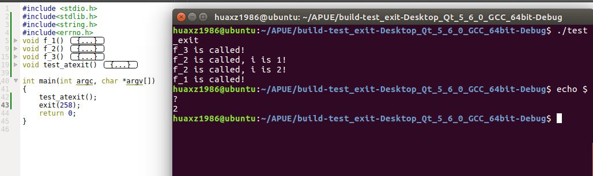
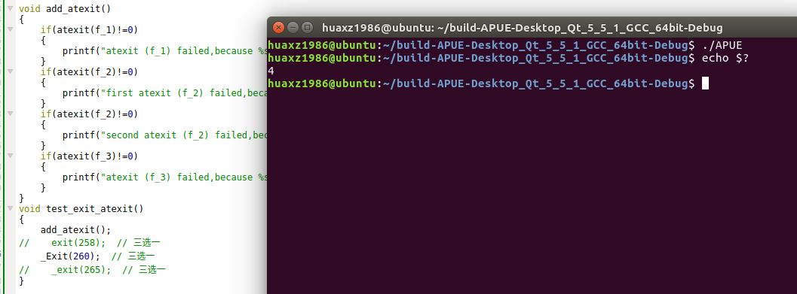
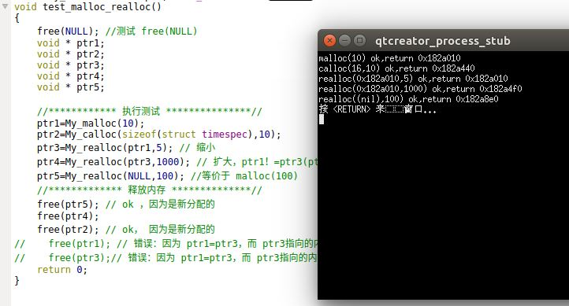
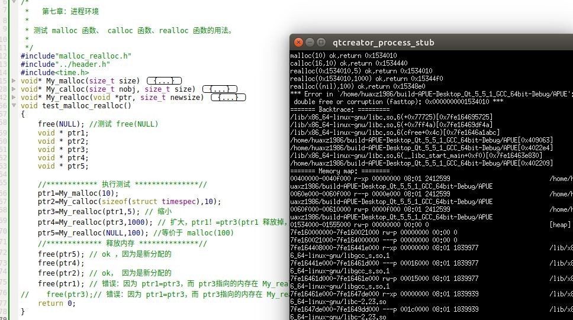
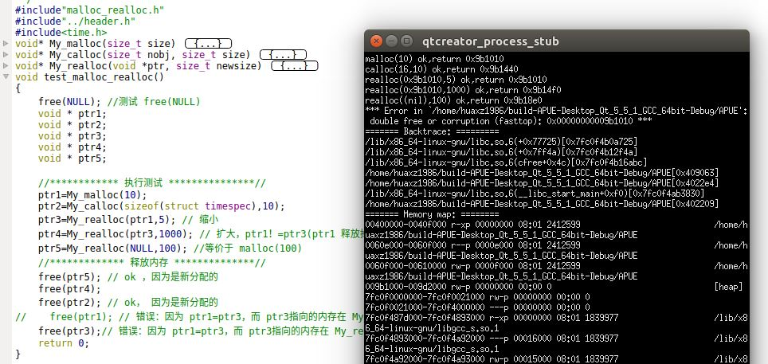
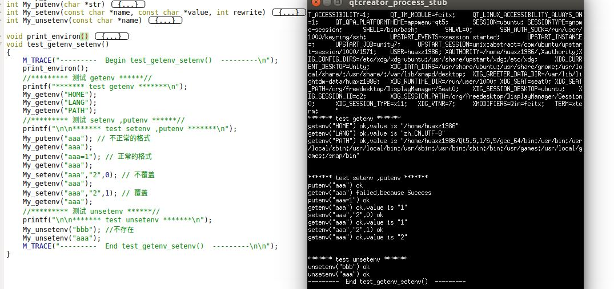
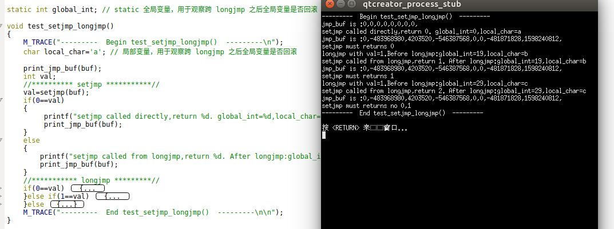
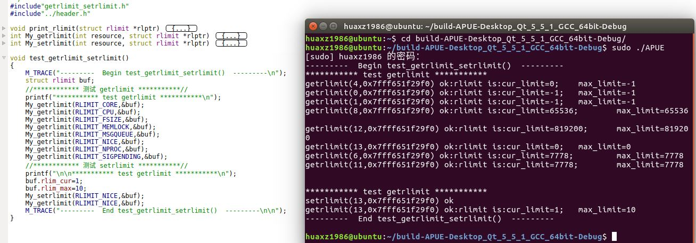

# 进程环境

## 进程相关

1. C程序总是从`main`函数开始执行的。`main`函数的原型是：

	```
	int main(int argc,char* argv[]);
	```
	- 参数：
		- `argc`：命令行参数的数目
		- `argv`：由指向各命令行参数的指针所组成的数组。`ISOC`和`POSIX`都要求`argv[argc]`是一个空指针

	当内核执行 C 程序时，在调用`main`之前先调用一个特殊的启动例程。
	- 内核执行C程序是通过使用一个`exec`函数实现的
	- 可执行程序文件将此启动例程指定为程序的其实地址（这是由链接器设置的，而链接器由C编译器调用）
	- 启动例程从内核取得命令行参数和环境变量值，然后为调用`main`函数做好安排

2. 有 8 种方式使得进程终止，其中 5 种为正常终止，3 种异常终止：
	- 正常终止方式：
		- 从`main`函数返回
		- 调用`exit`函数
		- 调用`_exit`函数或者`_Exit`函数
		- 多线程的程序中，最后一个线程从其启动例程返回
		- 多线程的程序中，从最后一个线程调用`pthread_exit`函数
	- 异常终止方式：
		- 调用`abort`函数
		- 接收到一个信号
		- 多线程的程序中，最后一个线程对取消请求作出响应

	> 关于多线程部分，在多线程章节讲述

3. 当内核执行 C 程序时，在调用`main`之前先调用一个特殊的启动例程。该启动例程是这样编写的：从`main`函数返回后立即调用`exit`函数。其形式为`exit(main(argc,argv))`。
	> 实际上启动例程通常是汇编语言编写的

4. `exit/_Exit/_exit`函数：正常终止一个程序

	```
	#include<stdlib.h>
	void exit(int status);
	void _Exit(int status);
	#include<unistd.h>
	void _exit(int status);
	```	

	- 参数：`status`：终止状态
	
	上述三个退出函数的区别：
	- `_exit`和`_Exit`函数：立即进入内核
	- `exit`函数：先执行一些清理处理，然后返回内核
		> “清理”代表什么？见下文
	- `exit`和`_Exit`是由`ISOC`说明的， `_exit`是由`POSIX`说明的 ，因此头文件不同

	注意：
	- 上述三个函数都带有一个整型参数，称为终止状态（或称作退出状态）。大多数 UNIX 系统 shell 都提供检查进程终止状态的方法
		- 若调用上述三个函数时不带终止状态，则该进程的终止状态是未定义的
		- 若`main`执行了一个无返回值的`return`语句，则该进程的终止状态是未定义的
		- 若`main`没有声明返回类型为整型，则该进程的终止状态是未定义的
		- 若`main`声明返回类型为整型，并且`main`执行到最后一条语句时返回（隐式返回），则该进程的终止状态是 0
	- `main`函数返回一个整型值与用该值调用`exit`是等价的。即`main`函数中，`exit(100);`等价于`return 100;`
	- 在LINUX中，退出状态码最高是255，一般自定义的代码值为0~255，如果超出255，则返回该数值被256除了之后的余数

5. `atexit`函数：登记由`exit`函数调用的清理函数

	```
	#include<stdlib.h>
	int atexit(void (*func) (void));
	```
	- 参数：
		- `func`：函数指针。它指向的函数的原型是：返回值为`void`，参数为`void`
	- 返回值：
		- 成功：返回 0
		- 失败：返回非 0

	一个进程可以登记最多 32 个函数，这些函数将由`exit`函数自动调用。这些函数称作终止处理程序（`exit handler`）。而`atexit`函数就是登记`exit handler`的
	- `exit`调用这些`exit handler`的顺序与它们登记的时候顺序相反
	- 如果同一个`exit handler`被登记多次，则它也会被调用多次
	> 通常操作系统会提供多于32个`exit handler`的限制。可以用`sysconf`函数查询这个限制值

6. 示例：在`main`函数中调用`test_exit_atexit`函数：

	```
void test_exit_atexit()
{
    M_TRACE("---------  Begin test_exit_atexit()  ---------\n");
    add_atexit();
    exit(258);  // 三选一
//    _Exit(260);  // 三选一
//    _exit(265);  // 三选一
    M_TRACE("---------  End test_exit_atexit()  ---------\n\n");
}
	```
	可以看到：
	- 终止处理程序`exit handler` 调用顺序是逆序的
	- 终止处理程序`exit handler` 多次注册则调用多次
	- 退出码是除以256的余数

	 

	如果将 `exit(258);`替换成`_Exit(260)`，则：
	- 不会再调用终止处理程序`exit handler` 
	 


7.  C程序的启动和终止
	- `exit`函数首先调用各终止处理程序，然后关闭（通过`fclose`）所打开的流。
	- 内核执行程序的唯一方法是调用一个`exec`函数
	- 内核自愿终止的唯一方法是显式或者隐式（通过调用`exit`函数）的调用`_exit`或者`_Exit`
	
	 

8. 每个程序都会接收一张环境表。
	- 与参数表一样，环境表也是一个字符指针数组
		- 其中数组中的每个指针指向一个以`null`结束的 C 字符串，这些字符串称之为环境字符串
		- 数组的最后一项是`null`
	- 全局变量`envrion`包含了该指针数组的地址：`extern char **envrion`。我们称`environ`为环境指针，它位于头文件`unistd.h`中
	- 按照惯例，环境字符串由`name=value`这种格式的字符串组成

	 	

9. C程序的存储空间布局：C程序一直由下列几部分组成：
	- 正文段：这是由CPU执行的机器指令部分。
		- 通常正文段是可以共享的。一个程序的可以同时执行`N`次，但是该程序的正文段在内存中只需要有一份而不是`N`份
		- 通常正文段是只读的，以防止程序由于意外而修改其指令
	- 初始化数据段：通常将它称作数据段。
		- 它包含了程序中明确地赋了初值的变量：包括函数外的赋初值的全局变量、函数内的赋初值的静态变量
	- 未初始化数据段：通常将它称作`bss`段。在程序开始执行之前，内核将此段中的数据初始化为0或者空指针。
		- 它包含了程序中未赋初值的变量：包括函数外的未赋初值的全局变量、函数内的未赋初值的静态变量
	- 栈段：临时变量以及每次函数调用时所需要保存的信息都存放在此段中。
		- 每次函数调用时，函数返回地址以及调用者的环境信息（如某些CPU 寄存器的值）都存放在栈中
		- 最新的正被执行的函数，在栈上为其临时变量分配存储空间
		> 通过这种方式使用栈，C 递归函数可以工作。递归函数每次调用自身时，就创建一个新的栈帧，因此某一次函数调用中的变量不影响下一次调用中的变量
	- 堆段：通常在堆中进行动态存储分配。
		- 由于历史习惯，堆位于未初始化数据段和栈段之间

	 

	注意：
	- 栈从高地址向低地址增长。堆顶和栈顶之间未使用的虚拟地址空间很大
	- 未初始化数据段的内容并不存放在磁盘程序文件中。需要存放在磁盘程序文件中的段只有正文段和初始化数据段
		> 因为内核在程序开始运行前将未初始化数据段设置为 0 
	- `size`命令可以查看程序的正文段、数据段 和`bss`段长度（以字节为单位）

10.  `malloc/calloc/realloc`函数：动态分配存储空间

	```
	#include<stdlib.h>
	void *malloc(size_t size);
	void *calloc(size_t nobj,size_t size);
	void *realloc(void *ptr,size_t newsize);
	```
	- 参数：

		对于`malloc`函数：
		- `size`：动态分配的存储空间的大小（字节数）

		对于`calloc`函数：
		- `nobj`：动态分配的对象的数量
		- `size`：每个对象的大小（字节数）

		对于`realloc`函数：
		- `ptr`：由`malloc/realloc`返回的指针，指向一个动态分配的空间
			- 如果`ptr`是`NULL`，则`realloc`与`malloc`功能相同，是分配一个指定长度为`newsize`字节的动态存储空间
		- `newsize`：调整后的动态空间的大小（字节数）
	- 返回值：
		- 成功：返回非空指针
		- 失败：返回`NULL`

	注意：
	- 这三个分配函数所返回的指针一定是适当对齐的，使其可以用于任何数据对象
	- `realloc`可以增加、减少之前分配的动态存储区长度。对于增加动态存储区的情况：
		- 如果在原来动态存储区位置后面有足够的空间可以扩充，则可以在原存储区位置上向高地址扩充，无需移动任何原先的内容，并返回与传给它相同的指针值
		- 如果在原来动态存储区位置后面没有足够的空间可以扩充，则`realloc`分配另一个足够大的动态存储区，然后将原先的内容移动到新的存储区。然后释放原存储区，返回新分配存储区的指针
	- 这些分配函数通常使用`sbrk`系统调用实现。该系统调用用于扩充或者缩小进程的堆空间。
		- 大多数实现所分配的存储空间要比所要求的稍大一些，额外的空间用来记录管理信息，比如分配块的长度、指向下一个分配块的指针等等。
		- 因此在一个动态分配区的尾部之后或者在起始位置之前写操作会修改另一块的管理记录信息。这种类型的错误是灾难性的，但是由于这种错误不会立即暴露出来，因此很难被发现
	- 这三个函数返回的动态分配区必须用`free()`函数进行释放。
		- 如果一个进程调用了`malloc`函数但是没有调用`free`函数，则该进程占用的存储空间就会连续增加，这称作内存泄漏。
		- 内存泄漏会导致进程地址空间长度慢慢增加直到不再有空闲空间。此时过度的换页开销会导致性能下降
	- 对一块动态分配的内存，只能`free`一次。如果`free`多次则会发生错误

11. 示例:在`main`函数中调用`test_malloc_realloc`函数：

	```
void test_malloc_realloc()
{
    M_TRACE("---------  Begin test_malloc_realloc()  ---------\n");
    free(NULL); //测试 free(NULL)
    void * ptr1;
    void * ptr2;
    void * ptr3;
    void * ptr4;
    void * ptr5;

    //************ 执行测试 ***************//
    ptr1=My_malloc(10);
    ptr2=My_calloc(sizeof(struct timespec),10);
    ptr3=My_realloc(ptr1,5); // 缩小
    ptr4=My_realloc(ptr3,1000); // 扩大，ptr1！=ptr3(ptr1 释放掉，ptr3 重新分配)
    ptr5=My_realloc(NULL,100); //等价于 malloc(100)
    //************* 释放内存 **************//
    free(ptr5); // ok ，因为是新分配的
    free(ptr4);
    free(ptr2); // ok， 因为是新分配的
// free(ptr1); // 错误：因为 ptr1=ptr3，而 ptr3指向的内存在 My_realloc(ptr3,1000) 时被释放
// free(ptr3);// 错误：因为 ptr1=ptr3，而 ptr3指向的内存在 My_realloc(ptr3,1000) 时被释放
    M_TRACE("---------  End test_malloc_realloc()  ---------\n\n");
}
	```

	 

	可以看到，我们只需要`free`指针`ptr2,ptr4,ptr5`：
	- `ptr1`：由于`realloc`缩小动态内存区时，并不移动动态内存区，它的值等于`ptr3`
	- `ptr2`：由`calloc`分配的
	- `ptr3`：在对`ptr3`进行`realloc`扩大动态内存区时，发生了内存区的移动，此时`realloc`会自动释放旧的内存区（即`ptr3`）
	- `ptr4`：由`realloc`扩张动态内存区时，分配的新的动态内存区
	- `ptr5`：当`realloc`第一个参数是`NULL`时，相当于`malloc`，此时分配动态内存区

	另外 `free(NULL)` 执行成功，并没有报错。

	下面看一下如果`free(ptr1)`：
	

	下面看一下如果`free(ptr3)`：
	

12. 必须用不同的变量保存`realloc`返回的值：

	```
	char * ptr=malloc(10);
	ptr=realloc(1000); # 错误行为
	```
	因为，一旦`realloc`失败，则`ptr`赋值为`NULL`。`ptr`原来指向的动态内存区再也不能访问，也就无法释放，从而发生内存泄漏

## 环境变量

1. 环境字符串的形式是：`name=value`。UNIX内核并不查看这些字符串，这些字符串的具体意义由各应用程序解释

2. `getenv`函数：获取环境变量的值：

	```
	#include<stdlib.h>
	char *getenv(const char*name);
	```
	- 参数：
		- `name`：环境变量名
	- 返回值：
		- 成功：指向与`name`关联的`value`的指针
		- 失败：返回`NULL`

	注意：
	- 虽然我们也可以通过`environ`全局变量访问到环境字符串，但是推荐使用`getenv`函数	
	- 常用的环境变量民有：
		- `"HOME"`：`home`目录
		- `"LANG"`:语言
		- `"LOGNAME"`：登录名
		- `"PATH"`：搜索路径
		- `"PWD"`：当前工作目录的绝对路径名
		- `"SHELL"`：用户首选的SHELL
		- `"TERM"`：终端类型
		- `"TMPDIR"`：在其中创建临时文件的目录路径名
		- `"TZ"`：时区信息

3.  `putenv/setenv/unsetenv`函数：设置环境变量的值

	```
	#include<stdlib.h>
	int putenv(char *str);
	int setenv(const char *name,const char *value,int rewrite);
	int unsetenv(const char *name);
	```
	- 参数：
	
		对于`putenv`函数：
		- `str`：形式为`name=value`的字符串，将其放置到进程的环境表中。如果`name`已经存在，则先删除其原来的语义
	
		对于`setenv`函数：
		- `name`：环境变量名
		- `value`：环境变量的值
		- `rewrite`：指定覆写行为。
			- 如果它为0，则如果`name`在环境表中已存在，则直接返回而不修改。同时也不报错
			- 如果它非0，则如果`name`在环境表中已存在，则首先删除它现有的定义，然后添加新的定义

		对于`unsetenv`函数：
		- `name`：环境变量名
	- 返回值：
		
		对于 `putenv`函数：
		- 成功：返回0 
		- 失败：返回非0
	
		对于`setenv/unsetenv`函数：
		- 成功： 返回 0
		- 失败： 返回 -1

	注意：
	- `unsetenv`是从环境表中删除`name`的定义。如果`name`不存在，则也不算出错
	- 这些函数内部操作环境表非常复杂，下面是原理：
		- 如果修改一个现有的`name`：
			- 如果新的`value`长度少于或等于现有`value`的长度，则只需要将新字符串复制到原字符串所用的空间即可
			- 如果新的`value`长度大于现有`value`的长度，则必须调用`malloc`为新字符串分配空间，然后将新字符串复制到该空间，接着使环境表中对`name`的指针指向新分配区并释放旧分配区
		- 如果增加一个新的`name`：
			- 如果这是第一次增加一个新的`name`：
				- 则必须调用`malloc`为新指针表分配空间
				- 然后将原来的环境表复制到新分配区
				- 并将新的`name=value`字符串的指针存放到该指针表的表尾，
				- 然后将一个空指针存放在其后
				- 然后使`environ`指向新指针表
				- 最后释放旧的指针表
			- 如果这不是第一次增加一个新的`name`，则可知以前已经调用了`malloc`：
				- 则只需要调用`realloc`，以分配比原空间多存放一个指针的空间
				- 并将新的`name=value`字符串的指针存放到该指针表的表尾，
				- 然后将一个空指针存放在其后
		- 如果删除一个`name`：则只需要先在环境表中找到该指针，然后将所有的后续指针都向环境表的首部依次顺序移动一个位置即可

4. 示例：在`main`函数中调用`test_getenv_setenv`函数：

	```
void test_getenv_setenv()
{
    M_TRACE("---------  Begin test_getenv_setenv()  ---------\n");
    print_environ();
    //********* 测试 getenv ******//
    printf("******* test getenv *******\n");
    My_getenv("HOME");
    My_getenv("LANG");
    My_getenv("PATH");
    //********* 测试 setenv ,putenv ******//
    printf("\n\n******* test setenv ,putenv *******\n");
    My_putenv("aaa"); // 不正常的格式
    My_getenv("aaa");
    My_putenv("aaa=1"); // 正常的格式
    My_getenv("aaa");
    My_setenv("aaa","2",0); // 不覆盖
    My_getenv("aaa");
    My_setenv("aaa","2",1); // 覆盖
    My_getenv("aaa");
    //********* 测试 unsetenv ******//
    printf("\n\n******* test unsetenv *******\n");
    My_unsetenv("bbb"); //不存在
    My_unsetenv("aaa");
    M_TRACE("---------  End test_getenv_setenv()  ---------\n\n");
}
	```

	 
	可以看到：
	- 对于不存在的 `"bbb"`，`unsetenv("bbb")`执行成功
	- 对于不正确的格式， `putenv("aaa")` 执行成功，但是紧随的`getenv("aaa")` 执行失败
	- 对于 `getenv` 执行失败时，并没有修改对应的全局`errno`变量

## setjmp 和 longjmp

1. 在C语言中， `goto`语句是不能够跨越函数的。如果想执行跨函数跳转功能，则使用`setjmp`和`longjmp`，它们称作非局部`goto`。
	- 非局部是指：这不是普通的C语言`goto`语句在一个函数内实施的跳转，而是在栈上跳过若干调用帧，返回到当前函数调用路径上

2. `setjmp/longjmp`函数：非局部`goto`

	```
	#include<setjmp.h>
	int setjmp(jmp_buf env);
	void longjmp(jmp_buf env,int val);
	```

	- 参数：
	
		对于`setjmp`函数：
		- `env`是一个特殊类型`jmp_buf`。
			- 它是某种形式的数组，其内容由`setjmp`函数填写
			- 它必须和配对的`longjmp`使用通过一个`env`
		>- `jmp_buf`类型就是某种形式的数组，其中存放的是在调用`longjmp`时能用来恢复栈状态的所有信息
		>- 简单地说，`env`参数就是在`setjmp`和`longjmp`之间传递状态信息

		对于`longjmp`函数：
		- `env`：它就是`setjmp`所设置的`env`。它就像是一个锚点，从而跳转时知道跳到哪个位置
		- `val`：用于标识本次`longjmp`。
			- 因此某个`setjmp`可能有多个`longjmp`对应。因此这些`jmp`之间可以用`val`分辨。`setjmp`就知道是从哪个`longjmp`跳转过来的
			- `longjmp`的`val`参数就是`setjmp`的返回值
				> 但是`setjmp`的返回值不一定是`longjmp`的`val`参数

	- `setjmp`的返回值：
		- 如果直接调用，则返回 0
		- 如果从`longjmp`返回，则为 非0 （其实就是所跳转的那个`longjmp`的`val`参数）

	注意：
	- 假设在执行`setjmp`之前，有变量包括：全局变量`global_var`、局部静态变量`static_var`、以及自动变量`auto_var`，则跨`longjmp`这些变量都不会回滚到`setjmp`之前的状态
	- 使用非局部`goto`时，在声明自动变量的函数已经返回后，不能引用这些自动变量。因为它们已经被释放了


3. 示例：在`main`函数中调用`test_setjmp_longjmp`函数：

	```
void test_setjmp_longjmp()
{
    M_TRACE("---------  Begin test_setjmp_longjmp()  ---------\n");
    char local_char='a'; // 局部变量，用于观察跨 longjmp 之后全局变量是否回滚

    print_jmp_buf(buf);
    int val;
    //********** setjmp ***********//
    val=setjmp(buf);
    if(0==val)
    {
         printf("setjmp called directly,return %d. global_int=%d,local_char=%c\n",val,global_int,local_char);
         print_jmp_buf(buf);
    }
    else
    {
        printf("setjmp called from longjmp,return %d. After longjmp:global_int=%d,local_char=%c\n",val,global_int,local_char);
        print_jmp_buf(buf);
    }
    //*********** longjmp *********//
    if(0==val)
    {
        printf("setjmp must returns 0\n");
        global_int=19;  // longjmp 之前的 global_int
        local_char='b'; // longjmp 之前的 local_char
        printf("longjmp with val=%d.Before longjmp:global_int=%d,local_char=%c\n",1,global_int,local_char);
        longjmp(buf,1);
    }else if(1==val)
    {
        printf("setjmp must returns 1\n");
        global_int=29;  // longjmp 之前的 global_int
        local_char='c'; // longjmp 之前的 local_char
        printf("longjmp with val=%d.Before longjmp:global_int=%d,local_char=%c\n",1,global_int,local_char);
        longjmp(buf,2);
    }else
    {
        printf("setjmp must returns no 0,1\n");
    }
    M_TRACE("---------  End test_setjmp_longjmp()  ---------\n\n");
}
	```
	

	注意：使用`longjmp`和`setjmp`时，不能将它们包装起来使用（即不能使用`My_longjmp,My_setjmp`包装函数），而是直接使用。

## 进程资源限制

1. 每个进程都有一组资源限制，其中一些可以通过`getrlimit/setrlimit`函数查询和修改：

	```
	#include<sys/resource.h>
	int getrlimit(int resource,struct rlimit *rlptr);
	int setrlimit(int resource,struct rlimit *rlptr);
	```
	- 参数：
		- `resource`：指定资源
		- `rlptr`：指向`struct rlimit`的指针。在`getrlimit`中，它返回资源限制值；在`setrlimit`中，它存放待设置的资源限制值
	- 返回值：
		- 成功：返回 0
		- 失败： 返回非 0

	其中`struct rlimit`为：

	```
	struct rlimit{
		rlim_t rlim_cur; //软限制：当前的限制值
		rlim_t rlim_max; //硬限制：最大值
	};
	```

	注意：
	- 在更改资源限制时，有三条规则：
		- 任何进程都可将一个软限制值更改为小于或者等于其硬限制值
		- 任何进程都可以降低其硬限制值，但是它必须大于或者等于其软限制值
		> 这种降低，对普通用户而言不可逆，因为普通用户不可提高其硬限制值
		- 只有超级用户进程才能够提高其硬限制值
	- 常量`RLIM_INFINITY`指定了一个无限量的限制
	- `resource`可以取下列的常量值之一：
		- `RLIMIT_AS`：进程总的可用存储空间的最大长度（字节）
			> 这会影响到`sbrk`函数和`mmap`函数
		- `RLIMIT_CORE`：`core`文件的最大字节数。如果为0，则阻止创建`core`文件
		- `RLIMIT_CPU`：CPU时间的最大量值（秒），如果超过此软限制时，向该进程发送`SIGXCPU`信号
		- `RLIMIT_DATA`：数据段的最大字节长度（包括初始化数据、非初始以及堆的总和）
		- `RLIMIT_FSIZE`：可以创建的文件的最大字节长度。当超过此软限制时，向该进程发送`SIGXFSX`信号
		- `RLIMIT_MEMLOCK`：一个进程使用`mlock`能够锁定在存储空间中的最大字节长度
		- `RLIMIT_MSGQUEUE`：进程为`POSIX`消息队列可分配的最大存储字节数
		- `RLIMIT_NICE`：为了影响进程的调度优先级，`nice`值可设置的最大限制
		- `RLIMIT_NOFILE`：每个进程能打开的最多文件数。更改此限制将影响到`sysconf`函数在参数`_SC_OPEN_MAX`中返回的值
		- `RLIMIT_NPROC`：每个实际用户`ID`可以拥有的最大子进程数。更改此限制将影响到`sysconf`函数在参数`_SC_CHILD_MAX`中返回的值
		- `RLIMIT_RSS`：最大驻内存集字节长度
		- `RLIMIT_SIGPENDING`：一个进程可排队的信号的最大数量。这个限制是`sigqueue`函数实施的
		- `RLIMIT_STACK`：栈的最大字节长度
	- 资源限制会由子进程继承

2. 示例：在`main`函数中调用`test_getrlimit_setrlimit`函数：

	```
void test_getrlimit_setrlimit()
{
    M_TRACE("---------  Begin test_getrlimit_setrlimit()  ---------\n");
    struct rlimit buf;
    //************ 测试 getrlimit ***********//
    printf("*********** test getrlimit ***********\n");
    My_getrlimit(RLIMIT_CORE,&buf);
    My_getrlimit(RLIMIT_CPU,&buf);
    My_getrlimit(RLIMIT_FSIZE,&buf);
    My_getrlimit(RLIMIT_MEMLOCK,&buf);
    My_getrlimit(RLIMIT_MSGQUEUE,&buf);
    My_getrlimit(RLIMIT_NICE,&buf);
    My_getrlimit(RLIMIT_NPROC,&buf);
    My_getrlimit(RLIMIT_SIGPENDING,&buf);
    //************ 测试 setrlimit ***********//
    printf("\n\n*********** test getrlimit ***********\n");
    buf.rlim_cur=1;
    buf.rlim_max=10;
    My_setrlimit(RLIMIT_NICE,&buf);
    My_getrlimit(RLIMIT_NICE,&buf);
    M_TRACE("---------  End test_getrlimit_setrlimit()  ---------\n\n");
}
	```

	 

	注意： `setrlimit`需要超级用户的权限，否则报错。