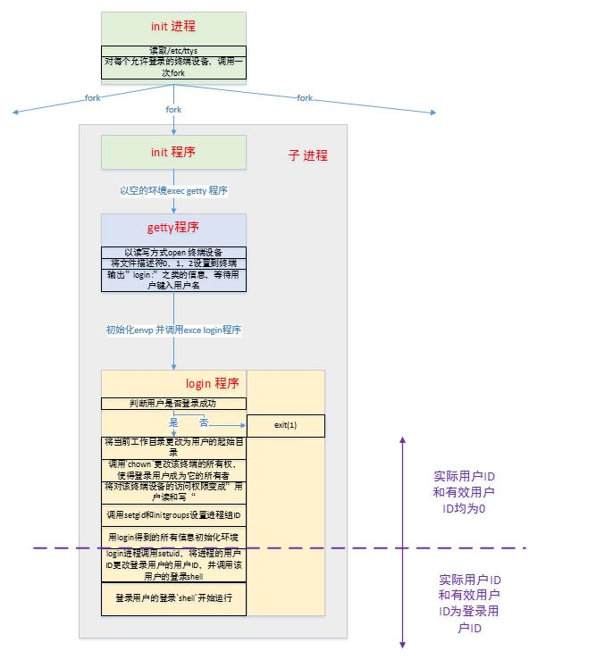
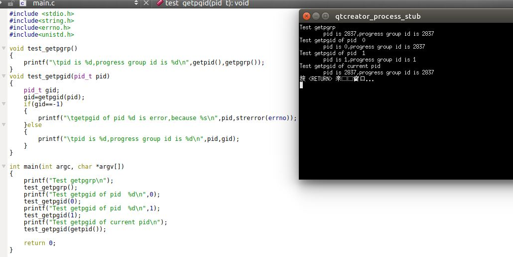
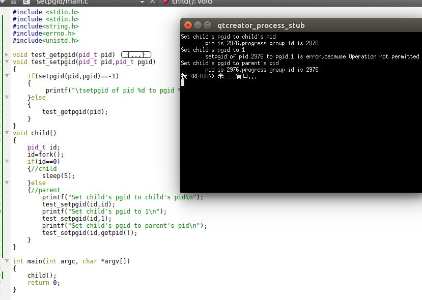
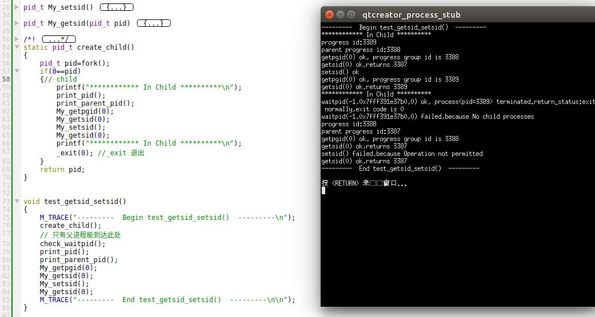
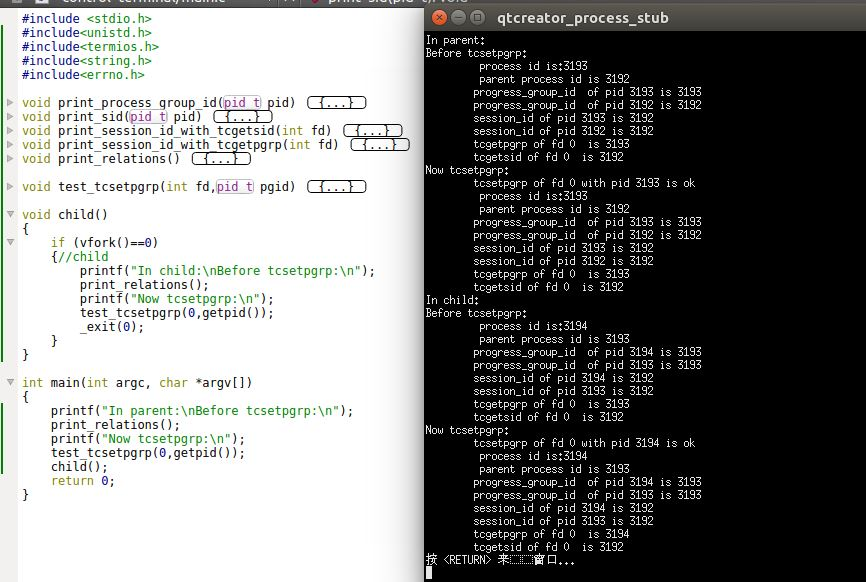

# 进程关系

1. 终端登录：
	- BSD系统：
		- 当系统自举时，内核创建进程ID为 1  的进程，即`init`进程
		- `init`进程读取文件`/etc/ttys`，对每个允许登录的终端设备，`init`调用一次`fork`，其所生成的子进程则`exec getty`程序（以一个空的环境）
		- `getty`对终端设备调用`open`函数，以读、写方式将终端打开。
			- 一旦设备被打开则文件描述符0、1、2被设置到该设备
			- 然后`getty`输出`login:`之类的信息，并等待用户键入用户名
			- 当用户键入了用户名后，`getty`的工作就完成了，它以类似下列的方式调用`login`程序：

				 ```execle("/bin/login","login","-p",username,(char *)0,envp);```

				其中`envp`是`getty`以终端名和在`gettytab`中说明的环境字符串为`login`创建的环境。`-p`标志通知`login`保留传递给它的环境，也可以将其他环境字符串添加到该环境中，但是不能替换它
		- `login`能处理多项工作
			- `login`得到了用户名，所以能够调用`getpwnam`获取相应用户的口令文件登录项，然后调用`getpass`以显示`Password:`
			- 接着`login`读取用户键入的口令，它调用`crypt`将用户键入的口令加密，并且与该用户在阴影口令文件中登录的`pw_passwd`字段比较
			- 如果用户自己键入的口令都无效，则`login`以参数1调用`exit`表示登录过程失败
				- 父进程`init`了解了子进程的终止情况后，再次调用`fork`其后又调用了`getty`，对此终端重复上述过程
			- 如果用户键入的口令正确，则`login`完成下列工作：
				- 将当前工作目录更改为用户的起始目录
				- 调用`chown`更改该终端的所有权，使得登录用户成为它的所有者
				- 将对该终端设备的访问权限变成”用户读和写“
				- 调用`setgid`和`initgroups`设置进程组ID
				- 用`login`得到的所有信息初始化环境：起始目录(`HOME`)、`shell`(`SHELL`)、用户名(`USER`和`LOGNAME`)以及一个系统默认路径(`PATH`)
				- `login`进程调用`setuid`，将进程的用户ID更改登录用户的用户`ID`，并调用该用户的登录`shell`，其方式类似于：`execl("/bin/sh","-sh",(char*)0);`
				- 至此，登录用户的登录`shell`开始运行。登录`shell`读取其启动文件（如`.profile`)。这些启动文件通常是更改某些环境变量并增加很多环境变量。当执行完启动文件后，用户最后得到`shell`提示符，并能键入命令
	- `MAC OS X`系统：它部分地给予`Free BSD`，因此启动步骤与`FreeBSD `几乎相同，除了：
		- `init`工作是由`launchd`完成的
		- 一开始提供的就是图形终端
	- `Linux`：步骤几乎与`Free BSD`相同。但是`init`读取的是`/etc/inittab`文件而不是`/etc/ttys`文件

	 

2. 网络登录：对于网络登录，所有登录都是经由内核的网络接口驱动程序。
	- 在`BSD`系统中，由`init`执行`shell`脚本`/etc/rc`，此`shell`脚本启动`inetd`守护进程。由`inetd`负责处理网络登录
	- 在`Linux`系统中，使用`xinetd`代替`inetd`进程

## 进程组

1. 进程组：每个进程除了有一个进程ID之外，还属于一个进程组。进程组是一个或者多个进程的集合。
	- 通常进程组是在同一个作业中结合起来的
	- 同一个进程组中的各进程接收来自同一个终端的信号
	- 每个进程中都有一个唯一的进程组ID标志
		- 进程组ID类似于进程ID，是一个整数并且可以存放在`pid_t`数据类型中
	- 每个进程组都有一个组长进程。进程组ID就等于组长进程的进程ID
		- 进程组的组长进程可以创建该组中的进程
		- 进程组的组长进程也可以终止。只要进程组中至少有一个进程存在，则该进程中就存在，这与组长进程是否终止无关
	- 进程组的生命周期：从组长进程创建进程中开始，到组内最后一个进程离开为止的时间
		- 这里用离开，是因为进程可以从一个进程组转移到另一个进程组

2. `getpgrp/getpgid`函数：获取进程所属的进程组：

	```
	#include<unistd.h>
	pid_t getpgrp(void);
	pid_t getpgid(pid_t pid);
	```
	- 对于`getpgrp`函数：其返回值是调用进程的进程组`ID`（没有失败值）
	- 对于`getpgid`函数：
		- 参数：`pid`为待查看进程的进程ID。如果`pid=0`，则返回调用进程的进程组`ID`
		> 这里没有要求`pid`和本进程的关系
		- 返回值：成功，则返回进程组`ID`；失败返回 -1

3. 示例：在`main`函数中调用`test_getpgrp_getpgid`函数:

	```
void test_getpgrp_getpgid()
{
    M_TRACE("---------  Begin test_getpgrp_getpgid()  ---------\n");
    create_child();
    // 只有父进程能到达此处
    check_waitpid();
    print_pid();
    print_parent_pid();
    My_getpgrp(); // 父进程自己
    My_getpgid(getppid());// 父进程的父进程
    M_TRACE("---------  End test_getpgrp_getpgid()  ---------\n\n");
}
	```
	

4. `setpgid`函数：加入一个现有的进程组或者创建一个新进程组

	```
	#include<unistd.h>
	int setpgid(pid_t pid,pid_t pgid);
	```
	- 参数：
		- `pid`：待处理的进程的进程`ID`
		- `pgid`：进程组的组`ID`
	- 返回值：
		- 成功：返回 0
		- 失败： 返回 -1

	`setpgid`函数将`pid`进程的进程组`ID`设置为`pgid`
	- 如果`pid`等于`pgid`，则由`pid`指定的进程变成进程组组长
	- 如果`pid`等于0，则使用调用者的进程`ID`
	- 如果`pgid`等于0，则使用`pid`指定的进程`ID`用作进程组`ID`

	注意：一个进程只能为它自己或者他的子进程设置进程组ID，且进程组ID只能为父进程进程组ID、父进程的进程ID或者子进程的进程ID。
	- 在它的子进程调用`exec`之后，它就不再更改子进程的进程组ID
	- 在大多数作业控制`shell`中，`fork`之后立即调用此函数，使得父进程设置其子进程的进程组ID，同时也使子进程设置其自己的进程组ID（这两个调用是冗余的，但是是个双保险）

5. 示例：在`main`函数中调用`test_setpgid`函数：

	```
void test_setpgid()
{
    M_TRACE("---------  Begin test_setpgid()  ---------\n");
    create_child();
    // 只有父进程能到达此处
    check_waitpid();
    print_pid();
    print_parent_pid();
    My_getpgrp(); // 父进程自己
    M_TRACE("---------  End test_setpgid()  ---------\n\n");
}
	```
  	

## 会话

1. 会话`session`是一个或者多个进程组的集合。

2. `setsid`函数：创建一个新会话

	```
	#include<unistd.h>
	pid_t setsid(void);
	```
	- 返回值：
		- 成功：返回进程组ID
		- 失败：返回 -1

	进程调用`setsid`建立一个新会话。如果调用此函数的进程不是一个进程组的组长进程，则此函数创建一个新会话并且发生下面三件事：
	- 该进程会变成新会话的会话首进程`session leader`。此时该进程是新会话中的唯一进程
		> 会话首进程是创建该会话的进程
	- 该进程成为一个新进程组的组长进程。新进程组ID就是该调用进程的进程ID
	- 该进程没有控制终端。即使调用`setsid`之前该进程有一个控制终端，该联系也被切断

	如果调用此函数的进程是个进程组的组长，则此函数返回出错。
	> 通常是进程首先`fork`，然后父进程终止，子进程调用`setsid`继续执行。这确保了子进程不是一个进程组的组长

3. `getsid`函数：返回进程所在的会话`ID`（会话`ID`等于会话首进程的进程组ID，会话首进程总是进程组的组长进程，因此它也等于会话首进程的进程ID）

	```
	#include<unistd.h>
	pid_t getsid(pid_t pid);
	```
	- 参数：
		- `pid`:待查看进程的进程`ID`
	- 返回值：
		- 成功：会话`ID`
		- 失败：返回 -1

	如果`pid`为0，则`getsid`返回调用进程的会话ID。如果`pid`并不属于调用者所在的会话，则调用进程就不能得到该会话ID

4. 示例：在`main`函数中调用`test_getsid_setsid`函数：

	```
void test_getsid_setsid()
{
    M_TRACE("---------  Begin test_getsid_setsid()  ---------\n");
    create_child();
    // 只有父进程能到达此处
    check_waitpid();
    print_pid();
    print_parent_pid();
    My_getpgid(0);
    My_getsid(0);
    My_setsid();
    My_getsid(0);
    M_TRACE("---------  End test_getsid_setsid()  ---------\n\n");
}
	```
  	
	可以看到：
	- 子进程的进程ID为 3389，父进程的进程ID为 3388
	- 刚开始，子进程和父进程为一个进程组。父进程为组长进程，进程组ID为 3388 。 会话ID为 3387
	- 对子进程调用`setsid` 之后：子进程独立成为一个进程组，子进程为组长进程，构成一个新的会话。进程组ID和会话ID都是 3389
	- 对父进程调用`setsid` 之后：由于父进程是个组长进程，则函数调用失败，并没有创建一个新的会话。

## 作业控制

1. 会话和进程组还有一些特性：
	- 一个会话可以有一个控制终端`controlling terminal`
		- 这可以是终端设备（在终端登录的情况下）
		- 也可以是伪终端设备（在网络登录的情况下）
	- 建立与控制终端连接的会话首进程称作控制进程`controlling process`
	- 一个会话中的进程组可以分成一个前台进程组，以及一个或者多个后台进程组
	- 如果一个会话有一个控制终端，则它有一个前台进程组，其他进程组为后台进程组
	- 无论何时键入终端的中断键（通常是`Ctrl+C`），都会将中断信号发送至前台进程组的所有进程
	- 无论何时键入终端的退出键（通常是`Ctrl+\`），都会将退出信号发送至前台进程组的所有进程

2.  `tcgetpgrp/tcsetpgrp`函数：获取/设置当前进程所在会话的前台进程组ID

	```
	#include<unistd.h>
	pid_t tcgetpgrp(int fd);
	int tcsetpgrp(int fd,pid_t pgrpid);
	```
	- 参数：
		- `fd`：进程在`fd`这个描述符上打开的终端
		- `pgrpid`：待设置的前台进程组ID

	- 返回值：
		- 对于`tcgetpgrp`：成功则返回前台进程组ID，失败返回 -1
		- 对于 `tcsetpgrp`：成功返回 0；失败返回 -1

	如果进程有一个控制终端，则该进程可以调用`tcsetpgrp`将前台进程组ID设置为`pgrpid`，其中：
	- `pgrpid`必须是同一个会话的一个进程组的ID
	- `fd`必须引用该会话的控制终端

	注意：大多数应用程序并不直接使用这两个函数，它们通常是由作业控制`shell`调用

3. `tcgetsid`函数：获取会话首进程的进程组ID（也就是会话ID）

	```
	#include<termios.hh>
	pid_t tcgetsid(int fd);
	```
	- 参数：
		- `fd`：进程在`fd`这个描述符上打开的终端
	- 返回值：
		- 成功则返回前台进程组ID
		- 失败返回 -1

	注意会话ID不一定等于前台进程组的组ID。对于一个会话，会话ID通常不变（前提是没有函数主动设置它）；但是前台进程组进程由于作业调度会经常发生变化

4. 示例：在`main`函数中调用`test_tcgetpgrp_tcsetpgrp`函数：


	```
void test_tcgetpgrp_tcsetpgrp()
{
    M_TRACE("---------  Begin test_tcgetpgrp_tcsetpgrp()  ---------\n");
    create_child();
    // 只有父进程能到达此处
    check_waitpid();
    print_pid();
    print_parent_pid();
    My_getpgrp(); // 父进程自己
    M_TRACE("---------  End test_tcgetpgrp_tcsetpgrp()  ---------\n\n");
}
	```
  	 
	可以看到：
	- 子进程ID为 3860，父进程ID为 3859， 父进程的父进程ID为 3858
	- 子进程、父进程都在进程组中，组ID为 3859.该进程组在一个会话中，会话ID为 3858
	- 标准输出对应的终端（就是标准终端），使用它的会话的ID为 3858.通过`tcgetsid`获取
	- 标准终端对应的会话的前台进程组的ID是 3859，通过`tcgetpgrp`获取
	- 当设置标准终端对应的会话的前台进程组为 3857 时，失败。因为进程 3857 不在当前的进程继承体系中
	- 当设置标准终端对应的会话的前台进程组为  3858 时，执行成功。此时：
		- 标准终端对应的会话的前台进程组的ID是 3858
		- 子进程所属的进程组不变
		-  标准输出对应的终端（就是标准终端），使用它的会话的ID 不变

5. 作业控制：运行在一个终端上启动多个作业，它控制哪个作业可以访问终端以及那些作业在后台运行
	- 一个作业是一个进程组。该进程组的进程协同完成一个任务
	- 在`Linux`中，当执行`ls > a.out &`等命令以`&`时，就启动了一个后台作业
		- `shell`会赋予它一个作业标识符，并打印作业标识符以及一个或者多个进程ID
	- 在`Linux`中，当执行`ls > a.out`等命令时，就启动了一个前台作业
	- 当我们键入以下三个字符之一时，会使终端产生信号，并将它们发送到所有的前台进程组（后台进程组不受影响）：	
		- `Ctrl+C`中断字符：产生`SIGINT`信号
		- `Ctrl+\`退出字符：产生`SIGQUIT`信号
		- `Ctrl+Z`挂起字符：产生`SIGTSTP`信号
	- 只有前台作业能够接收来自终端的输入。如果后台作业试图读取终端，则这并不是个错误。终端驱动程序会检测到这种情况，并向后台作业发送一个特定的信号`SIGTTIN`，该信号通常会停止此后台作业，而`shell`会向用户发出这种情况的通知
		- 用户此时可以通过`shell`命令将该后台作业转换为前台作业运行
	- 通过`stty`命令可以禁止或者允许后台作业输出到终端。
		- 用户禁止后台作业向控制终端写入，则当后台作业试图写到标准输出时，终端驱动程序识别出该写操作来自于后台进程，于是向该作业发送`SGITTOU`信号，该信号通常会停止此后台作业，而`shell`会向用户发出这种情况的通知
		- 用户此时可以通过`shell`命令将该后台作业转换为前台作业运行
	- 作业控制是在窗口终端得到广泛应用之前设计和实现的

6. 孤儿进程组：一个进程组不是孤儿进程组的条件是：该进程组中存在一个进程，其父进程在属于同一个会话的另一个组中
	- 如果进程组不是孤儿进程组，则属于同一个会话的另一个组中的父进程就有机会重启该组中停止的进程
	> 如果一个进程组中的所有进程：
	> 
	> - 要么其父进程不再同一个会话中
	> - 要么其父进程就在同一个组中
	>
	> 则该进程组是个孤儿进程组

	当孤儿进程组产生的时候，如果孤儿进程组中有`TASK_STOP`的进程，那么就发送`SIGHUP`和`SIGCONT`信号给这个进程组
	- 这个顺序是不能变的。我们知道进程在进程`在TASK_STOP`的时候是不能响应信号的，只有当进程继续运行的时候，才能响应之前的信号。
		- 如果先发送`SIGCONT`信号再发送`SIGHUP`信号，那么`SIGCONT`信号后，进程就开始重新进入运行态，这个和马上响应`SIGHUP`信号的用意相悖
		- 所以这个时候需要在进程`TASK_STOP`的过程中首先发送`SIGHUP`信号，为的是让进程运行之后马上执行`SIGHUP`信号。

	- 这两个信号是发送给有处于`TASK_STOP`状态的进程的进程组的所有进程的。所以进程组中正在运行的进程，如果没有建立`SIGHUP`信号处理函数，那么运行的进程就会因为`SIGHUP`退出。 